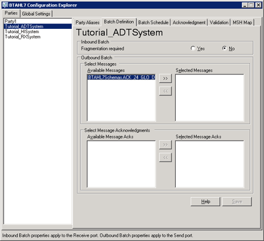

# Configuring Batching
You use [!INCLUDE[HL7_CurrentVersion_FirstRef](../../includes/hl7-currentversion-firstref-md.md)] Configuration Explorer to create batch, batch in/batch out batching, and to select available schemas for outbound batching.  
  
> [!NOTE]
>  You must configure trading partners using BizTalk Explorer before you can configure message batching.  
  
 The following figure shows the [!INCLUDE[btaBTAHL71.3abbrevnonumber](../../includes/btabtahl71-3abbrevnonumber-md.md)] Configuration Explorer **Batch Definition** tab.  
  
   
  
 Use the following procedures to open [!INCLUDE[btaBTAHL71.3abbrevnonumber](../../includes/btabtahl71-3abbrevnonumber-md.md)] Configuration Explorer and configure batching.  
  
### To enable message batching for outbound batching (Create Batch)  
  
1.  In the **Start** menu, open **BizTalk Server Administration**.  
  
2.  In the Administration Console, expand **BizTalk Server Administration**, expand **BizTalk Group**, expand **Applications**, and then expand **BizTalk Application 1**.  
  
3.  Click **Orchestrations**, right-click **BatchOrchestration.Orchestration_1**, and then select **Properties**.  
  
4.  In the Orchestration Properties dialog box, click **Bindings** in the console tree.  
  
5.  In the **Bindings** pane, select the appropriate host for **Host**. Click **OK**.  
  
6.  Right-click **BatchOrchestration.Orchestration_1**, and then select **Enlist**.  
  
7.  Right-click **BatchOrchestration.Orchestration_1**, and then select **Start**.  
  
### To run BTAHL7 Configuration Explorer  
  
-   In the **Start** menu, open **Microsoft BizTalk Accelerator for HL7** , and then click **BTAHL7 Configuration Explorer**.  
  
### To configure batching  
  
- In [!INCLUDE[btaBTAHL71.3abbrevnonumber](../../includes/btabtahl71-3abbrevnonumber-md.md)] Configuration Explorer, in the **BTAHL7 Configuration Explorer** dialog box, on the **Parties** tab, select the party you want to configure, and then on the **Batch Definition** tab, do the following:  
  
  |Use this|To do this|  
  |--------------|----------------|  
  |**Fragmentation required**|Select one of the following options:   -   **Yes**. To enable fragmentation. -   **No**. To disable fragmentation. **Note:**  For a new party, **Fragmentation Required** defaults to **No**.|  
  |**Select Messages**|Select the message types you want to send as a batch from the **Available Messages** window, and then click the Move to the right arrow (**>>**).|  
  |**Select Message Acknowledgments**|Select the message types for which you want the acknowledgments to send as a batch from the **Available Message Acks** window, and then click the Move to the right (**>>**).|  
  
  > [!NOTE]
  >  You may not see schemas that you add to your In [!INCLUDE[btaBTAHL71.3abbrevnonumber](../../includes/btabtahl71-3abbrevnonumber-md.md)] project while In [!INCLUDE[btaBTAHL71.3abbrevnonumber](../../includes/btabtahl71-3abbrevnonumber-md.md)] Configuration Explorer is running. In order to view these files, you may need to restart In [!INCLUDE[btaBTAHL71.3abbrevnonumber](../../includes/btabtahl71-3abbrevnonumber-md.md)] Configuration Explorer.  
  
## See Also  
 [Scheduling Batching](../../adapters-and-accelerators/accelerator-hl7/scheduling-batching.md)