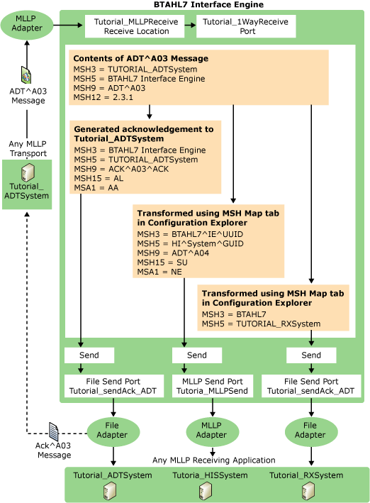

# End-to-End Tutorial for BizTalk Accelerator for HL7
This tutorial contains detailed steps that describe how you use Microsoft [!INCLUDE[HL7_CurrentVersion_FirstRef](../../includes/hl7-currentversion-firstref-md.md)] to facilitate business processes in a subscriber and publisher scenario.  
  
> [!IMPORTANT]
>  To use this tutorial, you must install the test tools when installing BTAHL7. If you performed a typical installation to install BTAHL7, then you must run a Custom installation and install the test tools in order for this tutorial to work correctly. At the **Custom Setup** screen of the BTAHL7 custom installation, select **MLLP Test Tool** from the **Adapter** folder, and select **Test Instances** from the **Artifacts** folder. For more information, see [Install BizTalk Accelerator for HL7](../../adapters-and-accelerators/accelerator-hl7/install-biztalk-accelerator-for-hl7.md).  
  
## Declarative Scenario  
 This tutorial uses the publish/subscribe or declarative scenario. In the declarative scenario, the flow of business is similar to that shown in the following figure. The numbered list following the figure describes the workflow.  
  
   
  
1.  The workflow begins when the publisher, for example, an Admissions Discharge and Transfer system, sends a message to specific subscribers. The publisher in the workflow is "Tutorial_ADTSystem", and the message is called "**ADT^A03**."  
  
2.  The message is routed to the BTAHL7 Interface Engine, which in turn receives, processes, validates, reformats, and then routes the message to subscribers.  
  
3.  The subscribers in this scenario are a Hospital Information System (Tutorial_HISystem) and a Pharmacy System (Tutorial_RXSystem). This scenario uses both File and MLLP adapter types. The publisher does not need to be aware of the subscribers and BTAHL7 appropriately sends an acknowledgment to the publisher after processing the message.  
  
4.  The publisher sends the ADT^A03 message through a one-way MLLP adapter (Tutorial_1WayReceivePort).  
  
5.  The destination of this message is the BTAHL7 Interface Engine, so the incoming message contains a source message (MSH3 = Tutorial_ADTSystem) and a destination message (MSH5 = BTAHL7InterfaceEngine).  
  
6.  BTAHL7 generates an acknowledgment (ACK) after appropriately validating the message, and then sends the acknowledgment to the Tutorial_ADTSystem through the File adapter.  
  
7.  The Tutorial_HISystem system and the Tutorial_RXSystem system subscribe to the ADT message received by the BTAHL7 Interface Engine.  
  
8.  The transformation occurs when you specify values for the respective fields by using the **MSH Map** tab in BTAHL7 Configuration Explorer.  
  
     For example, the party Tutorial_RXSystem has MSH3=BTHL7 specified in the **MSH Map** tab. Therefore, the message received by the subscriber will have "BTAHL7" as the value for the MSH3 field.  
  
## In this section  
  
-   [Testing Your Installation](../../adapters-and-accelerators/accelerator-hl7/testing-your-installation.md)  
  
-   [Preparing to Use the Tutorial](../../adapters-and-accelerators/accelerator-hl7/preparing-to-use-the-tutorial2.md)  
  
-   [Step 1: Create and Deploy Header and Acknowledgment Schemas](../../adapters-and-accelerators/accelerator-hl7/step-1-create-and-deploy-header-and-acknowledgment-schemas.md)  
  
-   [Step 2: Create Common Schemas for v2.3.1](../../adapters-and-accelerators/accelerator-hl7/step-2-create-common-schemas-for-v2-3-1.md)  
  
-   [Step 3: Create and Deploy a Trigger Event (Message) Project](../../adapters-and-accelerators/accelerator-hl7/step-3-create-and-deploy-a-trigger-event-message-project.md)  
  
-   [Step 4: Create the Receive Port for Accepting ADT^A03 Messages from ADT Systems Using the MLLP Adapter](../../adapters-and-accelerators/accelerator-hl7/step-4-create-receive-port-to-accept-adt^a03-messages-from-adt-using-mllp.md)  
  
-   [Step 5: Create a Send Port to Deliver Acknowledgments to the ADT System Using the File Adapter](../../adapters-and-accelerators/accelerator-hl7/step-5-create-send-port-to-deliver-acknowledgments-to-adt-system-using-file.md)  
  
-   [Step 6: Create a Send Port to Deliver the ADT^A03 Message to the RX System Using the File Adapter](../../adapters-and-accelerators/accelerator-hl7/step-6-create-send-port-to-deliver-adt^a03-message-to-rx-system-using-file.md)  
  
-   [Step 7: Create a Send Port to Deliver the ADT^A03 Message to HIS Using the MLLP Adapter](../../adapters-and-accelerators/accelerator-hl7/step-7-create-send-port-to-deliver-adt^a03-message-to-his-using-mllp-adapter.md)  
  
-   [Step 8: Configure Party Information](../../adapters-and-accelerators/accelerator-hl7/step-8-configure-party-information.md)  
  
-   [Step 9: Restart BizTalk Server](../../adapters-and-accelerators/accelerator-hl7/step-9-restart-biztalk-server.md)  
  
-   [Step 10: Verify the End-to-End Scenario](../../adapters-and-accelerators/accelerator-hl7/step-10-verify-the-end-to-end-scenario.md)

## See also
[Get started with the BizTalk Accelerator for HL7](../../adapters-and-accelerators/accelerator-hl7/get-started-with-the-biztalk-accelerator-for-hl7.md)
