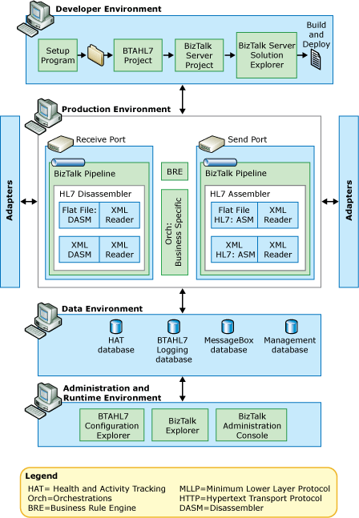

# How Messages Flow through BTAHL7
When you install [!INCLUDE[btsCoName](../../includes/btsconame-md.md)] BizTalk Accelerator for HL7 ([!INCLUDE[btaBTAHL71.3abbrevnonumber](../../includes/btabtahl71-3abbrevnonumber-md.md)]) on top of [!INCLUDE[btsCoName](../../includes/btsconame-md.md)]BizTalk Server, you add [!INCLUDE[btaBTAHL71.3abbrevnonumber](../../includes/btabtahl71-3abbrevnonumber-md.md)] components to the [!INCLUDE[btsBizTalkServerNoVersion](../../includes/btsbiztalkservernoversion-md.md)] architecture. The following figure shows the combined system, which provides an architectural overview of [!INCLUDE[btaBTAHL71.3abbrevnonumber](../../includes/btabtahl71-3abbrevnonumber-md.md)].  
  
   
  
## Message Processing Flow  
 When a line-of-business application sends a message to the [!INCLUDE[btaBTAHL71.3abbrevnonumber](../../includes/btabtahl71-3abbrevnonumber-md.md)] system, the following occurs:  
  
1. If the message is an HL7 message, [!INCLUDE[btaBTAHL71.3abbrevnonumber](../../includes/btabtahl71-3abbrevnonumber-md.md)] receives it through an adapter (usually an MLLP adapter). If it is an XML message, [!INCLUDE[btaBTAHL71.3abbrevnonumber](../../includes/btabtahl71-3abbrevnonumber-md.md)] receives it through an adapter (usually an HTTP adapter).  
  
   > [!NOTE]
   >  You can transport both 2.X and 2.XML messages over any adapter; however, you would usually transport V2.X messages over an MLLP adapter, and you would usually transport 2.XML messages over an HTTP adapter.  
  
2. The message is routed through the receive pipeline for parsing by the disassembler, and validation.  
  
   1. If the incoming message is an HL7 message, the flat file disassembler (DASM) disassembles it into XML. If the incoming message is an XML message, the XML DASM disassembles it.  
  
   2. If the incoming message is a batch message, the disassembler disassembles into the individual messages. (For more details, see [Batch Message Processing](../../adapters-and-accelerators/accelerator-hl7/batch-message-processing.md) and [Message Batching](../../adapters-and-accelerators/accelerator-hl7/message-batching.md).)  
  
   3. The DASM then validates the message.  
  
   4. If you use a two-way MLLP receive adapter, and if the disassembler has validated the message, [!INCLUDE[btaBTAHL71.3abbrevnonumber](../../includes/btabtahl71-3abbrevnonumber-md.md)] sends an acknowledgment (ACK) to the original sender of the message through the same adapter that received the original message. If not, [!INCLUDE[btaBTAHL71.3abbrevnonumber](../../includes/btabtahl71-3abbrevnonumber-md.md)] sends a negative acknowledgment (NAK). (How this step is accomplished depends on the ACK configuration. For details, see [ACK Message Modes](../../adapters-and-accelerators/accelerator-hl7/ack-message-modes.md).)  
  
   5. If you do not use a two-way MLLP receive adapter, then [!INCLUDE[btaBTAHL71.3abbrevnonumber](../../includes/btabtahl71-3abbrevnonumber-md.md)] generates an ACK or ACKs (or NAK or NAKs) and deposits it into the MessageBox database. [!INCLUDE[btaBTAHL71.3abbrevnonumber](../../includes/btabtahl71-3abbrevnonumber-md.md)] then routes it to the appropriate parties based on the send port configuration, which could use any of the other adapters (besides MLLP).  
  
      For a more complete listing of the processes performed in the flat file and XML disassemblers, see [BizTalk Accelerator for HL7 Components](../../adapters-and-accelerators/accelerator-hl7/biztalk-accelerator-for-hl7-components.md).  
  
3. After the message passes through the adapter and the receive pipeline, [!INCLUDE[btaBTAHL71.3abbrevnonumber](../../includes/btabtahl71-3abbrevnonumber-md.md)] passes the message into the MessageBox database. [!INCLUDE[btsBizTalkServerNoVersion](../../includes/btsbiztalkservernoversion-md.md)] then determines where to send the message next. If the message is part of an orchestration, it sends the message to the Orchestration Engine.  
  
4. The Orchestration Engine processes the message.  
  
   1. If a map affects the message, the map transforms the message according to its rules.  
  
   2. If you have set up a business rule, [!INCLUDE[btsBizTalkServerNoVersion](../../includes/btsbiztalkservernoversion-md.md)] invokes the Business Rule Engine (BRE) outside of the pipelines, potentially in the Orchestration Engine.  
  
   3. The Orchestration Engine sends the message back to the MessageBox database, and then continues processing the orchestration.  
  
5. Based on the subscription, [!INCLUDE[btsBizTalkServerNoVersion](../../includes/btsbiztalkservernoversion-md.md)] routes the message to the send port.  
  
6. [!INCLUDE[btaBTAHL71.3abbrevnonumber](../../includes/btabtahl71-3abbrevnonumber-md.md)] routes the message through the send pipeline for the following processing (if applicable): assembly and validation.  
  
   1. If the message will be an HL7 2.X message, [!INCLUDE[btaBTAHL71.3abbrevnonumber](../../includes/btabtahl71-3abbrevnonumber-md.md)] assembles the message from XML into HL7 by the flat file assembler (ASM). If the incoming message will be an XML message, the XML DASM assembles it.  
  
   2. If the message will be part of a batch message, [!INCLUDE[btaBTAHL71.3abbrevnonumber](../../includes/btabtahl71-3abbrevnonumber-md.md)] assembles each message into the batch message. (For more details, see [Batch Message Processing](../../adapters-and-accelerators/accelerator-hl7/batch-message-processing.md) and [Message Batching](../../adapters-and-accelerators/accelerator-hl7/message-batching.md).)  
  
   3. The ASM validates the message (if enabled through send-party configuration settings).  
  
      For a more complete listing of the processes performed in the flat file and XML assemblers, see [BizTalk Accelerator for HL7 Components](../../adapters-and-accelerators/accelerator-hl7/biztalk-accelerator-for-hl7-components.md).  
  
7. [!INCLUDE[btaBTAHL71.3abbrevnonumber](../../includes/btabtahl71-3abbrevnonumber-md.md)] sends the message through an adapter.  
  
   > [!NOTE]
   >  You can transport 2.X messages and 2.XML messages over a number of adapters; however, most systems transport 2.X messages over an MLLP adapter, and 2.XML messages over an HTTP adapter.  
  
## See Also  
 [How BTAHL7 Routes Messages](../../adapters-and-accelerators/accelerator-hl7/how-btahl7-routes-messages.md)