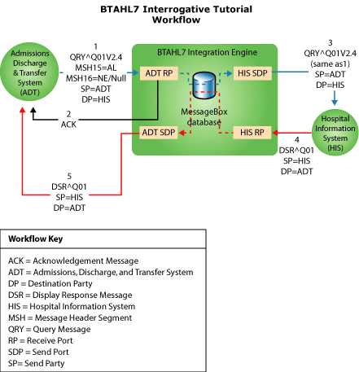

# Interrogative Tutorial
This tutorial contains detailed steps that describe how you use Microsoft [!INCLUDE[HL7_CurrentVersion_FirstRef](../../includes/hl7-currentversion-firstref-md.md)] to facilitate business processes in a Query/Response scenario.  
  
> [!NOTE]
>  To use this tutorial, you must install the MLLP test tools. These tools are not installed by a Typical installation of BTAHL7. You must run a Custom installation and select **MLLP Test Tool** from the Adapter folder and **Test Instances** from the Artifacts folder. If the test tools are installed, your system will contain the folder \<*drive*:\>\Program Files\Microsoft BizTalk \<version\> Accelerator for HL7\SDK\MLLP Utilities. See [install BizTalk Accelerator for HL7](../../adapters-and-accelerators/accelerator-hl7/install-biztalk-accelerator-for-hl7.md).  
  
## Interrogative Scenario  
 This tutorial uses the Query/Response or Interrogative scenario. In this scenario, the flow of business is similar to that shown in the following figure. The numbered list following the figure describes the workflow.  
  
   
  
1.  The workflow begins when an Admissions Discharge and Transfer (ADT) system sends a query to the Hospital Information System. The HL7 message uses the "**QRY^Q01**" schema. In the tutorial, the MllpSend utility simulates the ADT system sending the query message to the Hospital Information System through the ADT receive port in the BTAHL7 Integration Engine.  
  
2.  The BTAHL7 Integration Engine receives the query message from the ADT system and validates it. Then, the BTAHL7 pipeline sends an acknowledgment back to ADT.  
  
3.  The BTAHL7 Interface Engine processes the message, and then routes the query message to the HIS destination party through the HIS send port.  
  
4.  After receiving the acknowledgment from the original query, the ADT system waits for a response. The Hospital Information System sends a response message back through the HIS receive port. For this tutorial, the MllpSend utility simulates the Hospital Information System sending the response message.  
  
5.  The BTAHL7 Interface Engine processes the response message and then routes it to the destination party through the ADT send port.  
  
## In this section  
  
-   [Preparing to Use the Tutorial](../../adapters-and-accelerators/accelerator-hl7/preparing-to-use-the-tutorial-hl7-main.md)  
  
-   [Step 1: Create and Deploy Common Header and Acknowledgment Schemas](../../adapters-and-accelerators/accelerator-hl7/step-1-create-and-deploy-common-header-and-acknowledgment-schemas.md)  
  
-   [Step 2: Create Common Schemas for V2.4](../../adapters-and-accelerators/accelerator-hl7/step-2-create-common-schemas-for-v2-4.md)  
  
-   [Step 3: Create and Deploy a Trigger Event (Message) Project](../../adapters-and-accelerators/accelerator-hl7/step-3-create-and-deploy-a-trigger-event-message-project-hl7-main.md)  
  
-   [Step 4: Create the Receive Port for Accepting ADT Query Messages](../../adapters-and-accelerators/accelerator-hl7/step-4-create-the-receive-port-for-accepting-adt-query-messages.md)  
  
-   [Step 5: Create the Receive Port for Accepting HIS Messages](../../adapters-and-accelerators/accelerator-hl7/step-5-create-the-receive-port-for-accepting-his-messages.md)  
  
-   [Step 6: Create a Send Port to Deliver Query Messages](../../adapters-and-accelerators/accelerator-hl7/step-6-create-a-send-port-to-deliver-query-messages.md)  
  
-   [Step 7: Create a Send Port to Deliver Response Messages](../../adapters-and-accelerators/accelerator-hl7/step-7-create-a-send-port-to-deliver-response-messages.md)  
  
-   [Step 8: Configure Party Information](../../adapters-and-accelerators/accelerator-hl7/step-8-configure-party-information-hl7-main.md)  
  
-   [Step 9: Restart BizTalk Server](../../adapters-and-accelerators/accelerator-hl7/step-9-restart-biztalk-server-hl7-main.md)  
  
-   [Step 10: Verify the Interrogative Scenario](../../adapters-and-accelerators/accelerator-hl7/step-10-verify-the-interrogative-scenario.md)  

## Next step  
 [Preparing to Use the Tutorial](../../adapters-and-accelerators/accelerator-hl7/preparing-to-use-the-tutorial-hl7-main.md)
  
## See Also  
[Get started with the BizTalk Accelerator for HL7](../../adapters-and-accelerators/accelerator-hl7/get-started-with-the-biztalk-accelerator-for-hl7.md)