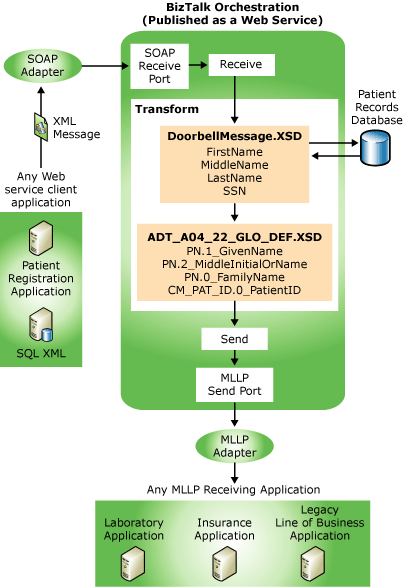

# Message Enrichment Tutorial
This tutorial provides step-by-step procedures for using [!INCLUDE[btsCoName](../../includes/btsconame-md.md)][!INCLUDE[HL7_CurrentVersion_FirstRef](../../includes/hl7-currentversion-firstref-md.md)] to solve a particular business problem: the message enrichment problem. The message enrichment tutorial describes a situation in which you have to add to, or enrich, a message that is not HL7-compliant and/or is incomplete. This can occur with an application, such as a patient registration application, or it can occur when you are populating a message with XML data from [!INCLUDE[btsCoName](../../includes/btsconame-md.md)][!INCLUDE[btsSQLServerNoVersion](../../includes/btssqlservernoversion-md.md)].  
  
 In this tutorial, you capture the messages with BTAHL7, and provide any missing data, for example, from a patient records database. You then convert the message and send it to a laboratory, insurance, or any legacy line-of-business (LOB) application using the MLLP (Minimal Lower Layer Protocol) adapter.  
  
 In this tutorial, you use a Web service client (WSClient.exe) application to send an XML-formatted message, in this case a "doorbell" Register Patient trigger event, through the SOAP adapter to [!INCLUDE[btsBizTalkServerNoVersion](../../includes/btsbiztalkservernoversion-md.md)] with BTAHL7. [!INCLUDE[btsBizTalkServerNoVersion](../../includes/btsbiztalkservernoversion-md.md)] receives the message in a SOAP receive port, and routes the message to an orchestration published as a Web service. The XML message contains a patient name and social security number. You augment the message, and use schemas, a map, and a transform to convert the message into HL7 format. You will then send it through an MLLP adapter to the laboratory, insurance, or LOB application.  
  
 The following figure shows the process flow of the tutorial.  
  
   
  
> [!NOTE]
>  This tutorial requires Windows Server Standard, Enterprise, Datacenter, or Web Edition, and a custom BTAHL7 installation that includes the MLLP test tools. Additionally, you should be familiar with [!INCLUDE[btsBizTalkServerNoVersion](../../includes/btsbiztalkservernoversion-md.md)] development in [!INCLUDE[btsVCSharp](../../includes/btsvcsharp-md.md)] and the information found in [learn about the HL7 accelerator and the BizTalk tools available](../../adapters-and-accelerators/accelerator-hl7/learn-the-hl7-accelerator-and-the-biztalk-tools-available.md).  
> 
> [!NOTE]
>  You can avoid errors by undeploying assemblies, stopping send ports, and disabling receive locations that you used in previous tutorials.  
  
## In this section  
  
-   [Step 1: Configure Application Pool Identity](../../adapters-and-accelerators/accelerator-hl7/step-1-configure-application-pool-identity.md)  
  
-   [Step 2: Create a New Project](../../adapters-and-accelerators/accelerator-hl7/step-2-create-a-new-project.md)  
  
-   [Step 3: Assign a Strong Name to the Assembly](../../adapters-and-accelerators/accelerator-hl7/step-3-assign-a-strong-name-to-the-assembly.md)  
  
-   [Step 4: Create the Schemas](../../adapters-and-accelerators/accelerator-hl7/step-4-create-the-schemas.md)  
  
-   [Step 5: Promote Schema Properties](../../adapters-and-accelerators/accelerator-hl7/step-5-promote-schema-properties.md)  
  
-   [Step 6: Validate the Schemas](../../adapters-and-accelerators/accelerator-hl7/step-6-validate-the-schemas.md)  
  
-   [Step 7: Sign and Build the Projects](../../adapters-and-accelerators/accelerator-hl7/step-7-sign-and-build-the-projects.md)  
  
-   [Step 8: Create a Map with BizTalk Mapper](../../adapters-and-accelerators/accelerator-hl7/step-8-create-a-map-with-biztalk-mapper.md)  
  
-   [Step 9: Validate and Build the Map Project](../../adapters-and-accelerators/accelerator-hl7/step-9-validate-and-build-the-map-project.md)  
  
-   [Step 10: Create an Orchestration](../../adapters-and-accelerators/accelerator-hl7/step-10-create-an-orchestration.md)  
  
-   [Step 11: Create Orchestration Variables](../../adapters-and-accelerators/accelerator-hl7/step-11-create-orchestration-variables.md)  
  
-   [Step 12: Configure Orchestration Shapes](../../adapters-and-accelerators/accelerator-hl7/step-12-configure-orchestration-shapes.md)  
  
-   [Step 13: Create and Configure Ports](../../adapters-and-accelerators/accelerator-hl7/step-13-create-and-configure-ports.md)  
  
-   [Step 14: Publish the Orchestration as a Web Service](../../adapters-and-accelerators/accelerator-hl7/step-14-publish-the-orchestration-as-a-web-service.md)  
  
-   [Step 15: Configure the Send and Receive Ports](../../adapters-and-accelerators/accelerator-hl7/step-15-configure-the-send-and-receive-ports.md)  
  
-   [Step 16: Start the Orchestration](../../adapters-and-accelerators/accelerator-hl7/step-16-start-the-orchestration.md)  
  
-   [Step 17: Create the WSClient Application](../../adapters-and-accelerators/accelerator-hl7/step-17-create-the-wsclient-application.md)  
  
-   [Step 18: Test Your New Message Enrichment Solution](../../adapters-and-accelerators/accelerator-hl7/step-18-test-your-new-message-enrichment-solution.md)