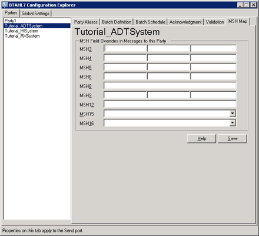

# MSH Field Overrides
Every HL7 message has a message header. Using [!INCLUDE[btaBTAHL7NoNumber](../../includes/btabtahl7nonumber-md.md)], you can override any message header value based on your business need. You use the [!INCLUDE[btaBTAHL71.3abbrevnonumber](../../includes/btabtahl71-3abbrevnonumber-md.md)] Configuration Explorer **MSH Map** tab to manually over ride message header values without using any mapping or orchestration.  
  
## Configuring MSH Field Overrides  
 You use the **MSH Map** tab in [!INCLUDE[btaBTAHL71.3abbrevnonumber](../../includes/btabtahl71-3abbrevnonumber-md.md)] Configuration Explorer (under the high-level **Parties** tab) to configure MSH field overrides. When you enter a value for an MSH field using this tab, that value overrides the existing MSH value in an outbound HL7 message that [!INCLUDE[btaBTAHL71.3abbrevnonumber](../../includes/btabtahl71-3abbrevnonumber-md.md)] sends to the selected party. You can type new values for many MSH fields, or select values from a drop-down list for the MSH15 and MSH16 fields.  
  
 The following figure shows the [!INCLUDE[btaBTAHL71.3abbrevnonumber](../../includes/btabtahl71-3abbrevnonumber-md.md)] Configuration Explorer **MSH Map** tab.  
  
   
  
 Use the following procedures to open [!INCLUDE[btaBTAHL71.3abbrevnonumber](../../includes/btabtahl71-3abbrevnonumber-md.md)] Configuration Explorer and configure MSH field overrides.  
  
#### To open BTAHL7 Configuration Explorer  
  
-   Click **Start**, click **Programs**, click **Microsoft BizTalk \<version\> Accelerator for HL7**, and then click **BTAHL7 Configuration Explorer**.  
  
#### To configure MSH field overrides  
  
1.  In BTAHL7 Configuration Explorer, on the **MSH Map** tab, do the following:  
  
    > [!NOTE]
    >  To override the existing value to null, type **\\**.  
  
    |Use this|To do this|  
    |--------------|----------------|  
    |**MSH.3**|Type message field overrides for this message header.|  
    |**MSH.4**|Type message field overrides for this message header.|  
    |**MSH.5**|Type message field overrides for this message header.|  
    |**MSH.6**|Type message field overrides for this message header.|  
    |**MSH.8**|Type message field overrides for this message header.|  
    |**MSH.9**|Type message field overrides for this message header|  
    |**MSH.12**|Type message field overrides for this message header.|  
    |**MSH.15**|Select from the following options for an acknowledgment override for the accept acknowledgment type:   -   **AL**. Select this option if you always want to send accept acknowledgments. -   **NE**. Select this option if you never want to send accept acknowledgments. -   **SU**. Select this option if you want to send accept acknowledgments after successful transmission of a message. -   **ER**. Select this option if you want to send accept acknowledgments only in the event of an error.|  
    |**MSH.16**|Select from the following options for an acknowledgment override for the application acknowledgment type:   -   **AL**. Select this option if you always want to send application acknowledgments. -   **NE**. Select this option if you never want to send application acknowledgments. -   **SU**. Select this option if you want to send application acknowledgments after successful transmission of a message. -   **ER**. Select this option if you want to send application acknowledgments only in the event of an error.|  
  
2.  Click **Save**.  
  
## See Also  
 [Logging Configuration](../../adapters-and-accelerators/accelerator-hl7/logging-configuration.md)   
 [Message Batching](../../adapters-and-accelerators/accelerator-hl7/message-batching.md)   
[Operational logging, message batching, validation and asknowledgment settings](../../adapters-and-accelerators/accelerator-hl7/operational-logging-message-batching-validation-and-asknowledgment-settings.md)
