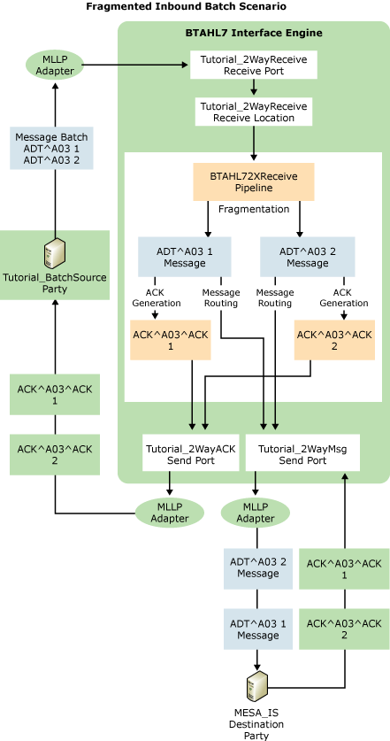

# Part 1: Fragmented Inbound Batch Scenario
In this part of the tutorial, you receive an HL7-encoded batch, fragment it into individual messages, and send the individual messages to a destination. The following figure shows the flow of this process.  
  
   
  
 This scenario includes the following workflow:  
  
1. The workflow begins when a line-of-business application sends a message batch to the [!INCLUDE[btsCoName](../../includes/btsconame-md.md)][!INCLUDE[HL7_CurrentVersion_FirstRef](../../includes/hl7-currentversion-firstref-md.md)] Integration Engine using the Minimal Lower Layer Protocol (MLLP) protocol. The batch contains two versions of an ADT^A03 message. The source application belongs to the Tutorial_BatchSource party.  
  
2. The Interface Engine receives the batch on an MLLP receive port, and validates the message batch. (The level of validation depends on settings selected for the source party in BTAHL7 Configuration Explorer.)  
  
3. Based on a setting in BTAHL7 Configuration Explorer that enables batch fragmentation, the Interface Engine parses the batch into two individual ADT^A03 messages. It validates the individual messages, again based on settings selected for the source party in BTAHL7 Configuration Explorer.  
  
4. The Interface Engine generates an acknowledgment for each message, based on the acknowledgment definition settings in BTAHL7 Configuration Explorer. In this tutorial, you will select Original Acknowledgment mode, so the Interface Engine generates a single Application Accept acknowledgment for each message after validating both the message header and body. The engine builds the acknowledgment based on the ACK_024_GLO_DEF schema, enters "AA" in field MSA2 of the acknowledgment, enters the destination party in MSH3, and enters the source party in MSH5.  
  
5. The Interface Engine places MLLP wrappers around each acknowledgment, and routes the acknowledgments to the source party through an MLLP send adapter set up to process acknowledgments.  
  
6. The Interface Engine places MLLP wrappers around each message, and routes each message individually to an MLLP send port set up to process non-acknowledgment messages.  
  
7. BTAHL7 sends each message through another MLLP send port to the destination specified in its MSH5 field.  
  
8. The destination party sends to BTAHL7 an application-accept acknowledgment for each message that it received.  
  
9. The Interface Engine receives each acknowledgment.  
  
## In This Section  
  
-   [Step 1: Add Header and Acknowledgment Schemas](../../adapters-and-accelerators/accelerator-hl7/step-1-add-header-and-acknowledgment-schemas.md)  
  
-   [Step 2: Add Common Schemas for v2.3.1](../../adapters-and-accelerators/accelerator-hl7/step-2-add-common-schemas-for-v2-3-1.md)  
  
-   [Step 3: Add a Trigger Event (Message) Schema](../../adapters-and-accelerators/accelerator-hl7/step-3-add-a-trigger-event-message-schema.md)  
  
-   [Step 4: Create a Receive Port for Accepting the Batch Message](../../adapters-and-accelerators/accelerator-hl7/step-4-create-a-receive-port-for-accepting-the-batch-message.md)  
  
-   [Step 5: Create a Send Port to Deliver Messages](../../adapters-and-accelerators/accelerator-hl7/step-5-create-a-send-port-to-deliver-messages.md)  
  
-   [Step 6: Create a Send Port to Deliver Acknowledgments](../../adapters-and-accelerators/accelerator-hl7/step-6-create-a-send-port-to-deliver-acknowledgments.md)  
  
-   [Step 7: Create and Configure a Source Party](../../adapters-and-accelerators/accelerator-hl7/step-7-create-and-configure-a-source-party.md)  
  
-   [Step 8: Restart BizTalk Server](../../adapters-and-accelerators/accelerator-hl7/step-8-restart-biztalk-server.md)  
  
-   [Step 9: Verify the Fragmented Inbound Batch Scenario](../../adapters-and-accelerators/accelerator-hl7/step-9-verify-the-fragmented-inbound-batch-scenario.md)