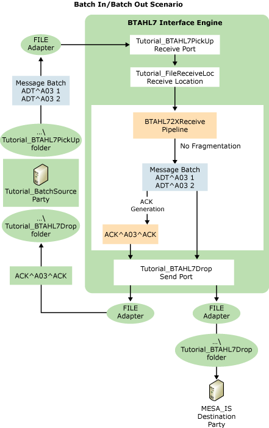

# Part 2: Batch In/Batch Out Scenario
In this part of the tutorial, you receive an HL7-encoded batch file, pass it through [!INCLUDE[btsBizTalkServerNoVersion](../../includes/btsbiztalkservernoversion-md.md)] without fragmentation, and send the intact batch file to the destination. The following figure shows the flow of this process, and the subsection below describes the workflow.  
  
> [!NOTE]
>  Before starting this part of the tutorial, turn off the MllpReceive and MllpSend tools that you used in Part 1, by closing the command prompts.  
  
   
  
 **How messages flow in the Batch In/Batch Out scenario**  
  
 This scenario includes the following workflow:  
  
1. The workflow begins when a line-of-business application sends a message batch to the [!INCLUDE[btsCoName](../../includes/btsconame-md.md)] BizTalk Accelerator for HL7 ([!INCLUDE[btaBTAHL71.3abbrevnonumber](../../includes/btabtahl71-3abbrevnonumber-md.md)]) Integration Engine using the FILE protocol. The batch contains two versions of an ADT^A03 message. The source application belongs to the Tutorial_BatchSource party.  
  
2. The Integration Engine receives the batch on a FILE receive port, and validates the message batch. (The level of validation depends on settings selected for the source party in [!INCLUDE[btaBTAHL71.3abbrevnonumber](../../includes/btabtahl71-3abbrevnonumber-md.md)] Configuration Explorer.)  
  
3. Based on a setting in [!INCLUDE[btaBTAHL71.3abbrevnonumber](../../includes/btabtahl71-3abbrevnonumber-md.md)] Configuration Explorer that disables batch fragmentation for the party, the Interface Engine does not parse the batch into individual messages, but leaves the batch as a batch. It validates the individual messages, again based on settings selected for the source party in [!INCLUDE[btaBTAHL71.3abbrevnonumber](../../includes/btabtahl71-3abbrevnonumber-md.md)] Configuration Explorer.  
  
4. The Interface Engine generates an acknowledgment for the batch message, based on the acknowledgment definition settings in the [!INCLUDE[btaBTAHL71.3abbrevnonumber](../../includes/btabtahl71-3abbrevnonumber-md.md)] Configuration Editor for the party. In this case, you select Original Acknowledgment mode, so the Interface Engine generates a single Application Accept acknowledgment for the message batch after validating both the message header and body. The engine builds the acknowledgment based on the ACK_024_GLO_DEF schema, enters "AA" in field MSA2 of the acknowledgment, enters the destination party in MSH3, and enters the source party in MSH5.  
  
5. The Interface Engine routes the acknowledgment batch to the source party through a FILE send adapter set up to process acknowledgments. In this case, [!INCLUDE[btaBTAHL71.3abbrevnonumber](../../includes/btabtahl71-3abbrevnonumber-md.md)] routes the batch to the \Tutorial_BatchACKDrop folder.  
  
6. [!INCLUDE[btaBTAHL71.3abbrevnonumber](../../includes/btabtahl71-3abbrevnonumber-md.md)] sends the message batch to the destination specified for the destination party, in this case the folder \Tutorial_BTAHL7Drop.  
  
## In This Section  
  
-   [Step 1: Configure Party Information for Batch In/Batch Out](../../adapters-and-accelerators/accelerator-hl7/step-1-configure-party-information-for-batch-in-batch-out.md)  
  
-   [Step 2: Modify or Create the Send and Receive Ports](../../adapters-and-accelerators/accelerator-hl7/step-2-modify-or-create-the-send-and-receive-ports.md)  
  
-   [Step 3: Test the Batch In/Batch Out Scenario](../../adapters-and-accelerators/accelerator-hl7/step-3-test-the-batch-in-batch-out-scenario.md)