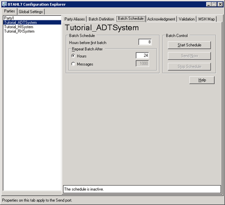

# Scheduling Batching
You use [!INCLUDE[HL7_CurrentVersion_FirstRef](../../includes/hl7-currentversion-firstref-md.md)] Configuration Explorer to activate, request, or terminate an outbound batch. Activating an outbound batch consists of two steps: configuring time-based or message count criteria and then starting the outbound batching orchestration.  
  
 The following figure shows the [!INCLUDE[btaBTAHL71.3abbrevnonumber](../../includes/btabtahl71-3abbrevnonumber-md.md)] Configuration Explorer **Batch Schedule** tab.  
  
   
  
 Use the following procedures to open [!INCLUDE[btaBTAHL71.3abbrevnonumber](../../includes/btabtahl71-3abbrevnonumber-md.md)] Configuration Explorer and schedule batching.  
  
### To open BTAHL7 Configuration Explorer  
  
-   Click **Start**, point to **Programs**, point to **Microsoft BizTalk \<version> Accelerator for HL7**, and then click **BTAHL7 Configuration Explorer**.  
  
### To schedule message batching  
  
1.  Open BTAHL7 Configuration Explorer.  
  
2.  In BTAHL7 Configuration Explorer, in the **BTAHL7 Configuration Explorer** dialog box, on the **Parties** tab, select the party you want to configure, and then on the **Batch Schedule** tab, do the following:  
  
    |Use this|To do this|  
    |--------------|----------------|  
    |**Hours before first batch**|Type the number of hours before the first batch is to start.|  
    |**Repeat Batch After**|Select one of the following:   -   **Hours**. Type the number of hours to repeat the batch process. -   **Messages**. Type the number of messages you want to process before the next batch process begins.|  
    |**Batch Control**|Select one of the following:   -   **Start Schedule**: Select to start the batch schedule. -   **Send Now**: Select to start the batch process immediately. -   **Stop Schedule**: Select to stop the current batch schedule.|  
  
## See Also  
 [Configuring Batching Acknowledgments](../../adapters-and-accelerators/accelerator-hl7/configuring-batching-acknowledgments.md)