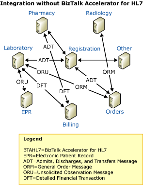
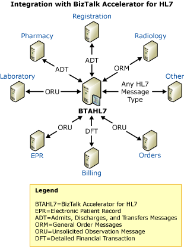

# The Need for Health Care Systems Integration
Microsoft [!INCLUDE[HL7_CurrentVersion_FirstRef](../../includes/hl7-currentversion-firstref-md.md)] provides health care providers with solutions for their application integration and business-process automation needs. This topic describes some of the business challenges that health care organizations face, and how systems incorporating Microsoft [!INCLUDE[btsBizTalkServerNoVersion_md](../../includes/btsbiztalkservernoversion-md.md)] and [!INCLUDE[HL7_CurrentVersion_abbrev_md](../../includes/hl7-currentversion-abbrev-md.md)] can help those organizations meet those challenges. Also take a look at a common scenario demonstrating a sample business scenario with [!INCLUDE[HL7_CurrentVersion_abbrev_md](../../includes/hl7-currentversion-abbrev-md.md)].  
  
## Health care business challenge

Health care organizations are complex business entities with many distinct, but connected parts. For a hospital, these departments can include Admission, labs, nursing stations, physicians, and billing. All of these departments generate and consume data. The data can include information about patients, billing, procedures, and medications. Often, organizations need this data across many of their departments. A common challenge for the health care organization is how to deal effectively with the exchange of data between departments.  
  
 The following figure shows how many departments may communicate with each other, creating a complex system.  
  
   
  
 Many of these departments also have distinct business processes. The personnel in a department may have created, implemented, and maintained their own processes. These processes may affect other departments, but the personnel may not have designed them with the other departments in mind.  
  
 Gaining greater control over processes across the full extent of the organization is an issue for many health care organizations.  
  
## Health care business solution

Technology can help solve the business challenges related to business process and data. Information Technology (IT) systems can help health care organizations transform their internal operations from disconnected, incompatible processes, to integrated, standardized ones.  
  
### Integration  
 Even if the processes of separate parts of a health care organization are not inherently compatible, you can integrate them. You can tie them together with technology that transforms a system characterized by point-to-point connections (as shown in the Health Care Business Challenge figure (in this topic) to one based on a hub-and-spoke arrangement, as shown in the following figure.  
  
   
  
[!INCLUDE[HL7_CurrentVersion_abbrev_md](../../includes/hl7-currentversion-abbrev-md.md)] achieves this integration by connecting to each separate department or entity, and providing the mechanisms that bind the processes together, resolving their differences. It also automates data exchange, so that business processes can run with a minimum of human intervention.  
  
### Standardization  
 Once you have connected business processes, the processes can exchange data. However, if the data maintained by separate departments is in different formats and systems transport it though different data protocols, the data exchange can require significant effort in system design and customization. You can greatly enhance the efficiency of this process if each of the connected departments standardizes the format and protocol used with their data exchange.  
  
 This is what the HL7 organization has done. They have created common formats for health care data, in the form of flat file schemas. Their efforts have been very successful, to the point that a high percentage of large hospitals have adopted their standards.  
  
### Solutions specific to the health care industry  
 Integrated IT systems and standardized data exchange have provided the foundation for more efficient health care processes. A truly effective IT solution for health care systems is one that focuses on the issues in that industry, and provides functionality, features, and tools that address the needs of health care organizations.  
  
[!INCLUDE[HL7_CurrentVersion_abbrev_md](../../includes/hl7-currentversion-abbrev-md.md)] provides that solution. You install [!INCLUDE[HL7_CurrentVersion_abbrev_md](../../includes/hl7-currentversion-abbrev-md.md)] on top of [!INCLUDE[btsBizTalkServerNoVersion_md](../../includes/btsbiztalkservernoversion-md.md)]. [!INCLUDE[HL7_CurrentVersion_abbrev_md](../../includes/hl7-currentversion-abbrev-md.md)] works with the schemas created and maintained by the HL7 organization. In addition, it provides features and tools specifically designed for health care applications. [!INCLUDE[HL7_CurrentVersion_abbrev_md](../../includes/hl7-currentversion-abbrev-md.md)] enables batching, acknowledgments, data validation, auditing, and logging required by health care organizations.  
  
## Next
Read a [sample business scenario](../../adapters-and-accelerators/accelerator-hl7/sample-business-scenario.md).
