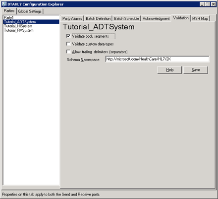

# Validation Settings
Using [!INCLUDE[btaBTAHL7NoNumber](../../includes/btabtahl7nonumber-md.md)], you can validate your messages against the HL7 standard. [!INCLUDE[btaBTAHL71.3abbrevnonumber](../../includes/btabtahl71-3abbrevnonumber-md.md)] ensures that the messages you send or receive have a message structure and body segment that conforms to the HL7 standard. You can also validate HL7 supported custom data types, and allow trailing delimiters. You use the [!INCLUDE[btaBTAHL71.3abbrevnonumber](../../includes/btabtahl71-3abbrevnonumber-md.md)] Configuration Explorer **Validation** tab to configure validation.  

## Configuring Validation Settings  
 You use the **Validation** tab of [!INCLUDE[btaBTAHL71.3abbrevnonumber](../../includes/btabtahl71-3abbrevnonumber-md.md)] Configuration Explorer (under the high-level **Parties** tab) to configure validation settings. You can select the following types of validation:  

- Syntax, structure, and schematic validation on body segments, based on the message schema  

- HL7 standard validation on custom data types (DT, TS, TM, and TN)  

- Validation of field delimiters (trailing delimiters are allowed)  

  Using this tab, you can also set the schema namespace used for the validation on the messages for this party.  

  The following figure shows the [!INCLUDE[btaBTAHL71.3abbrevnonumber](../../includes/btabtahl71-3abbrevnonumber-md.md)] Configuration Explorer **Validation** tab.  

    
  BTAHL7 Configuration Explorer Validation tab  

  Use the following procedures to configure validation settings.  

#### To open BTAHL7 Configuration Explorer  

-   Click **Start**, click **Programs**, click **Microsoft BizTalk \<version\> Accelerator for HL7**, and then click **BTAHL7 Configuration Explorer**.  

#### To configure validation settings  

1. In BTAHL7 Configuration Explorer on the **Validation** tab, do the following:  

   |                  Use this                  |                                            To do this                                            |
   |--------------------------------------------|--------------------------------------------------------------------------------------------------|
   |         **Validate body segments**         |             Select this option to perform syntax, structure, and schema validation.              |
   |       **Validate custom data type**        |  Select this option to perform HL7 standard validation on DT, TS, TM, and TN custom data types.  |
   | **Allow trailing delimiters (separators)** |           Select this option to enable trailing field delimiters in message instances.           |
   |            **Schema Namespace**            | Type the schema namespace location. The default value is http://microsoft.com/HealthCare/HL7/2X. |

2. Click **Save**.  

## See Also  
 [Logging Configuration](../../adapters-and-accelerators/accelerator-hl7/logging-configuration.md)   
 [Acknowledgment Settings](../../adapters-and-accelerators/accelerator-hl7/acknowledgment-settings.md)   
[Operational logging, message batching, validation and asknowledgment settings](../../adapters-and-accelerators/accelerator-hl7/operational-logging-message-batching-validation-and-asknowledgment-settings.md)