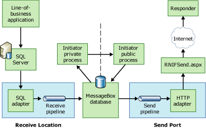

# Message Flow in the Initiator BTARN
Message flow on an initiator computer starts with receiving a message from the back-end line-of-business application, in its proprietary format. It involves converting that message to a RosettaNet Implementation Framework (RNIF)-compliant message, and then sending the message over the Internet to the responder computer.  
  
 If the Partner Interface Process (PIP) is single-action, the only response is an acknowledgement signal message. For information about single-action message flow, see "Flow of an Initiated Message" later in this topic. If the PIP is double-action, the initiator will receive a response message, and reply with an acknowledgement, in addition to the single-action message flow.  
  
 If the PIP is asynchronous, each message transmission over the Internet occurs on a different HTTP connection. If the PIP is synchronous, each message transmission occurs on the same connection, which the HTTP adapter holds until the process is complete. In a double-action synchronous scenario, the responder computer does not send an acknowledgement to the initiator computer in response to the initial request message. The response message serves as the acknowledgement.  
  
## BTARN Components on the Initiator Computer  
 As a message flows through [!INCLUDE[BTARN_CurrentVersion_FirstRef](../../includes/btarn-currentversion-firstref-md.md)] on the initiator computer, the following components will process the message:  
  
- SQL adapter  
  
- XML receive pipeline  
  
- Initiator private process  
  
- Initiator public process  
  
- XML send pipeline  
  
- HTTP adapter  
  
- RNIFSend.aspx page  
  
  For more information about these components, and how they process a message, see [Message Processing in BTARN](../../adapters-and-accelerators/accelerator-rosettanet/message-processing-in-btarn.md).  
  
## Flow of an Initiated Message  
 The following steps describe the message flow of an initiated message through the initiator [!INCLUDE[btaBTARN3.3abbrevnonumber](../../includes/btabtarn3-3abbrevnonumber-md.md)] computer. The following figure shows this process.  
  
   
  
1. The line-of-business application sends the message to [!INCLUDE[btsCoName](../../includes/btsconame-md.md)][!INCLUDE[btsSQLServerNoVersion](../../includes/btssqlservernoversion-md.md)].  
  
2. [!INCLUDE[btaBTARN3.3abbrevnonumber](../../includes/btabtarn3-3abbrevnonumber-md.md)] sends the message from the [!INCLUDE[btsSQLServerNoVersion](../../includes/btssqlservernoversion-md.md)] database to the SQL adapter.  
  
3. The XML receive pipeline does simple XML validation of the message.  
  
4. [!INCLUDE[btsBizTalkServerNoVersion](../../includes/btsbiztalkservernoversion-md.md)] routes the message to the MessageBox database.  
  
5. The private process processes the service content of the message.  
  
6. The public process processes the RNIF headers of the message.  
  
7. [!INCLUDE[btaBTARN3.3abbrevnonumber](../../includes/btabtarn3-3abbrevnonumber-md.md)] routes the message back to the MessageBox database.  
  
8. The send pipeline performs assembly and signing/encryption/encoding of the message.  
  
9. [!INCLUDE[btaBTARN3.3abbrevnonumber](../../includes/btabtarn3-3abbrevnonumber-md.md)] routes the message to the HTTP adapter.  
  
10. [!INCLUDE[btaBTARN3.3abbrevnonumber](../../includes/btabtarn3-3abbrevnonumber-md.md)] routes the message to the RNIFSend.aspx page, which sends it over the Internet to its destination.  
  
## See Also  
 [Message Flow in BTARN](../../adapters-and-accelerators/accelerator-rosettanet/message-flow-in-btarn.md)   
 [Message Flow in the Responder BTARN](../../adapters-and-accelerators/accelerator-rosettanet/message-flow-in-the-responder-btarn.md)   
 [Message Processing in BTARN](../../adapters-and-accelerators/accelerator-rosettanet/message-processing-in-btarn.md)