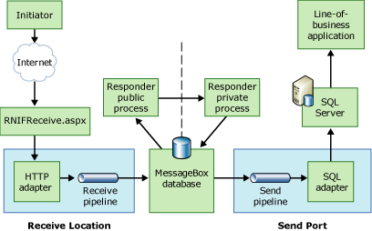

# Message Flow in the Responder BTARN
Message flow on a responder computer starts with receiving a message over the Internet from the initiator computer. It involves converting that message from a RosettaNet Implementation Framework (RNIF)-compliant message to a message in the proprietary format of the back-end application, and then routing the message to the line-of-business application.  
  
 If the Partner Interface Process (PIP) is single-action, the only response is an acknowledgement signal message. If the PIP is double-action, the responder will process and send a response message, and subsequently receive an acknowledgment for that response.  
  
 If the PIP is asynchronous, each message transmission over the Internet occurs on a different HTTP connection. If the PIP is synchronous, each message transmission occurs on the same connection, which the HTTP adapter holds until the process is complete. In a double-action synchronous scenario, the responder computer does not send an acknowledgement to the initiator computer in response to the initial request message. The response message serves as the acknowledgement.  
  
## BTARN Components on the Responder Computer  
 As a message flows through Microsoft [!INCLUDE[BTARN_CurrentVersion_FirstRef](../../includes/btarn-currentversion-firstref-md.md)] on the responder computer, the following components will process the message:  
  
- RNIFReceive.aspx page  
  
- HTTP adapter  
  
- Receive pipeline  
  
- Responder public process  
  
- Responder private process  
  
- SQL adapter  
  
- Send pipeline  
  
  For more information about these components, and how they process a message, see [Message Processing in BTARN](../../adapters-and-accelerators/accelerator-rosettanet/message-processing-in-btarn.md).  
  
## Message Flow on the Responder Computer  
 The message flow of a received message through the responder [!INCLUDE[btaBTARN3.3abbrevnonumber](../../includes/btabtarn3-3abbrevnonumber-md.md)] computer is as follows:  
  
   
  
1. The RNIFReceive aspx page receives the incoming message from the initiator.  
  
2. [!INCLUDE[btaBTARN3.3abbrevnonumber](../../includes/btabtarn3-3abbrevnonumber-md.md)] submits the message to the HTTP adapter, which submits it to the receive pipeline.  
  
3. The receive pipeline decodes, disassembles, and performs party resolution on the message, and then converts the message into the proprietary format of the back-end line-of-business application.  
  
4. [!INCLUDE[btaBTARN3.3abbrevnonumber](../../includes/btabtarn3-3abbrevnonumber-md.md)] routes the message to the MessageBox database.  
  
5. The public process processes the RNIF headers of the message.  
  
6. The private process processes the service content of the message. It generates an acknowledgement that is returned to the public process, to the MessageBox database, to the send pipeline, and then to the HTTP adapter for return over the Internet to the initiator.  
  
7. [!INCLUDE[btaBTARN3.3abbrevnonumber](../../includes/btabtarn3-3abbrevnonumber-md.md)] routes the message to the MessageBox database.  
  
8. The send pipeline assembles, and then signs/encrypts/encodes the message.  
  
9. [!INCLUDE[btaBTARN3.3abbrevnonumber](../../includes/btabtarn3-3abbrevnonumber-md.md)] routes the message to the SQL adapter.  
  
10. [!INCLUDE[btaBTARN3.3abbrevnonumber](../../includes/btabtarn3-3abbrevnonumber-md.md)] submits the message to [!INCLUDE[btsSQLServerNoVersion](../../includes/btssqlservernoversion-md.md)], and to the line-of-business application on the back end.  
  
## See Also  
 [Message Flow in BTARN](../../adapters-and-accelerators/accelerator-rosettanet/message-flow-in-btarn.md)   
 [Message Flow in the Initiator BTARN](../../adapters-and-accelerators/accelerator-rosettanet/message-flow-in-the-initiator-btarn.md)
