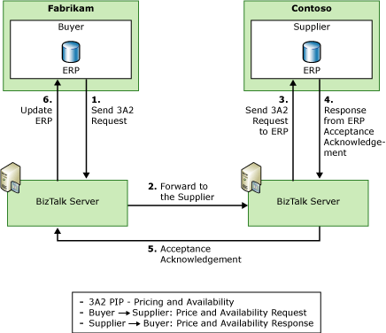

# Private Process Tutorial
This tutorial contains a complete end-to-end solution using [!INCLUDE[btsCoName](../../includes/btsconame-md.md)]® [!INCLUDE[BTARN_CurrentVersion_FirstRef](../../includes/btarn-currentversion-firstref-md.md)]. The tutorial details the steps that you have to follow to implement a RosettaNet-compliant solution by creating a trading scenario between two fictitious companies: Contoso, the supplier organization, and Fabrikam, the buyer organization.  
  
 The scenario this tutorial implements uses the 3A2-Price and Availability Partner Interface Process (PIP). Before a purchase, the buyer, Fabrikam, sends a 3A2-Price and Availability Request to the supplier, Contoso. This PIP enables Fabrikam to obtain information about a certain product that they can then process through business rules to make a determination about whether to purchase the product. The following figure shows the communication pattern between the initiator and responder organizations during a 3A2 PIP exchange.  
  
   
  
 The focus of this tutorial is on the Contoso solution. It outlines various aspects of creating a RosettaNet-based solution, including ERP integration, business policy enforcement, private process customization, and promoting secure communication.  
  
## In This Section  
  
-   [Preparing for the Private Process Tutorial](../../adapters-and-accelerators/accelerator-rosettanet/preparing-for-the-private-process-tutorial.md)  
  
-   [Creating the Contoso Solution](../../adapters-and-accelerators/accelerator-rosettanet/creating-the-contoso-solution.md)  
  
-   [Creating the Fabrikam Solution](../../adapters-and-accelerators/accelerator-rosettanet/creating-the-fabrikam-solution.md)  
  
-   [Testing the Solution](../../adapters-and-accelerators/accelerator-rosettanet/testing-the-solution.md)