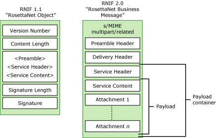

# RNIF Standard
The RosettaNet Implementation Framework (RNIF) standard defines how systems transport a RosettaNet message. The RNIF standard is a robust transfer, routing, packaging, and security standard. All RosettaNet messaging systems must comply with the RNIF standard to achieve RosettaNet certification.  
  
 The standard defines message structure, the need for acknowledgements, Multipurpose Internet Mail Extensions (MIME) encoding, and the digital signature. The core standard includes requirements for authentication, authorization, encryption, and non-repudiation. The RNIF standard is based on HTTP, MIME, and XML standards. The RNIF standard does not specify a platform or an enabling application.  
  
 [!INCLUDE[BTARN_CurrentVersion_FirstRef](../../includes/btarn-currentversion-firstref-md.md)] implements two versions of RNIF: RNIF Specification v02.00.01 and RNIF Specification v1.1. RNIF 2.01 added significant functionality beyond that supported by RNIF 1.1, including encryption, attachments, and synchronous transactions. RNIF 2.0 is not backward compatible with RNIF 1.1.  
  
## Messaging Framework Patterns  
 The following table shows RNIF support for messaging framework patterns and synchronous message exchange. A single-action message is one that does not involve a response, whereas a double-action message includes a request and response.  
  
|Framework|Pattern|Synchronous/ Asynchronous|  
|---------------|-------------|---------------------------------|  
|RNIF 1.1|Notification|Asynch|  
|RNIF 1.1|Transaction|Asynch|  
|RNIF 2.0|Double-action|Synch|  
|RNIF 2.0|Double-action|Asynch|  
|RNIF 2.0|Single-action|Synch|  
|RNIF 2.0|Single-action|Asynch|  
  
## Message Definitions  
 RNIF 1.1 and RNIF 2.01 define the RosettaNet message differently. These differences include how they handle attachments, the Secure/Multipurpose Internet Mail Extensions (SMIME) envelope, delivery header, and MIME packaging. RNIF 2.01 specifically includes attachments; RNIF 2.01 adds a delivery header, while RNIF 1.1 does not.  
  
> [!NOTE]
>  [!INCLUDE[btaBTARN3.3abbrevnonumber](../../includes/btabtarn3-3abbrevnonumber-md.md)] does not support the *Technical Recommendations for RNIF 1.1* published by the RosettaNet organization (one for attachment support, and one for synchronous responses).  
  
 Systems use the parts of RNIF 1.1 and RNIF 2.01 messages for party identification, routing, and service-level identification purposes. Before reading and replying to a body of service content, which is the main content of the message, each party must successfully populate or interpret the header values.  
  
 The following figure describes the RNIF 1.1 and RNIF 2.01 message definitions.  
  
   
  
 In the RNIF 1.1 message, the version number indicates the RNIF version. The content length is the length of the RosettaNet Service Message. The Service Message, which includes the preamble, the service header, and the service content, is a multipart/related MIME entity. The signature length is the length of the signature in bytes. If the signature exists, it is a Public-Key Cryptography Standards (PKCS) #7 signature on the service message field.  
  
 RNIF 2.01 includes a transfer protocol-independent container that packs together the business payload, header components, and other elements that systems will exchange in the package. A RosettaNet Business Message (as defined for RNIF 2.01) contains a preamble, a delivery header, a service header, and service content. Systems must validate all elements against the schema for the document type that contains it, based on the RosettaNet standard document type definition (DTD) grammar-validation rules. Service content can be an action message or a signal message. If service content is an action message, the message can include one or more attachments.  
  
 A RosettaNet Business Message is a multipart/related MIME entity. As shown in the preceding figure, the headers and service content are packaged together using a MIME multipart/related construct, which is similar to the RNIF 1.1 packaging scheme. Optionally, systems can digitally sign a RosettaNet Business Message. In RNIF 1.1, you would use the RosettaNet Object (RNO) format for this purpose. RNIF 2.0 eliminates the RNO format, and instead uses standard S/MIME encoding.  
  
 A system may encrypt the RNIF 2.01 payload or payload container. To do this, you bundle the parts that you want to encrypt in a multipart/related MIME entity, and then encrypt them. You then package the resulting S/MIME object as a single part in the RosettaNet Business Message.  
  
 A signal message must always be a RosettaNet-defined signal message instance. For action messages, the RNIF 2.01 specification provides the option of shipping business-action messages in a third-party defined format. The RNIF 2.01 service header includes additional fields for this purpose, such as a field that identifies the “standard body” and a field that identifies the version of the specification to which the action message conforms.  
  
 Only action messages (also known as business content) can be of non-RosettaNet origin. Systems must exchange these messages in a RosettaNet-defined PIP. RosettaNet must sanction these messages by explicitly identifying the sanctioned third-party action message in the PIP specification. Additionally, trading partners must agree in their trading partner agreement to exchange third-party business content. The agreement must include the PIP payload binding information, which identifies which third-party business content you would use as a replacement for a particular action message in a PIP.  
  
## See Also  
 [RosettaNet and CIDX Messaging Standards](../../adapters-and-accelerators/accelerator-rosettanet/rosettanet-and-cidx-messaging-standards.md)   
 [RosettaNet PIPs](../../adapters-and-accelerators/accelerator-rosettanet/rosettanet-pips.md)