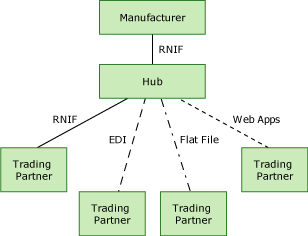

# Sample Hub-Based Scenario
In many supply-chain scenarios, a company will work with each of their trading partners to institute a RosettaNet Implementation Framework (RNIF) connection. This is an effective way to standardize communications throughout the supply chain. This scenario is described in [Sample Supply Chain Scenario](../../adapters-and-accelerators/accelerator-rosettanet/sample-supply-chain-scenario.md).  
  
 Another way to automate transactions throughout the supply chain is for the company to contract with another company to set up and manage the integrated system. This is a hub-based scenario.  
  
## How a Hub-Based System Works  
 In a hub-based system, the company contracting for an integrated system connects to the hub company using an RNIF connection. The hub then connects to all the company's trading partners using whatever type of electronic connection is required. The hub company provides all the trading partners with connection options: RNIF connections, EDI, flat file, Web applications, or non-compliant, proprietary connections. Managing the communications system is the hub company's business. The following figure shows how such a system might work.  
  
   
  
 A hub-based system has many advantages:  
  
-   The contracting company does not have to deal with the complexity of the supply chain; the hub company handles it.  
  
-   The contracting company does not have to maintain or upgrade the system, and it is not responsible for downtime; the hub company is responsible for system maintenance and downtime.  
  
-   The contracting company gains the advantages of a RosettaNet-compliant system, including standardization, automation, cost savings, and visibility.  
  
-   The contracting company has fully automated their supply chain with a variety of electronic connections that give the full array of trading partners a choice of connections. The contracting company does not have to maintain technological expertise in a variety of connection options.  
  
-   A trading partner can continue to use a proprietary connection, as long as the hub company supports it.  
  
-   The system is flexible. Trading partners do not have to adopt a RosettaNet-compliant system. However, if they do so, they will gain the benefits from such a system.  
  
## See Also  
 [How BizTalk Server Solves the Business Need](../../adapters-and-accelerators/accelerator-rosettanet/how-biztalk-server-solves-the-business-need1.md)   
 [The Need for Trading Partner Integration](../../adapters-and-accelerators/accelerator-rosettanet/the-need-for-trading-partner-integration.md)   
 [The Supply Chain Challenge](../../adapters-and-accelerators/accelerator-rosettanet/the-supply-chain-challenge.md)   
 [The Supply Chain Solution](../../adapters-and-accelerators/accelerator-rosettanet/the-supply-chain-solution.md)   
 [Sample Supply Chain Scenario](../../adapters-and-accelerators/accelerator-rosettanet/sample-supply-chain-scenario.md)
