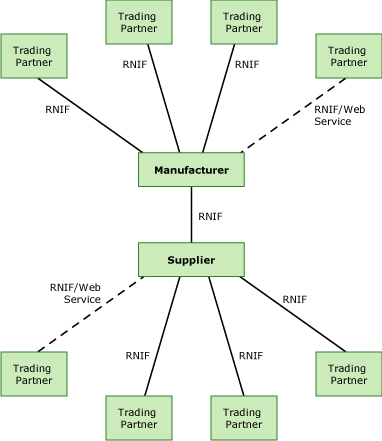

# Sample Supply Chain Scenario
One of the most fundamental processes in the high-technology supply chain is the exchange of purchase-order request and response messages. A buyer issues a purchase order, and a supplier acknowledges, at the line level, whether they accept or reject the order, or whether the order is pending.  
  
 This topic describes a sample scenario of two trading partners exchanging purchase-order messages, and shows how integration and automation enhance the process.  
  
## The Players  
 The buyer in this sample scenario is a large high-tech equipment manufacturer. They currently use an EDI-based system for automated data exchange. With suppliers that do not use EDI, they rely on telephone, fax, e-mail with spreadsheets, and Web applications. Even with those suppliers that do use EDI, they have a limited ability to integrate their trading-partner communications with their back-end ERP system. After they receive orders and information through EDI, they must manually re-key those orders into their ERP system. They want to improve their existing supply-chain processes by automating demand, inventory, purchasing, and reporting with their trading partners. They need a system to connect with their suppliers and customers through the Internet that will also integrate directly with their existing line-of-business (LOB) applications.  
  
 The seller is a medium-size supplier of high-performance integrated circuits (ICs). They currently communicate with their trading partners using telephone, fax, e-mail with attached [!INCLUDE[btsCoName](../../includes/btsconame-md.md)][!INCLUDE[btsExcel](../../includes/btsexcel-md.md)] spreadsheets, FTP, and Web applications. They do not use EDI. Their interactions with each trading partner are different, depending on the needs of the customer and their own technologies. They want to make their business processes more efficient to reduce transaction costs, improve customer satisfaction, and gain a competitive advantage.  
  
## The Present Business Process  
 Without an integrated solution, the purchase-order process for the manufacturer and supplier works as follows:  
  
1. A customer of the high-tech equipment manufacturer sends an order to the manufacturer over a Web site.  
  
2. In response to the original order, an employee of the manufacturer creates a purchase-order request in their LOB ERP application for the IC supplier.  
  
3. The purchase-order request traverses the various parties in the manufacturing company who have to record, process, review, and authorize the purchase-order request. This processing and routing is a combination of automated processes for users of the ERP system, and manual processes, such as e-mail with an attached [!INCLUDE[btsExcel](../../includes/btsexcel-md.md)] spreadsheet.  
  
4. An employee creates a purchase-order request in e-mail, and sends it to the supplier. A number of other employees communicating through e-mail, fax, or EDI to other suppliers repeat this process. Different departments use different processes. With those suppliers that use EDI, an employee of the manufacturer must still create a message manually from the ERP system.  
  
5. An employee at the supplier receives the message, and then manually keys it into their ERP system, changing the format of the data. By e-mail, the employee notifies other employees of the request.  
  
6. The other employees analyze the request. If required, they notify their own parts suppliers of the need for parts. Depending on the supplier, they use telephone, fax, e-mail, or FTP to notify their suppliers.  
  
7. After conferring with their departments and suppliers, each employee accepts or rejects each purchase order product line item, and then confirms or rejects the purchase order, and indicates that it is pending. They perform these tasks in the ERP system.  
  
8. An employee of the supplier creates a purchase-order response in e-mail, either confirming or rejecting each line item of the request, or creating a message indicating that the purchase order is pending. The employee of the supplier sends the response message to the manufacturer. If a line item is pending, they will later create another message indicating whether the pending item is accepted or rejected.  
  
9. An employee of the manufacturer receives the purchase-order response. They re-enter the order into their back-end ERP system.  
  
10. Another employee analyzes the purchase-order confirmation, and then creates a response to the original customer, confirming the order. They send this response through e-mail.  
  
## The RosettaNet Solution  
 Microsoft BizTalk Server and [!INCLUDE[BTARN_CurrentVersion_FirstRef](../../includes/btarn-currentversion-firstref-md.md)] automate and standardize the purchase-order request and response process. Using an integrated system minimizes the amount of manual intervention, the amount of paper handling, and using telephones and fax machines. Most processes are automated transactions between integrated server computers. When employees must manually perform an operation, they typically do it on back-end ERP systems. The following figure shows the integrated system.  
  
   
  
 In this scenario, an integrated system changes the following processes:  
  
- A RosettaNet Implementation Framework (RNIF) connection replaces the routine manual interactions between the manufacturer and the IC supplier. The system automatically sends and receives messages, routes data to back-end systems, and acknowledges and responds to the messages. Both the manufacturer and the supplier use [!INCLUDE[btaBTARN3.3abbrevnonumber](../../includes/btabtarn3-3abbrevnonumber-md.md)] to implement the RNIF connection.  
  
- An RNIF connection replaces the EDI connection between the manufacturer, the IC supplier, and other trading partners. This lets the integration system route data automatically to the back-end systems of the trading partners. Some of the trading partners use [!INCLUDE[btaBTARN3.3abbrevnonumber](../../includes/btabtarn3-3abbrevnonumber-md.md)] to implement the RNIF connection; others use a different RosettaNet-compliant solution.  
  
- For those smaller partners that do not have a RosettaNet-compliant solution, the manufacturer and the IC supplier create Web services that the partner can access with a Web browser. The Web service uses a standard RNIF connection to communicate with the [!INCLUDE[btaBTARN3.3abbrevnonumber](../../includes/btabtarn3-3abbrevnonumber-md.md)] system at either the manufacturer or the IC supplier.  
  
- Messages exchanged by the manufacturers and the suppliers follow schemas that comply with standard RosettaNet Partner Interface Processes (PIPs). These schemas replace the formats used in EDI and FTP. All trading partners use the same schemas; they do not have to map data between messages.  
  
- [!INCLUDE[btaBTARN3.3abbrevnonumber](../../includes/btabtarn3-3abbrevnonumber-md.md)] automatically validates all messages against the schemas, diminishing the risk of data errors.  
  
- Administrators can intervene on [!INCLUDE[btaBTARN3.3abbrevnonumber](../../includes/btabtarn3-3abbrevnonumber-md.md)] servers using administrative software tools. Business decision-makers on client computers can use business-monitoring tools hosted in Microsoft Office-based applications or tools. Both these are efficient processes that keep the system operating effectively and provide more visibility into how the system—and how the business—is running.  
  
### Message Flow  
 The business process now includes the following steps:  
  
1. A customer of the high-tech equipment manufacturer sends an order to the manufacturer over a Web site.  
  
2. In response to the original order, an employee of the manufacturer generates a purchase-order request on the company's Order and Inventory Management System. This LOB application is an ERP system with a Web-based user interface.  
  
3. The system sends the purchase-order request, still in the format native to the ERP system, to [!INCLUDE[btaBTARN3.3abbrevnonumber](../../includes/btabtarn3-3abbrevnonumber-md.md)].  
  
4. [!INCLUDE[btaBTARN3.3abbrevnonumber](../../includes/btabtarn3-3abbrevnonumber-md.md)] automatically generates a purchase-order request message conforming to the 3A4 PIP defined by the RosettaNet organization. This purchase-order request is in XML format. The PIP defines the content of the message.  
  
   > [!NOTE]
   >  The 3A4 PIP makes sure that all purchase-order requests and responses are the same in form. This PIP is part of a collection of RosettaNet-defined PIPs that form a complete, interconnected messaging system. For example, before sending the 3A4 message, the buyer may look for price and availability (PIP 3A2), request a quote (PIP 3A1), or transfer their shopping cart (PIP 3A3). After sending the purchase-order request, the buyer may change the purchase order (PIP 3A8), cancel the purchase order (PIP 3A9), query for purchase-order status (PIP 3A5), or distribute the purchase-order status (PIP 3A6). The RosettaNet organization has standardized all these messages.  
  
5. [!INCLUDE[btaBTARN3.3abbrevnonumber](../../includes/btabtarn3-3abbrevnonumber-md.md)] wraps the request message (named the service content) with RNIF headers that let [!INCLUDE[btaBTARN3.3abbrevnonumber](../../includes/btabtarn3-3abbrevnonumber-md.md)] transmit the message over the Internet to another [!INCLUDE[btaBTARN3.3abbrevnonumber](../../includes/btabtarn3-3abbrevnonumber-md.md)] computer at the supplier site. RNIF defines how partners exchange messages over the Internet.  
  
6. The manufacturer's [!INCLUDE[btaBTARN3.3abbrevnonumber](../../includes/btabtarn3-3abbrevnonumber-md.md)] system sends the purchase-order request to the IC supplier's [!INCLUDE[btaBTARN3.3abbrevnonumber](../../includes/btabtarn3-3abbrevnonumber-md.md)] system.  
  
7. The supplier's [!INCLUDE[btaBTARN3.3abbrevnonumber](../../includes/btabtarn3-3abbrevnonumber-md.md)] N system receives the purchase-order request. If this were a single-action request (one without a corresponding response), the supplier's [!INCLUDE[btaBTARN3.3abbrevnonumber](../../includes/btabtarn3-3abbrevnonumber-md.md)] system would return a signal message that acknowledges receipt of the message. However, because this is a double-action message, the supplier's [!INCLUDE[btaBTARN3.3abbrevnonumber](../../includes/btabtarn3-3abbrevnonumber-md.md)] system will return a receipt acknowledgement signal message followed by a response message as well.  
  
8. The supplier's [!INCLUDE[btaBTARN3.3abbrevnonumber](../../includes/btabtarn3-3abbrevnonumber-md.md)] system removes the RNIF headers from the purchase-order request message, processes the service content of the message, and then routes the request to the supplier's ERP system.  
  
9. Employees of the supplier work in the ERP system to process the order. If they have to send messages to their own parts suppliers, they do so using the same BizTalk and [!INCLUDE[btaBTARN3.3abbrevnonumber](../../includes/btabtarn3-3abbrevnonumber-md.md)] system. The IT department can customize the system to respond to the manufacturer automatically.  
  
10. An employee uses the supplier's ERP system to generate a purchase-order response message, and then routes the response message to the supplier's [!INCLUDE[btaBTARN3.3abbrevnonumber](../../includes/btabtarn3-3abbrevnonumber-md.md)] system.  
  
11. The supplier's [!INCLUDE[btaBTARN3.3abbrevnonumber](../../includes/btabtarn3-3abbrevnonumber-md.md)] system generates a PIP 3A4 purchase-order response message, wraps the service content of the response message in RNIF headers, and then sends the purchase-order response to the manufacturer's [!INCLUDE[btaBTARN3.3abbrevnonumber](../../includes/btabtarn3-3abbrevnonumber-md.md)] system.  
  
12. The manufacturer's [!INCLUDE[btaBTARN3.3abbrevnonumber](../../includes/btabtarn3-3abbrevnonumber-md.md)] system receives the purchase-order response, and then sends a receipt acknowledgement message to the supplier's [!INCLUDE[btaBTARN3.3abbrevnonumber](../../includes/btabtarn3-3abbrevnonumber-md.md)]. The supplier's [!INCLUDE[btaBTARN3.3abbrevnonumber](../../includes/btabtarn3-3abbrevnonumber-md.md)] system routes the acknowledgement to the supplier's ERP system.  
  
13. The manufacturer's [!INCLUDE[btaBTARN3.3abbrevnonumber](../../includes/btabtarn3-3abbrevnonumber-md.md)] removes the RNIF headers from the response message, processes the service content, and then routes the purchase-order response to the manufacturer's ERP application.  
  
14. An employee of the manufacturer analyzes all purchase-order confirmation messages, and then creates a response to the original customer, confirming the order. The employee then sends this response through e-mail.  
  
## Advantages of the BTARN Solution  
 BizTalk Server and [!INCLUDE[BTARN_CurrentVersion_abbrev](../../includes/btarn-currentversion-abbrev-md.md)] automate most facets of the purchase-order request and response process. They do so not only for the manufacturer and the IC supplier, but also for all other trading partners who have adopted RosettaNet-compliant solutions as part of supply-chain management.  
  
 An integration system minimizes the amount of manual intervention and the amount of paper handling. Most processes involve automated interactions between integrated server computers. Both the manufacturer and the IC supplier have a high degree of control over, and visibility into, their processes. They automatically receive acknowledgements, and can maintain proof of non-repudiation.  
  
 The automated system using [!INCLUDE[btaBTARN3.3abbrevnonumber](../../includes/btabtarn3-3abbrevnonumber-md.md)] enables the manufacturer and the supplier to do the following:  
  
-   Reduce the cycle times for order fulfillment  
  
-   Reduce uncertainties in the process, and increase the reliability of the process  
  
-   Decrease fulfillment times and quote response times  
  
-   Reduce time spent manually reworking information, obtaining missing information, or correcting errors  
  
-   Provide visibility into and enable monitoring of the process and tracking of messages  
  
## See Also  
 [How BizTalk Server Solves the Business Need](../../adapters-and-accelerators/accelerator-rosettanet/how-biztalk-server-solves-the-business-need1.md)   
 [The Need for Trading Partner Integration](../../adapters-and-accelerators/accelerator-rosettanet/the-need-for-trading-partner-integration.md)   
 [The Supply Chain Challenge](../../adapters-and-accelerators/accelerator-rosettanet/the-supply-chain-challenge.md)   
 [The Supply Chain Solution](../../adapters-and-accelerators/accelerator-rosettanet/the-supply-chain-solution.md)   
 [Sample Hub-Based Scenario](../../adapters-and-accelerators/accelerator-rosettanet/sample-hub-based-scenario.md)