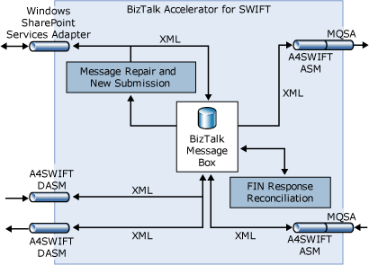

# A4SWIFT Component Configuration Guide
This guide provides information about configuring [!INCLUDE[btsCoName](../../includes/btsconame-md.md)][!INCLUDE[A4SWIFT_CurrentVersion_FirstRef](../../includes/a4swift-currentversion-firstref-md.md)]. Perform the steps in this configuration guide after you have installed A4SWIFT and completed the A4SWIFT Configuration Wizard (as described in the Installation Guide). This configuration guide includes the following instructions:  

- Post-installation steps for configuring the A4SWIFT runtime for messaging scenarios.  

- How to configure Message Repair and New Submission. To do so, you must first manually configure the A4SWIFT runtime. This does not require that you configure FIN Response Reconciliation.  

- How to configure FIN Response Reconciliation. To do so, you must first manually configure the A4SWIFT runtime. This does not require that you configure Message Repair and New Submission.  

  The following figure shows the A4SWIFT components that you will configure.  

    

  This section contains:  

- [Configuring the A4SWIFT Runtime](../../adapters-and-accelerators/accelerator-swift/configuring-the-a4swift-runtime.md)  

- [Configuring Message Repair and New Submission](../../adapters-and-accelerators/accelerator-swift/configuring-message-repair-and-new-submission.md)  

- [Configuring FIN Response Reconciliation](../../adapters-and-accelerators/accelerator-swift/configuring-fin-response-reconciliation.md)
