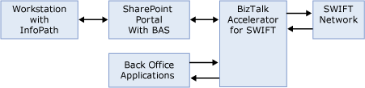
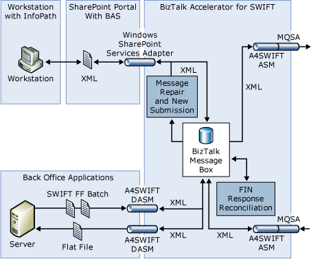
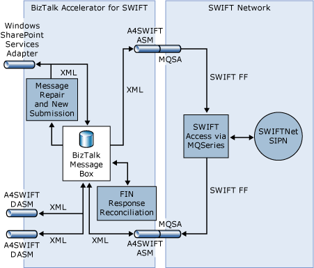
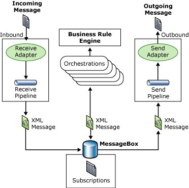

# BizTalk Accelerator for SWIFT Runtime
[!INCLUDE[btsCoName](../../includes/btsconame-md.md)] [!INCLUDE[A4SWIFT_CurrentVersion_FirstRef](../../includes/a4swift-currentversion-firstref-md.md)] provides functionality in two forms: development materials and runtime components. Development materials include XSD schemas, validation rules and policies, and sample code. Runtime components include the custom SWIFT disassembler, the custom SWIFT assembler, the Message Repair and New Submission orchestration (MrsrRepair.odx), and the FIN Response Reconciliation orchestration (FrrMain.odx). For more information on Message Repair and New Submission, see [Message Repair and New Submission](../../adapters-and-accelerators/accelerator-swift/message-repair-and-new-submission.md). For more information on FRR, see [FIN Response Reconciliation](../../adapters-and-accelerators/accelerator-swift/fin-response-reconciliation.md).  

 The following figure shows the high-level system architecture of [!INCLUDE[A4SWIFT_CurrentVersion_abbrev](../../includes/a4swift-currentversion-abbrev-md.md)].  

   

 The following figure illustrates how messages flow between A4SWIFT and a back-end application, and how A4SWIFT uses [!INCLUDE[btsInpathNoVersion](../../includes/btsinpathnoversion-md.md)] forms in MRSR site for Message Repair and New Submission.  

   

 The following figure illustrates how messages flow between A4SWIFT and the SWIFT Network.  

   

 You can define all A4SWIFT components as vertical-specific implementations of BizTalk Server application components. BizTalk accelerators provide development and runtime functionality to accelerate vertical-specific BizTalk application development on top of [!INCLUDE[btsBizTalkServerNoVersion](../../includes/btsbiztalkservernoversion-md.md)]. Therefore, all A4SWIFT components (development or runtime) abide by, and fit into, the BizTalk Server application architecture. A4SWIFT installs runtime components into the [!INCLUDE[btsBizTalkServerNoVersion](../../includes/btsbiztalkservernoversion-md.md)] runtime as custom components. After development materials are compiled and deployed, A4SWIFT and the [!INCLUDE[btsBizTalkServerNoVersion](../../includes/btsbiztalkservernoversion-md.md)] runtime use them to provide SWIFT messaging and automation functionality.  

 The following figure shows the high-level application topology for BizTalk Server.  

   

 The [!INCLUDE[btsBizTalkServerNoVersion](../../includes/btsbiztalkservernoversion-md.md)] application model uses the MessageBox database and the publisher-subscriber pattern that governs message flow into and out of the MessageBox database. For more information about BizTalk architecture and application design, see BizTalk Server Help.  

 The A4SWIFT application model inherits the [!INCLUDE[btsBizTalkServerNoVersion](../../includes/btsbiztalkservernoversion-md.md)] application model and adds to it SWIFT-specific components to facilitate SWIFT-related solutions on [!INCLUDE[btsBizTalkServerNoVersion](../../includes/btsbiztalkservernoversion-md.md)]. The following list describes these A4SWIFT-specific components:  

- **Runtime components.** SWIFT disassembler in the receive pipeline, SWIFT assembler in the send pipeline, Message Repair and New Submission orchestration, and FIN Response Reconciliation orchestration.  

- **Development materials.** SWIFT schemas, rules, orchestrations, and sample projects to be included in customer solutions and deployed onto the runtime for execution.  

  This section describes the A4SWIFT runtime in detail.  

  This section contains:  

- [SWIFT Disassembler](../../adapters-and-accelerators/accelerator-swift/swift-disassembler.md)  

- [SWIFT Assembler](../../adapters-and-accelerators/accelerator-swift/swift-assembler.md)  

- [Submitting Messages Through Receive Locations and InfoPath Forms](../../adapters-and-accelerators/accelerator-swift/submitting-messages-through-receive-locations-and-infopath-forms.md)  

- [Message Validation Engine](../../adapters-and-accelerators/accelerator-swift/message-validation-engine.md)
