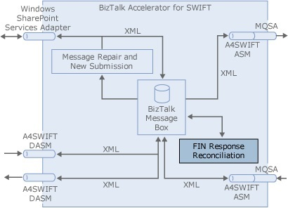

# Configuring FIN Response Reconciliation
You must perform the steps in the following sections to configure the [!INCLUDE[btsCoName](../../includes/btsconame-md.md)][!INCLUDE[A4SWIFT_CurrentVersion_FirstRef](../../includes/a4swift-currentversion-firstref-md.md)] FIN Response Reconciliation (FRR) feature, as shown in the following figure.  
  
   
  
 In the A4SWIFT Installation Wizard, you can choose to install Message Repair and New Submission and FRR, or Message Repair and New Submission without FRR, or FRR without Message Repair and New Submission. As a result, the instructions in this section do not assume that you are installing and configuring Message Repair and New Submission. They do, however, assume that you have performed the steps in the [Configuring the A4SWIFT Runtime](../../adapters-and-accelerators/accelerator-swift/configuring-the-a4swift-runtime.md).  
  
 This section contains:  
  
-   [Binding and Starting the FRR Orchestration](../../adapters-and-accelerators/accelerator-swift/binding-and-starting-the-frr-orchestration.md)  
  
-   [Creating the FRR Receive Pipeline](../../adapters-and-accelerators/accelerator-swift/creating-the-frr-receive-pipeline.md)  
  
-   [Creating the FRR Receive Location for Receiving from the Back-End Application](../../adapters-and-accelerators/accelerator-swift/creating-the-frr-receive-location-for-receiving-from-the-back-end-application.md)  
  
-   [Creating the FRR Receive Location for Receiving from SWIFT](../../adapters-and-accelerators/accelerator-swift/creating-the-frr-receive-location-for-receiving-from-swift.md)  
  
-   [Creating the FRR Send Pipeline](../../adapters-and-accelerators/accelerator-swift/creating-the-frr-send-pipeline.md)  
  
-   [Creating the FRR Send Port for Sending to SWIFT](../../adapters-and-accelerators/accelerator-swift/creating-the-frr-send-port-for-sending-to-swift.md)  
  
-   [Creating the FRR Send Ports for Sending to the Custom Handlers](../../adapters-and-accelerators/accelerator-swift/creating-the-frr-send-ports-for-sending-to-the-custom-handlers.md)