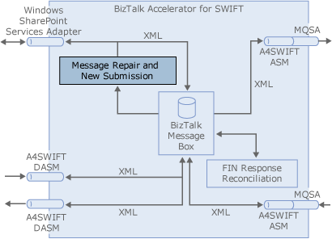

# Configuring Message Repair and New Submission
You must perform the steps in the following sections to configure the Message Repair and New Submission feature of [!INCLUDE[btsCoName](../../includes/btsconame-md.md)][!INCLUDE[A4SWIFT_CurrentVersion_FirstRef](../../includes/a4swift-currentversion-firstref-md.md)], as shown in the following figure.  
  
   
  
 In the A4SWIFT Installation Wizard, you can choose to install Message Repair and New Submission and FIN Response Reconciliation (FRR), or Message Repair and New Submission without FRR, or FRR without Message Repair and New Submission. As a result, the instructions in this section do not assume that you are installing and configuring FRR. They do, however, assume that you have performed the steps in the [A4SWIFT Component Configuration Guide](../../adapters-and-accelerators/accelerator-swift/a4swift-component-configuration-guide.md) section.  
  
 This section contains:  
  
-   [Installing Certificates](../../adapters-and-accelerators/accelerator-swift/installing-certificates.md)  
  
-   [Setting A4SWIFT Properties](../../adapters-and-accelerators/accelerator-swift/setting-a4swift-properties.md)  
  
-   [Adding A4SWIFT Users and Updating Windows Groups](../../adapters-and-accelerators/accelerator-swift/adding-a4swift-users-and-updating-windows-groups.md)  
  
-   [Adding Roles and Departments](../../adapters-and-accelerators/accelerator-swift/adding-roles-and-departments.md)  
  
-   [Deploying A4SWIFT Envelope Schemas](../../adapters-and-accelerators/accelerator-swift/deploying-a4swift-envelope-schemas.md)  
  
-   [Publishing InfoPath Form Templates](http://msdn.microsoft.com/2947e1ad-8c44-4cdb-bbde-7683e186b41b)