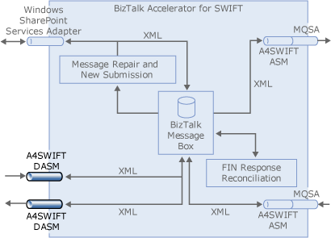

# Creating an A4SWIFT Receive Location
You must create an [!INCLUDE[btaA4SWIFT2.3abbrevnonumber](../../includes/btaa4swift2-3abbrevnonumber-md.md)] receive location to enable message reception from the SWIFT network by [!INCLUDE[btaA4SWIFT2.3abbrevnonumber](../../includes/btaa4swift2-3abbrevnonumber-md.md)], as shown in the following figure. The receive location receives flat file messages from an inbound file folder.  

   

 **Summary**  

 Create and bind a one-way receive port, and then create and enable a receive location with the following properties and components:  

| Property/Components |                                                             Setting                                                             |
|---------------------|---------------------------------------------------------------------------------------------------------------------------------|
|    Receive port     |                                                          One-way port                                                           |
|   Transport type    |                                                              FILE                                                               |
|     Address URI     |                                     Name of the folder that you want to receive the message                                     |
|      File mask      |                  \*.*\<extension\>*, where \<*extension*\> is the extension of the incoming flat file message                   |
|   Receive handler   |                                                    BizTalkServerApplication                                                     |
|  Receive pipeline   | The [!INCLUDE[btaA4SWIFT2.3abbrevnonumber](../../includes/btaa4swift2-3abbrevnonumber-md.md)] receive pipeline that you created |

### To add the receive port and location  

1.  Start **BizTalk Server Administration** console.  

    > [!NOTE]
    >  The BizTalk Server Administration Console can also be opened from within Visual Studio by clicking **BizTalk Server Administration** in the **Tools** menu.  

2.  In Administration Console, expand **BizTalk Server Administration**, expand **BizTalk Group**, expand **Applications**, and then expand **BizTalk Application 1**.  

3.  Right-click **Receive Ports**, point to **New**, and then click **One-Way Receive Port**.  

4.  In the Receive Port Properties dialog box, in the **Name** box, type a name for the receive port.  

5.  Click **Apply** to bind the port, and then click **OK**.  

6.  Right-click **Receive Locations**, point to **New**, and then click **One-way Receive Location**.  

7.  In the Select a Receive Port dialog box, click the receive port that you just created, and then click **OK**.  

8.  In the Receive Location Properties dialog box, in the **Name** box, type a name for the receive location.  

9. In the **Transport** section, for the **Type** text box, click the drop-down list, and then select **FILE**.  

10. Click the **Configure** button to the right of the Type drop-down list.  

11. In the FILE Transport Properties dialog box, click **Browse**. Move to the folder that you want to receive the message. Click **OK**.  

    > [!NOTE]
    >  If this folder does not exist, you can create it using the **Make New Folder** command.  

12. In the FILE Transport Properties dialog box, in the **File Mask** box, enter **\*.\<*extension*\>**, where \<*extension*\> is the extension of the incoming flat file message, such as **.txt**. Click **OK**.  

13. In the Receive Location Properties dialog box, ensure that **BizTalkServerApplication** is entered for the **Receive handler** box.  

14. For the **Receive Pipeline** box, select your custom receive pipeline from the drop-down list.  

15. Click **Apply**, and then click **OK**.  

16. In the BizTalk Server Administration Console, click **Receive Locations**, right-click the receive location that you just created, and then click **Enable**.  

    > [!NOTE]
    >  After you enable the receive location, BizTalk actively polls your file folder.