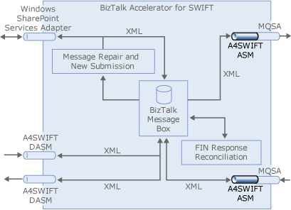

# Creating an A4SWIFT Send Port
You must create a send port to enable [!INCLUDE[btaA4SWIFT2.3abbrevnonumber](../../includes/btaa4swift2-3abbrevnonumber-md.md)] to send a message to the SWIFT network, as shown in the following figure. This send port will send flat file messages to an outbound file folder. This send port is designed to work with the Message Repair and New Submission feature.  
  
   
  
 **Summary**  
  
 Create and start a static one-way send port with the following properties and components:  
  
|Property/Component|Setting|  
|-------------------------|-------------|  
|Send port|Static one-way port|  
|Transport type|FILE|  
|Destination folder (Address URI)|Name of the folder that you want to send messages from|  
|File Name (Address URI)|%MessageID%.txt|  
|Filters|As described in the table below|  
  
### To add the sent port  
  
1.  In the BizTalk Server Administration Console, right-click **Send Ports**, point to **New**, and then click **Static One-way Send Port**.  
  
2.  In the Send Port Properties dialog box, in the **Name** box, type a name for the send port.  
  
3.  In the **Transport** section, for the **Type** box, click the drop-down list, and then select **FILE**.  
  
4.  Click the **Configure** button to the right of the Type drop-down list.  
  
5.  In the FILE Transport Properties dialog box, click **Browse**.  
  
6.  In the Browse For Folder dialog box, move to the folder that you want to send messages from. Click **OK**.  
  
    > [!NOTE]
    >  If this folder does not exist, you can create it using the **Make New Folder** command.  
  
7.  In the **File name** box, type **%MessageID%.txt**, and then click **OK**.  
  
8.  In the **Send Port Properties** dialog box, click the drop-down list for the **Send pipeline** box, and then select your custom send pipeline.  
  
9. In the left pane, click **Filters**, and then do the following:  
  
    |Use this|To do this|  
    |--------------|----------------|  
    |**Property**|Select **BTS.Operation**.|  
    |**Operator**|Select **==**.|  
    |**Value**|Type **A4SWIFT_MRSRCompleted**.|  
    |**Group**|Select **Or.**|  
    |**Property**|Select **BTS.Operation**.|  
    |**Operator**|Select **==**.|  
    |**Value**|Type **A4SWIFT_MRSRFailed**.|  
    |**Group**|Select **Or**.|  
    |**Property**|Select **Microsoft.Solutions.A4SWIFT.Property.A4SWIFT_Failed**.|  
    |**Operator**|Select **==**.|  
    |**Value**|Type **True**.|  
  
10. Click **Apply**, and then click **OK.**  
  
11. In the **Send Ports** pane, right-click the send port, and then click **Start**.
