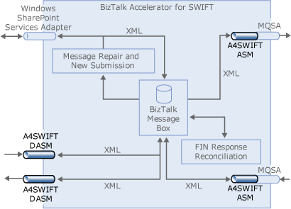

# Creating and Deploying A4SWIFT Pipelines
Perform the following steps to create and deploy SWIFT pipelines for message repair and new submission, as shown in the following figure.  

   

 **Summary**  

 Deploy the following schemas:  

-   Custom receive pipeline with the SWIFT Disassembler. Set BRE Validation and XML Validation properties to True, and the SWIFT Header Schema property to (None).  

-   Custom send pipeline with the SWIFT Assembler  

### To create a pipeline project  

1. In Visual Studio, click **File**, point to **New**, and then click **Project**.  

2. In the New Project dialog box, in the **Project types** pane, select the **BizTalk Projects** folder.  

3. In the **Templates** pane, select **Empty BizTalk Server Project**.  

4. In the **Name** box, type the name you want for the project name.  

5. In the **Solution** box, select **Add to Solution**. In the **Location** box, enter the location of the schema project that you created in [Deploying A4SWIFT Schemas](../../adapters-and-accelerators/accelerator-swift/deploying-a4swift-schemas.md).  

6. Click **OK** to open the new project.  
   [!INCLUDE[btsVStudioNoVersion](../../includes/btsvstudionoversion-md.md)][!INCLUDE[btsDotNet](../../includes/btsdotnet-md.md)] adds a new project to Solution Explorer, and creates the project folder and files in the folder specified.  

7. Create and assign a strong key file to the project. For more information, see "To create a strong-named SWIFT project" in [Deploying A4SWIFT Schemas](../../adapters-and-accelerators/accelerator-swift/deploying-a4swift-schemas.md).  

### To add a custom receive pipeline  

1. In Solution Explorer, right-click your pipeline project, point to **Add**, and then click **New Item**.  

2. In the Add New Item dialog box, click **Pipeline Files** in the Categories pane, and then select **Receive Pipeline** from the Templates pane.  

3. In the **Name** box, type a name for the pipeline.  

4. Click **Add** to open the blank pipeline in BizTalk Pipeline Designer.  

5. In [!INCLUDE[btsVStudioNoVersion](../../includes/btsvstudionoversion-md.md)], click **View** and then **Toolbox**.  

6. From the **BizTalk Pipeline Components Toolbox**, drag the **SWIFT Disassembler** to the **Drop Here** box below the **Disassemble** stage shape in **BizTalk Pipeline Designer**. Leave the **SWIFT Disassembler** as selected in the **BizTalk Pipeline Designer**.  

7. In **Properties**, verify that the **BRE Validation** and **XML Validation** properties are set to **True**.  

   > [!NOTE]
   >  The SWIFT Header Schema property should be set to **(None)**.  

8. In [!INCLUDE[btsVStudioNoVersion](../../includes/btsvstudionoversion-md.md)], click **File**, and then **Save All**.  

### To add a custom send pipeline  

1. In Solution Explorer, right-click the **SWIFTPipelines** project, point to **Add**, and then click **New Item**.  

2. In the Add New Item dialog box, verify that **Pipeline Files** is selected in the Categories pane, and then select **Send Pipeline** from the Templates pane.  

3. In the **Name** box, type a name for the pipeline.  

4. Click **Add** to open the blank pipeline in BizTalk Pipeline Designer.  

   > [!NOTE]
   >  An empty pipeline appears in the BizTalk Pipeline Designer. [!INCLUDE[btsVStudioNoVersion](../../includes/btsvstudionoversion-md.md)] adds the new pipeline to Solution Explorer under the SWIFTPipelines project.  

5. In [!INCLUDE[btsVStudioNoVersion](../../includes/btsvstudionoversion-md.md)], click **View** and then **Toolbox**.  

6. In the **BizTalk Pipeline Components Toolbox**, drag **SWIFT Assembler** to the **Drop Here** box below the **Assemble** stage shape in **BizTalk Pipeline Designer**.  

7. In [!INCLUDE[btsVStudioNoVersion](../../includes/btsvstudionoversion-md.md)], click **File**, and then **Save All**.  

8. Right click the pipelines project, and then click **Build**.  

   > [!NOTE]
   >  During the compilation process, you should not see any failures. If you do, check the source of the error, correct it and then re-build the project. You may, however, see warnings. You can correct the condition leading to the warnings. For more information, see "Building a pipeline project may result in warnings" in [Miscellaneous Known Issues](http://msdn.microsoft.com/library/bc94c781-2a56-4f80-8ecb-e654de2f6ed6).  

9. Right click the pipelines project, and then click **Deploy**.
