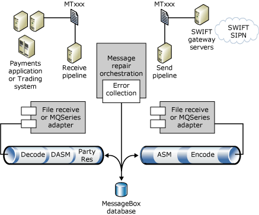

# End-to-End Tutorial
This tutorial contains detailed steps that describe how to create and set up a Microsoft [!INCLUDE[A4SWIFT_CurrentVersion_FirstRef](../../includes/a4swift-currentversion-firstref-md.md)] solution. The modules and lessons use Microsoft [!INCLUDE[btsVStudioNoVersion](../../includes/btsvstudionoversion-md.md)][!INCLUDE[btsDotNet](../../includes/btsdotnet-md.md)] to create the schema, maps orchestrations, and pipeline components using A4SWIFT.  
  
 The following figure shows the workflow of a common Integration Engine usage scenario for an end-to-end A4SWIFT solution.  
  
   
  
|A4SWIFT Tutorial Workflow Key|  
|-----------------------------------|  
|**ASM** = SWIFT Assembler|  
|**DASM** = SWIFT Disassembler|  
|**MTxxx** = A4SWIFT Message type|  
|**SIPN** = SWIFT Secure IP Network|  
  
 This section contains:  
  
-   [Module 1: Creating a SWIFT Solution](../../adapters-and-accelerators/accelerator-swift/module-1-creating-a-swift-solution.md)  
  
-   [Module 2: Adding a New Schemas Project](../../adapters-and-accelerators/accelerator-swift/module-2-adding-a-new-schemas-project.md)  
  
-   [Module 3: Adding a Pipeline Project](../../adapters-and-accelerators/accelerator-swift/module-3-adding-a-pipeline-project.md)  
  
-   [Module 4: Adding an XML Receive Location and Flat File Send Port](../../adapters-and-accelerators/accelerator-swift/module-4-adding-an-xml-receive-location-and-flat-file-send-port.md)  
  
-   [Module 5: Adding a Flat File Receive Location and XML Send Port](../../adapters-and-accelerators/accelerator-swift/module-5-adding-a-flat-file-receive-location-and-xml-send-port.md)  
  
-   [Module 6: Deploying the Business Rules](../../adapters-and-accelerators/accelerator-swift/module-6-deploying-the-business-rules.md)  
  
-   [Module 7: Testing a Valid Flat File Instance](../../adapters-and-accelerators/accelerator-swift/module-7-testing-a-valid-flat-file-instance.md)
