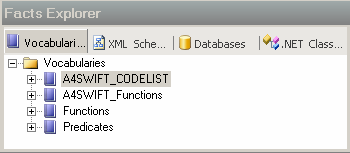

# Lesson 2: Confirming the Deployment Using the Business Rule Composer Tool
In this lesson, you confirm that the Business Rule Composer tool created your vocabularies and deployed your policies. A vocabulary is a collection of vocabulary elements you use in rule composition. A policy is a versioned collection of business rules.  
  
### To confirm the deployment using the Business Rule Composer tool  
  
1.  Start **Business Rule Composer** in BizTalk Server.  
  
2.  In the Open Rule Store dialog box, click **OK**.  
  
3.  In the Facts Explorer pane of the Business Rule Composer tool, confirm that the vocabularies you want appear in the Facts Explorer, as shown in the following figure.  
  
       
  
4.  In the Policy Explorer, confirm that the Business Rule Composer tool deployed the following policies:  
  
     MT103_Master_Policy  
  
     MT103_Validation_Policy  
  
     SWIFT_NetworkRule149_Policy  
  
     SWIFT_NetworkRule150_Policy  
  
     SWIFT_NetworkRule151_Policy  
  
     SWIFT_NetworkRule175_Policy  
  
     SWIFT_NetworkRule2_Policy  
  
     SWIFT_NetworkRule201_Policy  
  
     SWIFT_NetworkRule202_Policy  
  
     SWIFT_NetworkRule203_Policy  
  
     SWIFT_NetworkRule204_Policy  
  
     SWIFT_NetworkRule205_Policy  
  
     SWIFT_NetworkRule206_Policy  
  
     SWIFT_NetworkRule207_Policy  
  
     SWIFT_NetworkRule209_Policy  
  
     SWIFT_NetworkRule210_Policy  
  
     SWIFT_NetworkRule212_Policy  
  
     SWIFT_NetworkRule213_Policy  
  
     SWIFT_NetworkRule215_Policy  
  
     SWIFT_NetworkRule216_Policy  
  
     SWIFT_NetworkRule217_Policy  
  
     SWIFT_NetworkRule218_Policy  
  
     SWIFT_NetworkRule244_Policy  
  
     SWIFT_NetworkRule245_Policy  
  
     SWIFT_NetworkRule81_Policy  
  
     SWIFT_PartyIdentifier_Policy  
  
     SWIFT_Reference_Policy  
  
### To view a policy  
  
1. In the Policy Explorer pane of the Business Rules Composer, ensure that the **SWIFT_NetworkRule149_Policy** is expanded, and then expand the **Version 1.0 – Deployed** node.  
  
2. Double-click the **Validate_MT103** node to open it.  
  
    The policy opens in the editor pane on the right side of the screen.  
  
   Proceed to [Module 7: Testing a Valid Flat File Instance](../../adapters-and-accelerators/accelerator-swift/module-7-testing-a-valid-flat-file-instance.md).