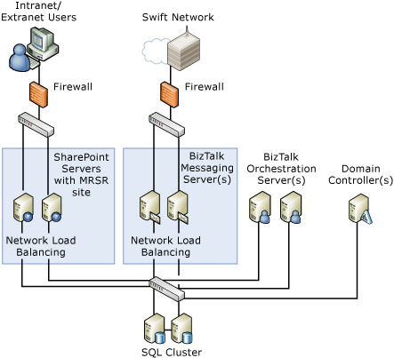

# Physical Diagram
A typical deployment has clustered BizTalk Server computers for messaging (sending and receiving), BizTalk Server computers for executing the business process (orchestration), BizTalk Server computers for accessing the InfoPath templates (MRSR site), and clustered SQL Server computers. The following deployment ensures a secure environment from both the intranet and Internet users.  
  
> [!NOTE]
>  This typical deployment is the recommended configuration. You will need to verify your own business needs and server configurations to make certain your deployment works correctly.  
  
 You can scale this deployment up or down, out or back, depending on the usage profile and your growing business needs. Typical scalability scenarios include adding one or more servers in each cluster to ensure higher availability or better throughput. Smaller enterprises might prefer scaling back their deployment to have the same servers perform multiple functions, such as having one [!INCLUDE[btsBizTalkServerNoVersion](../../includes/btsbiztalkservernoversion-md.md)] computer handle both orchestration and messaging. Microsoft [!INCLUDE[A4SWIFT_CurrentVersion_FirstRef](../../includes/a4swift-currentversion-firstref-md.md)] supports deployment on a single server. The following figure shows an example of the recommended distributed deployment environment for a full A4SWIFT deployment.  
  
   
Example of a full A4SWIFT deployment