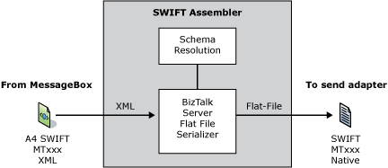

# SWIFT Assembler
An outbound send pipeline processes all messages transmitted by an [!INCLUDE[A4SWIFT_CurrentVersion_FirstRef](../../includes/a4swift-currentversion-firstref-md.md)] application (sent through a send port).  
  
 Logical execution stages related to outbound processing make up the BizTalk send pipelines. A pipeline component services or implements each stage. In particular, the assembler services the assemble stage in the receive pipeline. A4SWIFT provides SWIFT-specific outbound message processing functionality in a custom assembler component.  
  
 The SWIFT assembler, a custom flat file assembler, provides functionality for processing outbound SWIFT messages, and performs the following functions:  
  
- Dynamically discovers the message type and resolves the document schema  
  
- Serializes parsed XML into SWIFT flat files  
  
  The following figure shows the SWIFT assembler data flow.  
  
    
  
  For more information about the SWIFT assembler, see [Working with the SWIFT Disassembler and Assembler](../../adapters-and-accelerators/accelerator-swift/working-with-the-swift-disassembler-and-assembler.md).  
  
## See Also  
 [BizTalk Accelerator for SWIFT Runtime](../../adapters-and-accelerators/accelerator-swift/biztalk-accelerator-for-swift-runtime.md)