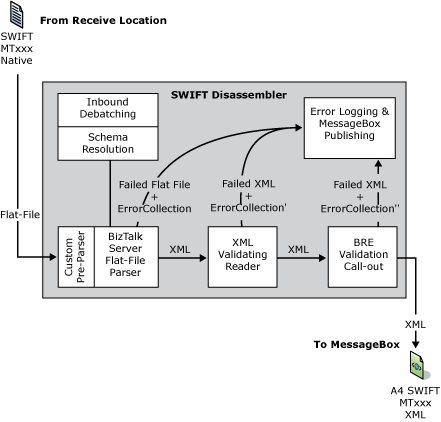

# SWIFT Disassembler
An inbound receive pipeline processes all messages submitted to an [!INCLUDE[A4SWIFT_CurrentVersion_FirstRef](../../includes/a4swift-currentversion-firstref-md.md)] application (received at a receive location).  
  
 Logical execution stages related to inbound processing make up the BizTalk receive pipelines. A pipeline component services or implements each stage. In particular, the disassembler services the disassemble stage in the receive pipeline. A4SWIFT provides SWIFT-specific message processing functionality in a custom disassembler component.  
  
 The SWIFT disassembler, a custom flat file disassembler, provides functionality for processing inbound SWIFT messages and batches, and performs the following functions:  
  
- Dynamically discovers the message type and resolves the document schema  
  
- Parses SWIFT flat files into XML  
  
- Invokes the XML validating reader to perform XML (schema) validation  
  
- Invokes the Business Rule Engine (BRE) to perform BRE validation  
  
- Publishes a parsed XML message to the MessageBox database with promoted context properties and serialized error collection XML  
  
- Processes and disassembles inbound batches  
  
  The following figure shows the SWIFT disassembler data flow.  
  
    
  
  For more information about the SWIFT disassembler, see [Working with the SWIFT Disassembler and Assembler](../../adapters-and-accelerators/accelerator-swift/working-with-the-swift-disassembler-and-assembler.md).  
  
## See Also  
 [BizTalk Accelerator for SWIFT Runtime](../../adapters-and-accelerators/accelerator-swift/biztalk-accelerator-for-swift-runtime.md)