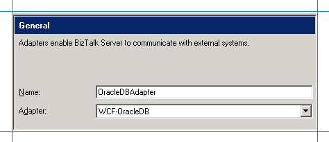

# Adding the Oracle Database Adapter to BizTalk Server Administration Console
This topic provides instructions on how to add the WCF-OracleDB adapter to the [!INCLUDE[btsBizTalkServerNoVersion](../../includes/btsbiztalkservernoversion-md.md)] Administration console.  
  
> [!IMPORTANT]
>  You need not perform these tasks if you want to configure a WCF-Custom port for the [!INCLUDE[adapteroracle_short](../../includes/adapteroracle-short-md.md)].  
  
## Add the Oracle Database Adapter  
  
1. Open the [!INCLUDE[btsBizTalkServerNoVersion](../../includes/btsbiztalkservernoversion-md.md)] Administration console.  
  
2. Expand the **BizTalk Group**, expand **Platform Settings**, and then select **Adapters**.  
  
3. Right-click **Adapters**, select **New**, and select **Adapter**.  
  
      
  
4. In the **Adapter Properties** dialog box, enter a name for the adapter and from the **Adapter** list, select **WCF-OracleDB**.  
  
      
  
5. Select **OK**.  
  
## See Also  
[Building Blocks to develop BizTalk Applications with Oracle Database](../../adapters-and-accelerators/adapter-oracle-database/building-blocks-to-develop-biztalk-applications-with-oracle-database.md)