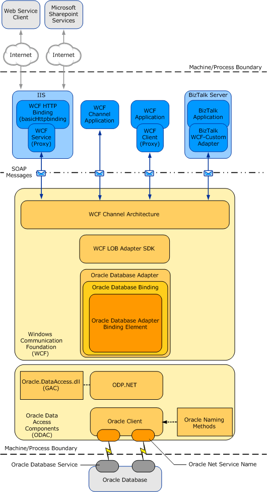
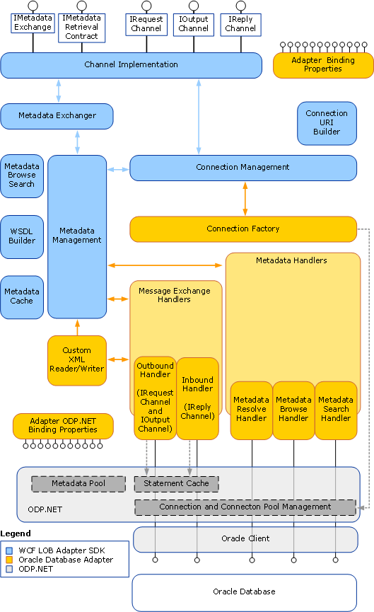

# Architecture overview of the BizTalk Adapter for Oracle Database
Describes the architecture for the [!INCLUDE[adapteroracle](../../includes/adapteroracle-md.md)]. 

An understanding of the [!INCLUDE[adapteroracle_short](../../includes/adapteroracle-short-md.md)] architecture can help you:  
  
- Understand the relationship between the [!INCLUDE[adapteroracle_short](../../includes/adapteroracle-short-md.md)] and the [!INCLUDE[afproductnamelong](../../includes/afproductnamelong-md.md)].  
  
- Understand security boundaries, so that you can better secure data in your solution.  
  
- Understand the [!INCLUDE[adapteroracle_short](../../includes/adapteroracle-short-md.md)] binding properties.  
  
- Troubleshoot installation issues.  
  
This topic describes the architecture of end-to-end solutions that use the [!INCLUDE[adapteroracle_short](../../includes/adapteroracle-short-md.md)] to operate on an Oracle database, and also described the internal architecture of the [!INCLUDE[adapteroracle_short](../../includes/adapteroracle-short-md.md)].  
 
## Adapter architecture overview
The [!INCLUDE[adapteroracle](../../includes/adapteroracle-md.md)] is a [!INCLUDE[firstref_btsWinCommFoundation](../../includes/firstref-btswincommfoundation-md.md)] custom binding. This binding contains a single custom transport binding element that enables communication with an Oracle database. The [!INCLUDE[adapteroracle_short](../../includes/adapteroracle-short-md.md)] is wrapped by the [!INCLUDE[afproductnamelong](../../includes/afproductnamelong-md.md)] runtime, and is exposed to applications through the [!INCLUDE[nextref_btsWinCommFoundation](../../includes/nextref-btswincommfoundation-md.md)] channel architecture. The [!INCLUDE[adapteroracle_short](../../includes/adapteroracle-short-md.md)] communicates with the Oracle database through the Oracle Data Provider for .NET (ODP.NET) and the Oracle client, which are part of the Oracle Data Access Components (ODAC) for Windows.  
  
 The following figure shows the end-to-end architecture for solutions that are developed by using the [!INCLUDE[adapteroracle_short](../../includes/adapteroracle-short-md.md)].  
  
   
  
## Consuming the adapter  
 The [!INCLUDE[adapteroracle_short](../../includes/adapteroracle-short-md.md)] exposes the Oracle database as a [!INCLUDE[nextref_btsWinCommFoundation](../../includes/nextref-btswincommfoundation-md.md)] service to client applications. To perform operations and access data on the Oracle database, client applications exchange SOAP messages with the [!INCLUDE[adapteroracle_short](../../includes/adapteroracle-short-md.md)] through [!INCLUDE[nextref_btsWinCommFoundation](../../includes/nextref-btswincommfoundation-md.md)] channels. The previous figure shows four ways in which the [!INCLUDE[adapteroracle_short](../../includes/adapteroracle-short-md.md)] can be consumed. They are:  
  
- Through a [!INCLUDE[nextref_btsWinCommFoundation](../../includes/nextref-btswincommfoundation-md.md)]channel model application. A [!INCLUDE[nextref_btsWinCommFoundation](../../includes/nextref-btswincommfoundation-md.md)] channel model application performs operations on the Oracle database by using the [!INCLUDE[nextref_btsWinCommFoundation](../../includes/nextref-btswincommfoundation-md.md)] channel model to exchange SOAP messages directly with the [!INCLUDE[adapteroracle_short](../../includes/adapteroracle-short-md.md)]. For more information about developing solutions for the [!INCLUDE[adapteroracle_short](../../includes/adapteroracle-short-md.md)] by using the [!INCLUDE[nextref_btsWinCommFoundation](../../includes/nextref-btswincommfoundation-md.md)] channel model, see [Developing Oracle Database application using the WCF Channel Model](../../adapters-and-accelerators/adapter-oracle-database/develop-oracle-database-applications-using-the-wcf-channel-model.md).  
  
- Through a [!INCLUDE[nextref_btsWinCommFoundation](../../includes/nextref-btswincommfoundation-md.md)] service model application. A [!INCLUDE[nextref_btsWinCommFoundation](../../includes/nextref-btswincommfoundation-md.md)] service model application calls methods on a [!INCLUDE[nextref_btsWinCommFoundation](../../includes/nextref-btswincommfoundation-md.md)] client to perform operations on the Oracle database. A [!INCLUDE[nextref_btsWinCommFoundation](../../includes/nextref-btswincommfoundation-md.md)] client models the operations exposed by the [!INCLUDE[adapteroracle_short](../../includes/adapteroracle-short-md.md)] as .NET methods. You can use the [!INCLUDE[afproductnamelong](../../includes/afproductnamelong-md.md)] or the WCF ServiceModel Metadata Utility Tool (svcutil.exe) to create a [!INCLUDE[nextref_btsWinCommFoundation](../../includes/nextref-btswincommfoundation-md.md)] client class from metadata exposed by the [!INCLUDE[adapteroracle_short](../../includes/adapteroracle-short-md.md)]. For more information about the [!INCLUDE[nextref_btsWinCommFoundation](../../includes/nextref-btswincommfoundation-md.md)] service model and the [!INCLUDE[adapteroracle_short](../../includes/adapteroracle-short-md.md)], see [Develop Oracle Databse Applications using the WCF Service model](../../adapters-and-accelerators/adapter-oracle-database/develop-oracle-database-applications-using-the-wcf-service-model.md).  
  
- Through a BizTalk receive location or send port that is configured to use the Microsoft BizTalk WCF-Custom adapter. The WCF-Custom adapter enables the use of [!INCLUDE[nextref_btsWinCommFoundation](../../includes/nextref-btswincommfoundation-md.md)] extensibility features. By using the WCF-Custom adapter you can select and configure the Oracle DB Binding and the behavior for the receive location or send port. For more information about how to use the [!INCLUDE[adapteroracle_short](../../includes/adapteroracle-short-md.md)] in [!INCLUDE[btsBizTalkServerNoVersion](../../includes/btsbiztalkservernoversion-md.md)] solutions, see [Develop your BizTalk applications](../../core/develop-your-biztalk-applications.md).  
  
- Through an IIS-hosted Web service. In this scenario, a WCF service proxy generated by using the adapter is hosted in IIS using the standard WCF Http Binding. This exposes the service contract as a Web service to external users. IIS automatically hosts the adapter at runtime, which, in turn, communicates with the Oracle database.  
  
  The [!INCLUDE[adapteroracle_short](../../includes/adapteroracle-short-md.md)] and ODAC are always hosted in-process with the application or service that consumes the adapter.  
  
## Oracle Database Adapter and WCF  
 [!INCLUDE[nextref_btsWinCommFoundation](../../includes/nextref-btswincommfoundation-md.md)] presents a programming model based on the exchange of SOAP messages over channels between clients and services. These messages are sent between endpoints exposed by a communicating client and service. An endpoint consists of:  
  
- An *endpoint address*, which specifies the location at which messages are received  
  
- A *binding*, which specifies the communication protocols used to exchange messages  
  
- A *contract*,which specifies the operations and data types exposed by the endpoint.  
  
  A binding consists of one or more binding elements that stack on top of each other to define how messages are exchanged with the endpoint. At a minimum, a binding must specify the transport and encoding that are used to exchange messages with the endpoint. Message exchange between endpoints occurs over a channel stack that is composed of one or more channels. Each channel is a concrete implementation of one of the binding elements in the binding configured for the endpoint. The [WCF documentation](http://go.microsoft.com/fwlink/?LinkID=196850) includes more details about [!INCLUDE[nextref_btsWinCommFoundation](../../includes/nextref-btswincommfoundation-md.md)], and the [!INCLUDE[nextref_btsWinCommFoundation](../../includes/nextref-btswincommfoundation-md.md)] programming model.  
  
  The [!INCLUDE[adapteroracle](../../includes/adapteroracle-md.md)] exposes a [!INCLUDE[nextref_btsWinCommFoundation](../../includes/nextref-btswincommfoundation-md.md)] custom binding, the Oracle DB Binding (**Microsoft.Adapters.OracleDB.OracleDBBinding**). By default, this binding contains a single custom transport binding element, the Oracle DB Adapter Binding Element (**Microsoft.Adapters.OracleDB.OracleDBAdapter**), which enables operations on an Oracle database.  
  
  **Microsoft.Adapters.OracleDB.OracleDBBinding** (the Oracle DB Binding) and **Microsoft.Adapters.OracleDB.OracleDBAdapter** (the Oracle DB Adapter Binding Element) are public classes and are also exposed to the configuration system. Because the Oracle DB Adapter Binding Element is exposed publicly, you can build your own custom [!INCLUDE[nextref_btsWinCommFoundation](../../includes/nextref-btswincommfoundation-md.md)] bindings capable of extending the functionality of the [!INCLUDE[adapteroracle_short](../../includes/adapteroracle-short-md.md)]. For example, you could implement a custom binding to support Enterprise Single Sign-on (SSO) in a [!INCLUDE[nextref_btsWinCommFoundation](../../includes/nextref-btswincommfoundation-md.md)] channel or service model solution. The reasons for doing this would be to aggregate database operations into a single multifunction operation or to perform schema transformation between operations implemented by a custom application and operations on the Oracle database.  
  
  The [!INCLUDE[adapteroracle_short](../../includes/adapteroracle-short-md.md)] is built on top of the [!INCLUDE[afproductnamelong](../../includes/afproductnamelong-md.md)] and runs on top of the [!INCLUDE[afproductnameshort](../../includes/afproductnameshort-md.md)] runtime. The [!INCLUDE[afproductnameshort](../../includes/afproductnameshort-md.md)] provides a software framework and tooling infrastructure that the [!INCLUDE[adapteroracle_short](../../includes/adapteroracle-short-md.md)] uses to provide a rich set of features to users and adapter clients.  

## Oracle Database Adapter and WCF LOB Adapter SDK
The [!INCLUDE[adapteroracle](../../includes/adapteroracle-md.md)] implements a set of core components that leverage functionality provided by the [!INCLUDE[afproductnamelong](../../includes/afproductnamelong-md.md)] and provide connectivity to the Oracle database through Oracle Data Provider for .NET (ODP.NET).  
  
 The [!INCLUDE[afproductnameshort](../../includes/afproductnameshort-md.md)] serves as the software layer through which the [!INCLUDE[adapteroracle_short](../../includes/adapteroracle-short-md.md)] interfaces with the [!INCLUDE[firstref_btsWinCommFoundation](../../includes/firstref-btswincommfoundation-md.md)]. ODP.NET serves as the layer through which the [!INCLUDE[adapteroracle_short](../../includes/adapteroracle-short-md.md)] interfaces with the Oracle database. 
 
The following figure shows the relationships between the internal components of the [!INCLUDE[adapteroracle_short](../../includes/adapteroracle-short-md.md)], [!INCLUDE[afproductnameshort](../../includes/afproductnameshort-md.md)], and ODP.NET.  
  
   
 
   
## ODP.NET  
 The [!INCLUDE[adapteroracle_short](../../includes/adapteroracle-short-md.md)] connects with the Oracle database through the ODP.NET and the Oracle client. Both of these components are part of Oracle Data Access Components (ODAC).  
  
 ODP.NET implements a data provider for the Oracle database that is consistent with the ADO.NET interface. The [!INCLUDE[adapteroracle_short](../../includes/adapteroracle-short-md.md)] uses the classes exposed by ODP.NET to operate on the Oracle database.  
  
 The Oracle client provides connectivity to the Oracle database. You establish a connection to an Oracle database by providing a connection URI to the [!INCLUDE[adapteroracle_short](../../includes/adapteroracle-short-md.md)]. You can specify the connection URI in two ways:  
  
- **Using tnsnames.ora**. In this approach, the connection URI provided by the adapter client contains only the net service name specified in the tnsnames.ora file. The adapter extracts the connection parameters such as server name, service name, port number, etc. from the net service name entry in the file. To use this approach, the computer running the Oracle client must be configured to include the net service name for the Oracle database in the tnsnames.ora file.  
  
- **Without using tnsnames.ora**. In this approach, the adapter clients specify the connection parameters directly in the connection URI. This does not require the net service name to be present in the tnsnames.ora file on the client computer. This approach does not even require the tnsnames.ora file to be present on the client computer.  
  
  For more information about the connection URI, see [Create a connection to the Oracle Database](../../adapters-and-accelerators/adapter-oracle-database/create-a-connection-to-the-oracle-database.md).
  
## Next
[Secure your Oracle Database applications](../../adapters-and-accelerators/adapter-oracle-database/secure-your-oracle-database-applications.md)