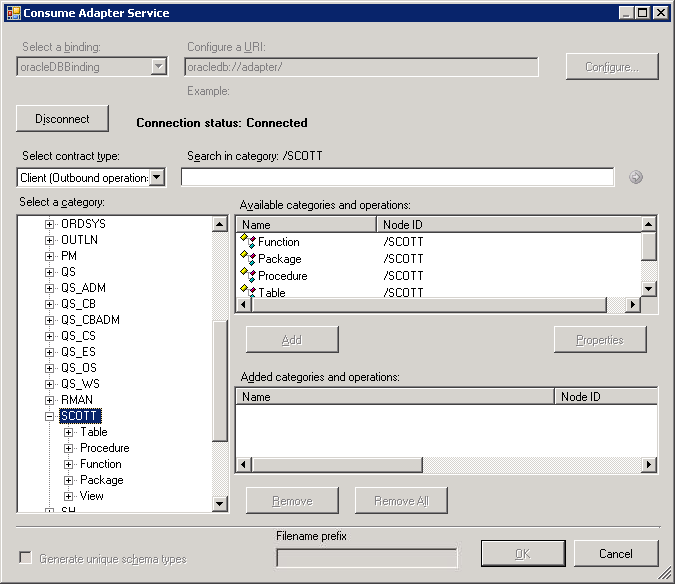
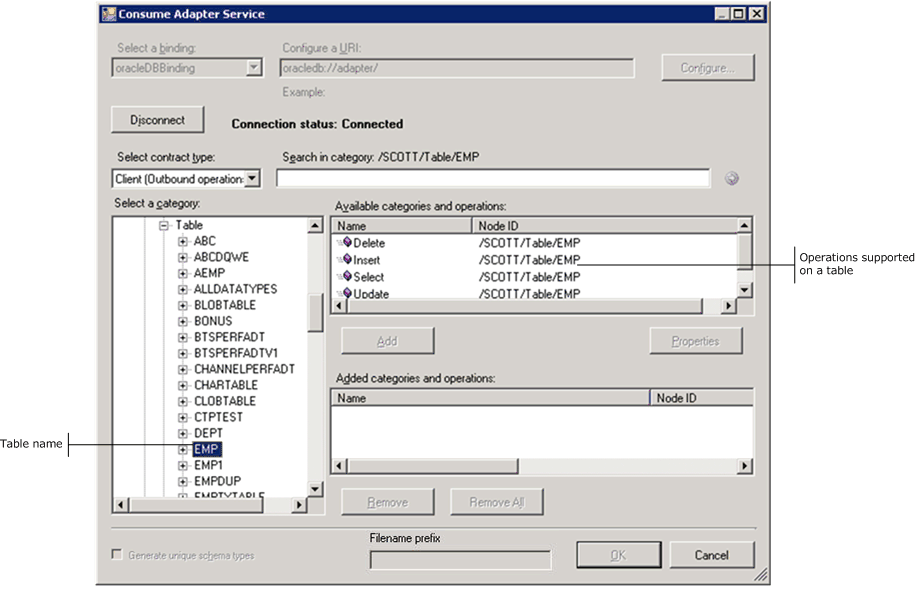
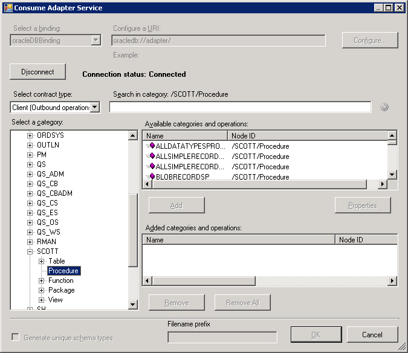
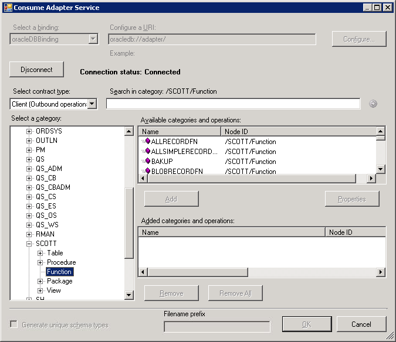
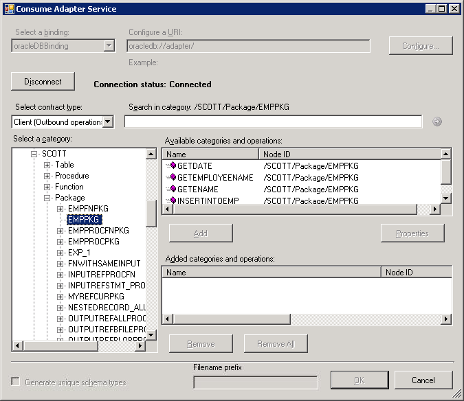
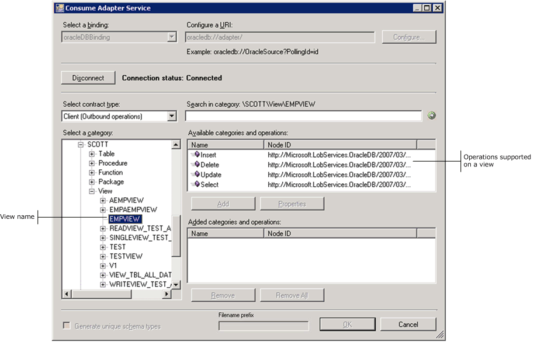
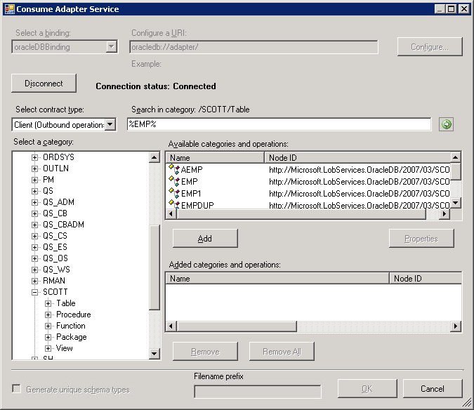
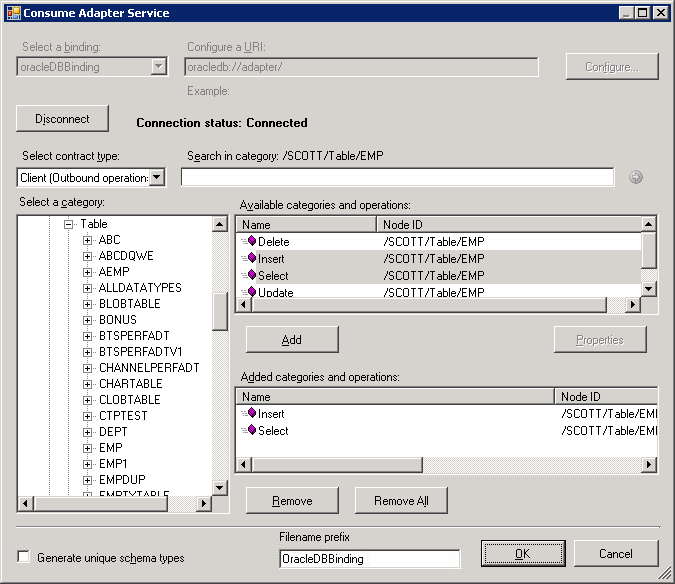
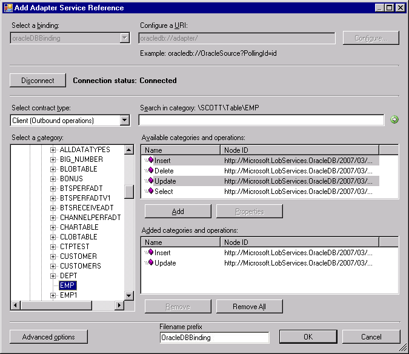

# Browse, search, and get metadata for Oracle Database operations
This section provides information about how to use [!INCLUDE[consumeadapterservlong](../../includes/consumeadapterservlong-md.md)], [!INCLUDE[addadapterwiz](../../includes/addadapterwiz-md.md)], and [!INCLUDE[addadapterservreflong](../../includes/addadapterservreflong-md.md)]. By using these [!INCLUDE[btsVStudioNoVersion](../../includes/btsvstudionoversion-md.md)] components, you can:  
  
- Browse for operations for which to retrieve metadata.  
  
- Search for operations for which to retrieve metadata.  
  
- Add message schemas for selected operations and port binding configuration files to a BizTalk server project when using the [!INCLUDE[consumeadapterservshort](../../includes/consumeadapterservshort-md.md)] or the [!INCLUDE[addadapterwiz](../../includes/addadapterwiz-md.md)].  
  
- Add a WCF client class or a WCF service contract (interface) for selected operations and a configuration file (app.config) to a non-BizTalk programming project when using the [!INCLUDE[addadapterservrefshort](../../includes/addadapterservrefshort-md.md)].  
  
  You must connect to the Oracle database before you can browse, search, or retrieve metadata for target operations. For information about how to connect to the Oracle database when you use [!INCLUDE[consumeadapterservshort](../../includes/consumeadapterservshort-md.md)], [!INCLUDE[addadapterwiz](../../includes/addadapterwiz-md.md)] or [!INCLUDE[addadapterservrefshort](../../includes/addadapterservrefshort-md.md)], see [Connect to Oracle Database in Visual Studio](../../adapters-and-accelerators/adapter-oracle-database/connect-to-oracle-database-in-visual-studio.md).  
  
> [!NOTE]
> - The [!INCLUDE[consumeadapterservlong](../../includes/consumeadapterservlong-md.md)], [!INCLUDE[addadapterwiz](../../includes/addadapterwiz-md.md)], and [!INCLUDE[addadapterservreflong](../../includes/addadapterservreflong-md.md)] present essentially the same interface when you browse and search for operations, so all the three components are covered in the same topics.  
>   -   You can select category nodes to return all the operations in that category's subtree—for example, an entire table or schema (or even all the tables in a schema).  
  
## Browsing for Operations  
 While browsing metadata using [!INCLUDE[consumeadapterservshort](../../includes/consumeadapterservshort-md.md)], [!INCLUDE[addadapterwiz](../../includes/addadapterwiz-md.md)] or [!INCLUDE[addadapterservrefshort](../../includes/addadapterservrefshort-md.md)], the [!INCLUDE[adapteroracle_short](../../includes/adapteroracle-short-md.md)] surfaces:  
  
-   Operations that can be performed on tables, views, stored procedures, functions, and packages.  
  
-   The SQLEXECUTE operation, which enables adapter clients to execute any generic data manipulation language (DML) or stored procedure in an Oracle database.  
  
-   The POLLINGSTMT and Notification operations, which enable adapter clients to obtain inbound data from the Oracle database. It also exposes a list of stored procedures, functions and packages under the respective schemas that are exposed as operations for polling.  
  
> [!NOTE]
> - By using the [!INCLUDE[consumeadapterservshort](../../includes/consumeadapterservshort-md.md)], [!INCLUDE[addadapterwiz](../../includes/addadapterwiz-md.md)] or [!INCLUDE[addadapterservrefshort](../../includes/addadapterservrefshort-md.md)], you can browse category and operation nodes using a Windows interface.  
>   -   The SQLEXECUTE, POLLINGSTMT, and Notification operations are presented directly under the root node in the category tree. You must select the root node to view these outbound and inbound operations.  
  
 For more information about browsing metadata, see [Get metadata for Oracle Database operations in Visual Studio](../../adapters-and-accelerators/adapter-oracle-database/get-metadata-for-oracle-database-operations-in-visual-studio.md)  
  
 Perform the following steps to browse for operations exposed for different artifacts in an Oracle database using the [!INCLUDE[addadapterservrefshort](../../includes/addadapterservrefshort-md.md)] or [!INCLUDE[consumeadapterservshort](../../includes/consumeadapterservshort-md.md)].  
  
#### To browse metadata in an Oracle database  
  
1. Connect to an Oracle database using the [!INCLUDE[consumeadapterservshort](../../includes/consumeadapterservshort-md.md)], [!INCLUDE[addadapterwiz](../../includes/addadapterwiz-md.md)] or [!INCLUDE[addadapterservrefshort](../../includes/addadapterservrefshort-md.md)]. See [Connect to Oracle Database in Visual Studio](../../adapters-and-accelerators/adapter-oracle-database/connect-to-oracle-database-in-visual-studio.md) for instructions.  
  
2. From the **Select contract type** drop-down list, select the type of contract based on whether you will be performing inbound or outbound operations using the adapter.  
  
3. The **Select a category** box lists the schemas in the Oracle database. Click a schema to see the tables, procedures, functions, packages, and views accessible to the schema in the **Available categories and operations** box. Alternatively, you can see the categorization by expanding the schema node.  
  
   > [!TIP]
   >  You can directly go to the “immediate” category node or subcategory nodes in the tree, by typing the name of the artifact in while the focus is on the tree view in the **Select a category** box. For example, to jump to the **SCOTT** node, keep the focus on the root node, and then type `SCOTT`.  
  
    The following figure shows the [!INCLUDE[consumeadapterservshort](../../includes/consumeadapterservshort-md.md)]. The SCOTT schema node is selected, and the general category nodes available under the SCOTT node are listed in the **Available categories and operations** box.  
  
      
  
4. Click the **Table** node to see the tables for SCOTT in the **Available categories and operations** box. Alternatively, you can see the list of tables by expanding the **Table** node.  
  
5. Click a table name to see the operations supported on the table.  
  
    The following figure shows the [!INCLUDE[consumeadapterservshort](../../includes/consumeadapterservshort-md.md)]. The tables available in the SCOTT schema are listed in the **Select a category** box. The operations available for the EMP table are listed in the **Available categories and operations** box.  
  
      
  
6. Click the **Procedure** node to list the procedures accessible to schema SCOTT in the **Available categories and operations** box.  
  
    The following figure shows the [!INCLUDE[consumeadapterservshort](../../includes/consumeadapterservshort-md.md)]. The general category nodes available in the SCOTT schema are listed in the **Select a category** box. The procedures available in the SCOTT schema are listed in the **Available categories and operations** box.  
  
      
  
7. Click the **Function** node to see the functions for the schema SCOTT in the **Available categories and operations** box.  
  
    The following figure shows the [!INCLUDE[consumeadapterservshort](../../includes/consumeadapterservshort-md.md)]. The general category nodes available in the SCOTT schema are listed in the **Select a category** box. The functions available in the SCOTT schema are listed in the **Available categories and operations** box .  
  
      
  
8. Click the **Package** node to see the packages for the schema SCOTT in the **Available categories and operations** box. Alternatively, you can see the list of packages by expanding the **Package** node.  
  
9. Click a package name to see the operations supported on the package.  
  
     The following figure shows [!INCLUDE[consumeadapterservshort](../../includes/consumeadapterservshort-md.md)], which lists the packages, and the supported operations for a particular package, for the SCOTT schema.  
  
       
  
10. Click the **View** node to see the views for the schema SCOTT in the **Available categories and operations** box. Alternatively, you can see the list of views by expanding the **View** node.  
  
11. Click a view name to see the operations supported on the view.  
  
     The following figure shows the [!INCLUDE[consumeadapterservshort](../../includes/consumeadapterservshort-md.md)], which lists the views, and the supported operations for a particular view, for the SCOTT schema.  
  
       
  
    > [!NOTE]
    >  Using the WCF channel and service models, adapter clients can specify a batch size to perform a batch retrieval of metadata.  
  
## Searching for Operations  
 While searching Oracle metadata using [!INCLUDE[consumeadapterservshort](../../includes/consumeadapterservshort-md.md)], [!INCLUDE[addadapterwiz](../../includes/addadapterwiz-md.md)], or [!INCLUDE[addadapterservrefshort](../../includes/addadapterservrefshort-md.md)], the [!INCLUDE[adapteroracle_short](../../includes/adapteroracle-short-md.md)]:  
  
- Supports wildcard and escape characters in the search expression.  
  
- Enables search immediately under the node at which the search operation is performed. For example, to search for a function, you must be searching under \\[Schema]\Functions. Multi-level search is not supported.  
  
  The following table lists the special characters that can be used for search and their interpretation by the [!INCLUDE[adapteroracle_short](../../includes/adapteroracle-short-md.md)].  
  
|Special character|Interpretation|  
|-----------------------|--------------------|  
|_ (underscore)|Matches exactly one character   For example, A_ matches AB, AC, AD.|  
|% (percentage)|Matches zero or more characters.   For example, A% matches A, AB, ABC.|  
|\ (escape)|Escapes the special meaning of % and _   For example, A\\_B matches A_B.|  
  
> [!NOTE]
>  Escape character is a character that is put before a wildcard character to indicate that the wildcard should be interpreted as a regular character and not as a wildcard.  
  
 For more information see [Get metadata for Oracle Database operations in Visual Studio](../../adapters-and-accelerators/adapter-oracle-database/get-metadata-for-oracle-database-operations-in-visual-studio.md)  
  
#### To search metadata in an Oracle database  
  
1. Connect to an Oracle database using the [!INCLUDE[consumeadapterservshort](../../includes/consumeadapterservshort-md.md)], [!INCLUDE[addadapterwiz](../../includes/addadapterwiz-md.md)] or [!INCLUDE[addadapterservrefshort](../../includes/addadapterservrefshort-md.md)]. See [Connect to Oracle Database in Visual Studio](../../adapters-and-accelerators/adapter-oracle-database/connect-to-oracle-database-in-visual-studio.md) for instructions.  
  
2. In the [!INCLUDE[consumeadapterservshort](../../includes/consumeadapterservshort-md.md)], from the **Select contract type** drop-down list, select the type of contract based on whether you will be searching for inbound or outbound operations using the adapter.  
  
3. In the **Select a category** box, click the schema containing the tables, procedures, functions, packages, and views that you want to search. If you are not sure which schema to click, click the root node.  
  
4. In the **Search in category** text box, enter a search expression to search for a specific schema. For example, to search for schemas that have "SC" in their name, type **%SC%** in the text box.  
  
5. Click the button with the right-arrow icon to start the search. After the search is complete, the **Available categories and operations** box lists the schemas that satisfy the search criteria.  
  
6. In the **Select a category** box, expand the node that corresponds to the schema, and then and click the database item that you want to search within. In the **Search in category** text box, enter a search expression to search for a specific database item.  
  
    For example, to search for tables that have "EMP" in their names, select **Table**, type **%EMP%** in the **Search in category** text box, and then click the button with the right-arrow icon.  
  
    The following figure shows the [!INCLUDE[consumeadapterservshort](../../includes/consumeadapterservshort-md.md)], which lists the search result.  
  
      
  
   > [!NOTE]
   >  Using the WCF channel and service models, adapter clients can specify a batch size to perform a batch-wise search of metadata.  
  
## Generating Schema Using the Consume Adapter Service Add-in or Add Adapter Metadata Wizard  
 You can use the [!INCLUDE[consumeadapterservshort](../../includes/consumeadapterservshort-md.md)] or the [!INCLUDE[addadapterwiz](../../includes/addadapterwiz-md.md)] to generate schema for selected Oracle database artifacts. Once you have browsed and searched for the artifacts you want to invoke, you can generate schema for those artifacts and send messages, conforming to the schema, to Oracle database. Perform the following steps to retrieve metadata from an Oracle database using the [!INCLUDE[consumeadapterservshort](../../includes/consumeadapterservshort-md.md)].  
  
> [!NOTE]
>  You can select category nodes to return all the operations in that category's sub-tree—for example, you can select an entire table (to generate schema for all the operations in the table) or a select specific operations on a table (for example, Insert and Delete) to generate schema for only those operations on a table. For more information about the nodes, see [Metadata Node IDs3](../../adapters-and-accelerators/adapter-oracle-database/metadata-node-ids3.md).  
  
#### To retrieve metadata from an Oracle database  
  
1. Connect to an Oracle database using the [!INCLUDE[consumeadapterservshort](../../includes/consumeadapterservshort-md.md)] or [!INCLUDE[addadapterwiz](../../includes/addadapterwiz-md.md)]. See [Connect to Oracle Database in Visual Studio](../../adapters-and-accelerators/adapter-oracle-database/connect-to-oracle-database-in-visual-studio.md) for instructions.  
  
2. From the **Select contract type** drop-down list, select the type of contract based on whether you will be performing inbound or outbound operations using the adapter.  
  
3. In the **Select a category** box, expand a schema node.  
  
4. Select the category for which you want to generate metadata. For example, if you want to generate metadata for a table, select **Table**.  
  
5. Expand that particular category node, and select the specific item within that node for which you want to generate metadata.  
  
    For example, to generate metadata for a specific table, expand the **Table** node, and select the specific table name.  
  
   > [!NOTE]
   >  You can also search for a specific database item, as described in the previous procedure.  
  
6. In the **Available categories and operations** box, select the operations that pertain to the database item that you selected in the previous step, and then click **Add**. The selected operations are listed in the **Added categories and operations** box.  
  
    The following figure shows the [!INCLUDE[consumeadapterservshort](../../includes/consumeadapterservshort-md.md)], which lists the selected operations.  
  
      
  
    If you want to generate schema for multiple operations, there may be some duplicate element definitions among these schema that may cause failure in compiling the BizTalk project. For example, consider a scenario where you generate schema for an operation “Op1”. The schema for “Op1” contains a parameter of complex data type “CT1”. After generating the schema for “Op1” you close the [!INCLUDE[consumeadapterservshort](../../includes/consumeadapterservshort-md.md)] and re-open it to generate schema for another operation “Op2”. Assume that “Op2” also contains a parameter of complex data type “CT1”. After you exit the [!INCLUDE[consumeadapterservshort](../../includes/consumeadapterservshort-md.md)] and compile the project, you will get compilation errors because the complex data type “CT1” is defined twice in different XSD files. In such situations, we recommend the following:  
  
   - Generate schema for all the operations in a single run of [!INCLUDE[consumeadapterservshort](../../includes/consumeadapterservshort-md.md)]. This ensures that the [!INCLUDE[consumeadapterservshort](../../includes/consumeadapterservshort-md.md)] generates only one definition for the complex data type “CT1”.  
  
   - If you want to generate schema for multiple operations across different runs of [!INCLUDE[consumeadapterservshort](../../includes/consumeadapterservshort-md.md)], make sure you select the **Generate unique schema types** check box so that the generated XSD files contain unique namespaces for the complex data type “CT1”.  
  
7. Click **OK**. The schema file is saved with an .xsd extension at the same location as the BizTalk project.  
  
    By default, the files are created with the naming convention "OracleDBBindingSchema\<n\>.xsd", where 'n' can be 1, 2, and so on, depending on the number of schema files created. Alternatively, you can provide a custom name to the schema files by entering a name in the **Filename prefix** text box. The [!INCLUDE[consumeadapterservshort](../../includes/consumeadapterservshort-md.md)] now creates schema files with the naming convention \<file name prefix\>Schema\<n\>.xsd.  
  
   > [!NOTE]
   >  The [!INCLUDE[consumeadapterservshort](../../includes/consumeadapterservshort-md.md)] also creates a binding file (an XML file) containing the binding properties that you specified when generating the schema for an operation and the SOAP action to invoke the operation. You can import this binding file in the BizTalk Server Administration console to create a WCF-Custom port with the connection URI, binding properties, and the SOAP action set. For more information, see [Configure a physical port binding using a port binding file to Oracle Database](../../adapters-and-accelerators/adapter-oracle-database/configure-a-physical-port-binding-using-a-port-binding-file-to-oracle-database.md).  
   > 
   > [!IMPORTANT]
   >  Using the [!INCLUDE[addadapterwiz](../../includes/addadapterwiz-md.md)] does not generate a binding file.  
  
8. On the **File** menu, click **Save All**.  
  
## Generating a WCF Client or WCF Service Contract Using the Add Adapter Service Reference Plug-in  
 You can use the [!INCLUDE[addadapterservrefshort](../../includes/addadapterservrefshort-md.md)] to generate either WCF client code for outbound operations or WCF service code for the inbound operations.  
  
#### To retrieve metadata from an Oracle database  
  
1. In the [!INCLUDE[addadapterservrefshort](../../includes/addadapterservrefshort-md.md)], from the **Select contract type** drop-down list, select the type of contract based on whether you will be performing inbound (POLLINGSTMT) or outbound operations.  
  
2. Browse or search for categories (such as an Oracle Database table) or for the specific operations for which you want to generate a WCF client (or WCF service contract).   
   For example, to browse for the operations in the SCOTT.EMP table, In the **Select a category** box:  
  
   1.  Expand the root node (**/**) to see the schemas surfaced for the Oracle database.  
  
   2.  Under the root node, expand the **SCOTT** node to see the categories exposed for the SCOTT schema.  
  
   3.  Under the **SCOTT** node, expand the **Table** node to see the tables surfaced for the SCOTT schema.  
  
   4.  Under the **Table** node select the **EMP** node. The operations surfaced for the EMP table are listed in the **Available categories and operations** box.  
  
3. In the **Available categories and operations** box, select the operations or categories for which you want to generate a WCF client (or WCF service contract), and then click **Add**. The selected operations are listed in the **Added categories and operations** box.  
  
    The following figure shows the [!INCLUDE[addadapterservrefshort](../../includes/addadapterservrefshort-md.md)] with the Insert and Update operations for the SCOTT.EMP table selected.  
  
      
  
   > [!IMPORTANT]
   >  Depending on the outbound operations (or categories) that you select, more than one WCF client class may be generated. For more details, see [Generate a WCF client or a WCF service contract for Oracle Database solution artifacts](../../adapters-and-accelerators/adapter-oracle-database/create-a-wcf-client-or-wcf-service-contract-for-oracle-db-solution-artifacts.md).  
  
4. For most scenarios the default serialization options are sufficient; however, if needed, you can control several aspects about the code that is generated and the type of serializer that is used. To set these options:  
  
   1. Click **Advanced Options** to open the **Advanced Options** box.  
  
   2. In the **Advanced Options** box under **Choose options for generated proxy**, select the options that you want. For example, you can select whether asynchronous methods are generated for the WCF client or disable the generation of a configuration file.  
  
   3. Under **Serializer** select the serializer that should be used.  
  
      The following figure shows the **Advanced Options** box with the default selections (**Auto** is selected for the serializer and no other options are selected).  
  
        
  
      The options that you can configure in the **Advanced Options** box are equivalent to some of the options available when you use the ServiceModel Metadata Utility Tool (svcutil.exe). For more information about these options, see [ServiceModel Metadata Utility Tool (Svcutil.exe)](https://msdn.microsoft.com/library/aa347733.aspx).
  
5. Click **OK**. The [!INCLUDE[addadapterservrefshort](../../includes/addadapterservrefshort-md.md)] saves the WCF client class (or WCF service interface) and helper code for the operations and categories that you have selected in your project directory. By default, a configuration file is also saved. Slightly different files are generated for inbound and outbound operations; for more information, see [Generate a WCF client or a WCF service contract for Oracle Database solution artifacts](../../adapters-and-accelerators/adapter-oracle-database/create-a-wcf-client-or-wcf-service-contract-for-oracle-db-solution-artifacts.md).  
  
   You can select any node that is listed in the **Available categories and operations** box. If you select a category node then all of the operations available under that node and its sub-nodes will be selected. For example, to generate a WCF client for all of the operations surfaced for the EMP table, you can select the EMP node; to generate WCF clients for all of the tables in the SCOTT schema, you can select the Table node; and so on.  
  
## See Also  
[Get metadata for Oracle Database operations in Visual Studio](../../adapters-and-accelerators/adapter-oracle-database/get-metadata-for-oracle-database-operations-in-visual-studio.md)