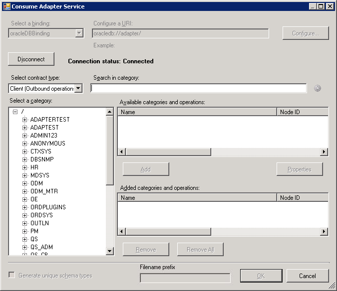

# Connect to the Oracle Database in Visual Studio using the Add Adapter Service Reference
To connect to the Oracle database using the [!INCLUDE[adapteroracle_short_md](../../includes/adapteroracle-short-md.md)] in a .NET programming solution, you must use the [!INCLUDE[addadapterservreflong](../../includes/addadapterservreflong-md.md)]. This topic provides instructions on how to use the [!INCLUDE[addadapterservrefshort](../../includes/addadapterservrefshort-md.md)].  
  
## Connect using the Add Adapter Service Reference Plug-in  
Complete the following steps to connect to an Oracle database using the [!INCLUDE[addadapterservrefshort](../../includes/addadapterservrefshort-md.md)].   

  
1. To connect using the [!INCLUDE[addadapterservrefshort](../../includes/addadapterservrefshort-md.md)] in a programming solution:  
  
   1.  Create a project using Visual Studio.  
  
   2.  Right-click the project in Solution Explorer, and then click **Add Adapter Service Reference**. The Add Adapter Service Reference Plug-in opens.  
  
2. From the **Select a binding** drop-down list, select **oracleDBBinding** and click **Configure**.  
  
3. In the **Configure Adapter** dialog box, click the **Security** tab, and from the **Client credential type** drop-down list box, select **Username** and specify the user name and password to connect to the Oracle database.  
  
   1. To connect using the Oracle database credentials, type the database credentials in the **User name** and **Password** text boxes. Make sure you adhere to the following considerations when specifying the user name and password to connect to an Oracle database:  
  
      - **User name**. The [!INCLUDE[adapteroracle_short](../../includes/adapteroracle-short-md.md)] preserves the case of the value that you enter for the user name when it opens a connection on the Oracle database. User names on the Oracle database are case-sensitive. You should ensure that you provide Oracle user names to the [!INCLUDE[adapteroracle_short](../../includes/adapteroracle-short-md.md)] in the case expected by your Oracle database. Typically, this means that the user name in the SCOTT/TIGER credential should be upper case: "SCOTT".  
  
      - **Password**. The [!INCLUDE[adapteroracle_short](../../includes/adapteroracle-short-md.md)] preserves the case of the value that you enter for the password when it opens a connection on the Oracle database. For release 10g and earlier, passwords on the Oracle system are not case-sensitive.  
  
   2. To connect using Windows Authentication, type **/** in the **User name** text box and leave the **Password** text box blank.  
  
4. Click the **URI Properties** tab, and specify values for the connection parameters. For more information about the connection URI for the [!INCLUDE[adapteroracle_short](../../includes/adapteroracle-short-md.md)], see [Create the Oracle Database connection URI](../../adapters-and-accelerators/adapter-oracle-database/create-the-oracle-database-connection-uri.md).  
  
5. Click the **Binding Properties** tab, and then specify values for the binding properties, if any, required by the operations you want to target. For example, if you want to target the POLLINGSTMT operation, you must set the **PollingStatement** binding property. For more information about binding properties, see [Read about the Oracle Database adapter binding properties](../../adapters-and-accelerators/adapter-oracle-database/read-about-the-oracle-database-adapter-binding-properties.md).
  
6. Click **OK**.  
  
7. Click **Connect**. After the connection is established, the connection status is shown as **Connected**.  
  
    The following figure shows the [!INCLUDE[consumeadapterservshort](../../includes/consumeadapterservshort-md.md)] immediately after the connection is established.  
  
      
  
## See Also  
 [Connect to Oracle Database in Visual Studio](../../adapters-and-accelerators/adapter-oracle-database/connect-to-oracle-database-in-visual-studio.md)   
 [Connect to the Oracle Database Using Windows Authentication](../../adapters-and-accelerators/adapter-oracle-database/connect-to-the-oracle-database-using-windows-authentication.md)