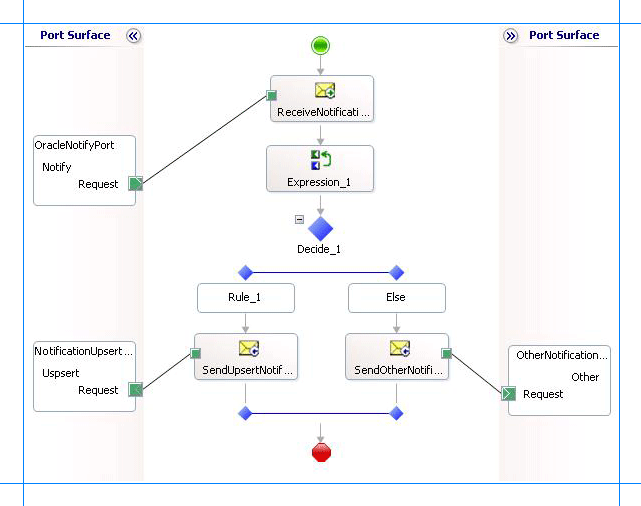

# Process notification messages to complete specific tasks in Oracle Database using BizTalk Server
You can use the [!INCLUDE[adapteroracle_short](../../includes/adapteroracle-short-md.md)] to receive notifications for changes to the Oracle database tables. However, the adapter only sends you a notification that some records were inserted, updated, or deleted in a certain database table. Any post-processing on those records must be handled by the client applications themselves. This topic presents a scenario-based description on how to process the records in the table based on the kind of notification received from the Oracle database.  
  
## Scenarios for Performing Subsequent Actions After Receiving Notification  
 Following are a couple of scenarios in which the adapter clients must perform certain post-notification tasks.  
  
-   **Scenario 1.** Consider a scenario where the adapter client must perform certain tasks based on the kind of notification you receive from the Oracle database. For example, the client application must update the records in table “A” if records are inserted in table “B”. Similarly, the client application must delete records from table “A” if records are deleted from table “B”.  
  
     In this scenario, from the notification message received, the adapter clients must extract the type of notification to decide whether the notification was for an insert operation or a delete operation. Once the notification type is ascertained, the adapter clients must perform subsequent actions to insert or update the relevant tables.  
  
-   **Scenario 2.** Consider a scenario where the receive location that receives notification messages for changes to a table goes down. While the receive location is down, some records are added to the table. However, for these records the adapter client does not receive any notification. When the receive location is back up, the adapter notifies the client by sending a specific message, and then the client application must look for all the records that were inserted in the database table while the receive location was down.  
  
     In this scenario, from the notification message received, the adapter clients must extract the information regarding whether the notification is for a change to a database table or for the receive location starting. If the notification is for the receive location starting, the adapter clients must implement the logic to process the records that might have been inserted, updated, or deleted while the receive location was down.  
  
> [!NOTE]
>  These are just some example scenarios that are listed for a better understanding of how to use the notification feature in the [!INCLUDE[adapteroracle_short](../../includes/adapteroracle-short-md.md)]. However, the basic set of tasks required to extract the type of notification received will be similar for all scenarios. This topic provides instructions on how to extract the type of notification from a notification message.  
  
## How This Topic Demonstrates Receiving Notification Messages  
 In this topic, to demonstrate how to process notification messages to perform subsequent tasks, we consider a basic scenario where an adapter client uses BizTalk application to receive notification messages for changes to the ACCOUNTACTIVITY table. After the notification is received, the client filters the type of notification received and performs subsequent action. To demonstrate a very basic scenario, let us consider that the adapter client copies the notification messages to different folders based on the kind of notification received. Therefore:  
  
- If the notification message is for an Insert or Update operation, the adapter client copies the message to C:\TestLocation\UpsertNotification folder.  
  
- If the notification message is for any other operation, for example Delete, the adapter client copies the message to C:\TestLocation\OtherNotificaiton folder.  
  
  To achieve this as part of a BizTalk application, the orchestration must contain the following:  
  
- A one-way receive port to receive notification messages.  
  
- An Expression shape that contains an xpath query to extract the information about the kind of notification message received.  
  
- A Decide shape to include a decision block in the orchestration. In this decision block, the application decides on what subsequent operations to perform based on the notification message received.  
  
- Two one-way send ports that finally receive the notification messages.  
  
## Configuring Notifications with the Oracle Database Binding Properties  
 The following table summarizes the [!INCLUDE[adapteroracle_short](../../includes/adapteroracle-short-md.md)] binding properties that you use to configure receiving notifications from the Oracle database. You must specify these binding properties while configuring the receive port in the [!INCLUDE[btsBizTalkServerNoVersion](../../includes/btsbiztalkservernoversion-md.md)] Administration console.  
  
> [!NOTE]
>  You may choose to specify these binding properties when generating the schema for the **Notification** operation, even though it is not mandatory. If you do so, the port binding file that the [!INCLUDE[consumeadapterservshort](../../includes/consumeadapterservshort-md.md)] generates as part of the metadata generation also contains the values you specify for the binding properties. You can later import this binding file in the [!INCLUDE[btsBizTalkServerNoVersion](../../includes/btsbiztalkservernoversion-md.md)] Administration console to create the WCF-custom or WCF-OracleDB receive port with the binding properties already set. For more information about creating a WCF-custom or WCF-OracleDB port using the binding file, see [Configure a physical port binding using a port Binding file to Oracle Database](../../adapters-and-accelerators/adapter-oracle-database/configure-a-physical-port-binding-using-a-port-binding-file-to-oracle-database.md).  
  
|Binding Property|Description|  
|----------------------|-----------------|  
|**InboundOperationType**|Specifies the inbound operation that you want to perform. To receive notification messages, set this to **Notification**.|  
|**NotificationPort**|Specifies the port number that ODP.NET must open to listen for database change notification from Oracle database.|  
|**NotificationStatement**|Specifies the SELECT statement used to register for query notifications. The adapter gets a notification message only when the result set for the specified SELECT statement changes.|  
|**NotifyOnListenerStart**|Specifies whether the adapter sends a notification to the adapter clients when the listener is started.|  
  
 For a more complete description of these properties, see [Working with binding properties](https://msdn.microsoft.com/library/dd788467.aspx). For a complete description of how to use the [!INCLUDE[adapteroracle_short](../../includes/adapteroracle-short-md.md)] to receive notifications from the Oracle database, read further.  
  
## How to Receive Notification Messages from Oracle Database  
 Performing an operation on the Oracle database using [!INCLUDE[adapteroracle_short](../../includes/adapteroracle-short-md.md)] with [!INCLUDE[btsBizTalkServerNoVersion](../../includes/btsbiztalkservernoversion-md.md)] involves the procedural tasks described in [Building blocks to develop BizTalk Applications with Oracle Database](../../adapters-and-accelerators/adapter-oracle-database/building-blocks-to-develop-biztalk-applications-with-oracle-database.md). To configure the adapter to receive notification messages, these tasks are:  
  
1. Create a BizTalk project, and then generate schema for the **Notification** inbound operation. Optionally, you can specify values for the **InboundOperationType**, **NotificationPort**, and **NotificationStatement** binding properties.  
  
2. Create a message in the BizTalk project for receiving notification from the Oracle database.  
  
3. Create an orchestration as described in the preceding section.  
  
4. Build and deploy the BizTalk project.  
  
5. Configure the BizTalk application by creating physical send and receive ports.  
  
   > [!NOTE]
   >  For inbound operations, like receiving notification messages, you must only configure a one-way WCF-Custom or WCF-OracleDB receive port. Two-way receive ports are not supported for inbound operations.  
  
6. Start the BizTalk application.  
  
   This topic provides instructions to perform these tasks.  
  
## Generating Schema  
 You must generate the schema for the **Notification** inbound operation. See [Retrieve metadata for Oracle Database operations in Visual Studio](../../adapters-and-accelerators/adapter-oracle-database/get-metadata-for-oracle-database-operations-in-visual-studio.md) for more information about how to generate the schema. Perform the following tasks when generating the schema. Skip the first step if you do not want to specify the binding properties at design-time.  
  
1.  Specify a value for **InboundOperationType**, **NotificationPort**, and **NotificationStatement** binding properties while generating the schema. For more information about this binding property, see [Working with binding properties](https://msdn.microsoft.com/library/dd788467.aspx). For instructions on how to specify binding properties, see [Configure the binding properties for Oracle Database](../../adapters-and-accelerators/adapter-oracle-database/configure-the-binding-properties-for-oracle-database.md).  
  
2.  Select the contract type as **Service (Inbound operations)**.  
  
3.  Generate schema for the **Notification** operation.  
  
## Defining Messages and Message Types  
 The schema that you generated earlier describes the "types" required for the messages in the orchestration. A message is typically a variable, the type for which is defined by the corresponding schema. Once the schema is generated, you must link it to the messages from the Orchestration view of the BizTalk project.  
  
 For this topic, you must create one message to receive notifications from the Oracle database.  
  
 Perform the following steps to create messages and link them to schema.  
  
#### To create messages and link to schema  
  
1.  Add an orchestration to the BizTalk project. From the Solution Explorer, right-click the BizTalk project name, point to **Add**, and then click **New Item**. Type a name for the BizTalk orchestration and then click **Add**.  
  
2.  Open the orchestration view window of the BizTalk project, if it is not already open. Click **View**, point to **Other Windows**, and then click **Orchestration View**.  
  
3.  In the **Orchestration View**, right-click **Messages**, and then click **New Message**.  
  
4.  Right-click the newly created message, and then select **Properties Window**.  
  
5.  In the **Properties** pane for **Message_1**, do the following:  
  
    |Use this|To do this|  
    |--------------|----------------|  
    |Identifier|Type `NotifyReceive`.|  
    |Message Type|From the drop-down list, expand **Schemas**, and select *Process_Notification.OracleDBBinding.Notification*, where *Process_Notification* is the name of your BizTalk project. *OracleDBBinding* is the schema generated for the **Notification** operation.|  
  
## Setting up the Orchestration  
 You must create a BizTalk orchestration to use [!INCLUDE[btsBizTalkServerNoVersion](../../includes/btsbiztalkservernoversion-md.md)] for receiving notification messages from the Oracle database and then performing tasks based on the type of notification received. In this orchestration, the adapter receives the notification message based on the SELECT statement specified for the **NotificationStatement** binding property. The xpath query specified within the Expression shape extracts the type of notification into a variable, say **NotificationType**. The Decide shape uses the value in this variable to decide on the kind of notification received and takes the appropriate “path” to perform subsequent operations. As mentioned in the preceding section, the orchestration will perform the following operations based on the kind of notification message received.  
  
- If the notification message is for an Insert or Update operation, the adapter client copies the message to C:\TestLocation\UpsertNotification folder.  
  
- If the notification message is for any other operation, for example Delete, the adapter client copies the message to C:\TestLocation\OtherNotificaiton folder.  
  
  So, your orchestration must contain the following:  
  
- A one-way receive port to receive notification messages.  
  
- An Expression shape that contains an xpath query to extract the kind of notification received.  
  
- A Decide shape to include a decision block in the orchestration. In this decision block, the application decides on what subsequent operations to perform based on the notification message received.  
  
- Two one-way send ports that finally receive the notification messages.  
  
- Receive shape.  
  
  A sample orchestration resembles the following.  
  
    
  
### Adding Message Shapes  
 Make sure you specify the following properties for each of the message shapes. The names listed in the Shape column are the names of the message shapes as displayed in the just-mentioned orchestration.  
  
|Shape|Shape Type|Properties|  
|-----------|----------------|----------------|  
|ReceiveNotification|Receive|- Set **Name** to *ReceiveNotification*<br /><br /> - Set **Activate** to *True*|  
  
### Adding an Expression Shape  
 The purpose of including an Expression shape in the orchestration is to have an xpath query to extract the kind of notification message received. Before creating an xpath query, let us look at the format of a notification message. A typical notification message resembles the following:  
  
```  
<?xml version="1.0" encoding="utf-8" ?>   
<Notification xmlns="http://Microsoft.LobServices.OracleDB/2007/03/Notification/">  
  <Details>  
    <NotificationDetails>  
      <ResourceName>SCOTT.ACCOUNTACTIVITY</ResourceName>   
      <Info>1</Info>   
      <QueryId>0</QueryId>   
    </NotificationDetails>  
  </Details>  
  <Info>Insert</Info>   
  <ResourceNames>  
    <string xmlns="http://schemas.microsoft.com/2003/10/Serialization/Arrays">SCOTT.ACCOUNTACTIVITY</string>   
  </ResourceNames>  
  <Source>Data</Source>   
  <Type>Change</Type>   
</Notification>  
```  
  
 As you see, the information about the type of the notification is available within the `<info>` tag, within the parent `<Notification>` tag. So, as part of this expression shape you must:  
  
-   Create a variable that contains the value within the `<Info>` tag and set its type to System.String. For more information about creating variables, see [Using Variables in Orchestrations](../../core/using-variables-in-orchestrations.md).  
  
     For this topic, name the variable as **NotificationType**.  
  
-   Create an xpath query to extract the value from the \<Info\> tag. The xpath query will resemble the following:  
  
    ```  
    NotificationType = xpath(NotifyReceive,"string(/*[local-name()='Notification']/*[local-name()='Info']/text())");  
    ```  
  
     In this xpath query, **NotifyReceive** is the message you created for receiving notification messages. The excerpt within the `string` function indicates that the query must extract the value within the `<Info>` tag, which in turn is within the `<Notification>` tag. Finally, the value extracted by the query is assigned to the **NotificaitonType** variable.  
  
### Adding a Decide Shape  
 The purpose of adding a Decide shape is to include a decision block in the orchestration to decide what subsequent operations to perform based on the kind of notification message received. The decision is made on the basis of the value of the **NotificationType** variable. In this topic, the orchestration makes a decision based on the kind of notification message received. So, the condition in the Rule shape is specified as follows:  
  
```  
NotificationType.Equals("Insert") | NotificationType.Equals("Update")  
```  
  
 This condition suggests that if the value for **NotificaitonType** variable is Insert or Update, the orchestration will perform one set of tasks. If the value of **NotificationType** variable is anything else, the orchestration will perform other set of tasks.  
  
 As mentioned in the preceding sections, to demonstrate a simple approach, the orchestration will copy messages to different folders based on the notification message type. So, within the Rule and Else blocks, you must add Send shapes to send the messages to different ports. For this topic, name the Send shape in the Rule block as **SendUpsertNotification** and the Send shape in the Else block as **SendOtherNotification**.  
  
### Adding Ports  
 You must now add the following logical ports to the orchestration:  
  
- One-way receive port to receive notification messages from the Oracle database.  
  
- One-way send port to send notification messages for Insert and Update operations to a specific folder.  
  
- One-way send port to send notification messages for any other operations to a specific folder.  
  
  Make sure you specify the following properties for each of the logical ports. The names listed in the Port column are the names of the ports as displayed in the orchestration.  
  
|Port|Properties|  
|----------|----------------|  
|OracleNotifyPort|- Set **Identifier** to *OracleNotifyPort*<br /><br /> - Set **Type** to *OracleNotifyPortType*<br /><br /> - Set **Communication Pattern** to *One-Way*<br /><br /> - Set **Communication Direction** to *Receive*|  
|NotificationUpsertPort|- Set **Identifier** to *NotificationUpsertPort*<br /><br /> - Set **Type** to *NotificationUpsertPortType*<br /><br /> - Set **Communication Pattern** to *One-Way*<br /><br /> - Set **Communication Direction** to *Send*|  
|OtherNotificationPort|- Set **Identifier** to *OtherNotificationPort*<br /><br /> - Set **Type** to *OtherNotificationPortType*<br /><br /> - Set **Communication Pattern** to *One-Way*<br /><br /> - Set **Communication Direction** to *Send*|  
  
### Specify Messages for Action Shapes and Connect to Ports  
 The following table specifies the properties and their values that you should set to specify messages for action shapes and to link the messages to the ports. The names listed in the Shape column are the names of the message shapes as displayed in the orchestration mentioned earlier.  
  
|Shape|Properties|  
|-----------|----------------|  
|ReceiveNotification|- Set **Message** to *NotifyReceive*<br /><br /> - Set **Operation** to *OracleNotifyPort.Notify.Request*|  
|SendUpsertNotification|- Set **Message** to *NotifyReceive*<br /><br /> - Set **Operation** to *NotificationUpsertPort.Upsert.Request*|  
|SendOtherNotification|- Set **Message** to *Select*<br /><br /> - Set **Operation** to *OtherNotificationPort.Other.Request*|  
  
 After you have specified these properties, the message shapes and ports are connected and your orchestration is complete.  
  
 You must now build the BizTalk solution and deploy it to a [!INCLUDE[btsBizTalkServerNoVersion](../../includes/btsbiztalkservernoversion-md.md)]. For more information, see [Building and Running Orchestrations](../../core/building-and-running-orchestrations.md).  
  
## Configuring the BizTalk Application  
 After you have deployed the BizTalk project, the orchestration you created earlier is listed under the **Orchestrations** pane in the [!INCLUDE[btsBizTalkServerNoVersion](../../includes/btsbiztalkservernoversion-md.md)] Administration console. You must use the [!INCLUDE[btsBizTalkServerNoVersion](../../includes/btsbiztalkservernoversion-md.md)] Administration console to configure the application. For a walkthrough, see [Walkthrough: Deploying a Basic BizTalk Application](Walkthrough:%20Deploying%20a%20Basic%20BizTalk%20Application.md).
  
 Configuring an application involves:  
  
- Selecting a host for the application.  
  
- Mapping the ports that you created in your orchestration to physical ports in the [!INCLUDE[btsBizTalkServerNoVersion](../../includes/btsbiztalkservernoversion-md.md)] Administration console. For this orchestration you must:  
  
  - Define a physical WCF-Custom or WCF-OracleDB one-way receive port. This port listens for notifications coming from the Oracle database. For information about how to create receive ports, see [Manually configure a physical port binding to the Oracle Database Adapter](../../adapters-and-accelerators/adapter-oracle-database/manually-configure-a-physical-port-binding-to-the-oracle-database-adapter.md). Make sure you specify the following binding properties for the receive port.  
  
    > [!IMPORTANT]
    >  You do not need to perform this step if you specified the binding properties at design-time. In such a case, you can create a WCF-custom or WCF-OracleDB receive port, with the required binding properties set, by importing the binding file created by the [!INCLUDE[consumeadapterservshort](../../includes/consumeadapterservshort-md.md)]. For more information, see Configuring a Physical Port Binding Using a Port Binding File.  
  
    |Binding Property|Value|  
    |----------------------|-----------|  
    |**InboundOperationType**|Set this to **Notification**.|  
    |**NotificationPort**|Specifies the port number that ODP.NET must open to listen for database change notification from Oracle database. Set this to the same port number that you must have added to the Windows Firewall exceptions list. For instructions on how to add ports to Windows Firewall exceptions list, see [http://go.microsoft.com/fwlink/?LinkID=196959](http://go.microsoft.com/fwlink/?LinkID=196959).<br /><br /> **Important:** If you set this to the default value of -1, you will have to completely disable Windows Firewall to receive notification messages.|  
    |**NotificationStatement**|Set this to:<br /><br /> `SELECT TID,ACCOUNT,PROCESSED FROM SCOTT.ACCOUNTACTIVITY WHERE PROCESSED = ‘n’`<br /><br /> **Note:** You must specify the table name along with the schema name. For example, `SCOTT.ACCOUNTACTIVITY`.|  
    |**NotifyOnListenerStart**|Set this to **True**.|  
  
     For more information about the different binding properties, see [Working with binding properties](https://msdn.microsoft.com/library/dd788467.aspx).  
  
    > [!NOTE]
    >  We recommend configuring the transaction isolation level and the transaction timeout while performing inbound operations using the [!INCLUDE[adapteroracle_short](../../includes/adapteroracle-short-md.md)]. You can do so by adding the service behavior while configuring the WCF-Custom or WCF-OracleDB receive port. For instruction on how to add the service behavior, see [Configure Transaction Isolation Level and Transaction Timeout with Oracle Database](../../adapters-and-accelerators/adapter-oracle-database/configure-transaction-isolation-level-and-transaction-timeout-with-oracle-db.md).  
  
  - Define a location on the hard disk and a corresponding file port where the BizTalk orchestration will drop the notification messages from the Oracle database for Insert and Update operations. Configure this port to drop notification messages to the folder C:\TestLocation\UpsertNotification.  
  
  - Define a location on the hard disk and a corresponding file port where the BizTalk orchestration will drop the notification messages from the Oracle database for all other operations. Configure this port to drop notification messages to the folder C:\TestLocation\OtherNotification.  
  
## Starting the Application  
 You must start the BizTalk application for receiving notification messages from the Oracle database and for performing the subsequent Select and Update operations. For instructions on starting a BizTalk application, see [How to Start an Orchestration](../../core/how-to-start-an-orchestration.md).  
  
 At this stage, make sure:  
  
-   The WCF-Custom or WCF-OracleDB one-way receive port, which receives the notification messages from the Oracle database is running.  
  
-   The two FILE send ports, which receive messages from Oracle database, are running.  
  
-   The BizTalk orchestration for the operation is running.  
  
## Executing the Operation  
 After you start the BizTalk orchestration, the following set of actions take place:  
  
-   Because the **NotifyOnListenerStart** binding property is set to **True**, you receive the following message:  
  
    ```  
    <?xml version="1.0" encoding="utf-8" ?>   
    <Notification xmlns="http://Microsoft.LobServices.OracleDB/2007/03/Notification/">  
      <Info>ListenerStarted</Info>   
      <Source>OracleDBBinding</Source>   
      <Type>Startup</Type>   
    </Notification>  
    ```  
  
     Note that the value in the `<Info>` tag is “ListnerStarted”. Hence, this message is received in C:\TestLocation\OtherNotification folder.  
  
-   Insert a record in the ACCOUNTACTIVITY table. You will receive a notification message resembling the following:  
  
    ```  
    <?xml version="1.0" encoding="utf-8" ?>   
    <Notification xmlns="http://Microsoft.LobServices.OracleDB/2007/03/Notification/">  
      <Details>  
        <NotificationDetails>  
          <ResourceName>SCOTT.ACCOUNTACTIVITY</ResourceName>   
          <Info>1</Info>   
          <QueryId>0</QueryId>   
        </NotificationDetails>  
      </Details>  
      <Info>Insert</Info>   
      <ResourceNames>  
        <string xmlns="http://schemas.microsoft.com/2003/10/Serialization/Arrays">SCOTT.ACCOUNTACTIVITY</string>   
      </ResourceNames>  
      <Source>Data</Source>   
      <Type>Change</Type>   
    </Notification>  
    ```  
  
     Note that the value in the `<Info>` tag is “Insert”. Hence, this message is received in C:\TestLocation\UpsertNotification folder.  
  
-   Update a record in the ACCOUNTACTIVITY table. You will receive a notification message resembling the following:  
  
    ```  
    <?xml version="1.0" encoding="utf-8" ?>   
    <Notification xmlns="http://Microsoft.LobServices.OracleDB/2007/03/Notification/">  
      <Details>  
        <NotificationDetails>  
          <ResourceName>SCOTT.ACCOUNTACTIVITY</ResourceName>   
          <Info>32</Info>   
          <QueryId>0</QueryId>   
        </NotificationDetails>  
      </Details>  
      <Info>Update</Info>   
      <ResourceNames>  
        <string xmlns="http://schemas.microsoft.com/2003/10/Serialization/Arrays">SCOTT.ACCOUNTACTIVITY</string>   
      </ResourceNames>  
      <Source>Data</Source>   
      <Type>Change</Type>   
    </Notification>  
    ```  
  
     Note that the value in the `<Info>` tag is “Update”. Hence, this message is received in C:\TestLocation\UpsertNotification folder.  
  
-   Delete a record from the ACCOUNTACTIVITY table. You will receive a notification message resembling the following:  
  
    ```  
    <?xml version="1.0" encoding="utf-8" ?>   
    <Notification xmlns="http://Microsoft.LobServices.OracleDB/2007/03/Notification/">  
      <Details>  
        <NotificationDetails>  
          <ResourceName>SCOTT.ACCOUNTACTIVITY</ResourceName>   
          <Info>16</Info>   
          <QueryId>0</QueryId>   
        </NotificationDetails>  
      </Details>  
      <Info>Delete</Info>   
      <ResourceNames>  
        <string xmlns="http://schemas.microsoft.com/2003/10/Serialization/Arrays">SCOTT.ACCOUNTACTIVITY</string>   
      </ResourceNames>  
      <Source>Data</Source>   
      <Type>Change</Type>   
    </Notification>  
    ```  
  
     Note that the value in the `<Info>` tag is “Delete”. Hence, this message is received in C:\TestLocation\OtherNotification folder.  
  
## Best Practices  
 After you have deployed and configured the BizTalk project, you can export configuration settings to an XML file called the binding file. Once you generate a binding file, you can import the configuration settings from the file, so that you do not need to create the send ports and receive ports for the same orchestration. For more information about binding files, see [Reuse Oracle Database Adapter bindings](../../adapters-and-accelerators/adapter-oracle-database/reuse-oracle-database-adapter-bindings.md).  
  
## Performing Complex Operations After Receiving Notification Messages  
 For simplicity and better understanding, the orchestration in this topic copies messages to different folders based on the notification type. However, in real-world scenarios you might want to perform more complex operations. You can perform similar procedures as provided in this topic and build on them to perform the operations you wish. For example, you can change the orchestration to insert records in another table if you get a notification message for an Insert operation on the ACCOUNTACTIVITY table. In such a case, you can make appropriate changes within the Decide shape.  
  
## See Also  
 [Receiving Oracle Database Change Notifications Using BizTalk Server](../../adapters-and-accelerators/adapter-oracle-database/receive-oracle-database-change-notifications-using-biztalk-server.md)