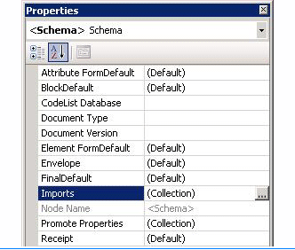
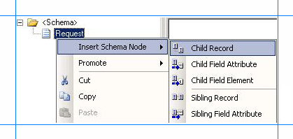
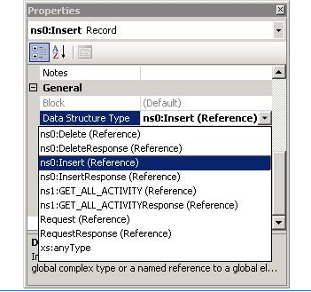
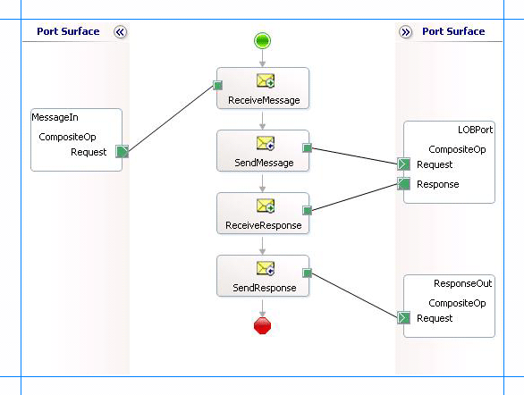

# Run Composite Operations on Oracle Database using BizTalk Server
The [!INCLUDE[adapteroracle_short](../../includes/adapteroracle-short-md.md)] enables adapter clients to perform composite operations on Oracle database. A composite operation can include:  

- Insert, Update, Delete, and Select operations on tables and views.  

- Stored procedures and functions, inside or outside a package.  

  A single composite operation can have any number of these operations, in any order. For example, you can have two inserts followed by a delete, and finally a stored procedure execution. Also, you can have different operations targeting different database tables or views. For more information about how the adapter supports composite operations, see [Performing Composite Operations in Oracle Database](../../adapters-and-accelerators/adapter-oracle-database/run-composite-operations-in-oracle-database.md). For information about the structure of the SOAP message for composite operations, see [Message Schemas for the Composite Operation](../../adapters-and-accelerators/adapter-oracle-database/message-schemas-for-the-composite-operation2.md).  

## How to Perform Composite Operations on Oracle Database?  
 Performing an operation on Oracle database using [!INCLUDE[adapteroracle_short](../../includes/adapteroracle-short-md.md)] with [!INCLUDE[btsBizTalkServerNoVersion](../../includes/btsbiztalkservernoversion-md.md)] involves procedural tasks described in [Building blocks to develop BizTalk Applications with Oracle Database](../../adapters-and-accelerators/adapter-oracle-database/building-blocks-to-develop-biztalk-applications-with-oracle-database.md). To perform composite operations on Oracle database, these tasks are:  

1. Create a BizTalk project in [!INCLUDE[btsVStudioNoVersion](../../includes/btsvstudionoversion-md.md)] and generate schema for all the operations you want to invoke.  

2. Manually create a schema file that includes references to all the schemas you generated in the previous step.  

3. Create messages in the BizTalk project for sending and receiving messages from Oracle database. These messages must conform to the request and response schema you created in the previous step.  

4. Create an orchestration to invoke the composite operation on Oracle database.  

5. Build and deploy the BizTalk project.  

6. Configure the BizTalk application by creating physical send and receive ports.  

7. Start the BizTalk application.  

   This topic provides instructions on how to perform these tasks.  

## Generating Schema  
 In this topic, to demonstrate how to perform composite operations, we will perform the following tasks in the same order:  

- Insert record into the ACCOUNTACTIVITY table.  

- Retrieve all the records in the ACCOUNTACTIVITY table by invoking the GET_ALL_ACTIVITY procedure within the ACCOUNT_PKG package.  

- Delete the record from the ACCOUNTACTIVITY table.  

  Run the scripts provided with the samples to create the ACCOUNTACTIVITY table. For more information about the samples, see [Schema Samples](../../adapters-and-accelerators/accelerator-rosettanet/schema-samples.md).  

  You must create a BizTalk project and use the [!INCLUDE[consumeadapterservshort](../../includes/consumeadapterservshort-md.md)] to generate the schema. See [Retrieve metadata for Oracle Database operations in Visual Studio](../../adapters-and-accelerators/adapter-oracle-database/get-metadata-for-oracle-database-operations-in-visual-studio.md) for more information about how to generate schemas.  

## Creating a Composite Schema Definition  
 You must now create a composite schema in the [!INCLUDE[btsVStudioNoVersion](../../includes/btsvstudionoversion-md.md)] BizTalk project that references the schemas you created for the individual operations. Perform the following steps to create a composite schema definition.  

#### To add a composite schema definition  

1. Add a schema file to the BizTalk project in [!INCLUDE[btsVStudioNoVersion](../../includes/btsvstudionoversion-md.md)]. Right-click the solution name, point to **Add**, and then click **New Item**. In the **Add New Item** dialog box, from the **Categories** box, click **Schema Files**. From the **Templates** box, click **Schema**. Specify a name for the schema file and click **OK**.  

    For this example, specify the schema file name as `CompositeSchema.xsd`.  

2. Add references to the schema generated for the different operations that you want to perform. In this example, the different schemas generated for operations are:  

   - OracleDBBinding.xsd, for Insert and Delete operations on ACCOUNTACTIVITY table.  

   - OracleDBBinding2.xsd, for the GET_ALL_ACTIVITY procedure.  

     To add references:  

   1.  Right-click the root **\<Schema\>** node in the CompositeSchema.xsd, and click **Properties**.  

   2.  In the **Property** box, click the ellipsis button **(…)** against the **Imports** property.  

          

   3.  In the **Imports** dialog box, from the **Import new schema as** list, select **XSD Import**, and then click **Add**.  

   4.  In the **BizTalk Type Picker** dialog box, expand the BizTalk project name node, expand **Schemas**, and then select the schema you want to import. For this example, select <BizTalk_project_name>.OracleDBBinding.xsd. Click **OK**.  

        Repeat this step to import <BizTalk_project_name>.OracleDBBinding2.xsd too.  

   5.  In the **Imports** dialog box, click **OK**.  

3. Add two child nodes to the root schema node. One child node corresponds to the request schema for performing the composite operation. The other child node corresponds to the response schema. The node that corresponds to the request schema can have any name. The node that corresponds to the response schema must be called <request_schema_node>Response. For this example, we will call the request schema node as **Request**. So, the response schema node is called **RequestResponse**.  

   > [!NOTE]
   >  By default, a **Root** node is also added to a new schema file. You can rename the **Root** node to **Request**. To rename a node, right-click the node name and click **Rename**.  

    To add a node under the **\<Schema\>** node:  

   1.  Right-click the **\<Schema\>** node, point to **Insert Schema Node**, and click **Child Record**.  

   2.  Rename the new node to **RequestResponse**.  

4. Add child nodes under the **Request** node that correspond to the request schema for each operation that you will perform as part of the composite operation. For this example, you must add child nodes corresponding to the following:  

   -   Insert and Delete operations on the ACCOUNTACTIVITY table.  

   -   GET_ALL_ACTIVITY procedure.  

   > [!IMPORTANT]
   >  You must add the nodes in the same order in which you want to perform the operations. For example, if you want to insert a record, then execute a stored procedure, and then delete a record you must first add a node for the Insert operation, followed by a node for the stored procedure, and finally a node for the Delete operation.  

    To add child nodes to the **Request** node:  

   1.  Right-click the **Request** node, point to **Insert Schema Node**, and then click  **Child Record**.  

          

   2.  Rename the record to correspond to a request schema for an operation that you perform as part of the composite operation. For example, rename the node to “Insert”.  

   3.  Map the **Insert** node to the request schema for the Insert operation on the ACCOUNTACTIVITY table. To do so, right-click the **Insert** node, and click **Properties**. In the **Properties** box, from the **Data Structure Type** list, select **Insert (Reference)**.  

          

   4.  Repeat these steps to add nodes for the request schemas for GET_ALL_ACTIVITY stored procedure and the Delete operation. Specify the node names and map them to the corresponding schema as mentioned in the following table.  

       |Node name|Mapped to schema|  
       |---------------|----------------------|  
       |GET_ALL_ACTIVITY|GET_ALL_ACTIVITY (Reference)|  
       |Delete|Delete (Reference)|  

5. Add child nodes under the **RequestResponse** node that correspond to the response schema for each operation that you will perform as part of the composite operation. For this example, you must add child nodes corresponding to the following:  

   -   Insert and Delete operations on the ACCOUNTACTIVITY table.  

   -   GET_ALL_ACTIVITY stored procedure.  

   > [!IMPORTANT]
   >  You must add the child nodes in the same order as the child nodes under the **Request** node.  

    To add child nodes to the **RequestResponse** node:  

   1.  Right-click the **RequestResponse** node, point to **Insert Schema Node**, and click **Child Record**.  

   2.  Rename the record to correspond to a response schema for an operation that you perform as part of the composite operation. For example, rename the node to “InsertResponse”.  

   3.  Map the **InsertResponse** node to the response schema for the Insert operation on the ACCOUNTACTIVITY table. To do so, right-click the **InsertResponse** node, and click **Properties**. In the **Properties** box, from the **Data Structure Type** list, select **InsertResponse (Reference)**.  

   4.  Repeat these steps to add nodes for the response schemas for the GET_ALL_ACTIVITY stored procedure and the Delete operation. Specify the node names and map them to the corresponding schema as mentioned in the following table.  

       |Node name|Mapped to schema|  
       |---------------|----------------------|  
       |GET_ALL_ACTIVITYResponse|GET_ALL_ACTIVITYResponse (Reference)|  
       |DeleteResponse|DeleteResponse (Reference)|  

6. Save the **CompositeSchema.xsd** file.  

## Defining Messages and Message Types  
 The composite schema that you created in the last step describes the “types” required for the messages in an orchestration. A message is typically a variable, the type for which is defined by the corresponding schema. You must now create messages for the orchestration and link them to schema you created in the previous step.  

#### To create messages and link to schema  

1. Add an orchestration to the BizTalk project in [!INCLUDE[btsVStudioNoVersion](../../includes/btsvstudionoversion-md.md)]. From Solution Explorer, right-click the BizTalk project name, point to **Add**, and then click **New Item**. Type a name for the BizTalk orchestration, and then click **Add**.  

2. Open the Orchestration View window of the BizTalk project, if it is not already open. To do so, click **View**, point to **Other Windows**, and then click **Orchestration View**.  

3. In Orchestration View, right-click **Messages**, and then click **New Message**.  

4. Right-click the newly created message, and then select **Properties Window**.  

5. In the **Properties** pane for the **Message_1**, do the following:  


   |   Use this   |                                                                                                                  To do this                                                                                                                   |
   |--------------|-----------------------------------------------------------------------------------------------------------------------------------------------------------------------------------------------------------------------------------------------|
   |  Identifier  |                                                                                                                Type `Request`                                                                                                                 |
   | Message Type | From the drop-down list, expand **Schemas**, and then select *Composite_Op.CompositeSchema.Request*, where Composite_Op is the name of your BizTalk project. CompositeSchema is the schema you created manually for the composite operations. |


6. Repeat step 2 to create a new message. In the **Properties** pane for the new message, do the following:  

   |Use this|To do this|  
   |--------------|----------------|  
   |Identifier|Type `Response`|  
   |Message Type|From the drop-down list, expand **Schemas**, and then select *Composite_Op.CompositeSchema.RequestResponse*.|  

## Setting up the Orchestration  
 You must create a BizTalk orchestration to use [!INCLUDE[btsBizTalkServerNoVersion](../../includes/btsbiztalkservernoversion-md.md)] for performing composite operations on Oracle database. In this orchestration, you drop a request message at a defined receive location. The request message must conform to the composite schema you created earlier. The [!INCLUDE[adapteroracle_short](../../includes/adapteroracle-short-md.md)] consumes this message and passes it on to Oracle database. The response from Oracle database is saved to another location. You must include Send and Receive shapes to send messages to Oracle database and receive responses, respectively. A basic orchestration for performing composite operations resembles the following:  

   

### Adding Message Shapes  
 Make sure you specify the following properties for each of the message shapes. The names listed in the Shape column are the names of the message shapes as displayed in the just-mentioned orchestration.  

|Shape|Shape Type|Properties|  
|-----------|----------------|----------------|  
|ReceiveMessage|Receive|-   Set **Name** to *ReceiveMessage*<br />-   Set **Activate** to *True*|  
|SendMessage|Send|-   Set **Name** to *SendMessage*|  
|ReceiveResponse|Receive|-   Set **Name** to *ReceiveResponse*<br />-   Set **Activate** to *False*|  
|SendResponse|Send|-   Set **Name** to *SendResponse*|  

### Adding Ports  
 Make sure you specify the following properties for each of the logical ports. The names listed in the Port column are the names of the ports as displayed in the orchestration.  

|Port|Properties|  
|----------|----------------|  
|MessageIn|-   Set **Identifier** to *MessageIn*<br />-   Set **Type** to *MessageInType*<br />-   Set **Communication Pattern** to *One-Way*<br />-   Set **Communication Direction** to *Receive*|  
|LOBPort|-   Set **Identifier** to *LOBPort*<br />-   Set **Type** to *LOBPortType*<br />-   Set **Communication Pattern** to *Request-Response*<br />-   Set **Communication Direction** to *Send-Receive*|  
|ResponseOut|-   Set **Identifier** to *ResponseOut*<br />-   Set **Type** to *ResponseOutType*<br />-   Set **Communication Pattern** to *One-Way*<br />-   Set **Communication Direction** to *Send*|  

### Specify Messages for Action Shapes, and Connect Them to Ports  
 The following table specifies the properties and their values that you should set to specify messages for action shapes and to link the messages to the ports. The names listed in the Shape column are the names of the message shapes as displayed in the orchestration mentioned earlier.  

|Shape|Properties|  
|-----------|----------------|  
|ReceiveMessage|-   Set **Message** to *Request*<br />-   Set **Operation** to *MessageIn.CompositeOp.Request*|  
|SendMessage|-   Set **Message** to *Request*<br />-   Set **Operation** to *LOBPort.CompositeOp.Request*|  
|ReceiveResponse|-   Set **Message** to *Response*<br />-   Set **Operation** to *LOBPort.CompositeOp.Response*|  
|SendResponse|-   Set **Message** to *Response*<br />-   Set **Operation** to *ResponseOut.CompositeOp.Request*|  

 After you have specified these properties, the message shapes and ports are connected and your orchestration is complete.  

 You must now build the BizTalk solution and deploy it to a [!INCLUDE[btsBizTalkServerNoVersion](../../includes/btsbiztalkservernoversion-md.md)]. For more information, see [Building and Running Orchestrations](../../core/building-and-running-orchestrations.md).  

## Configuring the BizTalk Application  
 After you have deployed the BizTalk project, the orchestration you created earlier is listed under the Orchestrations pane in the [!INCLUDE[btsBizTalkServerNoVersion](../../includes/btsbiztalkservernoversion-md.md)] Administration console. You must use the [!INCLUDE[btsBizTalkServerNoVersion](../../includes/btsbiztalkservernoversion-md.md)] Administration console to configure the application. For a walkthrough, see [Walkthrough: Deploying a Basic BizTalk Application](Walkthrough:%20Deploying%20a%20Basic%20BizTalk%20Application.md).

 Configuring an application involves:  

- Selecting a host for the application.  

- Mapping the ports that you created in your orchestration to physical ports in the [!INCLUDE[btsBizTalkServerNoVersion](../../includes/btsbiztalkservernoversion-md.md)] Administration console. For this orchestration you must:  

  - Define a location on the hard disk and a corresponding file port where you will drop a request message. The BizTalk orchestration will consume the request message and send it to Oracle database.  

  - Define a location on the hard disk and a corresponding file port where the BizTalk orchestration will drop the response message containing the response from Oracle database.  

  - Define a physical WCF-Custom or WCF-OracleDB send port to send messages to Oracle database. Because the operations that are being as part of the composite operation are executed in a single transaction, make sure the **UseAmbientTransaction** binding property is set to **True**.  

     You must also specify the action in the send port. The action for a composite operation is “<http://Microsoft.LobServices.OracleDB/2007/03/CompositeOperation”>. For information about how to create ports, see [Manually configure a physical port binding to the Oracle Database Adapter](../../adapters-and-accelerators/adapter-oracle-database/manually-configure-a-physical-port-binding-to-the-oracle-database-adapter.md). For more information about how to specify actions for ports, see [Configure the SOAP action for Oracle Database](../../adapters-and-accelerators/adapter-oracle-database/configure-the-soap-action-for-oracle-database.md).  

    > [!NOTE]
    >  Generating the schema using the [!INCLUDE[consumeadapterservlong](../../includes/consumeadapterservlong-md.md)] also creates a binding file that contains information about the ports and the actions to be set for those ports. You can import this binding file from the [!INCLUDE[btsBizTalkServerNoVersion](../../includes/btsbiztalkservernoversion-md.md)] Administration console to create send ports (for outbound calls) or receive ports (for inbound calls). For more information, see [Configure a physical port binding using a port binding file to Oracle Database](../../adapters-and-accelerators/adapter-oracle-database/configure-a-physical-port-binding-using-a-port-binding-file-to-oracle-database.md). If you import this binding file, the action on the send port is set to a dynamic action involving all the operations you selected in the [!INCLUDE[consumeadapterservshort](../../includes/consumeadapterservshort-md.md)] while generating the schema. For a composite operation, you must replace the dynamic action with “<http://Microsoft.LobServices.OracleDB/2007/03/CompositeOperation”>.  

## Starting the Application  
 You must start the BizTalk application for performing composite operations on Oracle database. For instructions on starting a BizTalk application, see [How to Start an Orchestration](../../core/how-to-start-an-orchestration.md).  

 At this stage, make sure:  

-   The FILE receive port to receive request messages for the orchestration is running.  

-   The FILE send port to receive the response messages from the orchestration is running.  

-   The WCF-Custom or WCF-OracleDB send port to send messages to Oracle database is running.  

-   The BizTalk orchestration for the operation is running.  

## Executing the Operation  
 After you run the application, you must drop a request message to the FILE receive location. The schema for the request message must conform to the schema for the composite operations you created earlier. For example, a request message that inserts a record in the ACCOUNTACTIVITY table, invokes the GET_ALL_ACTIVITY stored procedure, and deletes a record from the ACCOUNTACTIVITY table is:  

```  
<Request xmlns="http://Composite_Op.CompositeSchema">  
  <Insert xmlns="http://Microsoft.LobServices.OracleDB/2007/03/SCOTT/Table/ACCOUNTACTIVITY">  
    <RECORDSET>  
      <ACCOUNTACTIVITYRECORDINSERT>  
        <TID>1</TID>  
        <ACCOUNT>100001</ACCOUNT>  
        <AMOUNT>1500</AMOUNT>  
        <DESCRIPTION></DESCRIPTION>  
        <TRANSDATE>2008-06-21T15:52:19</TRANSDATE>  
        <PROCESSED>n</PROCESSED>  
      </ACCOUNTACTIVITYRECORDINSERT >  
    </RECORDSET>  
  </Insert>  
  <GET_ALL_ACTIVITY xmlns="http://Microsoft.LobServices.OracleDB/2007/03/SCOTT/Package/ACCOUNT_PKG"/>  
  <Delete xmlns="http://Microsoft.LobServices.OracleDB/2007/03/SCOTT/Table/ACCOUNTACTIVITY">  
    <FILTER>WHERE AMOUNT = 1500</FILTER>  
  </Delete>  
</Request>  
```  

 The preceding request message first inserts a record and then invokes the GET_ALL_ACTIVITY procedure to get all the records in the ACCOUNTACTIVITY table. Then, the inserted record is deleted by specifying a FILTER clause. See [Message Schemas for the Composite Operation](../../adapters-and-accelerators/adapter-oracle-database/message-schemas-for-the-composite-operation2.md) for more information about the request message schema for performing composite operations on Oracle database using the [!INCLUDE[adapteroracle_short](../../includes/adapteroracle-short-md.md)].  

 The orchestration consumes the message and sends it to Oracle database. The response from Oracle database is saved at the other FILE location defined as part of the orchestration. For example, the response from Oracle database for the preceding request message resembles the following:  

```  
<?xml version="1.0" encoding="utf-8" ?>   
<RequestResponse xmlns="http://Composite_Op.CompositeSchema">  
  <InsertResponse xmlns="http://Microsoft.LobServices.OracleDB/2007/03/SCOOT/Table/ACCOUNTACTIVITY">  
    <InsertResult>1</InsertResult>   
  </InsertResponse>  
  <GET_ALL_ACTIVITYResponse xmlns="http://Microsoft.LobServices.OracleDB/2007/03/SCOTT/Package/ACCOUNT_PKG">  
    <ALLRECS>  
      <xs:schema id="NewDataSet" xmlns:xs="http://www.w3.org/2001/XMLSchema" xmlns:msdata="urn:schemas-microsoft-com:xml-msdata">  
        <xs:element msdata:IsDataSet="true" name="NewDataSet">  
          <xs:complexType>  
            <xs:sequence>  
              <xs:element minOccurs="0" maxOccurs="unbounded" name="NewTable">  
                <xs:complexType>  
                  <xs:sequence>  
                    <xs:element minOccurs="0" name="TID" type="xs:decimal" />   
                    <xs:element minOccurs="0" name="ACCOUNT" type="xs:decimal" />   
                    <xs:element minOccurs="0" name="AMOUNT" type="xs:decimal" />   
                    <xs:element minOccurs="0" name="DESCRIPTION" type="xs:string" />   
                    <xs:element minOccurs="0" name="TRANSDATE" type="xs:dateTime" />   
                    <xs:element minOccurs="0" name="PROCESSED" type="xs:string" />   
                  </xs:sequence>  
                </xs:complexType>  
              </xs:element>  
            </xs:sequence>  
          </xs:complexType>  
        </xs:element>  
      </xs:schema>  
      <diffgr:diffgram xmlns:diffgr="urn:schemas-microsoft-com:xml-diffgram-v1">  
        <NewDataSet xmlns="">  
          <NewTable>  
            ......   
            ......   
          </NewTable>  
          ......  
          ......  
          <NewTable>  
            <TID>10</TID>   
            <ACCOUNT>100001</ACCOUNT>   
            <AMOUNT>1000</AMOUNT>   
            <TRANSDATE>2008-07-28T21:39:57</TRANSDATE>   
            <PROCESSED>n</PROCESSED>   
          </NewTable>  
        </NewDataSet>  
      </diffgr:diffgram>  
    </ALLRECS>  
  </GET_ALL_ACTIVITYResponse>  
  <DeleteResponse xmlns="http://Microsoft.LobServices.OracleDB/2007/03/SCOTT/Table/ACCOUNTACTIVITY">  
    <DeleteResult>1</DeleteResult>   
  </DeleteResponse>  
</RequestResponse>  
```  

 The preceding response contains multiple result sets corresponding the different operations performed as part of the composite operation. For example, the `InsertResult` element contains ‘1’, indicating the number of rows inserted by the Insert operation. Similarly, the `DeleteResult` element contains ‘1’, indicating the number of rows deleted by the Delete operation.  

> [!IMPORTANT]
>  If you experience time-out issues while executing a composite operation then it could be because the number of connections is less than the number of operations in a composite operation involving:  
> 
> - Stored procedures containing BFILE, BLOB, CLOB, NCLOB, and REF CURSOR as OUT or IN OUT parameters.  
>   -   Select operation.  
> 
>   To resolve this issue, you must ensure that if there are “n” number of such operations in a composite operation, the value specified for the **MinPoolSize** binding property is “n+1” or greater. For more information about the **MinPoolSize** binding property, see [Working with binding properties](https://msdn.microsoft.com/library/dd788467.aspx).  

## Best Practices  
 After you have deployed and configured the BizTalk project, you can export configuration settings to an XML file called the binding file. Once you generate a binding file, you can import the configuration settings from the file, so that you do not need to create items such as send ports and receive ports for the same orchestration. For more information about binding files, see 
[Reuse Oracle Database adapter bindings](../../adapters-and-accelerators/adapter-oracle-database/reuse-oracle-database-adapter-bindings.md).  

## See Also  
[Building Blocks to Develop BizTalk Applications with Oracle Database](../../adapters-and-accelerators/adapter-oracle-database/building-blocks-to-develop-biztalk-applications-with-oracle-database.md)