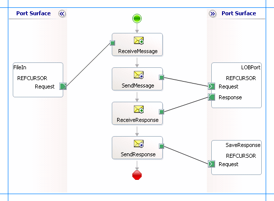

# Invoke Functions and Procedures with REF CURSORS in Oracle Database using BizTalk Server
A REF CURSOR is a PL/SQL data type that represents a pointer to a server-side result set generated by executing a query. A REF CURSOR type enables input and output streaming of data and is ideal for transferring large amounts of data to and from a PL/SQL code. The [!INCLUDE[adapteroracle_short](../../includes/adapteroracle-short-md.md)] provides support for strongly-typed and weakly-typed (SYS_REFCURSOR) REF CURSORs that can be passed to PL/SQL procedures and functions as IN, OUT, or IN OUT parameters. For more information about how the [!INCLUDE[adapteroracle_short](../../includes/adapteroracle-short-md.md)] supports REF CURSORs, see [Operations on Functions and Procedures with REF CURSOR Parameters](../../adapters-and-accelerators/adapter-oracle-database/ref-cursor-parameters-in-oracle-database-adapter.md). For information about the XML structure for REF CURSORS, see [Message Schemas for REF CURSORS](../../adapters-and-accelerators/adapter-oracle-database/message-schemas-for-ref-cursors.md).  
  
## How to Invoke Functions in an Oracle Database?  
 Performing an operation on an Oracle database using [!INCLUDE[adapteroracle_short](../../includes/adapteroracle-short-md.md)] with [!INCLUDE[btsBizTalkServerNoVersion](../../includes/btsbiztalkservernoversion-md.md)] involves procedural tasks described in [Building blocks to develop BizTalk Applications with Oracle Database](../../adapters-and-accelerators/adapter-oracle-database/building-blocks-to-develop-biztalk-applications-with-oracle-database.md). To invoke a function in an Oracle database that takes REF CURSOR as in parameters and gives REF CURSOR as out parameters, these tasks are:  
  
1. Create a BizTalk project and generate schema for the function you want to invoke in an Oracle database.  
  
2. Create messages in the BizTalk project for sending and receiving messages from the Oracle database.  
  
3. Create an orchestration to invoke the function in the Oracle database.  
  
4. Build and deploy the BizTalk project.  
  
5. Configure the BizTalk application by creating physical send and receive ports.  
  
6. Start the BizTalk application.  
  
   This topic provides instructions to perform these tasks.  
  
## Sample Based On This Topic  
 A sample, Func_RefCursor, based on this topic is also provided with the [!INCLUDE[adapterpacknoversion](../../includes/adapterpacknoversion-md.md)]. For more information, see [Adapter Samples](../../adapters-and-accelerators/accelerator-rosettanet/adapter-samples.md).  
  
## Generating Schema  
 In this topic, to demonstrate how the [!INCLUDE[adapteroracle_short](../../includes/adapteroracle-short-md.md)] supports invoking function that takes REF CURSOR parameters we will invoke the GET_ACTIVITY procedure. This procedure takes a weakly-typed IN REF CURSOR and a strongly-typed IN OUT REF CURSOR as parameters. The function returns a status, a weakly-typed OUT REF CURSOR and a strongly-typed IN OUT REF CURSOR. The GET_ACTIVITY procedure is available as part of the ACCOUNT_PKG created by running the SQL scripts provided with the samples. To know more about the samples and the SQL scripts, see [Schema Samples](../../adapters-and-accelerators/accelerator-rosettanet/schema-samples.md).  
  
 So, to invoke the GET_ACTIVITY procedure, we generate schema for the same procedure under the SCOTT\Package\ACCOUNT_PKG schema. See [Get metadata for Oracle Database operations in Visual Studio](../../adapters-and-accelerators/adapter-oracle-database/get-metadata-for-oracle-database-operations-in-visual-studio.md) for more information about how to generate schema.  
  
## Defining Messages and Message Types  
 The schema that you generated earlier describes the "types" required for the messages in the orchestration. A message is typically a variable, the type for which is defined by the corresponding schema. You must link the schema you generated in the first step to the messages from the Orchestration View window of the BizTalk project.  
  
 For this topic, you must create two messages—one to send a request to the Oracle database and the other to receive a response.  
  
 Perform the following steps to create messages and link them to the schema:  
  
#### To create messages and link to schema  
  
1.  Open the Orchestration View window of the BizTalk project, if it is not already open. To do this, click **View**, point to **Other Windows**, and then click **Orchestration View**.  
  
2.  In Orchestration View, right-click **Messages**, and then click **New Message**.  
  
3.  Right-click the newly created message, and then select **Properties Window**.  
  
4.  In the **Properties** pane for **Message_1**, do the following:  
  
    |Use this|To do this|  
    |--------------|----------------|  
    |Identifier|Type **Request**.|  
    |Message Type|From the drop-down list, expand **Schemas**, and select *Func_RefCursor.OracleDBBindingSchema.GET_ACTIVITY*, where *Func_RefCursor* is the name of your BizTalk project. *OracleDBBindingSchema* is the schema generated for the GET_ACTIVITY procedure.|  
  
5.  Repeat the previous step to create a new message. In the **Properties** pane for the new message, do the following:  
  
    |Use this|To do this|  
    |--------------|----------------|  
    |Identifier|Type **Response**.|  
    |Message Type|*Func_RefCursor.OracleDBBindingSchema.GET_ACTIVITYResponse*|  
  
## Setting up the Orchestration  
 You must create a BizTalk orchestration to use [!INCLUDE[btsBizTalkServerNoVersion](../../includes/btsbiztalkservernoversion-md.md)] for invoking a procedure with REF CURSOR parameters. In this orchestration, you drop a request message at a defined receive location. The [!INCLUDE[adapteroracle_short](../../includes/adapteroracle-short-md.md)] consumes this message and passes it on to the Oracle database via ODP. The response from the Oracle database is saved to another location. A typical orchestration for invoking functions and procedures with REF CURSORs would contain:  
  
- Send and Receive shapes to send messages to Oracle database and receive responses.  
  
- A one-way receive port to receive request messages to send to the Oracle database.  
  
- A two-way send port to send request messages to Oracle database and receive responses.  
  
- A one-way send port to send the responses from Oracle database to a folder.  
  
  A sample orchestration resembles the following:  
  
    
  
### Adding Message Shapes  
 Make sure you specify the following properties for each of the message shapes. The names listed in the Shape column are the names of the message shapes as displayed in the just-mentioned orchestration.  
  
|Shape|Shape Type|Properties|  
|-----------|----------------|----------------|  
|ReceiveMessage|Receive|-   Set **Name** to *ReceiveMessage*<br />-   Set **Activate** to *True*|  
|SendMessage|Send|-   Set **Name** to *SendMessage*|  
|ReceiveResponse|Receive|-   Set **Name** to *ReceiveResponse*<br />-   Set **Activate** to *False*|  
|SendResponse|Send|-   Set **Name** to *SendResponse*|  
  
### Adding Ports  
 Make sure you specify the following properties for each of the logical ports. The names listed in the Port column are the names of the ports as displayed in the orchestration.  
  
|Port|Properties|  
|----------|----------------|  
|FileIn|-   Set **Identifier** to *FileIn*<br />-   Set **Type** to *FileInType*<br />-   Set **Communication Pattern** to *One-Way*<br />-   Set **Communication Direction** to *Receive*|  
|LOBPort|-   Set **Identifier** to *LOBPort*<br />-   Set **Type** to *LOBPortType*<br />-   Set **Communication Pattern** to *Request-Response*<br />-   Set **Communication Direction** to *Send-Receive*|  
|SaveResponse|-   Set **Identifier** to *SaveResponse*<br />-   Set **Type** to *SaveResponseType*<br />-   Set **Communication Pattern** to *One-Way*<br />-   Set **Communication Direction** to *Send*|  
  
## Specify Messages for Action Shapes, and Connect Them to Ports  
 The following table specifies the properties and their values that you should set to specify messages for action shapes and to link them to the ports. The names listed in the Shape column are the names of the message shapes as displayed in the orchestration mentioned earlier.  
  
|Shape|Properties|  
|-----------|----------------|  
|ReceiveMessage|-   Set **Message** to *Request*<br />-   Set **Operation** to *FileIn.REFCURSOR.Request*|  
|SendMessage|-   Set **Message** to *Request*<br />-   Set **Operation** to *LOBPort.REFCURSOR.Request*|  
|ReceiveResponse|-   Set **Message** to *Response*<br />-   Set **Operation** to *LOBPort.REFCURSOR.Response*|  
|SendResponse|-   Set **Message** to *Response*<br />-   Set **Operation** to *SaveResponse.REFCURSOR.Request*|  
  
 After you have specified these properties, the message shapes and ports are connected and your orchestration is complete.  
  
 You must now build the BizTalk solution and deploy it to a [!INCLUDE[btsBizTalkServerNoVersion](../../includes/btsbiztalkservernoversion-md.md)]. For more information, see [Building and Running Orchestrations](../../core/building-and-running-orchestrations.md).  
  
## Configuring the BizTalk Application  
 After you have deployed the BizTalk project, the orchestration you created earlier is listed under the **Orchestrations** pane in the BizTalk Server Administration console. You must use the BizTalk Server Administration console to configure the application. For a walkthrough, see [Walkthrough: Deploying a Basic BizTalk Application](Walkthrough:%20Deploying%20a%20Basic%20BizTalk%20Application.md).
  
 Configuring an application involves:  
  
- Selecting a host for the application.  
  
- Mapping the ports that you created in your orchestration to physical ports in the BizTalk Server Administration console. For this orchestration you must:  
  
  - Define a location on the hard disk and a corresponding file port where you will drop a request message. The BizTalk orchestration will consume the request message and send it to the Oracle database.  
  
  - Define a location on the hard disk and a corresponding file port where the BizTalk orchestration will drop the response message containing the response from the Oracle database.  
  
  - Define a physical WCF-Custom or WCF-OracleDB send port to send messages to the Oracle database. You must also specify the action in the send port. For information about how to create WCF-Custom or WCF-OracleDB ports, see [Manually configure physical port binding to the Oracle Database Adapter](../../adapters-and-accelerators/adapter-oracle-database/manually-configure-a-physical-port-binding-to-the-oracle-database-adapter.md).  
  
    > [!NOTE]
    >  Generating the schema using the [!INCLUDE[consumeadapterservlong](../../includes/consumeadapterservlong-md.md)] also creates a binding file containing information about the ports and the actions to be set for those ports. You can import this binding file from the BizTalk Server Administration console to create send ports (for outbound calls) or receive ports (for inbound calls). For more information, see [Configure physical port binding using port binding file to Oracle Database](../../adapters-and-accelerators/adapter-oracle-database/configure-a-physical-port-binding-using-a-port-binding-file-to-oracle-database.md).  
  
## Starting the Application  
 You must start the BizTalk application for invoking a procedure in an Oracle database table. For instructions on starting a BizTalk application, see [How to Start an Orchestration](../../core/how-to-start-an-orchestration.md).  
  
 At this stage, make sure:  
  
-   The FILE receive port to receive request messages for the orchestration is running.  
  
-   The FILE send port to receive the response messages from the orchestration is running.  
  
-   The WCF-Custom or WCF-OracleDB send port to send messages to the Oracle database is running.  
  
-   The BizTalk orchestration for the operation is running.  
  
## Executing the Operation  
 After you run the application, you must drop a request message to the FILE receive location. The schema for the request message must conform to the schema for the procedure you generated earlier. See [Message Schemas for Functions and Procedures](../../adapters-and-accelerators/adapter-oracle-database/message-schemas-for-functions-and-procedures.md) for more information about the request message schema for invoking functions using the [!INCLUDE[adapteroracle_short](../../includes/adapteroracle-short-md.md)].  
  
 To invoke the GET_ACTIVITY procedure, you must specify a weakly-typed IN REF CURSOR and a strongly-typed IN OUT REF CURSOR as parameters. So, the request message to invoke this procedure is:  
  
```  
<GET_ACTIVITY xmlns="http://Microsoft.LobServices.OracleDB/2007/03/SCOTT/Package/ACCOUNT_PKG">  
  <INRECS>BEGIN OPEN ? FOR SELECT * FROM ACCOUNTACTIVITY WHERE ACCOUNT=100001; END;</INRECS>  
  <INOUTRECS_IN>BEGIN ACCOUNT_PKG.GET_ALL_ACTIVITY(?); END;</INOUTRECS_IN>  
</GET_ACTIVITY>  
```  
  
 The orchestration consumes the request message and sends it to the Oracle database. The response from the Oracle database is saved at the other FILE location defined as part of the orchestration.  
  
 The response for the above request message is:  
  
```  
<?xml version="1.0" encoding="utf-8" ?>   
<GET_ACTIVITYResponse xmlns="http://Microsoft.LobServices.OracleDB/2007/03/SCOTT/Package/ACCOUNT_PKG">  
  <STATUS>5</STATUS>   
  <INOUTRECS>  
    <INOUTRECSRECORD xmlns="http://Microsoft.LobServices.OracleDB/2007/03/SCOTT/Package/ACCOUNT_PKG/GET_ACTIVITY">  
      <TID>1</TID>   
      <ACCOUNT>100001</ACCOUNT>   
      <AMOUNT>500</AMOUNT>   
      <DESCRIPTION />   
      <TRANSDATE>2007-10-16T16:58:44</TRANSDATE>   
      <PROCESSED>n</PROCESSED>   
    </INOUTRECSRECORD>  
    <INOUTRECSRECORD xmlns="http://Microsoft.LobServices.OracleDB/2007/03/SCOTT/Package/ACCOUNT_PKG/GET_ACTIVITY">  
      .....   
      .....   
    </INOUTRECSRECORD>  
    ....  
    ....  
  </INOUTRECS>  
  <OUTRECS>  
    <GenRecordRow xmlns="http://Microsoft.LobServices.OracleDB/2007/03">  
      <GenRecordColumn>  
        <GenRecordColumn>  
          <ColumnName>TID</ColumnName>   
          <ColumnValue>1</ColumnValue>   
          <ColumnType>System.Decimal</ColumnType>   
        </GenRecordColumn>  
        <GenRecordColumn>  
          ....   
        </GenRecordColumn>  
        .....  
        .....  
      </GenRecordColumn>  
    </GenRecordRow>  
    <GenRecordRow xmlns="http://Microsoft.LobServices.OracleDB/2007/03">  
      .....  
      .....  
    </GenRecordRow>  
    .....  
    .....  
  </OUTRECS>  
</GET_ACTIVITYResponse>  
```  
  
 Note that the response contains a status, a weakly-typed OUT REF CURSOR and a strongly-typed IN OUT REF CUROSR.  
  
## Possible Exceptions  
 For information about the exceptions you might encounter while invoking functions and procedures using [!INCLUDE[btsBizTalkServerNoVersion](../../includes/btsbiztalkservernoversion-md.md)], see [Exceptions and error handling](../../adapters-and-accelerators/adapter-oracle-database/exceptions-and-error-handling-with-the-oracle-database-adapter.md).  
  
## Best Practices  
 After you have deployed and configured the BizTalk project, you can export configuration settings to an XML file called the bindings file. Once you generate a bindings file, you can import the configuration settings from the file so that you do not need to create the send ports, receive ports, etc. for the same orchestration. For more information about binding files, see [Reuse Oracle Database Adapter bindings](../../adapters-and-accelerators/adapter-oracle-database/reuse-oracle-database-adapter-bindings.md).  
  
## See Also  
 [Develop BizTalk applications](../../core/develop-your-biztalk-applications.md)