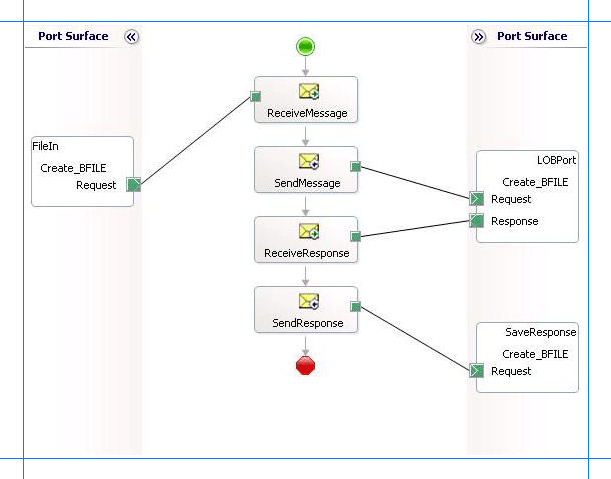

# Run operations on Tables with BFILE Data Types in Oracle Database using BizTalk Server
The [!INCLUDE[adapteroracle_short](../../includes/adapteroracle-short-md.md)] supports the BFILE data type in tables and stored procedures. This section provides information on how to perform operations on tables that have a column of BFILE data type. For more information about how the [!INCLUDE[adapteroracle_short](../../includes/adapteroracle-short-md.md)] supports BFILE, see [Operations on Tables With BFILE Data Types in Oracle Database](../../adapters-and-accelerators/adapter-oracle-database/operations-on-tables-with-bfile-data-types-in-oracle-database.md).  
  
## Setting Up Your Oracle Database Server for Operations on BFILE  
 This section demonstrates how to invoke a procedure that inserts a record into the SCOTT.CUSTOMERDOC table. This table contains a column of BFILE data type and is created by running the SQL scripts shipped with the [!INCLUDE[adapterpacknoversion](../../includes/adapterpacknoversion-md.md)] samples. To know more about the samples and the SQL scripts, see [Samples for the Oracle Database adapter](../../adapters-and-accelerators/adapter-oracle-database/samples-for-the-oracle-database-adapter.md).  
  
 After you have run the script to create the CUSTOMERDOC table, you must perform certain actions on the computer running the Oracle database to enable operations on BFILE data types. The tasks that you must perform on the Oracle database are:  
  
1.  Create a directory C:\MYDIR on the computer running the Oracle database.  
  
2.  Create a logical directory in the Oracle database. This usually requires a user with SYSDBA privileges. For example:  
  
    ```  
    CREATE OR REPLACE DIRECTORY MYDIR AS 'C:\MYDIR';  
    ```  
  
3.  Add privileges to the user to access the logical directory in Oracle. For example:  
  
    ```  
    GRANT READ, WRITE ON DIRECTORY MYDIR to SCOTT;  
    ```  
  
4.  Copy the files to be accessed into the physical directory location, on the computer running the Oracle database, associated with the logical directory in Oracle. You created this directory in step 1.  
  
     Based on the example above, copy a file, customer_profile.txt into directory C:\MYDIR. This file is now available for BFILE operations. For more information about performing operations, see [Performing Operations on Tables with Large Object Types Data by Using BizTalk Server in Oracle Database](../../adapters-and-accelerators/adapter-oracle-database/run-operations-on-tables-with-large-object-data-types-in-oracle-database.md).  
  
    > [!IMPORTANT]
    >  The ReadLOB operation is supported on tables with the BFILE data type. The UpdateLOB operation is NOT supported. However, users can alternately use the UPDATE operation.  
  
## How to Perform Operations Using BFILE Data Types  
 Performing an operation on an Oracle database using [!INCLUDE[adapteroracle_short](../../includes/adapteroracle-short-md.md)] with [!INCLUDE[btsBizTalkServerNoVersion](../../includes/btsbiztalkservernoversion-md.md)] involves procedural tasks described in [Building blocks to develop BizTalk Applications with Oracle Database](../../adapters-and-accelerators/adapter-oracle-database/building-blocks-to-develop-biztalk-applications-with-oracle-database.md). To invoke a procedure that inserts a record into the SCOTT.CUSTOMERDOC table, these tasks are:  
  
1. Create a BizTalk project and generate schema for the CREATE_CUSTOMERDOC stored procedure.  
  
2. Create messages in the BizTalk project for sending and receiving messages from the Oracle database.  
  
3. Create an orchestration to invoke the operation on the Oracle database table or view.  
  
4. Build and deploy the BizTalk project.  
  
5. Configure the BizTalk application by creating physical send and receive ports.  
  
6. Start the BizTalk application.  
  
   This topic provides instructions to perform these tasks.  
  
## Sample Based On This Topic  
 A sample, Operate_BFILE, based on this topic is also provided with the [!INCLUDE[adapterpacknoversion](../../includes/adapterpacknoversion-md.md)]. For more information, see [Samples for the Oracle Database adapter](../../adapters-and-accelerators/adapter-oracle-database/samples-for-the-oracle-database-adapter.md).  
  
## Generating Schema  
 In this topic, to demonstrate how to perform operations on a table with BFILE columns, we will invoke the CREATE_CUSTOMERDOC procedure. This procedure is created under the SCOTT\Package\ACCOUNT_PKG schema by running the SQL scripts provided with the samples. This procedure takes BFILE record type and adds a record in the CUSTOMERDOC table. For more information about the SQL scripts, see [Schema Samples](../../adapters-and-accelerators/accelerator-rosettanet/schema-samples.md).  
  
 See [Retrieve metadata for Oracle operations in Visual Studio](../../adapters-and-accelerators/adapter-oracle-database/get-metadata-for-oracle-database-operations-in-visual-studio.md) for more information about how to generate schema.  
  
## Defining Messages and Message Types  
 The schema that you generated earlier describes the "types" required for the messages in the orchestration. A message is typically a variable, the type for which is defined by the corresponding schema. You must link the schema you generated in the first step to the messages from the Orchestration View window of the BizTalk project.  
  
 For this topic, you must create two messages—one to send a request to the Oracle database and the other to receive a response.  
  
 Perform the following steps to create messages and link them to the schema.  
  
#### To create messages and link to schema  
  
1.  Open the Orchestration View window of the BizTalk project, if it is not already open. To do so, click **View**, point to **Other Windows**, and then click **Orchestration View**.  
  
2.  In Orchestration View, right-click **Messages**, and then click **New Message**.  
  
3.  Right-click the newly created message and then select **Properties Window**.  
  
4.  In the **Properties** pane for **Message_1**, do the following:  
  
    |Use this|To do this|  
    |--------------|----------------|  
    |Identifier|Type **Request**.|  
    |Message Type|From the drop-down list, expand **Schemas**, and then select *BFILE_Operations.OracleDBBindingSchema.CREATE_CUSTOMERDOC*, where *BFILE_Operations* is the name of your BizTalk project. *OracleDBBindingSchema* is the schema generated for the CREATE_CUSTOMERDOC procedure.|  
  
5.  Repeat step 2 to create a new message. In the **Properties** pane for the new message, do the following:  
  
    |Use this|To do this|  
    |--------------|----------------|  
    |Identifier|Type **Response**.|  
    |Message Type|From the drop-down list, expand **Schemas**, and then select *BFILE_Operations.OracleDBBindingSchema.CREATE_CUSTOMERDOCResponse*.|  
  
## Setting up the Orchestration  
 You must create a BizTalk orchestration to use [!INCLUDE[btsBizTalkServerNoVersion](../../includes/btsbiztalkservernoversion-md.md)] for executing a procedure. In this orchestration, you drop a request message at a defined receive location. The [!INCLUDE[adapteroracle_short](../../includes/adapteroracle-short-md.md)] consumes this message and passes it on to the Oracle database via ODP. The response from the Oracle database is saved to another location. A typical orchestration for performing operations on BFILE columns in an Oracle database table would contain:  
  
- Send and Receive shapes to send messages to Oracle database and receive responses.  
  
- A one-way receive port to receive request messages to send to the Oracle database.  
  
- A two-way send port to send request messages to Oracle database and receive responses.  
  
- A one-way send port to send the responses from Oracle database to a folder.  
  
  A sample orchestration resembles the following:  
  
    
  
### Adding Message Shapes  
 Make sure you specify the following properties for each of the message shapes. The names listed in the Shape column are the names of the message shapes as displayed in the just-mentioned orchestration.  
  
|Shape|Shape Type|Properties|  
|-----------|----------------|----------------|  
|ReceiveMessage|Receive|-   Set **Name** to *ReceiveMessage*<br />-   Set **Activate** to *True*|  
|SendMessage|Send|-   Set **Name** to *SendMessage*|  
|ReceiveResponse|Receive|-   Set **Name** to *ReceiveResponse*<br />-   Set **Activate** to *False*|  
|SendResponse|Send|-   Set **Name** to *SendResponse*|  
  
### Adding Ports  
 Make sure you specify the following properties for each of the logical ports. The names listed in the Port column are the names of the ports as displayed in the orchestration.  
  
|Port|Properties|  
|----------|----------------|  
|FileIn|-   Set **Identifier** to *FileIn*<br />-   Set **Type** to *FileInType*<br />-   Set **Communication Pattern** to *One-Way*<br />-   Set **Communication Direction** to *Receive*|  
|LOBPort|-   Set **Identifier** to *LOBPort*<br />-   Set **Type** to *LOBPortType*<br />-   Set **Communication Pattern** to *Request-Response*<br />-   Set **Communication Direction** to *Send-Receive*|  
|SaveResponse|-   Set **Identifier** to *SaveResponse*<br />-   Set **Type** to *SaveResponseType*<br />-   Set **Communication Pattern** to *One-Way*<br />-   Set **Communication Direction** to *Send*|  
  
## Specify Messages for Action Shapes, and Connect Them to Ports  
 The following table specifies the properties and their values that you should set to specify messages for action shapes and to link the messages to the ports. The names listed in the Shape column are the names of the message shapes as displayed in the orchestration mentioned earlier.  
  
|Shape|Properties|  
|-----------|----------------|  
|ReceiveMessage|-   Set **Message** to *Request*<br />-   Set **Operation** to *FileIn.Create_BFILE.Request*|  
|SendMessage|-   Set **Message** to *Request*<br />-   Set **Operation** to *LOBPort.Create_BFILE.Request*|  
|ReceiveResponse|-   Set **Message** to *Response*<br />-   Set **Operation** to *LOBPort.Create_BFILE.Response*|  
|SendResponse|-   Set **Message** to *Response*<br />-   Set **Operation** to *SaveResponse.Create_BFILE.Request*|  
  
 After you have specified these properties, the message shapes and ports are connected and your orchestration is complete.  
  
 You must now build the BizTalk solution and deploy it to a [!INCLUDE[btsBizTalkServerNoVersion](../../includes/btsbiztalkservernoversion-md.md)]. For more information, see [Building and Running Orchestrations](../../core/building-and-running-orchestrations.md).  
  
## Configuring the BizTalk Application  
 After you have deployed the BizTalk project, the orchestration you created earlier is listed under the **Orchestrations** pane in the BizTalk Server Administration console. You must use the BizTalk Server Administration console to configure the application. For a walkthrough, see [Walkthrough: Deploying a Basic BizTalk Application](Walkthrough:%20Deploying%20a%20Basic%20BizTalk%20Application.md).
  
 Configuring an application involves:  
  
- Selecting a host for the application.  
  
- Mapping the ports that you created in your orchestration to physical ports in the BizTalk Server Administration console. For this orchestration you must:  
  
  - Define a location on the hard disk and a corresponding file port where you will drop a request message. The BizTalk orchestration will consume the request message and send it to the Oracle database.  
  
  - Define a location on the hard disk and a corresponding file port where the BizTalk orchestration will drop the response message containing the response from the Oracle database.  
  
  - Define a physical WCF-Custom or WCF-OracleDB send port to send messages to the Oracle database. You must also specify the action in the send port. For information about how to create WCF-Custom or WCF-OracleDB ports, see [Manually configure physical port binding to the Oracle Database Adapter](../../adapters-and-accelerators/adapter-oracle-database/manually-configure-a-physical-port-binding-to-the-oracle-database-adapter.md).  
  
    > [!NOTE]
    >  Generating the schema using the [!INCLUDE[consumeadapterservlong](../../includes/consumeadapterservlong-md.md)] also creates a binding file that contains information about the ports and the actions to be set for those ports. You can import this binding file from the BizTalk Server Administration console to create send ports (for outbound calls) or receive ports (for inbound calls). For more information, see [Configure a physical port binding using a port binding file to Oracle Database](../../adapters-and-accelerators/adapter-oracle-database/configure-a-physical-port-binding-using-a-port-binding-file-to-oracle-database.md).  
  
## Starting the Application  
 You must start the BizTalk application for invoking the procedure that creates a record in the CUSTOMERDOC table. For instructions on starting a BizTalk application, see [How to Start an Orchestration](../../core/how-to-start-an-orchestration.md).  
  
 At this stage, make sure:  
  
-   The FILE receive port to receive request messages for the orchestration is running.  
  
-   The FILE send port to receive the response messages from the orchestration is running.  
  
-   The WCF-Custom or WCF-OracleDB send port to send messages to the Oracle database is running.  
  
-   The BizTalk orchestration for the operation is running.  
  
## Executing the Operation  
 After you run the application, you must drop a request message to the FILE receive location. The schema for the request message must conform to the schema for the procedure you generated earlier. See [Message Schemas for Functions and Procedures](../../adapters-and-accelerators/adapter-oracle-database/message-schemas-for-functions-and-procedures.md) for more information about the request message schema for invoking procedure using the [!INCLUDE[adapteroracle_short](../../includes/adapteroracle-short-md.md)].  
  
 For example, the request message to invoke the CREATE_CUSTOMERDOC procedure is:  
  
```  
<CREATE_CUSTOMERDOC xmlns="http://Microsoft.LobServices.OracleDB/2007/03/SCOTT/Package/ACCOUNT_PKG">  
  <CNAME>John Smith</CNAME>  
  <CDOC>MYDIR/John_Smith_profile.txt</CDOC>  
</CREATE_CUSTOMERDOC>  
```  
  
> [!NOTE]
>  The text file, John_Smith_profile.txt must be present in the physical directory location associated with the logical directory in Oracle. For this example, the text file must be present in C:\MYDIR  
  
 The orchestration consumes the message and sends it to the Oracle database. The response from the Oracle database is saved at the other FILE location defined as part of the orchestration. For example, the response from Oracle database for the above request message is:  
  
```  
<?xml version="1.0" encoding="utf-8"?>  
<CREATE_CUSTOMERDOCResponse xmlns="http://Microsoft.LobServices.OracleDB/2007/03/SCOTT/Package/ACCOUNT_PKG"></CREATE_CUSTOMERDOCResponse>  
```  
  
> [!NOTE]
>  You can create a similar orchestration to read data from tables that have BFILE type fields. The SQL script shipped with the [!INCLUDE[adapterpacknoversion](../../includes/adapterpacknoversion-md.md)] creates an ACCOUNT_PKG that contains a GET_CUSTOMERDOC procedure. You can use this procedure to retrieve BFILE data from the SCOTT.CUSTOMERDOC table.  
> 
>  A sample, Operate_BFILE, is also included with the samples for [!INCLUDE[adapterpacknoversion](../../includes/adapterpacknoversion-md.md)]. This sample demonstrates how to insert records into the SCOTT.CUSTOMERDOC table using the CREATE_CUSTOMERDOC stored procedure (as described in this topic.) The sample also demonstrates how to read BFILE data from the SCOTT.CUSTOMERDOC table using GET_CUSTOMERDOC stored procedure.  
  
## Possible Exceptions  
 For information about the exceptions you might encounter while performing a DML operation using [!INCLUDE[btsBizTalkServerNoVersion](../../includes/btsbiztalkservernoversion-md.md)], see [Exceptions and error handling](../../adapters-and-accelerators/adapter-oracle-database/exceptions-and-error-handling-with-the-oracle-database-adapter.md).  
  
## Best Practices  
 After you have deployed and configured the BizTalk project, you can export configuration settings to an XML file called the bindings file. Once you generate a bindings file, you can import the configuration settings from the file so that you do not need to create the send ports, receive ports, etc. for the same orchestration. For more information about binding files, see [Reuse Oracle Database Adapter bindings](../../adapters-and-accelerators/adapter-oracle-database/reuse-oracle-database-adapter-bindings.md).  
  
## See Also  
[Building Blocks to develop BizTalk Applications with Oracle Database](../../adapters-and-accelerators/adapter-oracle-database/building-blocks-to-develop-biztalk-applications-with-oracle-database.md)