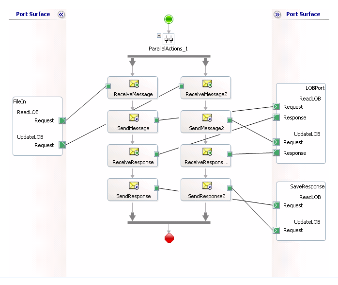

# Run operations on tables with large object data types in Oracle Database
The [!INCLUDE[adapteroracle](../../includes/adapteroracle-md.md)] provides support for the Oracle large object (LOB) data types:  

- Binary large object (BLOB)  

- Character large object (CLOB)  

- National character large object (NCLOB)  

- Binary file (BFILE). For more information, see [Performing Operations on Tables with BFILE Data Types in Oracle Database using BizTalk Server](../../adapters-and-accelerators/adapter-oracle-database/run-operations-on-tables-with-bfile-data-types-in-oracle-db-using-biztalk.md).  

  The [!INCLUDE[adapteroracle](../../includes/adapteroracle-md.md)] does this by surfacing the ReadLOB and UpdateLOB operations for tables that contain LOB columns. For more information about these operations see [Operations on Tables and Views That Contain LOB Data in Oracle Database](../../adapters-and-accelerators/adapter-oracle-database/operations-on-tables-and-views-that-contain-lob-data-in-oracle-database.md). For more information about the structure of the SOAP message for invoking these operations, see [Message Schemas for Special LOB Operations](../../adapters-and-accelerators/adapter-oracle-database/message-schemas-for-special-lob-operations2.md).  

> [!NOTE]
>  When using the [!INCLUDE[adapteroracle_short](../../includes/adapteroracle-short-md.md)] with [!INCLUDE[btsBizTalkServerNoVersion](../../includes/btsbiztalkservernoversion-md.md)], the ReadLOB operation does not support streaming LOB type data from an Oracle database. To stream LOB data from an Oracle database using [!INCLUDE[btsBizTalkServerNoVersion](../../includes/btsbiztalkservernoversion-md.md)] you should instead use the Select operation. For more information about streaming, see [Streaming Support for LOB Data Types in Oracle Database](../../adapters-and-accelerators/adapter-oracle-database/streaming-support-for-lob-data-types-in-oracle-database.md). Also, the response from the Oracle database for the ReadLOB operation will fail validation against the WSDL. For instructions on how to workaround the failure, see [Troubleshooting operational issues](https://msdn.microsoft.com/library/dd787883.aspx).  

## How to Perform Operations on LOB Data?  
 Performing an operation on an Oracle database using [!INCLUDE[adapteroracle_short](../../includes/adapteroracle-short-md.md)] with [!INCLUDE[btsBizTalkServerNoVersion](../../includes/btsbiztalkservernoversion-md.md)] involves procedural tasks described in [Building blocks to develop BizTalk Applications with Oracle Database](../../adapters-and-accelerators/adapter-oracle-database/building-blocks-to-develop-biztalk-applications-with-oracle-database.md). To invoke both ReadLOB and UpdateLOB operations on a table in an Oracle database, these tasks are:  

1. Create a BizTalk project and generate schema for both ReadLOB and UpdateLOB operations.  

2. Create messages in the BizTalk project for sending and receiving messages from the Oracle database. You must create messages for both the sending request and receiving responses for both the operations.  

3. Create an orchestration to invoke both ReadLOB and UpdateLOB operations.  

4. Build and deploy the BizTalk project.  

5. Configure the BizTalk application by creating physical send and receive ports.  

6. Start the BizTalk application.  

   This topic provides instructions to perform these tasks.  

## Sample Based On This Topic  
 A sample, Operate_LOB, based on this topic is also provided with the [!INCLUDE[adapterpacknoversion](../../includes/adapterpacknoversion-md.md)]. For more information, see [Adapter Samples](../../adapters-and-accelerators/accelerator-rosettanet/adapter-samples.md).  

## Generating Schema  
 In this topic, to demonstrate how to perform ReadLOB and UpdateLOB operations, we will generate metadata for these operations surfaced for the CUSTOMER table under the SCOTT schema in the Oracle database. This table is created under the SCOTT schema by running the SQL scripts provided with the samples. To know more about the samples, see [Schema Samples](../../adapters-and-accelerators/accelerator-rosettanet/schema-samples.md).  

## Defining Messages and Message Types  
 The schema that you generated earlier describes the "types" required for the messages in the orchestration. A message is typically a variable, the type for which is defined by the corresponding schema. You must link the schema you generated in the first step to the messages from the Orchestration View window of the BizTalk project.  

 For this topic, you must create two request-response message sets—one request-response set for the ReadLOB operation and the second request-response set for the UpdateLOB operation.  

 Perform the following steps to create messages and link them to the schema.  

#### To create messages and link to schema  

1. Open the Orchestration View window of the BizTalk project, if it is not already open. To do this, click **View**, point to **Other Windows**, and then click **Orchestration View**.  

2. In Orchestration View, right-click **Messages**, and then click **New Message**.  

3. Right-click the newly created message, and then select **Properties Window**.  

4. In the **Properties** pane for **Message_1**, do the following:  


   |   Use this   |                                                                                                                                       To do this                                                                                                                                       |
   |--------------|----------------------------------------------------------------------------------------------------------------------------------------------------------------------------------------------------------------------------------------------------------------------------------------|
   |  Identifier  |                                                                                                                                   Type **Request**.                                                                                                                                    |
   | Message Type | From the drop-down list, expand **Schemas**, and select *Operate_LOB.OracleDBBindingSchema.ReadLOB*<em>,</em> where *Operate_LOB* is the name of your BizTalk project. *OracleDBBindingSchema* is the schema generated for the ReadLOB and UpdateLOB operations on the CUSTOMER table. |


5. Repeat the previous step to create three more messages. In the **Properties** pane for the new messages, do the following:  

   |Set Identifier to|Set Message Type to|  
   |-----------------------|-------------------------|  
   |Response|*Operate_LOB.OracleDBBindingSchema.ReadLOBResponse*|  
   |Request2|*Operate_LOB.OracleDBBindingSchema.UpdateLOB*|  
   |Response2|*Operate_LOB.OracleDBBindingSchema.UpdateLOBResponse*|  

## Setting up the Orchestration  
 You must create a BizTalk orchestration to use [!INCLUDE[btsBizTalkServerNoVersion](../../includes/btsbiztalkservernoversion-md.md)] for invoking ReadLOB and UpdateLOB operations on a table. In this orchestration, you drop two request messages, one for the ReadLOB operation and the other for the UpdateLOB operation. These messages are dropped at a receive location. The [!INCLUDE[adapteroracle_short](../../includes/adapteroracle-short-md.md)] consumes the messages and passes them on to the Oracle database via ODP. The response from the Oracle database is saved to another location.  

 Because the orchestration picks two requests simultaneously, you need to include a Parallel Actions shape in the orchestration. For each parallel action, you must include Send and Receive shapes to send messages to Oracle database and receive responses. However, you could use the same ports for sending and receiving messages for both operations. A typical orchestration for performing the ReadLOB and UpdateLOB operations simultaneously would contain:  

- Send and Receive shapes to send messages to Oracle database and receive responses.  

- A one-way receive port to receive request messages to send to the Oracle database.  

- A two-way send port to send request messages to Oracle database and receive responses.  

- A one-way send port to send the responses from Oracle database to a folder.  

  A sample orchestration resembles the following:  

    

### Adding Message Shapes  
 Make sure you specify the following properties for each of the message shapes. The names listed in the Shape column are the names of the message shapes as displayed in the just-mentioned orchestration. The following table lists the shapes you must include for one of the parallel actions.  

|Shape|Shape Type|Properties|  
|-----------|----------------|----------------|  
|ReceiveMessage|Receive|-   Set **Name** to *ReceiveMessage*<br />-   Set **Activate** to *True*|  
|SendMessage|Send|-   Set **Name** to *SendMessage*|  
|ReceiveResponse|Receive|-   Set **Name** to *ReceiveResponse*<br />-   Set **Activate** to *False*|  
|SendResponse|Send|-   Set **Name** to *SendResponse*|  

 The following table lists the shapes that you must include for the other parallel action.  

|Shape|Shape Type|Properties|  
|-----------|----------------|----------------|  
|ReceiveMessage2|Receive|-   Set **Name** to *ReceiveMessage2*<br />-   Set **Activate** to *True*|  
|SendMessage2|Send|-   Set **Name** to *SendMessage2*|  
|ReceiveResponse2|Receive|-   Set **Name** to *ReceiveResponse2*<br />-   Set **Activate** to *False*|  
|SendResponse2|Send|-   Set **Name** to *SendResponse2*|  

### Adding Ports  
 Make sure you specify the following properties for each of the logical ports. The names listed in the Port column are the names of the ports as displayed in the orchestration.  

|Port|Properties|  
|----------|----------------|  
|FileIn|-   Set **Identifier** to *FileIn*<br />-   Set **Type** to *FileInType*<br />-   Set **Communication Pattern** to *One-Way*<br />-   Set **Communication Direction** to *Receive*|  
|LOBPort|-   Set **Identifier** to *LOBPort*<br />-   Set **Type** to *LOBPortType*<br />-   Set **Communication Pattern** to *Request-Response*<br />-   Set **Communication Direction** to *Send-Receive*|  
|SaveResponse|-   Set **Identifier** to *SaveResponse*<br />-   Set **Type** to *SaveResponseType*<br />-   Set **Communication Pattern** to *One-Way*<br />-   Set **Communication Direction** to *Send*|  

 Because you will be processing two request and response messages using these ports, you must create two operations for each port, where each operation corresponds to one message type. To create an operation, right-click the port shape, and then select **New Operation**. Name the first operation for each port as **ReadLOB** and the second operation for each port as **UpdateLOB**.  

### Using Correlation  
 Correlation is the process of matching an incoming message with the appropriate instance of an orchestration. In the orchestration you will be dropping two request messages, one for each overload. Using correlation, you associate a request message with the right orchestration. For more information about correlation, see [Using Correlations in Orchestrations](../../core/using-correlations-in-orchestrations.md).  

##### To use correlations  

1.  Promote a property from the schema generated for each operation. For example, promote the LOB_COLUMN property from the ReadLOB operation schema; promote the FILTER property from the UpdateLOB operation schema. To promote a property, right-click the property in the schema view, point to **Promote**, and then select **Quick Promotion**. This adds a PropertySchema.xsd file to your BizTalk project.  

     For information about promoting a property, see [Promoting Properties](../../core/promoting-properties.md).  

2.  From the Orchestration View, right-click **Correlation Types**, and then select **New Correlation Type**.  

3.  The **Correlation Properties** dialog box lists the properties you promoted in step 1. Select a property, and then click **Add**.  

4.  Click **OK**.  

5.  To create correlation types for the other promoted property, repeat these steps.  

6.  Rename the correlation types based on the operation they are associated with. You could rename the correlation types to *CorrelationType_ReadLOB* (for the ReadLOB operation) and *CorrelationType_UpdateLOB* (for the UpdateLOB operation).  

7.  From Orchestration View, right-click **Correlation Sets**, and then select **New Correlation Set**.  

8.  Right-click the newly added correlation set, and then click **Properties**. In the **Properties** pane, do the following:  

    |Use this|To do this|  
    |--------------|----------------|  
    |Correlation Type|*Operate_LOB.CorrelationType_ReadLOB*|  
    |Identifier|*Correlation_ReadLOB*|  

9. Add another correlation set and specify the following properties from the Properties pane.  

    |Use this|To do this|  
    |--------------|----------------|  
    |Correlation Type|*Operate_LOB.CorrelationType_UpdateLOB*|  
    |Identifier|*Correlation_UpdateLOB*|  

## Specify Messages for Action Shapes, and Connect Them to Ports  
 The following table specifies the properties and their values that you should set to specify messages for action shapes and to link them to the ports. The names listed in the Shape column are the names of the message shapes as displayed in the orchestration mentioned earlier.  

|Shape|Properties|  
|-----------|----------------|  
|ReceiveMessage|-   Set **Initializing Correlation Sets** to *Correlation_ReadLOB*<br />-   Set **Message** to *Request*<br />-   Set **Operation** to *FileIn.ReadLOB.Request*|  
|SendMessage|-   Set **Message** to *Request*<br />-   Set **Operation** to *LOBPort.ReadLOB.Request*|  
|ReceiveResponse|-   Set **Message** to *Response*<br />-   Set **Operation** to *LOBPort.ReadLOB.Response*|  
|SendResponse|-   Set **Message** to *Response*<br />-   Set **Operation** to *SaveResponse.ReadLOB.Request*|  
|ReceiveMessage2|-   Set **Initializing Correlation Sets** to *Correlation_UpdateLOB*<br />-   Set **Message** to *Request2*<br />-   Set **Operation** to *FileIn.UpdateLOB.Request*|  
|SendMessage2|-   Set **Message** to *Request2*<br />-   Set **Operation** to *LOBPort.UpdateLOB.Request*|  
|ReceiveResponse2|-   Set **Message** to *Response2*<br />-   Set **Operation** to *LOBPort.UpdateLOB.Response*|  
|SendResponse2|-   Set **Message** to *Response*<br />-   Set **Operation** to *SaveResponse.UpdateLOB.Request*|  

 After you have specified these properties, the message shapes and ports are connected and your orchestration is complete.  

 You must now build the BizTalk solution and deploy it to a [!INCLUDE[btsBizTalkServerNoVersion](../../includes/btsbiztalkservernoversion-md.md)]. For more information, see [Building and Running Orchestrations](../../core/building-and-running-orchestrations.md).  

## Configuring the BizTalk Application  
 After you have deployed the BizTalk project, the orchestration you created earlier is listed under the **Orchestrations** pane in the BizTalk Server Administration console. You must use the BizTalk Server Administration console to configure the application. For a walkthrough, see [Walkthrough: Deploying a Basic BizTalk Application](Walkthrough:%20Deploying%20a%20Basic%20BizTalk%20Application.md).

 Configuring an application involves:  

- Selecting a host for the application.  

- Mapping the ports that you created in your orchestration to physical ports in the BizTalk Server Administration console. For this orchestration you must:  

  - Define a location on the hard disk and a corresponding file port where you will drop the request messages, one each for ReadLOB and UpdateLOB operations. The BizTalk orchestration will consume the request messages and send it to the Oracle database.  

  - Define a location on the hard disk and a corresponding file port where the BizTalk orchestration will drop the response messages, one for each operation, containing the response from the Oracle database.  

  - Define a physical WCF-Custom or WCF-OracleDB send port to send messages to the Oracle database. You must also specify the action in the send port. For information about how to create WCF-Custom or WCF-OracleDB ports, see [Manually configure a physical port binding to the Oracle Database Adapter](../../adapters-and-accelerators/adapter-oracle-database/manually-configure-a-physical-port-binding-to-the-oracle-database-adapter.md). Because the WCF-Custom or WCF-OracleDB send port sends and receive messages conforming to more than one schema and performs two operations, you must set dynamic action for both the operations. For more information about actions, see [Configure the SOAP action for Oracle Database](../../adapters-and-accelerators/adapter-oracle-database/configure-the-soap-action-for-oracle-database.md). For this orchestration, the action should be set as follows:  

    ```  
    <BtsActionMapping xmlns:xsi="http://www.w3.org/2001/XMLSchema-instance" xmlns:xsd="http://www.w3.org/2001/XMLSchema">  
      <Operation Name="ReadLOB" Action="http://Microsoft.LobServices.OracleDB/2007/03/SCOTT/Table/CUSTOMER/ReadLOB" />  
      <Operation Name="UpdateLOB" Action="http://Microsoft.LobServices.OracleDB/2007/03/SCOTT/Table/CUSTOMER/UpdateLOB" />  
    </BtsActionMapping>  
    ```  

    > [!NOTE]
    >  Generating the schema using the [!INCLUDE[consumeadapterservlong](../../includes/consumeadapterservlong-md.md)] also creates a binding file containing information about the ports and the actions to be set for those ports. You can import this binding file from the BizTalk Server Administration console to create send ports (for outbound calls) or receive ports (for inbound calls). For more information, see [Configure a physical port binding using a port binding file to Oracle Database](../../adapters-and-accelerators/adapter-oracle-database/configure-a-physical-port-binding-using-a-port-binding-file-to-oracle-database.md).  

## Starting the Application  
 You must start the BizTalk application for performing an operation on the Oracle database. For instructions on starting a BizTalk application, see [How to Start an Orchestration](../../core/how-to-start-an-orchestration.md).  

 At this stage, make sure:  

-   The FILE receive port to receive request messages for the orchestration is running.  

-   The FILE send port to receive the response messages from the orchestration is running.  

-   The WCF-Custom send port or WCF-OracleDB to send messages to the Oracle database is running.  

-   The BizTalk orchestration for the operation is running.  

## Executing the Operation  
 After you run the application, you must drop request messages to the FILE receive location. The schema for the request messages must conform to the schema for the operations you generated earlier. See [Message Schemas for Special LOB Operations](../../adapters-and-accelerators/adapter-oracle-database/message-schemas-for-special-lob-operations2.md) for more information about the request message schema for invoking operations on LOB data types using the [!INCLUDE[adapteroracle_short](../../includes/adapteroracle-short-md.md)].  

 The orchestration consumes the request messages and sends them to the Oracle database. The response from the Oracle database is saved at other FILE location defined as part of the orchestration.  

 For this orchestration, we first drop a request message for the UpdateLOB operation to update the PHOTO column (of BLOB data type) of the CUSTOMER table. The request message to invoke the update the PHOTO column for a specific customer is:  

```  
<UpdateLOB xmlns="http://Microsoft.LobServices.OracleDB/2007/03/SCOTT/Table/CUSTOMER">  
  <LOB_COLUMN>PHOTO</LOB_COLUMN>  
  <FILTER>Name='Mindy Martin'</FILTER>  
  <Stream>YWJjZA==</Stream>  
</UpdateLOB>  
```  

> [!NOTE]
>  The filter string must always fetch one matching row otherwise the Oracle Database adapter throws an XmlReaderParsingException. Also the value for the \<Stream\> element must be of base64Binary type.  

 The response for the UpdateLOB operation is:  

```  
<?xml version="1.0" encoding="utf-8"?>  
<UpdateLOBResponse xmlns="http://Microsoft.LobServices.OracleDB/2007/03/SCOTT/Table/CUSTOMER"></UpdateLOBResponse>  
```  

 We now drop a request message for the ReadLOB operation to read the data that was updated by the UpdateLOB operation. The request message to invoke the ReadLOB operation on the PHOTO column for a specific customer is:  

```  
<ReadLOB xmlns="http://Microsoft.LobServices.OracleDB/2007/03/SCOTT/Table/CUSTOMER">  
  <LOB_COLUMN>PHOTO</LOB_COLUMN>  
  <FILTER>NAME='Mindy Martin'</FILTER>  
</ReadLOB>  
```  

> [!NOTE]
>  The filter string must always fetch one matching row. If there is more than one matching row, the [!INCLUDE[adapteroracle_short](../../includes/adapteroracle-short-md.md)] only returns the LOB column for the first (matching) row.  

 The response for the ReadLOB operation is:  

```  
<?xml version="1.0" encoding="utf-8"?>  
<ReadLOBResponse mlns="http://Microsoft.LobServices.OracleDB/2007/03/SCOTT/Table/CUSTOMER">  
  <ReadLOBResult>YWJjZA==</ReadLOBResult>  
</ReadLOBResponse>  
```  

> [!NOTE]
>  The response for the ReadLOB operation may fail to validate against the WSDL. You must perform certain tasks to validate the ReadLOB against the WSDL. For more information see [Troubleshooting operational issues](https://msdn.microsoft.com/library/dd787883.aspx).  

## Possible Exceptions  
 For information about the exceptions you might encounter while performing operations on table containing LOB data using [!INCLUDE[btsBizTalkServerNoVersion](../../includes/btsbiztalkservernoversion-md.md)], see [Exceptions and error handling](../../adapters-and-accelerators/adapter-oracle-database/exceptions-and-error-handling-with-the-oracle-database-adapter.md).  

## Best Practices  
 After you have deployed and configured the BizTalk project, you can export configuration settings to an XML file called the bindings file. Once you generate a bindings file, you can import the configuration settings from the file so that you do not need to create the send ports, receive ports, etc. for the same orchestration. For more information about binding files, see [Reuse Oracle Database Adapter bindings](../../adapters-and-accelerators/adapter-oracle-database/reuse-oracle-database-adapter-bindings.md).  

## See Also  
[Building Blocks to Develop BizTalk applications with Oracle Database](../../adapters-and-accelerators/adapter-oracle-database/building-blocks-to-develop-biztalk-applications-with-oracle-database.md)