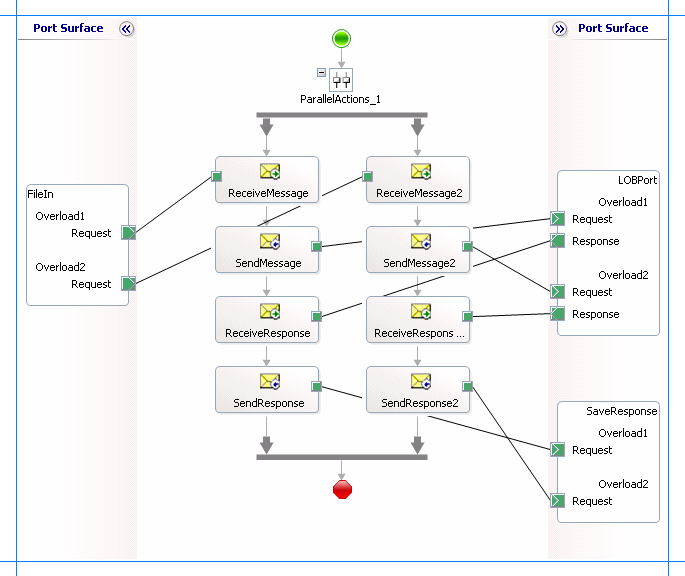

# Invoke Overloaded Functions and Procedures in Oracle Database using BizTalk Server
Stored procedures and functions can be overloaded in an Oracle database. The [!INCLUDE[adapteroracle_short](../../includes/adapteroracle-short-md.md)] supports overloaded functions and procedures by changing the target namespace of the operation. For example, the message structure for two overloaded procedures looks like:  
  
```  
Stored Procedure Overload 1:  
<[SP_NAME] xmlns="http://Microsoft.LobServices.OracleDB/2007/03/[SCHEMA]/Package/[PACKAGE_NAME]/[SP_NAME]/overload1">    
  <[PRM1_NAME]>value1</[PRM1_NAME]>  
  <[PRM2_NAME]>value1</[PRM2_NAME]>  
  …  
</[SP_NAME]>  
  
Stored Procedure Overload 2:  
<[SP_NAME] xmlns="http://Microsoft.LobServices.OracleDB/2007/03/[SCHEMA]/Package/[PACKAGE_NAME]/[SP_NAME]/overload2">    
  <[PRM1_NAME]>value1</I_[PRM1_NAME]>  
  <[PRM2_NAME]>value1</I_[PRM2_NAME]>  
  …  
</[SP_NAME]>  
```  
  
 The SOAP message structure and the SOAP action required to invoke an overloaded function or procedure is similar to invoking a function and procedure, as described under [Message Schemas for Functions and Procedures](../../adapters-and-accelerators/adapter-oracle-database/message-schemas-for-functions-and-procedures.md).  
  
 Invoking an overloaded procedure is similar to invoking any other function as described in [Invoking Functions and Procedures in Oracle Database Using BizTalk Server](../../adapters-and-accelerators/adapter-oracle-database/invoke-functions-and-procedures-in-oracle-database-using-biztalk-server.md). However to differentiate overloaded functions, the [!INCLUDE[adapteroracle_short](../../includes/adapteroracle-short-md.md)] appends a unique string to the node ID and the namespace that it surfaces for overloaded artifact. This string is "overload1" for the first overload, "overload2" for the next overload, and so on.  
  
## How to Invoke Overloaded Functions and Procedures?  
 Performing an operation on an Oracle database using [!INCLUDE[adapteroracle_short](../../includes/adapteroracle-short-md.md)] with [!INCLUDE[btsBizTalkServerNoVersion](../../includes/btsbiztalkservernoversion-md.md)] involves procedural tasks described in [Building blocks to develop BizTalk Applications with Oracle Database](../../adapters-and-accelerators/adapter-oracle-database/building-blocks-to-develop-biztalk-applications-with-oracle-database.md). To invoke a function in an Oracle database, these tasks are:  
  
1. Create a BizTalk project and generate schema for the overloaded function you want to invoke in an Oracle database.  
  
2. Create messages in the BizTalk project for sending and receiving messages from the Oracle database. You must create messages for each overload.  
  
3. Create an orchestration to invoke the overloaded function in the Oracle database.  
  
4. Build and deploy the BizTalk project.  
  
5. Configure the BizTalk application by creating physical send and receive ports.  
  
6. Start the BizTalk application.  
  
   This topic provides instructions to perform these tasks.  
  
## Sample Based On This Topic  
 A sample, InvokeOverloadedProc, based on this topic is also provided with the [!INCLUDE[adapterpacknoversion](../../includes/adapterpacknoversion-md.md)]. For more information, see [Adapter Samples](../../adapters-and-accelerators/accelerator-rosettanet/adapter-samples.md).  
  
## Generating Schema  
 In this topic, to demonstrate how to invoke an overloaded function or procedure, we will invoke the GET_ACCOUNT procedure under the SCOTT\Package\ACCOUNT_PKG schema. This package is created under the SCOTT schema by running the SQL scripts provided with the samples. This is an overloaded procedure where:  
  
- One overload takes the account ID as the IN parameter and returns an ACCOUNT%ROWTYPE as OUT parameter.  
  
- Second overload takes the account name as the IN parameter and returns an ACCOUNT%ROWTYPE as OUT parameter.  
  
  To know more about the samples and the SQL scripts, see [Schema Samples](../../adapters-and-accelerators/accelerator-rosettanet/schema-samples.md).  
  
  To invoke an overloaded function, we generate schema for both the overloaded procedures, GET_ACCOUNT.1 and GET_ACCOUNT.2. See [Retrieve metadata for Oracle Database operations in Visual Studio](../../adapters-and-accelerators/adapter-oracle-database/get-metadata-for-oracle-database-operations-in-visual-studio.md) for more information about how to generate schema.  
  
## Defining Messages and Message Types  
 The schema that you generated earlier describes the "types" required for the messages in the orchestration. A message is typically a variable, the type for which is defined by the corresponding schema. You must link the schema you generated in the first step to the messages from the Orchestration View window of the BizTalk project.  
  
 For this topic, you must create two request-response message sets—one request-response set for the first overloaded procedure and the second request-response set for the second overloaded procedure.  
  
 Perform the following steps to create messages and link them to the schema.  
  
#### To create messages and link to schema  
  
1.  Open the Orchestration View window of the BizTalk project, if it is not already open. To do so, click **View**, point to **Other Windows**, and then click **Orchestration View**.  
  
2.  In Orchestration View, right-click **Messages**, and then click **New Message**.  
  
3.  Right-click the newly created message, and then select **Properties Window**.  
  
4.  In the **Properties** pane for **Message_1**, do the following:  
  
    |Use this|To do this|  
    |--------------|----------------|  
    |Identifier|Type **Request**.|  
    |Message Type|From the drop-down list, expand **Schemas**, and select *InvokeOverloadedProc.OracleDBBindingSchema.GET_ACCOUNT*, where *InvokeOverloadedProc* is the name of your BizTalk project. *OracleDBBindingSchema* is the schema generated for the GET_ACCOUNT procedure.|  
  
5.  Repeat the previous step to create three more messages. In the **Properties** pane for the new messages, do the following:  
  
    |Set Identifier to|Set Message Type to|  
    |-----------------------|-------------------------|  
    |Response|*InvokeOverloadedProc.OracleDBBindingSchema.GET_ACCOUNTResponse*|  
    |Request2|*InvokeOverloadedProc.OracleDBBindingSchema1.GET_ACCOUNT*|  
    |Response2|*InvokeOverloadedProc.OracleDBBindingSchema1.GET_ACCOUNTResponse*|  
  
## Setting up the Orchestration  
 You must create a BizTalk orchestration to use [!INCLUDE[btsBizTalkServerNoVersion](../../includes/btsbiztalkservernoversion-md.md)] for invoking an overloaded procedure in an Oracle database. In this orchestration, you drop two request messages, one corresponding to each overloaded procedure, at the defined receive location. The [!INCLUDE[adapteroracle_short](../../includes/adapteroracle-short-md.md)] consumes the messages and passes them on to the Oracle database via ODP. The response from the Oracle database is saved to another location.  
  
 Because the orchestration picks two requests simultaneously, you need to include a Parallel Actions shape in the orchestration. For each parallel action, you must include Send and Receive shapes to send messages to the Oracle database and receive responses. However, you could use the same ports for sending and receiving messages for both operations. A typical orchestration for invoking the overloaded procedures simultaneously would contain:  
  
- Send and Receive shapes to send messages to Oracle database and receive responses.  
  
- A one-way receive port to receive request messages to send to the Oracle database.  
  
- A two-way send port to send request messages to Oracle database and receive responses.  
  
- A one-way send port to send the responses from Oracle database to a folder.  
  
  A sample orchestration to invoke the first and second overloads for GET_ACCOUNT procedure resembles the following:  
  
    
  
### Adding Message Shapes  
 Make sure you specify the following properties for each of the message shapes. The names listed in the Shape column are the names of the message shapes as displayed in the just-mentioned orchestration. The following table lists the shapes you must include for one of the parallel actions.  
  
|Shape|Shape Type|Properties|  
|-----------|----------------|----------------|  
|ReceiveMessage|Receive|-   Set **Name** to *ReceiveMessage*<br />-   Set **Activate** to *True*|  
|SendMessage|Send|-   Set **Name** to *SendMessage*|  
|ReceiveResponse|Receive|-   Set **Name** to *ReceiveResponse*<br />-   Set **Activate** to *False*|  
|SendResponse|Send|-   Set **Name** to *SendResponse*|  
  
 The following table lists the shapes that you must include for the other parallel action.  
  
|Shape|Shape Type|Properties|  
|-----------|----------------|----------------|  
|ReceiveMessage2|Receive|-   Set **Name** to *ReceiveMessage2*<br />-   Set **Activate** to *True*|  
|SendMessage2|Send|-   Set **Name** to *SendMessage2*|  
|ReceiveResponse2|Receive|-   Set **Name** to *ReceiveResponse2*<br />-   Set **Activate** to *False*|  
|SendResponse2|Send|-   Set **Name** to *SendResponse2*|  
  
### Adding Ports  
 Make sure that you specify the following properties for each of the logical ports. The names listed in the Port column are the names of the ports as displayed in the orchestration.  
  
|Port|Properties|  
|----------|----------------|  
|FileIn|-   Set **Identifier** to *FileIn*<br />-   Set **Type** to *FileInType*<br />-   Set **Communication Pattern** to *One-Way*<br />-   Set **Communication Direction** to *Receive*|  
|LOBPort|-   Set **Identifier** to *LOBPort*<br />-   Set **Type** to *LOBPortType*<br />-   Set **Communication Pattern** to *Request-Response*<br />-   Set **Communication Direction** to *Send-Receive*|  
|SaveResponse|-   Set **Identifier** to *SaveResponse*<br />-   Set **Type** to *SaveResponseType*<br />-   Set **Communication Pattern** to *One-Way*<br />-   Set **Communication Direction** to *Send*|  
  
 Because you will be processing two request and response messages using these ports, you must create two operations for each port, where each operation corresponds to one message type. To create an operation, right-click the port shape, and then select **New Operation**. Name the first operation for each port as **Overload1** and the second operation for each port as **Overload2**.  
  
### Using Correlation  
 Correlation is the process of matching an incoming message with the appropriate instance of an orchestration. In the orchestration you will be dropping two request messages, one for each overload. Using correlation, you associate a request message with the right orchestration. For more information about correlation, see [Using Correlations in Orchestrations](../../core/using-correlations-in-orchestrations.md).  
  
##### To use correlations  
  
1.  Promote a property from the schema generated for each overloaded function. For example, promote the AID property from the schema for the first overload; promote the ANAME property from the schema of the second overload. To promote a property, right-click the property in the schema view, point to **Promote**, and then select **Quick Promotion**. This adds a PropertySchema.xsd file to your BizTalk project.  
  
     For information about promoting a property, see [Promoting Properties](../../core/promoting-properties.md).  
  
2.  From Orchestration View, right-click **Correlation Types**, and then select **New Correlation Type**.  
  
3.  The **Correlation Properties** dialog box lists the properties that you promoted in step 1. Select a property, and then click **Add**.  
  
4.  Click **OK**.  
  
5.  To create correlation types for the other promoted property, repeat these steps.  
  
6.  Rename the correlation types based on the property to which they are associated. You could rename the correlation types to *CorrelationType_AID* (for the AID property) and *CorrelationType_ANAME* (for the ANAME property).  
  
7.  From Orchestration View, right-click **Correlation Sets**, and then select **New Correlation Set**.  
  
8.  Right-click the newly added correlation set, and then click **Properties**. In the Properties pane, do the following:  
  
    |Use this|To do this|  
    |--------------|----------------|  
    |Correlation Type|*InvokeOverloadedProc.CorrelationType_AID*|  
    |Identifier|*Correlation_AID*|  
  
9. Add another correlation set, and specify the following properties from the Properties pane.  
  
    |Use this|To do this|  
    |--------------|----------------|  
    |Correlation Type|*InvokeOverloadedProc.CorrelationType_ANAME*|  
    |Identifier|*Correlation_ANAME*|  
  
## Specify Messages for Action Shapes, and Connect Them to Ports  
 The following table specifies the properties and their values that you should set to specify messages for action shapes and to link the messages to the ports. The names listed in the Shape column are the names of the message shapes as displayed in the orchestration mentioned earlier.  
  
|Shape|Properties|  
|-----------|----------------|  
|ReceiveMessage|-   Set **Initializing Correlation Sets** to *Correlation_AID*<br />-   Set **Message** to *Request*<br />-   Set **Operation** to *FileIn.Overload1.Request*|  
|SendMessage|-   Set **Message** to *Request*<br />-   Set **Operation** to *LOBPort.Overload1.Request*|  
|ReceiveResponse|-   Set **Message** to *Response*<br />-   Set **Operation** to *LOBPort.Overload1.Response*|  
|SendResponse|-   Set **Message** to *Response*<br />-   Set **Operation** to *SaveResponse.Overload1.Request*|  
|ReceiveMessage2|-   Set **Initializing Correlation Sets** to *Correlation_ANAME*<br />-   Set **Message** to *Request2*<br />-   Set **Operation** to *FileIn.Overload2.Request*|  
|SendMessage2|-   Set **Message** to *Request2*<br />-   Set **Operation** to *LOBPort.Overload2.Request*|  
|ReceiveResponse2|-   Set **Message** to *Response2*<br />-   Set **Operation** to *LOBPort.Overload2.Response*|  
|SendResponse2|-   Set **Message** to *Response2*<br />-   Set **Operation** to *SaveResponse.Overload2.Request*|  
  
 After you have specified these properties, the message shapes and ports are connected and your orchestration is complete.  
  
 You must now build the BizTalk solution and deploy it to a [!INCLUDE[btsBizTalkServerNoVersion](../../includes/btsbiztalkservernoversion-md.md)]. For more information, see [Building and Running Orchestrations](../../core/building-and-running-orchestrations.md).  
  
## Configuring the BizTalk Application  
 After you have deployed the BizTalk project, the orchestration you created earlier is listed under the **Orchestrations** pane in the BizTalk Server Administration console. You must use the BizTalk Server Administration console to configure the application. For a walkthrough, see [Walkthrough: Deploying a Basic BizTalk Application](Walkthrough:%20Deploying%20a%20Basic%20BizTalk%20Application.md).
  
 Configuring an application involves:  
  
- Selecting a host for the application.  
  
- Mapping the ports that you created in your orchestration to physical ports in the BizTalk Server Administration console. For this orchestration you must:  
  
  - Define a location on the hard disk and a corresponding file port where you will drop the request messages, one for each overloaded procedure. The BizTalk orchestration will consume the request messages and send it to the Oracle database.  
  
  - Define a location on the hard disk and a corresponding file port where the BizTalk orchestration will drop the response messages, one for each overloaded procedure, containing the response from the Oracle database.  
  
  - Define a physical WCF-Custom or WCF-OracleDB send port to send messages to the Oracle database. You must also specify the action in the send port. For information about how to create WCF-Custom or WCF-OracleDB ports, see [Manually configure a physical port binding to the Oracle Database Adapter](../../adapters-and-accelerators/adapter-oracle-database/manually-configure-a-physical-port-binding-to-the-oracle-database-adapter.md). Because the WCF-Custom or WCF-OracleDB send port sends and receive messages conforming to more than one schema and performs two operations, you must set dynamic action for both the operations. For more information about actions, see [Configure the SOAP action for Oracle Database](../../adapters-and-accelerators/adapter-oracle-database/configure-the-soap-action-for-oracle-database.md). For this orchestration, the action should be set as follows:  
  
    ```  
    <BtsActionMapping>  
      <Operation Name="Overload1" Action="http://Microsoft.LobServices.OracleDB/2007/03/SCOTT/Package/ACCOUNT_PKG/GET_ACCOUNT/overload1" />  
      <Operation Name="Overload2" Action="http://Microsoft.LobServices.OracleDB/2007/03/SCOTT/Package/ACCOUNT_PKG/GET_ACCOUNT/overload2" />  
    </BtsActionMapping>  
    ```  
  
    > [!NOTE]
    >  Generating the schema using the [!INCLUDE[consumeadapterservlong](../../includes/consumeadapterservlong-md.md)] also creates a binding file containing information about the ports and the actions to be set for those ports. You can import this binding file from the BizTalk Server Administration console to create send ports (for outbound calls) or receive ports (for inbound calls). For more information, see [Configure a physical port binding using a port binding file to Oracle Database](../../adapters-and-accelerators/adapter-oracle-database/configure-a-physical-port-binding-using-a-port-binding-file-to-oracle-database.md).  
  
## Starting the Application  
 You must start the BizTalk application for invoking a function in an Oracle database table. For instructions on starting a BizTalk application, see [How to Start an Orchestration](../../core/how-to-start-an-orchestration.md).  
  
 At this stage, make sure:  
  
-   The FILE receive port to receive request messages for the orchestration is running.  
  
-   The FILE send port to receive the response messages from the orchestration is running.  
  
-   The WCF-Custom or WCF-OracleDB send port to send messages to the Oracle database is running.  
  
-   The BizTalk orchestration for the operation is running.  
  
## Executing the Operation  
 After you run the application, you must drop two request messages (one for each overloaded procedure) to the FILE receive location. The schema for the request messages must conform to the schema for the procedure you generated earlier. See [Message Schemas for Functions and Procedures](../../adapters-and-accelerators/adapter-oracle-database/message-schemas-for-functions-and-procedures.md) for more information about the request message schema for invoking functions using the [!INCLUDE[adapteroracle_short](../../includes/adapteroracle-short-md.md)].  
  
 For example, the request message to invoke the first overload of the GET_ACCOUNT procedure is:  
  
```  
<GET_ACCOUNT xmlns="http://Microsoft.LobServices.OracleDB/2007/03/SCOTT/Package/ACCOUNT_PKG/GET_ACCOUNT/overload1">  
  <AID>100001</AID>  
</GET_ACCOUNT>  
```  
  
 Similarly, the request message to invoke the second overload of the GET_ACCOUNT procedure is:  
  
```  
<GET_ACCOUNT xmlns="http://Microsoft.LobServices.OracleDB/2007/03/SCOTT/Package/ACCOUNT_PKG/GET_ACCOUNT/overload2">  
  <ANAME>Mindy Martin</ANAME>  
</GET_ACCOUNT>  
```  
  
 The first request message invokes the GET_ACCOUNT procedure to retrieve record with account ID equal to 100020. The second request message invokes the GET_ACCOUNT procedure to retrieve records having the account name as "John Smith".  
  
 The orchestration consumes the request messages and sends them to the Oracle database. The response from the Oracle database is saved at other FILE location defined as part of the orchestration. For example, the response for invoking the first overloaded procedure is:  
  
```  
<?xml version="1.0" encoding="utf-8"?>  
<GET_ACCOUNTResponse mlns="http://Microsoft.LobServices.OracleDB/2007/03/SCOTT/Package/ACCOUNT_PKG/GET_ACCOUNT/overload1">  
 <ACCT>  
  <ACCTID>100001</ACCTID>  
  <NAME>Ty Carlson</NAME>  
  <BALANCE>9000</BALANCE>  
 </ACCT>  
</GET_ACCOUNTResponse>  
```  
  
## Possible Exceptions  
 For information about the exceptions you might encounter while invoking overloaded packages using [!INCLUDE[btsBizTalkServerNoVersion](../../includes/btsbiztalkservernoversion-md.md)], see [Exceptions and error handling](../../adapters-and-accelerators/adapter-oracle-database/exceptions-and-error-handling-with-the-oracle-database-adapter.md).  
  
## Best Practices  
 After you have deployed and configured the BizTalk project, you can export configuration settings to an XML file called the bindings file. Once you generate a bindings file, you can import the configuration settings from the file so that you do not need to create the send ports, receive ports, etc. for the same orchestration. For more information about binding files, see [Reuse Oracle Database Adapter bindings](../../adapters-and-accelerators/adapter-oracle-database/reuse-oracle-database-adapter-bindings.md).  
  
## See Also  
[Building Blocks to Develop BizTalk applications with the Oracle Database](../../adapters-and-accelerators/adapter-oracle-database/building-blocks-to-develop-biztalk-applications-with-oracle-database.md)