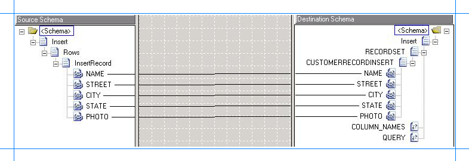
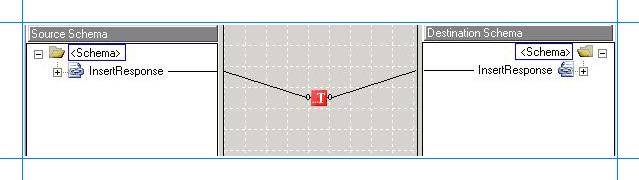

# Step 1: Modify the vPrev BizTalk Project in Oracle Database
  
  
 **Time to complete:** 10 minutes  
  
 **Objective:** In this step, you make the following changes to the existing vPrev BizTalk project:  
  
- Generate metadata for the Insert operation on the SCOTT.CUSTOMER table using the WCF-based [!INCLUDE[adapteroracle_short](../../includes/adapteroracle-short-md.md)].  
  
- Map the request message for performing an Insert operation using the vPrev Oracle database adapter to a request message for performing an Insert operation using the WCF-based [!INCLUDE[adapteroracle_short](../../includes/adapteroracle-short-md.md)].  
  
- Map the response message received using the WCF-based [!INCLUDE[adapteroracle_short](../../includes/adapteroracle-short-md.md)] to the response message for the vPrev Oracle database adapter.  
  
## Prerequisites  
  
-   You must have a vPrev BizTalk project to perform an Insert operation on the SCOTT.CUSTOMER table in the Oracle database.  
  
## Modify the vPrev BizTalk project  
  
1. Generate metadata for the Insert operation on the SCOTT.CUSTOMER table using the WCF-based [!INCLUDE[adapteroracle_short](../../includes/adapteroracle-short-md.md)]. You can use the [!INCLUDE[consumeadapterservlong](../../includes/consumeadapterservlong-md.md)] to generate metadata.  
  
    For instructions on how to generate metadata, see [Get metadata for Oracle Database operations in Visual Studio](../../adapters-and-accelerators/adapter-oracle-database/get-metadata-for-oracle-database-operations-in-visual-studio.md). After the schema is generated, a file with the name similar to *OracleDBBindingSchema.xsd* is added to the BizTalk project. This file contains the schema for sending a message to perform an Insert operation on the SCOTT.CUSTOMER table in the Oracle database using the WCF-based [!INCLUDE[adapteroracle_short](../../includes/adapteroracle-short-md.md)].  
  
2. Generating the metadata for the Insert operation also creates a port binding file. In the next step, this binding file will be used to create a WCF-Custom send port to send messages to the Oracle database. The SOAP action for the operation is also set to the operation for which you generated metadata. For example, if you generate metadata for the Insert operation, the operation name in the SOAP action on the send port will be “Insert”. However, the operation name on the logical send port that you create as part of the orchestration could be different, for example, “Operation_1”. As a result, when you send messages to the Oracle database using the send port, you get an error. To prevent this, make sure the operation name on the logical send port in your orchestration is the same as the operation name for which you generated metadata.  
  
    So, in case of this tutorial, because you generate metadata for the Insert operation, change the name of the logical send port operation to “Insert”.  
  
3. For the request message, map the schema generated using vPrev Oracle database adapter to the schema generated using the WCF-based [!INCLUDE[adapteroracle_short](../../includes/adapteroracle-short-md.md)].  
  
   1. Add a BizTalk mapper to the BizTalk project. Right-click the BizTalk project, point to **Add**, and click **New Item**.  
  
       In the **Add New Item** dialog box, from the left pane, select **Map Files**. From the right pane, select **Map**. Specify a name for the map, such as **RequestMap.btm**. Click **Add**.  
  
   2. From the Source Schema pane, click **Open Source Schema**.  
  
   3. In the **BizTalk Type Picker** dialog box, expand the project name, expand **Schemas**, and select the schema for the request message for the vPrev Oracle database adapter. For this tutorial, select *Oracle_Migration.CUSTOMERService_CUSTOMER_x5d*. Click **OK**.  
  
   4. In the **Root Node for Source Schema** dialog box, select *Insert* and click **OK**.  
  
   5. From the Destination Schema pane, click **Open Destination Schema**.  
  
   6. In the **BizTalk Type Picker** dialog box, expand the project name, expand **Schemas**, and select the schema for the request message for the WCF-based [!INCLUDE[adapteroracle_short](../../includes/adapteroracle-short-md.md)]. For this tutorial, select *Oracle_Migration.OracleDBBindingSchema*. Click **OK**.  
  
   7. In the **Root Node for Target Schema** dialog box, select *Insert* and click **OK**.  
  
   8. Map the respective elements in both the schemas as illustrated in the following figure.  
  
         
  
   9. Save the map.  
  
4. For the response message, map the schema generated using vPrev Oracle database adapter to the schema generated using the WCF-based [!INCLUDE[adapteroracle_short](../../includes/adapteroracle-short-md.md)].  
  
   1. Add a BizTalk mapper to the BizTalk project. Right-click the BizTalk project, point to **Add**, and click **New Item**.  
  
       In the **Add New Item** dialog box, from the left pane, select **Map Files**. From the right pane, select **Map**. Specify a name for the map, such as **ResponseMap.btm**. Click **Add**.  
  
   2. From the Source Schema pane, click **Open Source Schema**.  
  
   3. In the **BizTalk Type Picker** dialog box, expand the project name, expand **Schemas**, and select the schema for the response message for the WCF-based [!INCLUDE[adapteroracle_short](../../includes/adapteroracle-short-md.md)]. For this tutorial, select *Oracle_Migration.OracleDBBindingSchema*. Click **OK**.  
  
   4. In the **Root Node for Source Schema** dialog box, select *InsertResponse* and click **OK**.  
  
   5. From the Destination Schema pane, click **Open Destination Schema**.  
  
   6. In the **BizTalk Type Picker** dialog box, expand the project name, expand **Schemas**, and select the schema for the response message for the vPrev Oracle database adapter. For this tutorial, select *Oracle_Migration.CUSTOMERService_CUSTOMER_x5d*. Click **OK**.  
  
   7. In the **Root Node for Target Schema** dialog box, select *InsertResponse*, and then click **OK**.  
  
   8. You will notice that the schema for the response message conforming to the WCF-based [!INCLUDE[adapteroracle_short](../../includes/adapteroracle-short-md.md)] contains an additional *InsertResult* element. You must remove this from the schema and map the *InsertResponse* element in both the schemas.  
  
       To do so, from the **Toolbox**, drag the **String Left Trim** functoid and drop it on the mapper grid. Connect the **InsertResponse** element in the source schema to the functoid. Similarly, connect the **InsertResponse** element in the destination schema to the functoid. The following figure illustrates how the two elements are mapped via the functoid.  
  
         
  
      > [!NOTE]
      >  For more information, see the **String Left Trim Functoid** [!INCLUDE[ui-guidance-developers-reference](../../includes/ui-guidance-developers-reference.md)].
  
   9. Save the map.  
  
5. Save and build the BizTalk solution. Right-click the solution, and then click **Build Solution**.  
  
6. Deploy the solution. Right-click the solution, and then click **Deploy Solution**.  
  
## Next Steps  
 Create a WCF-custom send port and configure it to use the maps you created in this step, as described in [Step 2: Configure the Orchestration in Biztalk Server Administration Console using the SQL adapter](../../adapters-and-accelerators/adapter-sql/step-2-configure-the-orchestration-to-use-the-sql-adapter-in-biztalk-server.md).  
  
## See Also  
 [Tutorial: Migrating BizTalk Projects](https://msdn.microsoft.com/library/dd788186(v=bts.80).aspx)