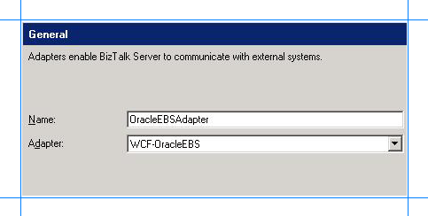

# Add the Oracle E-Business Suite adapter to BizTalk Server Administration console
The [!INCLUDE[adapteroraclebusinessshort](../../includes/adapteroraclebusinessshort-md.md)] can be used in BizTalk Server either as a WCF-Custom port or a WCF-OracleEBS port. If you want to use the [!INCLUDE[adapteroraclebusinessshort](../../includes/adapteroraclebusinessshort-md.md)] through a WCF-Custom port, you do not need to add the WCF-Custom port to the [!INCLUDE[btsBizTalkServerNoVersion](../../includes/btsbiztalkservernoversion-md.md)] Administration console because the WCF-Custom port is added to the [!INCLUDE[btsBizTalkServerNoVersion](../../includes/btsbiztalkservernoversion-md.md)] Administration console by default. However, if you want to use the [!INCLUDE[adapteroraclebusinessshort](../../includes/adapteroraclebusinessshort-md.md)] through a WCF-OracleEBS port, you must first add the WCF-OracleEBS adapter to the [!INCLUDE[btsBizTalkServerNoVersion](../../includes/btsbiztalkservernoversion-md.md)] Administration console.  
  
 This topic provides instructions on how to add the WCF-OracleEBS adapter to the [!INCLUDE[btsBizTalkServerNoVersion](../../includes/btsbiztalkservernoversion-md.md)] Administration console.  
  
> [!IMPORTANT]
>  If you want to configure a WCF-Custom port for the [!INCLUDE[adapteroraclebusinessshort](../../includes/adapteroraclebusinessshort-md.md)], you need not perform this procedure.  
  
### To add the Oracle E-Business Suite Adapter  
  
1. Start the [!INCLUDE[btsBizTalkServerNoVersion](../../includes/btsbiztalkservernoversion-md.md)] Administration console.  
  
2. In the console tree, expand the **BizTalk Group**, expand **Platform Settings**, and then click **Adapters**.  
  
3. Right-click **Adapters**, point to **New**, and click **Adapter**.  
  
      
  
4. In the **Adapter Properties** dialog box, specify a name for the adapter and from the **Adapter** list, select **WCF-OracleEBS**.  
  
      
  
5. Click **OK**.  
  
## See Also  
 [Building blocks to create Oracle E-Business Suite applications](../../adapters-and-accelerators/adapter-oracle-ebs/building-blocks-to-create-oracle-e-business-suite-applications.md)
