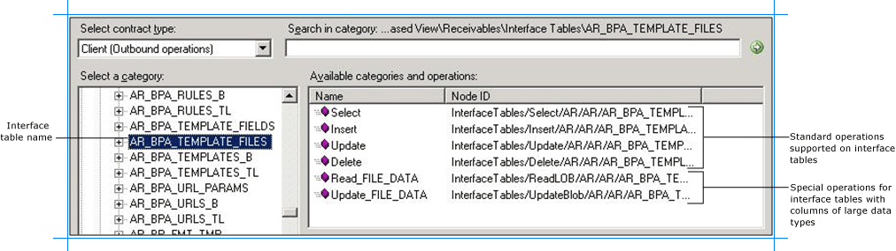
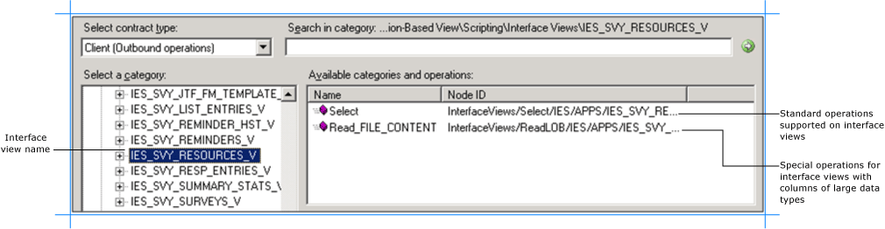
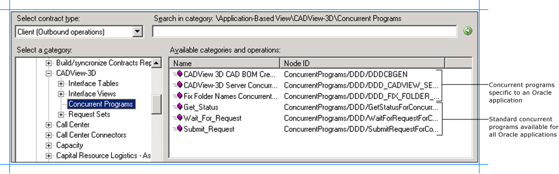
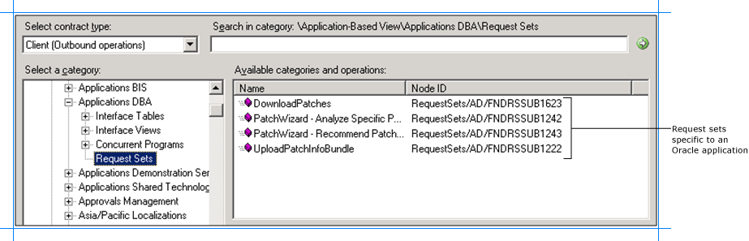
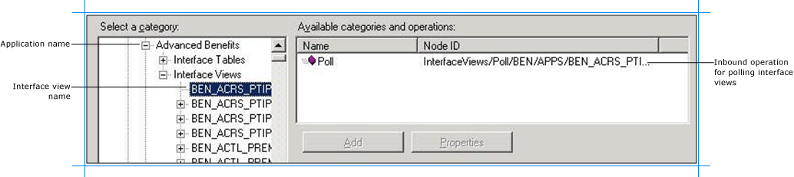

# Browse for Oracle E-Business Suite operations under the application-based view
You can use the [!INCLUDE[consumeadapterservshort](../../includes/consumeadapterservshort-md.md)] or the [!INCLUDE[addadapterservrefshort](../../includes/addadapterservrefshort-md.md)] to browse for outbound and inbound operations that can be performed on Oracle E-Business Suite using the [!INCLUDE[adapteroraclebusinessshort](../../includes/adapteroraclebusinessshort-md.md)]. This topic provides information on how to browse for outbound and inbound operations under the application-based view.  
  
> [!NOTE]
>  The [!INCLUDE[consumeadapterservshort](../../includes/consumeadapterservshort-md.md)] and the [!INCLUDE[addadapterservrefshort](../../includes/addadapterservrefshort-md.md)] present essentially the same interface when you browse and search for operations, so both components are covered in the same topics.  
  
## Prerequisites  
 You must connect to the Oracle E-Business Suite before you can browse metadata for target operations. For information about how to connect to the Oracle database when you use the [!INCLUDE[consumeadapterservshort](../../includes/consumeadapterservshort-md.md)] or the [!INCLUDE[addadapterservrefshort](../../includes/addadapterservrefshort-md.md)], see [Connect to the Oracle E-Business Suite in Visual Studio](../../adapters-and-accelerators/adapter-oracle-ebs/connect-to-the-oracle-e-business-suite-in-visual-studio.md).  
  
## Browsing for Outbound Operations  
 Perform the following steps to browse the outbound operations under the application-based view.  
  
#### To browse metadata for outbound operations under the Application-Based view  
  
1. Connect to Oracle E-Business Suite using the [!INCLUDE[consumeadapterservshort](../../includes/consumeadapterservshort-md.md)] or the [!INCLUDE[addadapterservrefshort](../../includes/addadapterservrefshort-md.md)]. See [Connect to the Oracle E-Business Suite in Visual Studio](../../adapters-and-accelerators/adapter-oracle-ebs/connect-to-the-oracle-e-business-suite-in-visual-studio.md) for instructions.  
  
2. From the **Select contract type** list, select **Client (Outbound operations)**.  
  
3. The **Select a category** box lists the different views under which the Oracle E-Business Suite artifacts are categorized.  
  
    The following figure shows the [!INCLUDE[consumeadapterservshort](../../includes/consumeadapterservshort-md.md)]. The root node (/) is selected, and the general category nodes available under the root node are listed in the **Available categories and operations** box.  
  
      
  
   > [!NOTE]
   >  The standard operations such as ExecuteReader, ExecuteScalar, and ExecuteNonQuery are available at the root level. For more information about these operations, see [Support for ExecuteNonQuery, ExecuteReader, and ExecuteScalar Operations](../../adapters-and-accelerators/adapter-oracle-ebs/support-for-executenonquery-executereader-and-executescalar-operations.md). For instructions on how to execute these operations using the [!INCLUDE[adapteroraclebusinessshort](../../includes/adapteroraclebusinessshort-md.md)], see [ExecuteReader, ExecuteScalar, or ExecuteNonQuery Operations in SQL using BizTalk Server](../../adapters-and-accelerators/adapter-sql/executereader-executescalar-or-executenonquery-in-sql-server-using-biztalk.md).  
  
4. Expand the **Application-Based View** node to see all the Oracle E-Business suite applications available on the server you connected to. Expand an application to see categories for interface tables, interface views, concurrent programs, and request sets available for that application.  
  
   > [!TIP]
   >  You can directly go to the “immediate” category node or subcategory nodes in the tree, by typing the name of the artifact in while the focus is on the tree view in the **Select a category** box. For example, to jump to the **Alert** node, keep the focus on the **Application-Based View** node, and then type `Alert`.  
  
5. Expand the **Interface Tables** node to see the interface tables for the Oracle application. Click an interface table to see the list of operations available for the table in the **Available categories and operations** box.  
  
      
  
   > [!NOTE]
   >  If an interface table contains columns of type BLOB, CLOB, NCLOB, or BFILE the adapter also exposes a specific operation to read data from such columns. The name of such operations are Read_\<LOBColName\>. For example, if the interface table has a column, FILE_DATA, of type BLOB, the adapter exposes a **Read_FILE_DATA** operation. If an interface table has more than one column of type BLOB, CLOB, NCLOB, and BFILE the adapter will expose as many number of Read_\<LOBColName\> operations.  
   >   
   >  Similarly, if an interface table contains columns of type BLOB, CLOB, or NCLOB the adapter also exposes a specific operation to update data into such columns. The name of such operations are Update_\<LOBColName\>. For example, if the interface table has a column, FILE_DATA, of type BLOB, the adapter exposes an **Update_FILE_DATA** operation. If an interface table has more than one column of type BLOB, CLOB, and NCLOB the adapter will expose as many number of Update_\<LOBColName\> operations. Note that the update operation is not supported on columns of type BFILE.  
  
6. Expand the **Interface Views** node to see the interface views for the Oracle application. Click an interface view to see the list of operations available for the view in the **Available categories and operations** box.  
  
      
  
   > [!NOTE]
   >  If an interface view contains columns of type BLOB, CLOB, NCLOB, or BFILE the adapter also exposes a specific operation to read data from such columns. The name of such operations are Read_\<LOBColName\>. For example, if the interface view has a column, FILE_CONTENT, of type BLOB, the adapter exposes a **Read_FILE_CONTENT** operation. If an interface view has more than one column of type BLOB, CLOB, NCLOB, or BFILE the adapter will expose as many number of Read_\<LOBColName\> operations. Note that Update_\<LOBColName\> operations are not supported on views.  
  
7. Click the **Concurrent Programs** node to see the concurrent programs for an application in the **Available categories and operations** box.  
  
      
  
    This figure shows the concurrent programs specific to an Oracle application and the standard concurrent programs for all Oracle applications.  
  
   > [!IMPORTANT]
   >  The [!INCLUDE[consumeadapterservshort](../../includes/consumeadapterservshort-md.md)] (or the [!INCLUDE[addadapterservrefshort](../../includes/addadapterservrefshort-md.md)]) displays friendly names of concurrent programs. However, the metadata for the concurrent program has the actual name of the concurrent program. For example, the Receivables application contains a “Customer Interface” concurrent program. However, the metadata has the concurrent program name as RACUST, which is the actual name of the concurrent program.  
  
8. Click the **Request Sets** node to see the request sets for an application in the **Available categories and operations** box.  
  
      
  
   > [!IMPORTANT]
   >  The [!INCLUDE[consumeadapterservshort](../../includes/consumeadapterservshort-md.md)] (or the [!INCLUDE[addadapterservrefshort](../../includes/addadapterservrefshort-md.md)]) displays friendly names of request sets. However, the metadata for the request set has the actual name of the request set. For example, the Applications DBA application contains a “DownloadPatches” request set. However, the metadata has the request set name as FNDRSSUB1623, which is the actual name of the request set.  
  
## Browsing for Inbound Operations  
 Perform the following steps to browse the inbound operations under the application-based view.  
  
#### To browse metadata for inbound operations under the Application-based view  
  
1. Connect to Oracle E-Business Suite using the [!INCLUDE[consumeadapterservshort](../../includes/consumeadapterservshort-md.md)] or the [!INCLUDE[addadapterservrefshort](../../includes/addadapterservrefshort-md.md)]. See [Connect to the Oracle E-Business Suite in Visual Studio](../../adapters-and-accelerators/adapter-oracle-ebs/connect-to-the-oracle-e-business-suite-in-visual-studio.md) for instructions.  
  
2. From the **Select contract type** list, for inbound operations select **Service (Inbound operations)**.  
  
3. The **Select a category** box lists the different views under which the Oracle E-Business Suite artifacts are categorized.  
  
    The following figure shows the [!INCLUDE[consumeadapterservshort](../../includes/consumeadapterservshort-md.md)]. The root node (/) is selected, and the general category nodes available under the root node are listed in the **Available categories and operations** box.  
  
      
  
    The inbound operation, **Notification**, is also available at the root level.  
  
4. Expand the **Application-Based View** node to see all the Oracle E-Business suite applications available on the server you connected to. Expand an application to see categories for interface tables and interface views.  
  
   > [!TIP]
   >  You can directly go to the “immediate” category node or subcategory nodes in the tree, by typing the name of the artifact in while the focus is on the tree view in the **Select a category** box. For example, to jump to the **Alert** node, keep the focus on the **Application-Based View** node, and then type `Alert`.  
  
5. Expand an Oracle application to see categories for interface tables and interface views available for that application. Expand the **Interface Tables** and **Interface Views** nodes to see the interface tables and interface views for the Oracle application. Click an interface table or interface view to see the inbound operation available for the table or view in the **Available categories and operations** box.  
  
    In the following figure, an interface view is selected in the **Select a category** box and the inbound operation supported on the view is listed in the **Available categories and operations** box.  
  
      
  
   > [!NOTE]
   >  The [!INCLUDE[adapteroraclebusinessshort](../../includes/adapteroraclebusinessshort-md.md)] does not surface concurrent programs and request sets for inbound operations.  
  
## See Also  
 [Browse, search, and get metadata for Oracle E-Business Suite operations](../../adapters-and-accelerators/adapter-oracle-ebs/browse-search-and-get-metadata-for-oracle-e-business-suite-operations.md)