# Browse for Oracle E-Business Suite operations under the schema-based view
You can use the [!INCLUDE[consumeadapterservshort](../../includes/consumeadapterservshort-md.md)] or the [!INCLUDE[addadapterservrefshort](../../includes/addadapterservrefshort-md.md)] to browse for outbound and inbound operations that can be performed on Oracle E-Business Suite using the [!INCLUDE[adapteroraclebusinessshort](../../includes/adapteroraclebusinessshort-md.md)]. This topic provides information on how to browse for outbound and inbound operations under the schema-based view.  
  
> [!NOTE]
>  The [!INCLUDE[consumeadapterservshort](../../includes/consumeadapterservshort-md.md)] and the [!INCLUDE[addadapterservrefshort](../../includes/addadapterservrefshort-md.md)] present essentially the same interface when you browse and search for operations, so both components are covered in the same topics.  
  
## Prerequisites  
 You must connect to the Oracle E-Business Suite before you can browse metadata for target operations. For information about how to connect to the Oracle database when you use the [!INCLUDE[consumeadapterservshort](../../includes/consumeadapterservshort-md.md)] or the [!INCLUDE[addadapterservrefshort](../../includes/addadapterservrefshort-md.md)], see [Connect to the Oracle E-Business Suite in Visual Studio](../../adapters-and-accelerators/adapter-oracle-ebs/connect-to-the-oracle-e-business-suite-in-visual-studio.md).  
  
## Browsing for Outbound Operations  
 Perform the following steps to browse the outbound operations under the schema-based view.  
  
#### To browse metadata for outbound operations under the Schema-Based view  
  
1. Connect to Oracle E-Business Suite using the [!INCLUDE[consumeadapterservshort](../../includes/consumeadapterservshort-md.md)] or the [!INCLUDE[addadapterservrefshort](../../includes/addadapterservrefshort-md.md)]. See [Connect to the Oracle E-Business Suite in Visual Studio](../../adapters-and-accelerators/adapter-oracle-ebs/connect-to-the-oracle-e-business-suite-in-visual-studio.md) for instructions.  
  
2. From the **Select contract type** list, for outbound operations select **Client (Outbound operations)**.  
  
3. The **Select a category** box lists the different views under which the Oracle E-Business Suite artifacts are categorized.  
  
    The following figure shows the [!INCLUDE[consumeadapterservshort](../../includes/consumeadapterservshort-md.md)]. The root node (/) is selected, and the general category nodes available under the root node are listed in the **Available categories and operations** box.  
  
    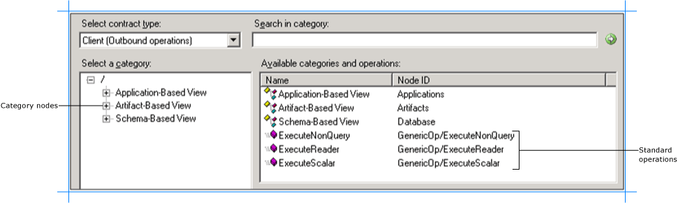  
  
   > [!NOTE]
   >  The standard operations such as ExecuteReader, ExecuteScalar, and ExecuteNonQuery are available at the root level. For more information about these operations, see [Support for ExecuteNonQuery, ExecuteReader, and ExecuteScalar Operations](../../adapters-and-accelerators/adapter-oracle-ebs/support-for-executenonquery-executereader-and-executescalar-operations.md). For instructions on how to execute these operations using the [!INCLUDE[adapteroraclebusinessshort](../../includes/adapteroraclebusinessshort-md.md)], see [ExecuteReader, ExecuteScalar, or ExecuteNonQuery Operations in SQL using BizTalk Server](../../adapters-and-accelerators/adapter-sql/executereader-executescalar-or-executenonquery-in-sql-server-using-biztalk.md).  
  
4. Expand the **Schema-Based View** node to see the schemas defined in the underlying database. Each schema is further categorized on the basis of PL-SQL APIs, procedures, functions, tables, and views it contains.  
  
   > [!TIP]
   >  You can directly go to the “immediate” category node or subcategory nodes in the tree, by typing the name of the artifact while the focus is on the tree view in the **Select a category** box. For example, to jump to the **SCOTT** schema, keep the focus on the **Schema-Based View** node, and then type `SCOTT`.  
  
5. Expand the **PL-SQL APIs** node to see the list of packages defined in the Oracle database for a particular schema. Click a package name to see the functions and procedures defined within that package in the **Available categories and operations** box.  
  
    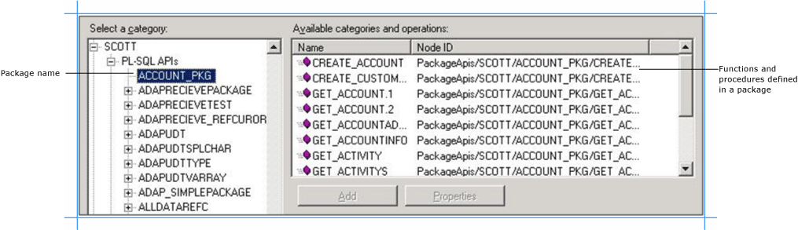  
  
6. Click the **Procedures** node to see the list of procedures in the **Available categories and operations** box.  
  
    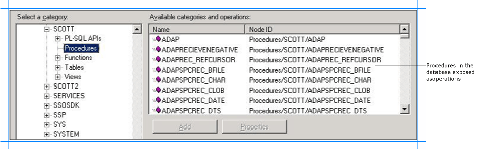  
  
7. Click the **Functions** node to see the list of functions in the **Available categories and operations** box.  
  
    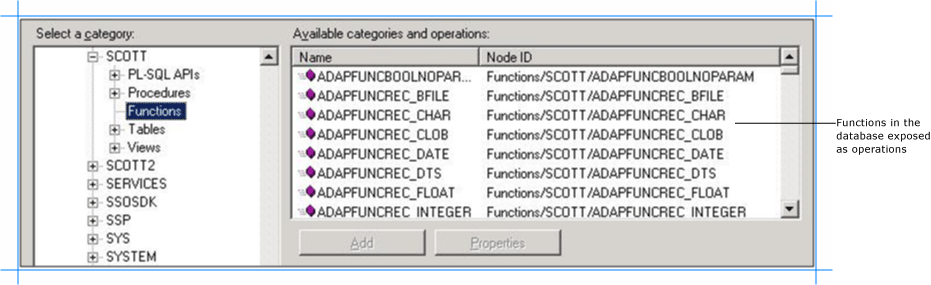  
  
8. Expand the **Tables** node to see the list of tables for a particular schema. Click a table name to see the operations supported on the table in the **Available categories and operations** box.  
  
    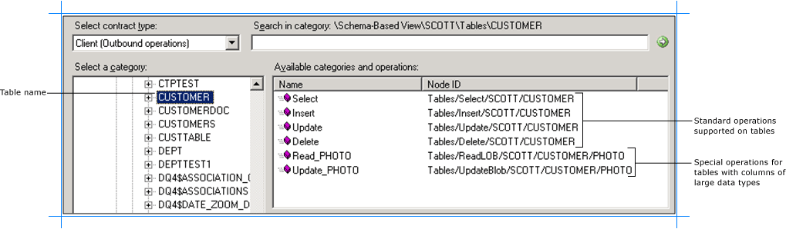  
  
   > [!NOTE]
   >  If a table contains columns of type BLOB, CLOB, NCLOB, or BFILE the adapter also exposes a specific operation to read data from such columns. The name of such operations are Read_\<LOBColName\>. For example, if the table has a column, PHOTO, of type BLOB, the adapter exposes a **Read_PHOTO** operation. If a table has more than one column of type BLOB, CLOB, NCLOB, and BFILE the adapter will expose as many number of Read_\<LOBColName\> operations.  
   >   
   >  Similarly, if a table contains columns of type BLOB, CLOB, or NCLOB the adapter also exposes a specific operation to update data into such columns. The name of such operations are Update_\<LOBColName\>. For example, if the table has a column, PHOTO, of type BLOB, the adapter exposes an **Update_PHOTO** operation. If a table has more than one column of type BLOB, CLOB, and NCLOB the adapter will expose as many number of Update_\<LOBColName\> operations. Note that the update operation is not supported on columns of type BFILE.  
  
9. Expand the **Views** node to see the list of views for a particular schema. Click a view name to see the operations supported on the view in the **Available categories and operations** box.  
  
     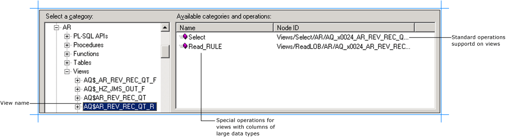  
  
    > [!NOTE]
    >  If a view contains columns of type BLOB, CLOB, NCLOB, or BFILE the adapter also exposes a specific operation to read data from such columns. The name of such operations are Read_\<LOBColName\>. For example, if the view has a column, RULE, of type BLOB, the adapter exposes a **Read_RULE** operation. If a view has more than one column of type BLOB, CLOB, NCLOB, or BFILE the adapter will expose as many number of Read_\<LOBColName\> operations. Note that Update_\<LOBColName\> operations are not supported on views.  
  
## Browsing for Inbound Operations  
 Perform the following steps to browse the inbound operations under the schema-based view.  
  
#### To browse metadata for inbound operations under the Schema-based view  
  
1. Connect to Oracle E-Business Suite using the [!INCLUDE[consumeadapterservshort](../../includes/consumeadapterservshort-md.md)] or the [!INCLUDE[addadapterservrefshort](../../includes/addadapterservrefshort-md.md)]. See [Connect to the Oracle E-Business Suite in Visual Studio](../../adapters-and-accelerators/adapter-oracle-ebs/connect-to-the-oracle-e-business-suite-in-visual-studio.md) for instructions.  
  
2. From the **Select contract type** list, for inbound operations select **Service (Inbound operations)**.  
  
3. The **Select a category** box lists the different views under which the Oracle E-Business Suite artifacts are categorized.  
  
    The following figure shows the [!INCLUDE[consumeadapterservshort](../../includes/consumeadapterservshort-md.md)]. The root node (/) is selected, and the general category nodes available under the root node are listed in the **Available categories and operations** box.  
  
    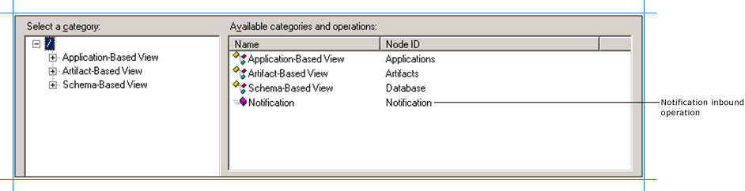  
  
    The inbound operation, **Notification**, is also available at the root level.  
  
4. Expand the **Schema-Based View** node to see the schemas defined in the underlying database. Each schema is further categorized on the basis of PL-SQL APIs, procedures, functions, tables, and views it contains.  
  
   > [!TIP]
   >  You can directly go to the “immediate” category node or subcategory nodes in the tree, by typing the name of the artifact while the focus is on the tree view in the **Select a category** box. For example, to jump to the **SCOTT** schema, keep the focus on the **Schema-Based View** node, and then type `SCOTT`.  
  
5. Expand the **PL-SQL APIs** node to see the list of packages defined in the Oracle database for a particular schema. Click a package name to see the functions and procedures defined within that package in the **Available categories and operations** box. Each of the listed functions and procedures can be used to poll the Oracle database.  
  
    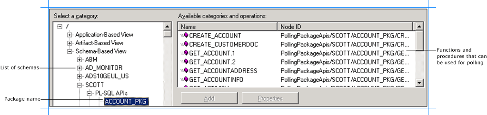  
  
6. Click the **Procedures** node to see the list of procedures in **the Available categories and operations** box. Each of the listed procedures can be used to poll the Oracle database.  
  
    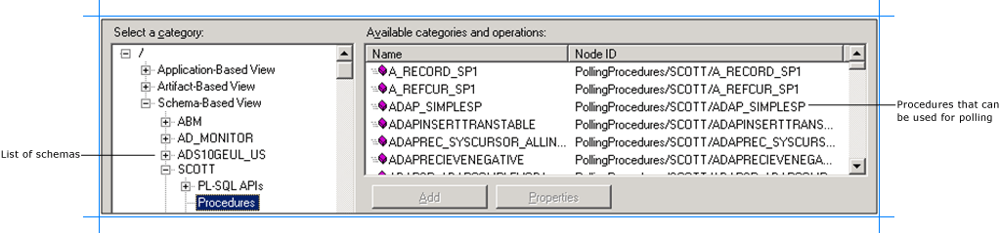  
  
7. Click the **Functions** node to see the list of functions in the **Available categories and operations** box. Each of the listed functions can be used to poll the Oracle database.  
  
    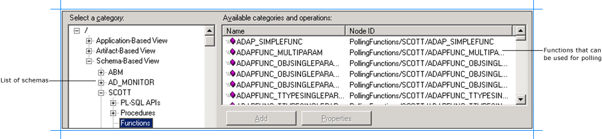  
  
8. Expand the **Tables** node to see the list of tables for a particular schema. Click a table name to see the **Poll** inbound operation supported on the table in the **Available categories and operations** box.  
  
    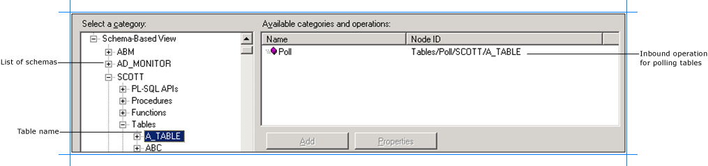  
  
9. Expand the **Views** node to see the list of views for a particular schema. Click a view name to see the **Poll** inbound operation supported on the view in the **Available categories and operations** box.  
  
     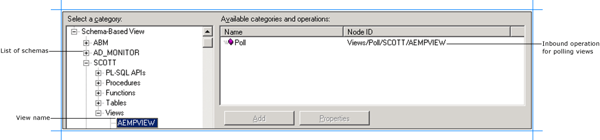  
  
## See Also  
 [Browse, search, and get metadata for Oracle E-Business Suite operations](../../adapters-and-accelerators/adapter-oracle-ebs/browse-search-and-get-metadata-for-oracle-e-business-suite-operations.md)