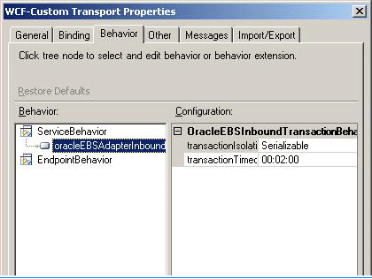

# Configure transaction isolation level and transaction timeout with Oracle E-Business Suite
While performing inbound operations (Polling and Notification) using the [!INCLUDE[adapteroracleebusinesslong](../../includes/adapteroracleebusinesslong-md.md)] with [!INCLUDE[btsBizTalkServerNoVersion](../../includes/btsbiztalkservernoversion-md.md)], you should appropriately configure the transaction isolation level and the transaction timeout values. To do this:  

1. Start the [!INCLUDE[btsBizTalkServerNoVersion](../../includes/btsbiztalkservernoversion-md.md)] Administration console.  

2. In the console tree, expand the **BizTalk Group**, and then expand **Applications**.  

3. Expand the BizTalk application that you have deployed after generating the metadata using the [!INCLUDE[adapteroraclebusinessshort](../../includes/adapteroraclebusinessshort-md.md)].  

4. Right-click **Receive Ports**, point to **New**, and then click **One-way Receive Port**.  

5. In the **Receive Port Properties** dialog box, on the **General** tab, type a name for the receive port.  

6. In the left pane of the **Receive Port Properties** dialog box, click **Receive Locations**, and then click **New** in the right pane to define a new receive location.  

7. In the **Receive Location Properties** dialog box, click **WCF-Custom** in the **Type** list.  

8. Click **Configure** adjacent to the **Type** list.  

9. In the **WCF-Custom Transport Properties** dialog box, click the **Behavior** tab.  

10. In the **Behavior** list, right-click **ServiceBehavior**, and click **Add extension**.  

11. In the **Select Behavior Extension** dialog box, select **oracleEBSAdapterInboundTransactionBehavior**, and click **OK**.  

12. In the left pane of the **WCF-Custom Transport Properties**, select the **oracleEBSAdapterInboundTransactionBehavior** service under **ServiceBehavior**.  

13. In the right pane of the **WCF-Custom Transport Properties**, specify appropriate values for the **transactionIsolationLevel** and **transactionTimeout** parameters. You can select any of the following transaction isolation levels: **Serializable**, **RepeatableRead**, **ReadCommitted**, **ReadUncommitted**, **Snapshot**, **Chaos**, and **Unspecified**. For information about these transaction isolation levels, see the **Members** section at [http://go.microsoft.com/fwlink/?LinkId=126983](http://go.microsoft.com/fwlink/?LinkId=126983).  

    > [!IMPORTANT]
    >  Oracle E-Business Suite supports only the following two transaction isolation levels: ReadCommitted and Serializable.  

       

14. Click **OK** in the **WCF-Custom Transport Properties** dialog box.  

15. Click **OK** in the open dialog boxes to save the changes.
