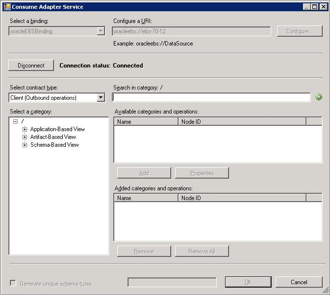

# Connect to Oracle E-Business Suite in Visual Studio using Add Adapter Service Reference Plug-in
To connect to Oracle E-Business Suite using the [!INCLUDE[adapteroraclebusinessshort](../../includes/adapteroraclebusinessshort-md.md)] in a .NET programming solution, you must use the [!INCLUDE[addadapterservreflong](../../includes/addadapterservreflong-md.md)]. This topic provides instructions on how to use the [!INCLUDE[addadapterservrefshort](../../includes/addadapterservrefshort-md.md)].  

## Connecting to Oracle E-Business Suite Using the Add Adapter Service Reference Plug-in  
 Perform the following steps to connect to Oracle E-Business Suite using the [!INCLUDE[addadapterservrefshort](../../includes/addadapterservrefshort-md.md)].  

#### To connect to Oracle E-Business Suite  

1. To connect using the [!INCLUDE[addadapterservrefshort](../../includes/addadapterservrefshort-md.md)] in a programming solution:  

   1. Create a project using Visual Studio.  

   2. Right-click the project in Solution Explorer, and then click **Add Adapter Service Reference**. The [!INCLUDE[addadapterservrefshort](../../includes/addadapterservrefshort-md.md)] opens.  

2. From the **Select a binding** drop-down list, select **oracleEBSBinding** and click **Configure**.  

3. In the **Configure Adapter** dialog box, click the **Security** tab, and from the **Client credential type** drop-down list box, select **Username** and specify the user name and password to connect to the Oracle E-Business Suite.  

   |                                                                                           |                                                                                                                                                                                                                                                                                                         |
   |-------------------------------------------------------------------------------------------|---------------------------------------------------------------------------------------------------------------------------------------------------------------------------------------------------------------------------------------------------------------------------------------------------------|
   |                                         Use this                                          |                                                                                                                                               To do this                                                                                                                                                |
   |                     **To connect using Oracle database credentials**                      |                                                                          Specify the **ClientCredentialType** binding property to **Database** and specify database credentials for **User name** and **Password** text boxes.                                                                          |
   |                 **To connect using Oracle E-Business Suite credentials**                  | Specify the **ClientCredentialType** binding property to **EBusiness** and specify Oracle E-Business Suite credentials for **User name** and **Password** text boxes. In this case, you must also specify Oracle database credentials for **OracleUserName** and **OraclePassword** binding properties. |
   | **To connect using Windows Authentication if ClientCredentialType is set to “Database”**  |                                                                                                         Specify a “/” for the **User name** text box and leave the **Password** text box blank.                                                                                                         |
   | **To connect using Windows Authentication if ClientCredentialType is set to “EBusiness”** |                                       Specify Oracle E-Business Suite credentials for **User name** and **Password** text boxes. You must also specify a “/” for the **OracleUserName** binding property and leave the **OraclePassword** binding property blank.                                       |

4. Click the **URI Properties** tab, and specify values for the connection parameters. For more information about the connection URI for the [!INCLUDE[adapteroraclebusinessshort](../../includes/adapteroraclebusinessshort-md.md)], see [Create the Oracle E-Business Suite connection URI](../../adapters-and-accelerators/adapter-oracle-ebs/create-the-oracle-e-business-suite-connection-uri.md).  

   > [!NOTE]
   >  If the connection parameters contain any reserved characters, you must specify them as-is in the **URI Properties** tab, that is, without using any escape characters. However, if you specify the URI directly in the **Configure a URI** field and the connection parameters contain reserved characters, you must specify the connection parameters using proper escape characters.  

5. Click the **Binding Properties** tab, and then specify values for the binding properties, if any, required by the operations you want to target. For more information about binding properties, see [Read about the BizTalk Adapter for Oracle E-Business Suite binding properties](../../adapters-and-accelerators/adapter-oracle-ebs/read-about-the-biztalk-adapter-for-oracle-e-business-suite-binding-properties.md).  

6. Click **OK**.  

7. Click **Connect**. After the connection is established, the connection status is shown as **Connected**.  

    The following figure shows the [!INCLUDE[consumeadapterservshort](../../includes/consumeadapterservshort-md.md)] immediately after the connection is established. The graphical user interface is the same for the [!INCLUDE[addadapterservrefshort](../../includes/addadapterservrefshort-md.md)].  

      

    The [!INCLUDE[addadapterservrefshort](../../includes/addadapterservrefshort-md.md)] displays different nodes containing various operations that can be performed on the Oracle E-Business Suite and the Oracle database. For more information on how the metadata is categorized under the various nodes, see [Connect to Oracle E-Business Suite in Visual Studio using Add Adapter Metadata Wizard](../../adapters-and-accelerators/adapter-oracle-ebs/connect-to-oracle-ebs-in-visual-studio-using-add-adapter-metadata-wizard.md).  

## See Also  
 [Connect to the Oracle E-Business Suite in Visual Studio](../../adapters-and-accelerators/adapter-oracle-ebs/connect-to-the-oracle-e-business-suite-in-visual-studio.md)   
 [Connect to Oracle E-Business Suite using Windows Authentication](../../adapters-and-accelerators/adapter-oracle-ebs/connect-to-oracle-e-business-suite-using-windows-authentication.md)