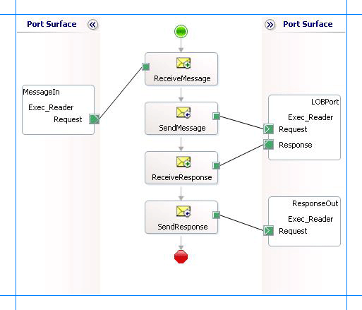

# ExecuteReader, ExecuteScalar, or ExecuteNonQuery operations in Oracle E-Business Suite
The [!INCLUDE[adapteroraclebusinessshort](../../includes/adapteroraclebusinessshort-md.md)] exposes generic operations such as **ExecuteNonQuery**, **ExecuteReader**, and **ExecuteScalar**. You can use these operations to execute any SQL statement on Oracle database. These operations differ based on the kind of response you get for the SQL statement. For more information about how the adapter supports these operations, see [Support for ExecuteNonQuery, ExecuteReader, and ExecuteScalar Operations](../../adapters-and-accelerators/adapter-oracle-ebs/support-for-executenonquery-executereader-and-executescalar-operations.md).  
  
 This topic demonstrates how to perform an **ExecuteReader** operation using the [!INCLUDE[adapteroraclebusinessshort](../../includes/adapteroraclebusinessshort-md.md)] with [!INCLUDE[btsBizTalkServerNoVersion](../../includes/btsbiztalkservernoversion-md.md)]. You can follow the same set of procedures described in this topic to perform **ExecuteNonQuery** and **ExecuteScalar** operations.  
  
## How to Invoke ExecuteReader operation on Oracle Database  
 Performing an operation on a Oracle database by using [!INCLUDE[adapteroraclebusinessshort](../../includes/adapteroraclebusinessshort-md.md)] with [!INCLUDE[btsBizTalkServerNoVersion](../../includes/btsbiztalkservernoversion-md.md)] involves procedural tasks described in [Building blocks to create Oracle E-Business Suite applications](../../adapters-and-accelerators/adapter-oracle-ebs/building-blocks-to-create-oracle-e-business-suite-applications.md). To invoke the **ExecuteReader** operation on Oracle database, these tasks are:  
  
1. Create a BizTalk project, and generate schema for the **ExecuteReader** operation.  
  
2. Create messages in the BizTalk project for sending and receiving messages from Oracle database.  
  
3. Create an orchestration to invoke the operation on Oracle database.  
  
4. Build and deploy the BizTalk project.  
  
5. Configure the BizTalk application by creating physical send and receive ports.  
  
6. Start the BizTalk application.  
  
   This topic provides instructions to perform these tasks.  
  
## Generating Schema  
 This topic demonstrates how to invoke the **ExecuteReader** operation on an Oracle database using the [!INCLUDE[adapteroraclebusinessshort](../../includes/adapteroraclebusinessshort-md.md)] with [!INCLUDE[btsBizTalkServerNoVersion](../../includes/btsbiztalkservernoversion-md.md)]. The **ExecuteReader** operation takes any SQL statement as a parameter and returns the result set for the operation as an array of DataSet. For this topic, we execute a SELECT statement on ACCOUNTACTIVITY table using the **ExecuteReader** operation. The ACCOUNTACTIVITY table is created by running the scripts provided with the samples. For more information about the script, see [Samples](../../adapters-and-accelerators/adapter-oracle-ebs/samples-for-the-oracle-ebs-adapter.md).  
  
 To demonstrate how to invoke **ExecuteReader** operation, schema is generated for the **ExecuteReader** operation. You must create a BizTalk project and use the [!INCLUDE[consumeadapterservshort](../../includes/consumeadapterservshort-md.md)] to generate the schema. For more information about how to generate schemas, see [Retrieving Metadata for Oracle E-Business Suite Operations in Visual Studio](../../adapters-and-accelerators/adapter-oracle-ebs/get-metadata-for-oracle-e-business-suite-operations-in-visual-studio.md).  
  
## Defining Messages and Message Types  
 The schema that you generated earlier describes the “types” required for the messages in the orchestration. A message is typically a variable, the type for which defined by the corresponding schema. You must now create messages for the orchestration and link them to schemas you generated in the previous step.  
  
#### To create messages and link to schema  
  
1.  Add an orchestration to the BizTalk project. From Solution Explorer, right-click the BizTalk project name, point to **Add**, and then click **New Item**. Type a name for the BizTalk orchestration, and then click **Add**.  
  
2.  Open the Orchestration View window of the BizTalk project, if it is not already open. To do so, click **View**, point to **Other Windows**, and then click **Orchestration View**.  
  
3.  In Orchestration View, right-click **Messages**, and then click **New Message**.  
  
4.  Right-click the newly created message, and then select **Properties Window**.  
  
5.  In the **Properties** pane for the **Message_1**, do the following:  
  
    |Use this|To do this|  
    |--------------|----------------|  
    |Identifier|Type `Request`|  
    |Message Type|From the drop-down list, expand **Schemas**, and then select *Execute_Reader.GenericOperation.ExecuteReader*, where Execute_Reader is the name of your BizTalk project. *GenericOperation* is the schema generated for the **ExecuteReader** operation.|  
  
6.  Repeat step 2 to create a new message. In the **Properties** pane for the new message, do the following:  
  
    |Use this|To do this|  
    |--------------|----------------|  
    |Identifier|Type `Response`|  
    |Message Type|From the drop-down list, expand **Schemas**, and then select *Execute_Reader.GenericOperation.ExecuteReaderResponse*.|  
  
## Setting up the Orchestration  
 You must create a BizTalk orchestration to use [!INCLUDE[btsBizTalkServerNoVersion](../../includes/btsbiztalkservernoversion-md.md)] for performing an operation on Oracle database. In this orchestration, you drop a request message at a defined receive location. The [!INCLUDE[adapteroraclebusinessshort](../../includes/adapteroraclebusinessshort-md.md)] consumes this message and passes it on to Oracle database. The response from Oracle database is saved to another location. A typical orchestration for invoking generic operations such as **ExecuteReader** would contain:  
  
- Send and Receive shapes to send and receive messages from an Oracle database.  
  
- A two-way receive port to send and receive messages from an Oracle database.  
  
- A one-way send port to send response from Oracle database to a folder.  
  
  A sample orchestration for invoking an **ExecuteReader** operation resembles the following:  
  
    
  
### Adding Message Shapes  
 You need to configure the following properties for each of the message shapes. The names listed in the Shape column correspond to the names of the message shapes as displayed in the just-mentioned orchestration.  
  
|Shape|Shape Type|Properties|  
|-----------|----------------|----------------|  
|ReceiveMessage|Receive|-   Set **Name** to *ReceiveMessage*<br />-   Set **Activate** to *True*|  
|SendMessage|Send|-   Set **Name** to *SendMessage*|  
|ReceiveResponse|Receive|-   Set **Name** to *ReceiveResponse*<br />-   Set **Activate** to *False*|  
|SendResponse|Send|-   Set **Name** to *SendResponse*|  
  
### Adding Ports  
 For each of the logical ports, configure  the properties in the table below. The names listed in the Port column correspond to the names of the ports as displayed in the orchestration.  
  
|Port|Properties|  
|----------|----------------|  
|MessageIn|-   Set **Identifier** to *MessageIn*<br />-   Set **Type** to *MessageInType*<br />-   Set **Communication Pattern** to *One-Way*<br />-   Set **Communication Direction** to *Receive*|  
|LOBPort|-   Set **Identifier** to *LOBPort*<br />-   Set **Type** to *LOBPortType*<br />-   Set **Communication Pattern** to *Request-Response*<br />-   Set **Communication Direction** to *Send-Receive*|  
|ResponseOut|-   Set **Identifier** to *ResponseOut*<br />-   Set **Type** to *ResponseOutType*<br />-   Set **Communication Pattern** to *One-Way*<br />-   Set **Communication Direction** to *Send*|  
  
### Specify Messages for Action Shapes and Connect Them to Ports  
 The following table specifies the property  values to specify messages for action shapes and to link the messages to the ports. The names listed in the **Shape** column correspond to the names of the message shapes as displayed in the orchestration diagram earlier.  
  
 After you have configure these properties, the message shapes and ports are connected, and your orchestration is complete.  
  
 Then, you must now build the BizTalk solution and deploy it to BizTalk Server. For more information, see [Building and Running Orchestrations](../../core/building-and-running-orchestrations.md).  
  
|Shape|Properties|  
|-----------|----------------|  
|ReceiveMessage|-   Set **Message** to *Request*<br />-   Set **Operation** to *MessageIn.Exec_Reader.Request*|  
|SendMessage|-   Set **Message** to *Request*<br />-   Set **Operation** to *LOBPort.Exec_Reader.Request*|  
|ReceiveResponse|-   Set **Message** to *Response*<br />-   Set **Operation** to *LOBPort.Exec_Reader.Response*|  
|SendResponse|-   Set **Message** to *Response*<br />-   Set **Operation** to *ResponseOut.Exec_Reader.Request*|  
  
 After you have specified these properties, the message shapes and ports are connected, and your orchestration is complete.  
  
 You must now build the BizTalk solution and deploy it to BizTalk Server. For more information, see [Building and Running Orchestrations](../../core/building-and-running-orchestrations.md).  
  
## Configuring the BizTalk Application  
 After you have deployed the BizTalk project, the orchestration you created earlier is listed under the **Orchestrations** pane in the [!INCLUDE[btsBizTalkServerNoVersion](../../includes/btsbiztalkservernoversion-md.md)] Administration console. You must use the [!INCLUDE[btsBizTalkServerNoVersion](../../includes/btsbiztalkservernoversion-md.md)] Administration console to configure the application. For a walkthrough, see [Walkthrough: Deploying a Basic BizTalk Application](Walkthrough:%20Deploying%20a%20Basic%20BizTalk%20Application.md).  
  
 Configuring an application involves:  
  
- Selecting a host for the application.  
  
- Mapping the ports that you created in your orchestration to physical ports in the [!INCLUDE[btsBizTalkServerNoVersion](../../includes/btsbiztalkservernoversion-md.md)] Administration console. For this orchestration you must:  
  
  - Define a location on the hard disk and a corresponding file port where you will drop a request message. The BizTalk orchestration will consume the request message and send it to the Oracle database.  
  
  - Define a location on the hard disk and a corresponding file port where the BizTalk orchestration will drop the response message containing the response from the Oracle database.  
  
  - Define a physical WCF-Custom or WCF-OracleEBS send port to send messages to the Oracle database. You must also specify the action in the send port. For information about how to create send ports, see [Manually Configuring a Physical Port Binding to the Oracle E-Business Adapter
    ](../../adapters-and-accelerators/adapter-oracle-ebs/manually-configure-a-physical-port-binding-to-the-oracle-e-business-adapter.md).  
  
    > [!IMPORTANT]
    >  As part of generic operations, if you are executing operations on objects, for example stored procedures, functions, interface tables, or interface views, which belong to an Oracle E-Business Suite application, you must set the application context by specifying the requisite binding properties. For more information about setting the application context, see [Set Application Context](../../adapters-and-accelerators/adapter-oracle-ebs/set-application-context.md).  
    > 
    >  You can set the application context either by specifying the binding properties or by setting the message context properties exposed by the [!INCLUDE[adapteroraclebusinessshort](../../includes/adapteroraclebusinessshort-md.md)]. For instructions on how to set the binding properties, see [Configure the Binding Properties for Oracle E-Business Suite](../../adapters-and-accelerators/adapter-oracle-ebs/configure-the-binding-properties-for-oracle-e-business-suite.md). For instructions on how to set the application context using message context properties, see [Configure the Application Context Using Message Context Properties in Oracle E-Business Suite](../../adapters-and-accelerators/adapter-oracle-ebs/configure-application-context-using-message-context-properties-in-oracle-ebs.md).  
    > 
    > [!NOTE]
    >  Generating the schema using the [!INCLUDE[consumeadapterservlong](../../includes/consumeadapterservlong-md.md)] also creates a binding file that contains information about the ports and the actions to be set for those ports. You can import this binding file from the [!INCLUDE[btsBizTalkServerNoVersion](../../includes/btsbiztalkservernoversion-md.md)] Administration console to create send ports (for outbound calls) or receive ports (for inbound calls). For more information, see [Configure a Physical Port Binding Using a Port Binding File to Oracle E-Business Suite](../../adapters-and-accelerators/adapter-oracle-ebs/configure-a-physical-port-binding-using-a-port-binding-file-to-oracle-ebs.md).  
  
## Starting the Application  
 You must start the BizTalk application before invoking **ExecuteReader** operation on Oracle database. For instructions on starting a BizTalk application, see [How to Start an Orchestration](../../core/how-to-start-an-orchestration.md).  
  
 At this stage, make sure:  
  
-   The FILE receive port to receive request messages for the orchestration is running.  
  
-   The FILE send port to receive the response messages from the orchestration is running.  
  
-   The WCF-Custom or WCF-OracleEBS send port to send messages to Oracle database is running.  
  
-   The BizTalk orchestration for the operation is running.  
  
## Executing the Operation  
 After you run the application, you must drop a request message to the FILE receive location. The schema for the request message must conform to the schema for the **ExecuteReader** operation you generated earlier. For example, the request message to execute a SELECT statement using an **ExecuteReader** operation is:  
  
```  
<ExecuteReader xmlns="http://schemas.microsoft.com/OracleEBS/2008/05/GenericOperation/">  
  <Query>SELECT * FROM ACCOUNTACTIVITY</Query>  
</ExecuteReader>  
```  
  
 See Message Schemas for ExecuteReader, ExecuteScalar, and ExecuteNonQuery Operations for more information about the request message schema for invoking an **ExecuteReader** operation using the [!INCLUDE[adapteroraclebusinessshort](../../includes/adapteroraclebusinessshort-md.md)].  
  
 The orchestration consumes the message and sends it to the Oracle database. The response from the Oracle database is saved at the other FILE location defined as part of the orchestration. The response for the **ExecuteReader** operation contains a result set as a DataSet. For example, the response from the Oracle database for the preceding request message is:  
  
```  
<?xml version="1.0" encoding="utf-8" ?>   
<ExecuteReaderResponse xmlns="http://schemas.microsoft.com/OracleEBS/2008/05/GenericOperation/">  
  <ExecuteReaderResult>  
    <xs:schema id="NewDataSet" xmlns:xs="http://www.w3.org/2001/XMLSchema" xmlns:msdata="urn:schemas-microsoft-com:xml-msdata">  
      <xs:element msdata:IsDataSet="true" name="NewDataSet">  
        <xs:complexType>  
          <xs:sequence>  
            <xs:element minOccurs="0" maxOccurs="unbounded" name="NewTable">  
              <xs:complexType>  
                <xs:sequence>  
                  <xs:element minOccurs="0" name="TID" type="xs:decimal" />   
                  <xs:element minOccurs="0" name="ACCOUNT" type="xs:decimal" />   
                  <xs:element minOccurs="0" name="AMOUNT" type="xs:decimal" />   
                  <xs:element minOccurs="0" name="DESCRIPTION" type="xs:string" />   
                  <xs:element minOccurs="0" name="TRANSDATE" type="xs:dateTime" />   
                  <xs:element minOccurs="0" name="PROCESSED" type="xs:string" />   
                </xs:sequence>  
              </xs:complexType>  
            </xs:element>  
          </xs:sequence>  
        </xs:complexType>  
      </xs:element>  
    </xs:schema>  
    <diffgr:diffgram xmlns:diffgr="urn:schemas-microsoft-com:xml-diffgram-v1">  
      <NewDataSet xmlns="">  
        <NewTable>  
          <TID>1</TID>   
          <ACCOUNT>100001</ACCOUNT>   
          <AMOUNT>500</AMOUNT>   
          <DESCRIPTION />   
          <TRANSDATE>2008-08-04T13:04:20</TRANSDATE>   
          <PROCESSED>n</PROCESSED>   
        </NewTable>  
        <NewTable>  
          ......  
          ......  
        </NewTable>  
        ......  
        ......  
      </NewDataSet>  
    </diffgr:diffgram>  
  </ExecuteReaderResult>  
</ExecuteReaderResponse>  
```  
  
## Best Practices  
 After you have deployed and configured the BizTalk project, you can export configuration settings to an XML file called the binding file. After you generate a binding file, you can import the configuration settings from the file, so that you do not need to create items such as the send ports and receive ports for the same orchestration. For more information about binding files, see [Reuse Adapter Bindings with Oracle E-Business Suite](../../adapters-and-accelerators/adapter-oracle-ebs/reuse-adapter-bindings-with-oracle-e-business-suite.md).  
  
## See Also  
[Develop BizTalk applications using the Oracle E-Business Suite adapter](../../adapters-and-accelerators/adapter-oracle-ebs/develop-biztalk-applications-using-the-oracle-e-business-suite-adapter.md)