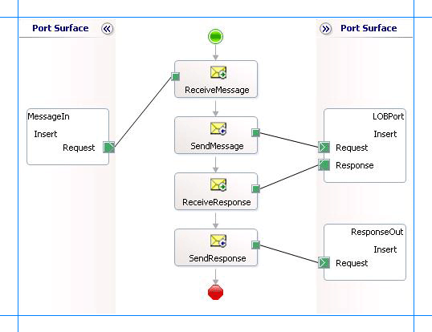

# Insert, update, delete, or select on interface tables and interface views with Oracle E-Business Suite
The [!INCLUDE[adapteroraclebusinessshort](../../includes/adapteroraclebusinessshort-md.md)]surfaces a set of standard operations such as Insert, Update, Delete, Select on interface tables and views. This topic provides instructions on how to perform these operations using the adapter. For more information about how the adapter supports these operations, see [Operations on Interface Tables and Interface Views](../../adapters-and-accelerators/adapter-oracle-ebs/operations-on-interface-tables-and-interface-views.md). For information about the structure of the SOAP message for these operations, see [Message Schemas for Insert, Update, Delete, and Select Operations](../../adapters-and-accelerators/adapter-oracle-ebs/message-schemas-for-insert-update-delete-and-select-operations.md).  

> [!NOTE]
>  The adapter also exposes specific operations for tables and views that contain large data types such as BLOB, CLOB, NCLOB, and BFILE. For more information about such operations, see [Operations on Interface Tables, Interface Views, Tables, and Views That Contain LOB Data](../../adapters-and-accelerators/adapter-oracle-ebs/read-and-update-on-interface-tables-and-views-with-large-object-data-types.md). For instructions on how to perform operations on tables and columns with large data types using BizTalk Server, see [Complete operations on tables with large data types in Oracle E-Business Suite using the WCF service model](../../adapters-and-accelerators/adapter-oracle-ebs/run-table-operations-with-large-data-types-in-oracle-ebs-using-a-wcf-service.md).  

## How to Perform Basic Operations on Oracle E-Business Suite  
 Performing an operation on Oracle E-Business Suite by using [!INCLUDE[adapteroraclebusinessshort](../../includes/adapteroraclebusinessshort-md.md)] with [!INCLUDE[btsBizTalkServerNoVersion](../../includes/btsbiztalkservernoversion-md.md)] involves procedural tasks described in [Building blocks to create Oracle E-Business Suite applications](../../adapters-and-accelerators/adapter-oracle-ebs/building-blocks-to-create-oracle-e-business-suite-applications.md). To perform Insert, Update, Delete, or Select operations on tables and views in Oracle E-Business Suite, these tasks are:  

1. Create a BizTalk project, and generate schema for the operation you want to invoke on an interface table or view.  

2. Create messages in the BizTalk project for sending and receiving messages from the Oracle E-Business Suite.  

3. Create an orchestration to invoke the operation on the interface table or view.  

4. Build and deploy the BizTalk project.  

5. Configure the BizTalk application by creating physical send and receive ports.  

6. Start the BizTalk application.  

   This topic provides instructions to perform these tasks.  

## Generating Schema  
 This topic demonstrates how to perform basic Insert, Update, Delete, or Select operations by inserting records in the AR_ARCHIVE_PURGE_INTERIM interface table in Oracle E-Business Suite. This interface table is available in the **Receivables** application in the Oracle E-Business Suite.  

 To demonstrate how to insert records, schema is generated for the Insert operation for the AR_ARCHIVE_PURGE_INTERIM table. You must create a BizTalk project and use the [!INCLUDE[consumeadapterservshort](../../includes/consumeadapterservshort-md.md)] to generate the schema. See [Retrieving Metadata for Oracle E-Business Suite Operations in Visual Studio](../../adapters-and-accelerators/adapter-oracle-ebs/get-metadata-for-oracle-e-business-suite-operations-in-visual-studio.md) for more information about how to generate schemas.  

## Defining Messages and Message Types  
 The schema that you generated earlier describes the “types” required for the messages in the orchestration. A message is typically a variable, the type for which defined by the corresponding schema. You must now create messages for the orchestration and link them to schemas you generated in the previous step.  

#### To create messages and link to schema  

1.  Add an orchestration to the BizTalk project. From Solution Explorer, right-click the BizTalk project name, point to **Add**, and then click **New Item**. Type a name for the BizTalk orchestration, and then click **Add**.  

2.  Open the Orchestration View window of the BizTalk project, if it is not already open. To do so, click **View**, point to **Other Windows**, and then click **Orchestration View**.  

3.  In Orchestration View, right-click **Messages**, and then click **New Message**.  

4.  Right-click the newly created message, and then select **Properties Window**.  

5.  In the **Properties** pane for the **Message_1**, do the following:  

    |Use this|To do this|  
    |--------------|----------------|  
    |Identifier|Type `Request`|  
    |Message Type|From the drop-down list, expand **Schemas**, and then select *InsertInterfaceTable.OracleEBSBinding.Insert*, where InsertInterfaceTable is the name of your BizTalk project. OracleEBSBinding is the schema generated for the Insert operation on the AR_ARCHIVE_PURGE_INTERIM table.|  

6.  Repeat step 2 to create a new message. In the **Properties** pane for the new message, do the following:  

    |Use this|To do this|  
    |--------------|----------------|  
    |Identifier|Type `Response`|  
    |Message Type|From the drop-down list, expand **Schemas**, and then select *InsertInterfaceTable.OracleEBSBinding.InsertResponse*.|  

## Setting up the Orchestration  
 You must create a BizTalk orchestration to use [!INCLUDE[btsBizTalkServerNoVersion](../../includes/btsbiztalkservernoversion-md.md)] for performing an operation on Oracle E-Business Suite. In this orchestration, you drop a request message at a defined receive location. The [!INCLUDE[adapteroraclebusinessshort](../../includes/adapteroraclebusinessshort-md.md)] consumes this message and passes it on to Oracle E-Business Suite. The response from Oracle E-Business Suite is saved to another location. A typical orchestration for performing basic table operations on Oracle database would contain:  

- Send and Receive shapes to send messages to Oracle database and receive responses.  

- A one-way receive port to receive request messages to send to the Oracle database.  

- A two-way send port to send request messages to Oracle database and receive responses.  

- A one-way send port to send the responses from Oracle database to a folder.  

  A sample orchestration for the Select operation resembles the following:  

    

### Adding Message Shapes  
 Make sure you specify the following properties for each of the message shapes. The names listed in the Shape column are the names of the message shapes as displayed in the just-mentioned orchestration.  

|Shape|Shape Type|Properties|  
|-----------|----------------|----------------|  
|ReceiveMessage|Receive|-   Set **Name** to *ReceiveMessage*<br />-   Set **Activate** to *True*|  
|SendMessage|Send|-   Set **Name** to *SendMessage*|  
|ReceiveResponse|Receive|-   Set **Name** to *ReceiveResponse*<br />-   Set **Activate** to *False*|  
|SendResponse|Send|-   Set **Name** to *SendResponse*|  

### Adding Ports  
 Make sure you specify the following properties for each of the logical ports. The names listed in the Port column are the names of the ports as displayed in the orchestration.  

|Port|Properties|  
|----------|----------------|  
|MessageIn|-   Set **Identifier** to *MessageIn*<br />-   Set **Type** to *MessageInType*<br />-   Set **Communication Pattern** to *One-Way*<br />-   Set **Communication Direction** to *Receive*|  
|LOBPort|-   Set **Identifier** to *LOBPort*<br />-   Set **Type** to *LOBPortType*<br />-   Set **Communication Pattern** to *Request-Response*<br />-   Set **Communication Direction** to *Send-Receive*|  
|ResponseOut|-   Set **Identifier** to *ResponseOut*<br />-   Set **Type** to *ResponseOutType*<br />-   Set **Communication Pattern** to *One-Way*<br />-   Set **Communication Direction** to *Send*|  

### Specify Messages for Action Shapes, and Connect Them to Ports  
 The following table specifies the properties and their values that you should set to specify messages for action shapes and to link the messages to the ports. The names listed in the Shape column are the names of the message shapes as displayed in the orchestration mentioned earlier.  

|Shape|Properties|  
|-----------|----------------|  
|ReceiveMessage|-   Set **Message** to *Request*<br />-   Set **Operation** to *MessageIn.Insert.Request*|  
|SendMessage|-   Set **Message** to *Request*<br />-   Set **Operation** to *LOBPort.Insert.Request*|  
|ReceiveResponse|-   Set **Message** to *Response*<br />-   Set **Operation** to *LOBPort.Insert.Response*|  
|SendResponse|-   Set **Message** to *Response*<br />-   Set **Operation** to *ResponseOut.Insert.Request*|  

 After you have specified these properties, the message shapes and ports are connected, and your orchestration is complete.  

 You must now build the BizTalk solution and deploy it to BizTalk Server. For more information, see [Building and Running Orchestrations](../../core/building-and-running-orchestrations.md).  

## Configuring the BizTalk Application  
 After you have deployed the BizTalk project, the orchestration you created earlier is listed under the Orchestrations pane in the [!INCLUDE[btsBizTalkServerNoVersion](../../includes/btsbiztalkservernoversion-md.md)] Administration console. You must use the [!INCLUDE[btsBizTalkServerNoVersion](../../includes/btsbiztalkservernoversion-md.md)] Administration console to configure the application. For a walkthrough, see [Walkthrough: Deploying a Basic BizTalk Application](Walkthrough:%20Deploying%20a%20Basic%20BizTalk%20Application.md).  

 Configuring an application involves:  

- Selecting a host for the application.  

- Mapping the ports that you created in your orchestration to physical ports in the [!INCLUDE[btsBizTalkServerNoVersion](../../includes/btsbiztalkservernoversion-md.md)] Administration console. For this orchestration you must:  

  - Define a location on the hard disk and a corresponding file port where you will drop a request message. The BizTalk orchestration will consume the request message and send it to Oracle E-Business Suite.  

  - Define a location on the hard disk and a corresponding file port where the BizTalk orchestration will drop the response message containing the response from Oracle E-Business Suite.  

  - Define a physical WCF-Custom or WCF-OracleEBS send port to send messages to Oracle E-Business Suite. You must also specify the action in the send port. For information about how to create ports, see [Manually Configuring a Physical Port Binding to the Oracle E-Business Adapter](../../adapters-and-accelerators/adapter-oracle-ebs/manually-configure-a-physical-port-binding-to-the-oracle-e-business-adapter.md)  

     To perform operations on interface tables or interface views using the [!INCLUDE[adapteroraclebusinessshort](../../includes/adapteroraclebusinessshort-md.md)], you must set the right application context in which the operation is invoked. The [!INCLUDE[adapteroraclebusinessshort](../../includes/adapteroraclebusinessshort-md.md)] provides certain binding properties to specify the application context for any operation. You must set these binding properties on the WCF-Custom or WCF-OracleEBS port used for performing operations on interface tables.  

    - If the **ClientCredentialType** binding property is set to **Database**, then you must specify the following binding properties to set the applications context.  


      |        Binding Property         |                                                                                                                                                                                                                                                                                     Value                                                                                                                                                                                                                                                                                     |
      |---------------------------------|-------------------------------------------------------------------------------------------------------------------------------------------------------------------------------------------------------------------------------------------------------------------------------------------------------------------------------------------------------------------------------------------------------------------------------------------------------------------------------------------------------------------------------------------------------------------------------|
      |       **OracleUserName**        | Specify the name of an Oracle E-Business Suite user. The [!INCLUDE[adapteroraclebusinessshort](../../includes/adapteroraclebusinessshort-md.md)] does not preserve the case of the value that you enter for the **OracleUserName** binding property when it connects to Oracle E-Business Suite. The user name is passed to Oracle E-Business Suite using the standard rules of SQL\*Plus. However, if you want the case of the user name to be preserved or if you want to enter a user name containing special characters, you must specify the value within double quotes. |
      |       **OraclePassword**        |   The password for the Oracle E-Business Suite user. The [!INCLUDE[adapteroraclebusinessshort](../../includes/adapteroraclebusinessshort-md.md)] does not preserve the case of the value that you enter for the **OraclePassword** binding property when it connects to Oracle E-Business Suite. The password is passed to Oracle E-Business Suite using the standard rules of SQL\*Plus. However, if you want the case of the password to be preserved or if you want to enter a password containing special characters, you must specify the value within double quotes.    |
      | **OracleEBSResponsibilityName** |                                                                                                                                                                                                                                                     The responsibility associated with the Oracle E-Business Suite user.                                                                                                                                                                                                                                                      |


    - If the **ClientCredentialType** binding property is set to **EBusiness**, you must have already specified Oracle E-Business credentials while establishing the connection. In such a case you must only specify value for the **OracleEBSResponsibilityName** binding property.  

      For more information about the different binding properties, see [Read about the BizTalk Adapter for Oracle E-Business Suite Binding Properties](../../adapters-and-accelerators/adapter-oracle-ebs/read-about-the-biztalk-adapter-for-oracle-e-business-suite-binding-properties.md). For more information on how the adapter supports setting the application context, see [Set Application Context](../../adapters-and-accelerators/adapter-oracle-ebs/set-application-context.md).  

    > [!NOTE]
    >  You can set the application context either by specifying the binding properties or by setting the message context properties exposed by the [!INCLUDE[adapteroraclebusinessshort](../../includes/adapteroraclebusinessshort-md.md)]. For instructions on how to set the binding properties, see [Configure the Binding Properties for Oracle E-Business Suite](../../adapters-and-accelerators/adapter-oracle-ebs/configure-the-binding-properties-for-oracle-e-business-suite.md). For instructions on how to set the application context using message context properties, see [Configure the Application Context Using Message Context Properties in Oracle E-Business Suite](../../adapters-and-accelerators/adapter-oracle-ebs/configure-application-context-using-message-context-properties-in-oracle-ebs.md).  
    > 
    > [!NOTE]
    >  Generating the schema using the [!INCLUDE[consumeadapterservlong](../../includes/consumeadapterservlong-md.md)] also creates a binding file that contains information about the ports and the actions to be set for those ports. You can import this binding file from the [!INCLUDE[btsBizTalkServerNoVersion](../../includes/btsbiztalkservernoversion-md.md)] Administration console to create send ports (for outbound calls) or receive ports (for inbound calls). For more information, see [Configure a Physical Port Binding Using a Port Binding File to Oracle E-Business Suite](../../adapters-and-accelerators/adapter-oracle-ebs/configure-a-physical-port-binding-using-a-port-binding-file-to-oracle-ebs.md).  

## Starting the Application  
 You must start the BizTalk application for inserting records into the AR_ARCHIVE_PURGE_INTERIM interface table. For instructions on starting a BizTalk application, see [How to Start an Orchestration](../../core/how-to-start-an-orchestration.md).  

 At this stage, make sure:  

-   The FILE receive port to receive request messages for the orchestration is running.  

-   The FILE send port to receive the response messages from the orchestration is running.  

-   The WCF-Custom or WCF-OracleEBS send port to send messages to Oracle E-Business Suite is running.  

-   The BizTalk orchestration for the operation is running.  

## Executing the Operation  
 After you run the application, you must drop a request message to the FILE receive location. The schema for the request message must conform to the schema for the Insert operation that you generated earlier. For example, the request message to select all records from the AR_ARCHIVE_PURGE_INTERIM interface table is:  

```  
<Insert xmlns="http://schemas.microsoft.com/OracleEBS/2008/05/InterfaceTables/AR/AR/AR_ARCHIVE_PURGE_INTERIM">  
  <RECORDSET>  
    <InsertRecord xmlns="http://schemas.microsoft.com/OracleEBS/2008/05/TableViewRecord/AR/AR_ARCHIVE_PURGE_INTERIM">  
      <TRX_ID>001</TRX_ID>  
      <RELATED_ID>002</RELATED_ID>  
    </InsertRecord>  
  </RECORDSET>    
</Insert>  
```  

 This request message will insert records into the AR_ARCHIVE_PURGE_INTERIM interface table. See [Message Schemas for Insert, Update, Delete, and Select Operations](../../adapters-and-accelerators/adapter-oracle-ebs/message-schemas-for-insert-update-delete-and-select-operations.md) for more information about the request message schema for performing basic DML operations on Oracle E-Business Suite using the [!INCLUDE[adapteroraclebusinessshort](../../includes/adapteroraclebusinessshort-md.md)].  

 For simple data columns, like in the preceding request message, you can also use the **InlineValue** attribute. For more information about the InlineValue attribute, see the description of the Insert operation in [Operations on Interface Tables and Interface Views](../../adapters-and-accelerators/adapter-oracle-ebs/operations-on-interface-tables-and-interface-views.md).  

 For example, the preceding request message with inline values will resemble the following:  

```  
<Insert xmlns="http://schemas.microsoft.com/OracleEBS/2008/05/InterfaceTables/AR/AR/AR_ARCHIVE_PURGE_INTERIM">  
  <RECORDSET>  
    <InsertRecord xmlns="http://schemas.microsoft.com/OracleEBS/2008/05/TableViewRecord/AR/AR_ARCHIVE_PURGE_INTERIM">  
      <TRX_ID InlineValue="(Select TRX_ID FROM table_name)">001</TRX_ID>  
      <RELATED_ID>002</RELATED_ID>  
    </InsertRecord>  
  </RECORDSET>    
</Insert>  
```  

 In this request message, the value for TRX_ID column is retrieved from another table. So, even though “001” is specified as a value for TRX_ID, the value for the SELECT statement specified for InlineValue attribute will get inserted into the table.  

 The orchestration consumes the message and sends it to Oracle E-Business Suite. The response from Oracle E-Business Suite is saved at the other FILE location defined as part of the orchestration. For example, the response from Oracle E-Business Suite for the preceding request message is:  

```  
<?xml version="1.0" encoding="utf-8" ?>   
<InsertResponse xmlns="http://schemas.microsoft.com/OracleEBS/2008/05/InterfaceTables/AR/AR/AR_ARCHIVE_PURGE_INTERIM">  
  <InsertResult>1</InsertResult>   
</InsertResponse>  
```  

 The response contains the number of rows inserted into the table.  

## Best Practices  
 After you have deployed and configured the BizTalk project, you can export configuration settings to an XML file called the binding file. After you generate a binding file, you can import the configuration settings from the file, so that you do not need to create items such as the send ports and receive ports for the same orchestration. For more information about binding files, see [Reuse Adapter Bindings with Oracle E-Business Suite](../../adapters-and-accelerators/adapter-oracle-ebs/reuse-adapter-bindings-with-oracle-e-business-suite.md).  

## See Also  
[Develop BizTalk applications using the Oracle E-Business Suite adapter](../../adapters-and-accelerators/adapter-oracle-ebs/develop-biztalk-applications-using-the-oracle-e-business-suite-adapter.md)