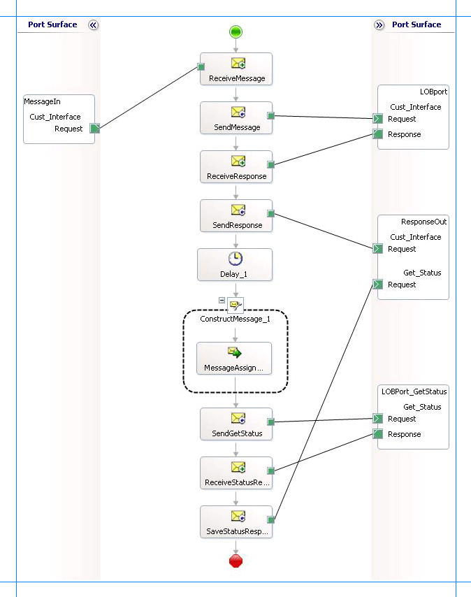

# Invoke concurrent programs in Oracle E-Business Suite
Oracle E-Business Suite exposes concurrent programs that you can execute to perform specific operations on Oracle applications. Each Oracle application has a set of standard concurrent programs (that are same across all operations) and certain concurrent programs that are specific to an Oracle application. The [!INCLUDE[adapteroraclebusinessshort](../../includes/adapteroraclebusinessshort-md.md)] exposes all concurrent programs as operations that adapter clients can invoke. For more information on how the adapter supports concurrent programs, see [Operations on Concurrent Programs](../../adapters-and-accelerators/adapter-oracle-ebs/operations-on-concurrent-programs.md). For information about the structure of SOAP messages for invoking concurrent programs, see [Message Schemas for Concurrent Programs](../../adapters-and-accelerators/adapter-oracle-ebs/message-schemas-for-concurrent-programs.md).  

> [!NOTE]
>  For the concurrent programs that do not expose their metadata, the Oracle E-Business adapter exposes 100 optional parameters for each of these concurrent programs. To invoke these concurrent programs successfully, the user must consult the Oracle E-Business Suite documentation to figure out the parameters for a concurrent program that require a value, and then specify them. An example of such a concurrent program is **Journal Import** (actual name: **GLLEZL**) in the **General Ledger** application.  

## Prerequisites  
 You must have completed the steps in [Prerequisites to create Oracle E-Business Suite applications](../../adapters-and-accelerators/adapter-oracle-ebs/prerequisites-to-create-oracle-e-business-suite-applications.md).

## How to Invoke Concurrent Programs in Oracle Applications  
 Performing an operation on Oracle E-Business Suite using the [!INCLUDE[adapteroraclebusinessshort](../../includes/adapteroraclebusinessshort-md.md)] with [!INCLUDE[btsBizTalkServerNoVersion](../../includes/btsbiztalkservernoversion-md.md)] involves procedural tasks described in [Building blocks to create Oracle E-Business Suite applications](../../adapters-and-accelerators/adapter-oracle-ebs/building-blocks-to-create-oracle-e-business-suite-applications.md). To invoke a concurrent program, these tasks are:  

- Create a BizTalk project, and generate schema for the concurrent program you want to invoke.  

- Create messages in the BizTalk project for sending and receiving messages to and from Oracle E-Business Suite.  

- Create an orchestration to invoke the concurrent program.  

- Build and deploy the BizTalk project.  

- Configure the BizTalk application by creating physical send and receive ports.  

- Start the BizTalk application.  

  This topic provides instructions to perform these tasks.  

## Generating Schema  
 This topic demonstrates how to invoke the **Customer Interface** concurrent program from the **Receivables** application. This application is available with the default Oracle E-Business Suite application. This concurrent program returns a request ID. To check the status of the concurrent program, we execute the **Get_Status** concurrent program by passing the request ID received in the response of the **Customer Interface** concurrent program.  

 In this topic, we generate schema for both the **Customer Interface** and **Get_Status** concurrent programs. For more information about how to generate schema, see [Retrieving Metadata for Oracle E-Business Suite Operations in Visual Studio](../../adapters-and-accelerators/adapter-oracle-ebs/get-metadata-for-oracle-e-business-suite-operations-in-visual-studio.md).  

## Defining Messages and Message Types  
 The schema that you generated earlier describes the “types” required for the messages in the orchestration. A message is typically a variable, the type for which is defined by the corresponding schema. You must now create messages for the orchestration, and link them to schemas that you generated in the previous step.  

 In this orchestration you must create four messages—one receive-response set to invoke the **Customer Interface** concurrent program and the other receive-response set to invoke the **Get_Status** concurrent program.  

#### To create messages and link to schema  

1. Add an orchestration to the BizTalk project. From Solution Explorer, right-click the BizTalk project name, point to **Add**, and then click **New Item**. Type a name for the BizTalk orchestration, and then click **Add**.  

2. Open the Orchestration View window of the BizTalk project, if it is not already open. To do so, click **View**, point to **Other Windows**, and then click **Orchestration View**.  

3. In Orchestration View, right-click **Messages**, and then click **New Message**.  

4. Right-click the newly created message, and then select **Properties Window**.  

5. In the **Properties** pane for the **Message_1**, do the following:  


   |   Use this   |                                                                                                                                                                                                                                                                                           To do this                                                                                                                                                                                                                                                                                           |
   |--------------|------------------------------------------------------------------------------------------------------------------------------------------------------------------------------------------------------------------------------------------------------------------------------------------------------------------------------------------------------------------------------------------------------------------------------------------------------------------------------------------------------------------------------------------------------------------------------------------------|
   |  Identifier  |                                                                                                                                                                                                                                                                                         Type `Request`                                                                                                                                                                                                                                                                                         |
   | Message Type | From the drop-down list, expand **Schemas**, and then select *ConcurrentProgram.OracleEBSBindingSchema.RACUST*, where ConcurrentProgram is the name of your BizTalk project. OracleEBSBindingSchema is the schema generated for invoking the **Customer Interface** concurrent program. **Note:**  RACUST is the actual name of the **Customer Interface** concurrent program. While the [!INCLUDE[consumeadapterservshort](../../includes/consumeadapterservshort-md.md)] displays the friendly name (**Customer Interface**), the schema contains the actual name of the concurrent program. |


6. Repeat step 3 to create three new message. In the **Properties** pane for the new message, do the following:  

   |Set Identifier to|Set Message Type to|  
   |-----------------------|-------------------------|  
   |Response|*ConcurrentProgram.OracleEBSBindingSchema.RACUSTResponse*|  
   |Get_StatusRequest|*ConcurrentProgram.OracleEBSBindingSchema1.GetStatusForConcurrentProgram*|  
   |Get_StatusResponse|*ConcurrentProgram.OracleEBSBindingSchema1.GetStatusForConcurrentProgramResponse*|  

## Setting up the Orchestration  
 You must create a BizTalk orchestration to use [!INCLUDE[btsBizTalkServerNoVersion](../../includes/btsbiztalkservernoversion-md.md)] for invoking concurrent programs in Oracle E-Business Suite. In this orchestration, you will be dropping a request message at a defined receive location. The orchestration consumes this message and passes it on to Oracle E-Business Suite to invoke the **Customer Interface** concurrent program. The response for the concurrent program is received from Oracle and is saved at another location. The response message contains a request ID. The orchestration includes a **Construct Message** shape to extract the request ID from the response and construct a message that conforms to the schema of the **Get_Status** concurrent program. The message to invoke the **Get_Status** concurrent program is sent to the Oracle E-Business Suite with the request ID as a parameter. You must include send and receive shapes, message construction shapes, and ports to send messages to Oracle and receive responses.  

 Typically, the **Customer Interface** concurrent program will take some time to execute, so you need to wait before executing the **Get_Status** concurrent. You can automate this by adding a **Delay** shape.  

 A sample orchestration resembles the following:  

   

### Adding Message Shapes  
 Specify the following properties for each of the message shapes. The names listed in the **Shape** column correspond to the message shapes as displayed in the preceding orchestration.  

|Shape|Shape Type|Properties|  
|-----------|----------------|----------------|  
|ReceiveMessage|Receive|-   Set **Name** to *ReceiveMessage*<br />-   Set **Activate** to *True*|  
|SendMessage|Send|-   Set **Name** to *SendMessage*|  
|ReceiveResponse|Receive|-   Set **Name** to *ReceiveResponse*<br />-   Set **Activate** to *False*|  
|SendResponse|Send|-   Set **Name** to *SendResponse*|  
|SendGetStatus|Send|-   Set **Name** to *SendGetStatus*|  
|ReceiveStatusResponse|Receive|-   Set **Name** to *ReceiveStatusResponse*<br />-   Set **Activate** to *False*|  
|SaveStatusResponse|Send|-   Set **Name** to *SaveStatusResponse*|  

### Adding a Delay Shape  
 If you want the orchestration to wait between invoking the **Customer Interface** and **Get_Status** concurrent programs, you must add a **Delay** shape to the orchestration. You must add a **Delay** shape after the orchestration copies the response for the **Customer Interface** concurrent program to a FILE send port. So, you must add a **Delay** shape after the **SendResponse** shape.  

 Within the **Delay** shape, you can specify the time interval for which the orchestration must wait before proceeding  by adding the following code to the Expression Editor for the **Delay** shape:  

```  
new System.TimeSpan(0,2,0)  
```  

 By adding this code, the orchestration will wait for two minutes before proceeding. For more information about how to configure the **Delay** shape, see [How to Configure the Delay Shape](../../core/how-to-configure-the-delay-shape.md).  

### Adding the Construct Message Shape  
 The response from the Oracle E-Business Suite for the **Customer Interface** concurrent program contains a request ID. To get the status of the concurrent program, you must pass the same request ID as a parameter to the **Get_Status** concurrent program. To do so, in the orchestration, you must include a **Construct Message** shape, and within that a **Message Assignment** shape. The purpose of the **Construct Message** shape is:  

- To extract the request ID from the response that is received for the **Customer Interface** concurrent program.  

- To construct a message that conforms to the message schema for the **Get_Status** concurrent program.  

  For the **Construct Message** shape, set the **Message Constructed** property to **Get_StatusRequest**.  

  For the **Message Assignment** shape, add the below. Before adding the code, you must have:  

```  
XmlDoc = new System.Xml.XmlDocument();  
XmlDoc.LoadXml("<GetStatusForConcurrentProgram xmlns='http://schemas.microsoft.com/OracleEBS/2008/05/ConcurrentPrograms/AR'><RequestId /></GetStatusForConcurrentProgram>");  
Get_StatusRequest = XmlDoc;  
Get_StatusRequest.RequestId = xpath(Response,"string(/*[local-name()='RACUSTResponse']/*[local-name()='RACUSTResult']/text())");  
```  

### Adding Ports  
 To configure the ports, you specify the properties listed in the table below for each of the logical ports. The names listed in the *Port* column correspond to the names of the ports displayed in the orchestration.  

|Port|Properties|  
|----------|----------------|  
|MessageIn|-   Set **Identifier** to *MessageIn*<br />-   Set **Type** to *MessageInType*<br />-   Set **Communication Pattern** to *One-Way*<br />-   Set **Communication Direction** to *Receive*|  
|LOBPort|-   Set **Identifier** to *LOBPort*<br />-   Set **Type** to *LOBPortType*<br />-   Set **Communication Pattern** to *Request-Response*<br />-   Set **Communication Direction** to *Send-Receive*|  
|ResponseOut|-   Set **Identifier** to *ResponseOut*<br />-   Set **Type** to *ResponseOutType*<br />-   Set **Communication Pattern** to *One-Way*<br />-   Set **Communication Direction** to *Send*<br />-   Create an operation *Cust_Interface*. This operation is used for the **Customer Interface** concurrent program.<br />-   Create an operation *Get_Status*. This operation is used for the **Get_Status** concurrent program.|  
|LOBPort_GetStatus|-   Set **Identifier** to *LOBPort_GetStatus*<br />-   Set **Type** to *LOBPort_GetStatusType*<br />-   Set **Communication Pattern** to *Request-Response*<br />-   Set **Communication Direction** to *Send-Receive*|  

### Specify Messages for Action Shapes and Connect to Ports  
 The following table specifies the property  values to specify messages for action shapes and linking them to the ports. The names listed in the **Shape** column correspond to the names of the message shapes as displayed in the orchestration diagram.  

 After you have specified these properties, the message shapes and ports are connected and your orchestration is complete.  

 You must now build the BizTalk solution and then deploy it to a BizTalk Server. For more information, see [Building and Running Orchestrations](../../core/building-and-running-orchestrations.md).  

|Shape|Properties|  
|-----------|----------------|  
|ReceiveMessage|-   Set **Message** to *Request*<br />-   Set **Operation** to *MessageIn.Cust_Interface.Request*|  
|SendMessage|-   Set **Message** to *Request*<br />-   Set **Operation** to *LOBport.Cust_Interface.Request*|  
|ReceiveResponse|-   Set **Message** to *Response*<br />-   Set **Operation** to *LOBport.Cust_Interface.Response*|  
|SendResponse|-   Set **Message** to *Response*<br />-   Set **Operation** to *ResponseOut.Cust_Interface.Request*|  
|SendGetStatus|-   Set **Message** to *Get_StatusRequest*<br />-   Set **Operation** to *LOBPort_GetStatus.Get_Status.Request*|  
|ReceiveStatusResponse|-   Set **Message** to *Get_StatusResponse*<br />-   Set **Operation** to *LOBPort_GetStatus.Get_Status.Response*|  
|SaveStatusResponse|-   Set **Message** to *Get_StatusResponse*<br />-   Set **Operation** to *ResponseOut.Get_Status.Request*|  

 After you have specified these properties, the message shapes and ports are connected and your orchestration is complete.  

 You must now build the BizTalk solution and then deploy it to a BizTalk Server. For more information, see [Building and Running Orchestrations](../../core/building-and-running-orchestrations.md).  

## Configuring the BizTalk Application  
 After you have deployed the BizTalk project, the orchestration you created earlier is listed under the **Orchestrations** pane in the [!INCLUDE[btsBizTalkServerNoVersion](../../includes/btsbiztalkservernoversion-md.md)] Administration console. You must use the [!INCLUDE[btsBizTalkServerNoVersion](../../includes/btsbiztalkservernoversion-md.md)] Administration console to configure the application. For a walkthrough, see [Walkthrough: Deploying a Basic BizTalk Application](Walkthrough:%20Deploying%20a%20Basic%20BizTalk%20Application.md).  

 Configuring an application involves:  

- Selecting a host for the application.  

- Mapping the ports that you created in your orchestration to physical ports in the [!INCLUDE[btsBizTalkServerNoVersion](../../includes/btsbiztalkservernoversion-md.md)] Administration console. For this orchestration you must:  

  - Define a location on the hard disk and a corresponding file port where you will drop a request message. The BizTalk orchestration will consume the request message and send it to the Oracle E-Business Suite.  

  - Define a location on the hard disk and a corresponding file port where the BizTalk orchestration will drop the response message containing the response from Oracle E-Business Suite.  

  - Define two physical WCF-Custom or WCF-OracleEBS send ports—one to send messages to Oracle E-Business Suite to execute the **Customer Interface** concurrent program and the other to execute the **Get_Status** concurrent program. You must also specify the action in the send ports. For information about how to create ports, see [Manually Configuring a Physical Port Binding to the Oracle E-Business Adapter](../../adapters-and-accelerators/adapter-oracle-ebs/manually-configure-a-physical-port-binding-to-the-oracle-e-business-adapter.md).  

     To invoke concurrent programs using the [!INCLUDE[adapteroraclebusinessshort](../../includes/adapteroraclebusinessshort-md.md)], you must set the right application context in which the operation is invoked. The [!INCLUDE[adapteroraclebusinessshort](../../includes/adapteroraclebusinessshort-md.md)] provides certain binding properties to specify the application context for any operation. You must set these binding properties on the WCF-Custom or WCF-OracleEBS port used for invoking concurrent programs.  

    - If the **ClientCredentialType** binding property is set to **Database**, then you must specify the following binding properties to set the applications context.  


      |        Binding Property         |                                                                                                                                                                                                                                                                                     Value                                                                                                                                                                                                                                                                                     |
      |---------------------------------|-------------------------------------------------------------------------------------------------------------------------------------------------------------------------------------------------------------------------------------------------------------------------------------------------------------------------------------------------------------------------------------------------------------------------------------------------------------------------------------------------------------------------------------------------------------------------------|
      |       **OracleUserName**        | Specify the name of an Oracle E-Business Suite user. The [!INCLUDE[adapteroraclebusinessshort](../../includes/adapteroraclebusinessshort-md.md)] does not preserve the case of the value that you enter for the **OracleUserName** binding property when it connects to Oracle E-Business Suite. The user name is passed to Oracle E-Business Suite using the standard rules of SQL\*Plus. However, if you want the case of the user name to be preserved or if you want to enter a user name containing special characters, you must specify the value within double quotes. |
      |       **OraclePassword**        |   The password for the Oracle E-Business Suite user. The [!INCLUDE[adapteroraclebusinessshort](../../includes/adapteroraclebusinessshort-md.md)] does not preserve the case of the value that you enter for the **OraclePassword** binding property when it connects to Oracle E-Business Suite. The password is passed to Oracle E-Business Suite using the standard rules of SQL\*Plus. However, if you want the case of the password to be preserved or if you want to enter a password containing special characters, you must specify the value within double quotes.    |
      | **OracleEBSResponsibilityName** |                                                                                                                                                                                                                                                     The responsibility associated with the Oracle E-Business Suite user.                                                                                                                                                                                                                                                      |


    - If the **ClientCredentialType** binding property is set to **EBusiness**, you must have already specified Oracle E-Business credentials while establishing the connection. In such a case you must only specify value for the **OracleEBSResponsibilityName** binding property.  

      For more information about the different binding properties, see [Read about the BizTalk Adapter for Oracle E-Business Suite Binding Properties](../../adapters-and-accelerators/adapter-oracle-ebs/read-about-the-biztalk-adapter-for-oracle-e-business-suite-binding-properties.md). For more information on how the adapter supports setting the application context, see [Set Application Context](../../adapters-and-accelerators/adapter-oracle-ebs/set-application-context.md).  

    > [!NOTE]
    >  You can set the application context either by specifying the binding properties or by setting the message context properties exposed by the [!INCLUDE[adapteroraclebusinessshort](../../includes/adapteroraclebusinessshort-md.md)]. For instructions on how to set the binding properties, see [Configure the Binding Properties for Oracle E-Business Suite](../../adapters-and-accelerators/adapter-oracle-ebs/configure-the-binding-properties-for-oracle-e-business-suite.md). For instructions on how to set the application context using message context properties, see [Configure the Application Context Using Message Context Properties in Oracle E-Business Suite](../../adapters-and-accelerators/adapter-oracle-ebs/configure-application-context-using-message-context-properties-in-oracle-ebs.md).  
    > 
    > [!NOTE]
    >  Generating the schema using the [!INCLUDE[consumeadapterservlong](../../includes/consumeadapterservlong-md.md)] also creates a binding file that contains information about the ports and the actions to be set for those ports. You can import this binding file from the [!INCLUDE[btsBizTalkServerNoVersion](../../includes/btsbiztalkservernoversion-md.md)] Administration console to create send ports (for outbound calls) or receive ports (for inbound calls). For more information, see [Configure a Physical Port Binding Using a Port Binding File to Oracle E-Business Suite](../../adapters-and-accelerators/adapter-oracle-ebs/configure-a-physical-port-binding-using-a-port-binding-file-to-oracle-ebs.md).  

## Starting the Application  
 You must start the BizTalk application before invoking the concurrent programs. For instructions on starting a BizTalk application, see [How to Start an Orchestration](../../core/how-to-start-an-orchestration.md).  

 At this stage, make sure:  

-   The FILE receive port to receive request messages for the orchestration is running.  

-   The FILE send port to receive the response messages from the orchestration is running.  

-   The WCF-Custom or WCF-OracleEBS send port to invoke the **Customer Interface** concurrent program is running.  

-   The WCF-Custom or WCF-OracleEBS send port to invoke the **Get_Status** concurrent program is running.  

-   The BizTalk orchestration for the operation is running.  

## Executing the Operation  
 After you run the application, you must drop a request message that conforms to the schema for invoking the **Customer Interface** concurrent program. For example, the request message to invoke the **Customer Interface** concurrent program is:  

```  
<RACUST xmlns="http://schemas.microsoft.com/OracleEBS/2008/05/ConcurrentPrograms/AR">  
  <Description>Customer Interface Program</Description>  
  <StartTime></StartTime>  
  <CREATE_RECIPROCAL_CUSTOMER>Yes</CREATE_RECIPROCAL_CUSTOMER>  
  <ORG_ID>203</ORG_ID>  
</RACUST>  
```  

> [!NOTE]
>  The request message for invoking a concurrent program requires some optional parameters such as SetOptions, SetPrintOptions, and SetRepeatOptions. The request message provided here does not contain these optional parameters. For information on the complete request message, including optional parameters, see [Message Schemas for Concurrent Programs](../../adapters-and-accelerators/adapter-oracle-ebs/message-schemas-for-concurrent-programs.md).  

 The orchestration consumes the message, passes it on to the Oracle E-Business Suite, and receives a response. The response message is saved at the other file location specified as part of the orchestration. The response for the Customer Interface concurrent program resembles the following:  

```  
<?xml version="1.0" encoding="utf-8"?>  
<RACUSTResponse xmlns="http://schemas.microsoft.com/OracleEBS/2008/05/ConcurrentPrograms/AR">  
  <RACUSTResult>2794708</RACUSTResult>  
</RACUSTResponse>  
```  

 The response from the Oracle E-Business Suite contains a request ID. The orchestration extracts the request ID from the response message, constructs a message to invoke the **Get_Status** concurrent program, and passes it to the Oracle E-Business Suite to execute the **Get_Status** concurrent program. After the response is received for th  **Get_Status** concurrent program, it is copied to the same file location as the first response. The response for the **Get_Status** concurrent program resembles the following:  

```  
<?xml version="1.0" encoding="utf-8" ?>   
<GetStatusForConcurrentProgramResponse xmlns="http://schemas.microsoft.com/OracleEBS/2008/05/ConcurrentPrograms/AR">  
  <GetStatusForConcurrentProgramResult>true</GetStatusForConcurrentProgramResult>   
  <Phase>Pending</Phase>   
  <Status>Standby</Status>   
  <DevPhase>PENDING</DevPhase>   
  <DevStatus>STANDBY</DevStatus>   
  <Message>null</Message>   
</GetStatusForConcurrentProgramResponse>  
```  

## Best Practices  
 After you have deployed and configured the BizTalk project, you can export configuration settings to an XML file called the binding file. After you generate a binding file, you can import the configuration settings from the file, so that you do not need to create items such as send ports and receive ports for the same orchestration. For more information about binding files, see [Reuse Adapter Bindings with Oracle E-Business Suite](../../adapters-and-accelerators/adapter-oracle-ebs/reuse-adapter-bindings-with-oracle-e-business-suite.md).  

## See Also  
[Develop BizTalk applications using the Oracle E-Business Suite adapter](../../adapters-and-accelerators/adapter-oracle-ebs/develop-biztalk-applications-using-the-oracle-e-business-suite-adapter.md)