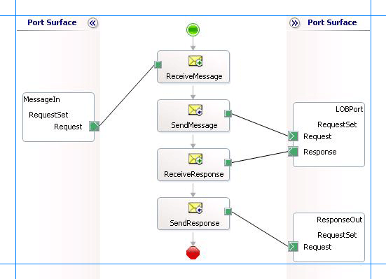

# Invoke request sets in Oracle E-Business Suite
[!INCLUDE[adapteroracleebusinesslong](../../includes/adapteroracleebusinesslong-md.md)] enables you to execute request sets in Oracle E-Business Suite. Request sets are divided into one or more stages, and each stage contains a set of reports and concurrent programs. For more information on how the adapter supports request sets, see [Operations on Request Sets](../../adapters-and-accelerators/adapter-oracle-ebs/operations-on-request-sets.md). For information about the structure of SOAP messages for invoking request sets, see [Message Schemas for Request Sets](../../adapters-and-accelerators/adapter-oracle-ebs/message-schemas-for-request-sets.md).  

## Prerequisites  
 You must have completed the steps in [Prerequisites to create Oracle E-Business Suite applications](../../adapters-and-accelerators/adapter-oracle-ebs/prerequisites-to-create-oracle-e-business-suite-applications.md).  

## How to Invoke Request Sets in Oracle E-Business Suite  
 Performing an operation on Oracle E-Business Suite using the [!INCLUDE[adapteroraclebusinessshort](../../includes/adapteroraclebusinessshort-md.md)] with [!INCLUDE[btsBizTalkServerNoVersion](../../includes/btsbiztalkservernoversion-md.md)] involves procedural tasks described in [Building blocks to create Oracle E-Business Suite applications](../../adapters-and-accelerators/adapter-oracle-ebs/building-blocks-to-create-oracle-e-business-suite-applications.md). To invoke a request set, these tasks are:  

- Create a BizTalk project, and generate schema for the request set you want to invoke.  

- Create messages in the BizTalk project for sending and receiving messages to and from Oracle E-Business Suite.  

- Create an orchestration to invoke the request set.  

- Build and deploy the BizTalk project.  

- Configure the BizTalk application by creating physical send and receive ports.  

- Start the BizTalk application.  

  This topic provides instructions to perform these tasks.  

## Generating Schema  
 This topic demonstrates how to invoke a request set, by invoking the **Function Security Reports** (friendly name) request set from the **Application Object Library** application. The actual name of the request set is **FNDRSSUB43**. This request set is available with the default Oracle E-Business Suite application. This request set returns a request ID.  

 Hence, in this topic, we generate schema for the **FNDRSSUB43** request set. See [Retrieving Metadata for Oracle E-Business Suite Operations in Visual Studio](../../adapters-and-accelerators/adapter-oracle-ebs/get-metadata-for-oracle-e-business-suite-operations-in-visual-studio.md) for more information about how to generate schema.  

## Defining Messages and Message Types  
 The schema that you generated earlier describes the “types” required for the messages in the orchestration. A message is typically a variable, the type for which is defined by the corresponding schema. You must now create messages for the orchestration, and link them to schemas that you generated in the previous step.  

 In this orchestration you must create two messages—one to send message to invoke the request set and another to receive a response for the request set.  

#### To create messages and link to schema  

1.  Add an orchestration to the BizTalk project. From Solution Explorer, right-click the BizTalk project name, point to **Add**, and then click **New Item**. Type a name for the BizTalk orchestration, and then click **Add**.  

2.  Open the Orchestration View window of the BizTalk project, if it is not already open. To do so, click **View**, point to **Other Windows**, and then click **Orchestration View**.  

3.  In Orchestration View, right-click **Messages**, and then click **New Message**.  

4.  Right-click the newly created message, and then select **Properties Window**.  

5.  In the **Properties** pane for the **Message_1**, do the following:  

    |Use this|To do this|  
    |--------------|----------------|  
    |Identifier|Type `Request`|  
    |Message Type|From the drop-down list, expand **Schemas**, and then select *RequestSet.OracleEBSBindingRequestSets_FND.FNDRSSUB43*, where RequestSet is the name of your BizTalk project. OracleEBSBindingRequestSets is the schema generated for invoking the **FNDRSSUB43** request set.|  

6.  Repeat step 3 to create a message. In the **Properties** pane for the new message, do the following:  

    |Use this|To do this|  
    |--------------|----------------|  
    |Response|*RequestSet.OracleEBSBindingRequestSets_FND.FNDRSSUB43Response*|  

## Setting up the Orchestration  
 You must create a BizTalk orchestration to use [!INCLUDE[btsBizTalkServerNoVersion](../../includes/btsbiztalkservernoversion-md.md)] for invoking request sets in Oracle E-Business Suite. In this orchestration, you will be dropping a request message at a defined receive location. The orchestration consumes this message and passes it on to Oracle E-Business Suite to invoke the **FNDRSSUB43** request set. The response for the request set is received from Oracle and is saved at another location. A typical orchestration to invoke a request set would contain:  

- Send and Receive shapes to send messages to Oracle E-Business Suite and receive responses.  

- A one-way receive port to receive request messages to send to Oracle E-Business Suite.  

- A two-way send port to send request messages to Oracle E-Business Suite and receive responses.  

- A one-way send port to send the responses from Oracle E-Business Suite to a folder.  

  A sample orchestration to invoke a request set resembles the following:  

    

### Adding Message Shapes  
 Specify the following properties for each of the message shapes. The names listed in the *Shape* column are the names of the message shapes as displayed in the preceding orchestration.  

|Shape|Shape Type|Properties|  
|-----------|----------------|----------------|  
|ReceiveMessage|Receive|-   Set **Name** to *ReceiveMessage*<br />-   Set **Activate** to *True*|  
|SendMessage|Send|-   Set **Name** to *SendMessage*|  
|ReceiveResponse|Receive|-   Set **Name** to *ReceiveResponse*<br />-   Set **Activate** to *False*|  
|SendResponse|Send|-   Set **Name** to *SendResponse*|  

### Adding Ports  
 Make sure you specify the following properties for each of the logical ports. The names listed in the *Port* column are the names of the ports as displayed in the orchestration.  

|Port|Properties|  
|----------|----------------|  
|MessageIn|-   Set **Identifier** to *MessageIn*<br />-   Set **Type** to *MessageInType*<br />-   Set **Communication Pattern** to *One-Way*<br />-   Set **Communication Direction** to *Receive*|  
|LOBPort|-   Set **Identifier** to *LOBPort*<br />-   Set **Type** to *LOBPortType*<br />-   Set **Communication Pattern** to *Request-Response*<br />-   Set **Communication Direction** to *Send-Receive*|  
|ResponseOut|-   Set **Identifier** to *ResponseOut*<br />-   Set **Type** to *ResponseOutType*<br />-   Set **Communication Pattern** to *One-Way*<br />-   Set **Communication Direction** to *Send*|  

### Specify Messages for Action Shapes and Connect to Ports  
 The following table specifies the properties and their values to be set to specify messages for action shapes and linking them to the ports. The names listed in the *Shape* column are the names of the message shapes as displayed in the previous orchestration.  

|Shape|Properties|  
|-----------|----------------|  
|ReceiveMessage|-   Set **Message** to *Request*<br />-   Set **Operation** to *MessageIn.RequestSet.Request*|  
|SendMessage|-   Set **Message** to *Request*<br />-   Set **Operation** to *LOBPort.RequestSet.Request*|  
|ReceiveResponse|-   Set **Message** to *Response*<br />-   Set **Operation** to *LOBPort.RequestSet.Response*|  
|SendResponse|-   Set **Message** to *Response*<br />-   Set **Operation** to *ResponseOut.RequestSet.Request*|  

 After you have specified these properties, the message shapes and ports are connected and your orchestration is complete.  

 You must now build the BizTalk solution and then deploy it to a BizTalk Server. For more information, see [Building and Running Orchestrations](../../core/building-and-running-orchestrations.md).  

## Configuring the BizTalk Application  
 After you have deployed the BizTalk project, the orchestration you created earlier is listed under the Orchestrations pane in the [!INCLUDE[btsBizTalkServerNoVersion](../../includes/btsbiztalkservernoversion-md.md)] Administration console. You must use the [!INCLUDE[btsBizTalkServerNoVersion](../../includes/btsbiztalkservernoversion-md.md)] Administration console to configure the application. For more information about configuring an application, see [Walkthrough: Deploying a Basic BizTalk Application](Walkthrough:%20Deploying%20a%20Basic%20BizTalk%20Application.md).  

 Configuring an application involves:  

- Selecting a host for the application.  

- Mapping the ports that you created in your orchestration to physical ports in the [!INCLUDE[btsBizTalkServerNoVersion](../../includes/btsbiztalkservernoversion-md.md)] Administration console. For this orchestration you must:  

  - Define a location on the hard disk and a corresponding file port where you will drop a request message. The BizTalk orchestration will consume the request message and send it to the Oracle E-Business Suite.  

  - Define a location on the hard disk and a corresponding file port where the BizTalk orchestration will drop the response message containing the response from Oracle E-Business Suite.  

  - Define a physical WCF-Custom or WCF-OracleEBS send port to send messages to Oracle E-Business Suite. You must also specify the action in the send port. For information about how to create send ports, see [Manually Configuring a Physical Port Binding to the Oracle E-Business Adapter](../../adapters-and-accelerators/adapter-oracle-ebs/manually-configure-a-physical-port-binding-to-the-oracle-e-business-adapter.md).  

     To invoke request sets using the [!INCLUDE[adapteroraclebusinessshort](../../includes/adapteroraclebusinessshort-md.md)], you must set the right application context in which the operation is invoked. The [!INCLUDE[adapteroraclebusinessshort](../../includes/adapteroraclebusinessshort-md.md)] provides certain binding properties to specify the application context for any operation. You must set these binding properties on the WCF-Custom or WCF-OracleEBS port used for invoking request sets.  

    - If the **ClientCredentialType** binding property is set to **Database**, then you must specify the following binding properties to set the applications context.  


      |        Binding Property         |                                                                                                                                                                                                                                                                                     Value                                                                                                                                                                                                                                                                                     |
      |---------------------------------|-------------------------------------------------------------------------------------------------------------------------------------------------------------------------------------------------------------------------------------------------------------------------------------------------------------------------------------------------------------------------------------------------------------------------------------------------------------------------------------------------------------------------------------------------------------------------------|
      |       **OracleUserName**        | Specify the name of an Oracle E-Business Suite user. The [!INCLUDE[adapteroraclebusinessshort](../../includes/adapteroraclebusinessshort-md.md)] does not preserve the case of the value that you enter for the **OracleUserName** binding property when it connects to Oracle E-Business Suite. The user name is passed to Oracle E-Business Suite using the standard rules of SQL\*Plus. However, if you want the case of the user name to be preserved or if you want to enter a user name containing special characters, you must specify the value within double quotes. |
      |       **OraclePassword**        |   The password for the Oracle E-Business Suite user. The [!INCLUDE[adapteroraclebusinessshort](../../includes/adapteroraclebusinessshort-md.md)] does not preserve the case of the value that you enter for the **OraclePassword** binding property when it connects to Oracle E-Business Suite. The password is passed to Oracle E-Business Suite using the standard rules of SQL\*Plus. However, if you want the case of the password to be preserved or if you want to enter a password containing special characters, you must specify the value within double quotes.    |
      | **OracleEBSResponsibilityName** |                                                                                                                                                                                                                                                     The responsibility associated with the Oracle E-Business Suite user.                                                                                                                                                                                                                                                      |


    - If the **ClientCredentialType** binding property is set to **EBusiness**, you must have already specified Oracle E-Business credentials while establishing the connection. In such a case you must only specify value for the **OracleEBSResponsibilityName** binding property.  

      For more information about the different binding properties, see [Read about the BizTalk Adapter for Oracle E-Business Suite Binding Properties
      ](../../adapters-and-accelerators/adapter-oracle-ebs/read-about-the-biztalk-adapter-for-oracle-e-business-suite-binding-properties.md). For more information on how the adapter supports setting the application context, see [Set Application Context](../../adapters-and-accelerators/adapter-oracle-ebs/set-application-context.md).  

    > [!NOTE]
    >  You can set the application context either by specifying the binding properties or by setting the message context properties exposed by the [!INCLUDE[adapteroraclebusinessshort](../../includes/adapteroraclebusinessshort-md.md)]. For instructions on how to set the binding properties, see [Configure Binding Properties for the Oracle E-Business Suite](../../adapters-and-accelerators/adapter-oracle-ebs/configure-the-binding-properties-for-oracle-e-business-suite.md). For instructions on how to set the application context using message context properties, see [Configure the Application Context Using Message Context Properties in Oracle E-Business Suite](../../adapters-and-accelerators/adapter-oracle-ebs/configure-application-context-using-message-context-properties-in-oracle-ebs.md).  
    > 
    > [!NOTE]
    >  Generating the schema using the [!INCLUDE[consumeadapterservlong](../../includes/consumeadapterservlong-md.md)] also creates a binding file that contains information about the ports and the actions to be set for those ports. You can import this binding file from the [!INCLUDE[btsBizTalkServerNoVersion](../../includes/btsbiztalkservernoversion-md.md)] Administration console to create send ports (for outbound calls) or receive ports (for inbound calls). For more information, see [Configure a Physical Port Binding Using a Port Binding File to Oracle E-Business Suite](../../adapters-and-accelerators/adapter-oracle-ebs/configure-a-physical-port-binding-using-a-port-binding-file-to-oracle-ebs.md).  

## Starting the Application  
 You must start the BizTalk application for invoking the request sets. For instructions on starting a BizTalk application, see [How to Start an Orchestration](../../core/how-to-start-an-orchestration.md).  

 At this stage, make sure:  

-   The FILE receive port to receive request messages for the orchestration is running.  

-   The FILE send port to receive the response messages from the orchestration is running.  

-   The WCF-Custom or WCF-OracleEBS send port to invoke the **FNDRSSUB43** request set is running.  

-   The BizTalk orchestration for the operation is running.  

## Executing the Operation  
 After you run the application, you must drop a request message that conforms to the schema for invoking the **FNDRSSUB43** request set. For example, the request message to invoke the **FNDRSSUB43** request set is:  

```  
<FNDRSSUB43 xmlns="http://schemas.microsoft.com/OracleEBS/2008/05/RequestSets/FND">  
  <StartTime></ StartTime>  
  <All_x0020_Requests_x0020_in_x0020_the_x0020_Set_STAGE10>  
    <FNDMNNAV xmlns="http://schemas.microsoft.com/OracleEBS/2008/05/RequestSetStage/FND/FNDRSSUB43">  
      <Responsibility xmlns="http://schemas.microsoft.com/OracleEBS/2008/05/RequestSetConcurrentProgram/FND/FNDRSSUB43/STAGE10/FND">System Administrator</Responsibility>  
      <ns3:Application xmlns="http://schemas.microsoft.com/OracleEBS/2008/05/RequestSetConcurrentProgram/FND/FNDRSSUB43/STAGE10/FND"></ns3:Application>  
    </ns2:FNDMNNAV>  
    <ns2:FNDMNMNU xmlns="http://schemas.microsoft.com/OracleEBS/2008/05/RequestSetStage/FND/FNDRSSUB43">  
      <ns3:Responsibility xmlns="http://schemas.microsoft.com/OracleEBS/2008/05/RequestSetConcurrentProgram/FND/FNDRSSUB43/STAGE10/FND">System Administrator</ns3:Responsibility>  
      <ns3:Application xmlns="http://schemas.microsoft.com/OracleEBS/2008/05/RequestSetConcurrentProgram/FND/FNDRSSUB43/STAGE10/FND"></ns3:Application>  
    </ns2:FNDMNMNU>  
    <ns2:FNDMNFUN xmlns="http://schemas.microsoft.com/OracleEBS/2008/05/RequestSetStage/FND/FNDRSSUB43">  
      <ns3:Responsibility xmlns="http://schemas.microsoft.com/OracleEBS/2008/05/RequestSetConcurrentProgram/FND/FNDRSSUB43/STAGE10/FND">System Administrator</ns3:Responsibility>  
      <ns3:Application xmlns="http://schemas.microsoft.com/OracleEBS/2008/05/RequestSetConcurrentProgram/FND/FNDRSSUB43/STAGE10/FND"></ns3:Application>  
    </ns2:FNDMNFUN>  
  </ns0:All_x0020_Requests_x0020_in_x0020_the_x0020_Set_STAGE10>  
</ns0:FNDRSSUB43>  
```  

> [!NOTE]
>  The request message for invoking a request set requires some optional parameters such as SetRelClassOptions, SetPrintOptions, SetRepeatOptions, and SetNlsOptions. The request message provided here does not contain these optional parameters. For information on the complete request message, including optional parameters, see [Message Schemas for Request Sets](../../adapters-and-accelerators/adapter-oracle-ebs/message-schemas-for-request-sets.md).  

 The orchestration consumes the message, passes it on to the Oracle E-Business Suite, and receives a response. The response message is saved at the other file location specified as part of the orchestration. The response for the **FNDRSSUB43** request set resembles the following:  

```  
<?xml version="1.0" encoding="utf-8"?>  
<FNDRSSUB43Response xmlns="http://schemas.microsoft.com/OracleEBS/2008/05/RequestSets/FND">  
  <FNDRSSUB43Result>2543208</FNDRSSUB43Result>  
</FNDRSSUB43Response>  
```  

 The response from the Oracle E-Business Suite contains a request ID. Request ID ‘0’ denotes that the final submit operation on the request set failed. In such a case, you can specify other optional parameters in the request message, such as ContinueOnFail, to find out the reason of failure and to debug further.  

## Best Practices  
 After you have deployed and configured the BizTalk project, you can export configuration settings to an XML file called the binding file. Once you generate a binding file, you can import the configuration settings from the file, so that you do not need to create items such as send ports and receive ports for the same orchestration. For more information about binding files, see [Reuse Adapter Bindings with Oracle E-Business Suite](../../adapters-and-accelerators/adapter-oracle-ebs/reuse-adapter-bindings-with-oracle-e-business-suite.md).  

## See Also  
[Develop BizTalk applications using the Oracle E-Business Suite adapter
](../../adapters-and-accelerators/adapter-oracle-ebs/develop-biztalk-applications-using-the-oracle-e-business-suite-adapter.md)