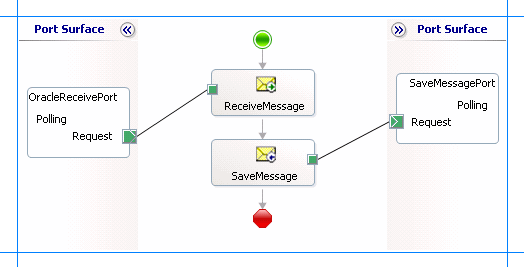

# Poll Oracle E-Business Suite using stored procedures
You can configure the [!INCLUDE[adapteroraclebusinessshort](../../includes/adapteroraclebusinessshort-md.md)] to receive periodic data-change messages by using stored procedures to continuously poll the Oracle database. You can specify a stored procedure as a polling statement that the adapter executes periodically to poll the Oracle database.  

 To enable polling, you must specify certain binding properties on the WCF-Custom or WCF-OracleEBS receive port.  For more information about how the adapter supports polling, see [Support for Inbound Calls Using Polling](../../adapters-and-accelerators/adapter-oracle-ebs/support-for-inbound-calls-using-polling.md). For information about the structure of the SOAP message for polling operations, see [Message Schemas for the Polling Operations](../../adapters-and-accelerators/adapter-oracle-ebs/message-schemas-for-the-polling-operations1.md).  

## Configuring a Polling Operation with Oracle E-Business Adapter Binding Properties  
 The following table summarizes the [!INCLUDE[adapteroraclebusinessshort](../../includes/adapteroraclebusinessshort-md.md)] binding properties that you use to configure the adapter to receive data-change messages. You must specify these binding properties while configuring the WCF-Custom or WCF-OracleEBS receive port in the [!INCLUDE[btsBizTalkServerNoVersion](../../includes/btsbiztalkservernoversion-md.md)] Administration console.  


|         Binding Property         |                                                                                                                                                                                                                                                                       Description                                                                                                                                                                                                                                                                       |
|----------------------------------|---------------------------------------------------------------------------------------------------------------------------------------------------------------------------------------------------------------------------------------------------------------------------------------------------------------------------------------------------------------------------------------------------------------------------------------------------------------------------------------------------------------------------------------------------------|
|     **InboundOperationType**     |                                                                                                                                                                                                                   Specifies whether you want to perform a **Polling** or **Notification** inbound operation. Default is **Polling**.                                                                                                                                                                                                                    |
| **PolledDataAvailableStatement** |                                                                                                                                                       Specifies the SQL statement that the adapter executes to determine whether any data is available for polling. Only if a record is available, the stored procedure you specified for the **PollingInput** binding property will be executed.                                                                                                                                                       |
|       **PollingInterval**        |                                           Specifies the interval, in seconds, at which the [!INCLUDE[adapteroraclebusinessshort](../../includes/adapteroraclebusinessshort-md.md)] executes the statement specified for the **PolledDataAvailableStatement** binding property. The default is 30 seconds. The polling interval determines the time interval between successive polls. If the statement is executed within the specified interval, the adapter sleeps for the remaining time in the interval.                                            |
|         **PollingInput**         | Specifies the polling statement. To poll using a stored procedure, you must specify the entire request message for this binding property. The request message must be the same that you send to the adapter for invoking the stored procedure as an outbound operation. The default is null.<br /><br /> You must specify a value for **PollingInput** binding property to enable polling. The polling statement is executed only if there is data available for polling, which is determined by the **PolledDataAvailableStatement** binding property. |
|        **PollingAction**         |                                                                                                                                               Specifies the action for the polling operation. You can determine the polling action for a specific operation from the metadata you generate for the operation using the [!INCLUDE[consumeadapterservshort](../../includes/consumeadapterservshort-md.md)].                                                                                                                                               |
|      **PostPollStatement**       |                                                                                                                                                                                                            Specifies a statement block that is executed after the statement specified by the **PollingInput** binding property is executed.                                                                                                                                                                                                             |
|      **PollWhileDataFound**      |                                                                               Specifies whether the [!INCLUDE[adapteroraclebusinessshort](../../includes/adapteroraclebusinessshort-md.md)] ignores the polling interval and continuously executes the polling statement, if data is available in the table being polled. If no data is available in the table, the adapter reverts to execute the polling statement at the specified polling interval. Default is false.                                                                               |

 For a more complete description of these properties, see [Read about the BizTalk Adapter for Oracle E-Business Suite Binding Properties](../../adapters-and-accelerators/adapter-oracle-ebs/read-about-the-biztalk-adapter-for-oracle-e-business-suite-binding-properties.md). For a complete description of how to use the [!INCLUDE[adapteroraclebusinessshort](../../includes/adapteroraclebusinessshort-md.md)] to poll the Oracle database, read the following sections.  

## How This Topic Demonstrates Polling  
 In this topic, to demonstrate how the [!INCLUDE[adapteroraclebusinessshort](../../includes/adapteroraclebusinessshort-md.md)] supports receiving data change messages using stored procedures, create a BizTalk project and generate schema for the stored procedure you want to use to poll the Oracle database. In this topic, we use the GET_ACTIVITYS stored procedure to poll the ACCOUNTACTIVITY table. This stored procedure is available with the ACCOUNT_PKG package. You can run the SQL scripts provided with the samples to create these objects in the database.  

> [!NOTE]
>  The orchestration in this topic polls the ACCOUNTACTIVITY table, which is a base database table created by running the scripts provided with the samples. You must perform similar procedures as described in this topic to poll any other table, including interface tables.  

 To demonstrate a polling operation, we do the following:  

-   Specify a SELECT statement for the **PolledDataAvailableStatement** binding property to determine where the table being polled (ACCOUNTACTIVITY) has any data. In this example, you can set this binding property as:  

    ```  
    SELECT COUNT (*) FROM ACCOUNTACTIVITY  
    ```  

     This ensures that the adapter executes the polling statement only when the ACCOUNTACTIVITY table has some records.  

-   Execute a stored procedure, GET_ACTIVITYS, by providing the request message as part of the **PollingInput** binding property. This stored procedure will retrieve all the rows in the ACCOUNTACTIVITY table and you will get a response message from the adapter.  

-   EXECUTE a PL/SQL block as part of the **PostPollStatement** binding property. This statement will move all data from ACCOUNTACTIVITY table to another table in the database. Once this happens, the next time **PollingInput** will be executed, it will not fetch any data and hence the GET_ACTIVITYS stored procedure will return an empty response message.  

-   Until more data is added to the ACCOUNTACTIVITY table, you will continue to get empty response messages. So, you must repopulate the ACCOUNTACTIVITY table with new records. You can do so by running the more_activity_data.sql script provided with the samples. After you run this script, the next polling operation will fetch the new records inserted into the table.  

## How to Receive Data-change Messages from Oracle  
 Performing an operation on Oracle database using [!INCLUDE[adapteroraclebusinessshort](../../includes/adapteroraclebusinessshort-md.md)] with [!INCLUDE[btsBizTalkServerNoVersion](../../includes/btsbiztalkservernoversion-md.md)] involves the following procedural tasks described in [Building blocks to create Oracle E-Business Suite aplications](../../adapters-and-accelerators/adapter-oracle-ebs/building-blocks-to-create-oracle-e-business-suite-applications.md). To configure the adapter to poll Oracle database using a stored procedure, these tasks are:  

1. Create a BizTalk project, and generate schema for the stored procedure you want to use for polling.  

2. Create a message in the BizTalk project for receiving messages from Oracle database.  

3. Create an orchestration to receive messages from Oracle database and save them to a folder.  

4. Build and deploy the BizTalk project.  

5. Configure the BizTalk application by creating physical send and receive ports.  

   > [!IMPORTANT]
   >  For inbound polling scenarios you must always configure a one-way receive port. Two-way receive ports are not supported for inbound operations.  

6. Start the BizTalk application.  

   This topic provides instructions to perform these tasks.  

## Sample Based On This Topic  
 A sample, PollingUsingStoredProc, based on this topic is also provided with the BizTalk Adapter Pack. For more information, see [Samples](../../adapters-and-accelerators/adapter-oracle-ebs/samples-for-the-oracle-ebs-adapter.md).  

## Generating Schema  
 You must generate the schema for the GET_ACTIVITYS operation. Perform the following tasks while generating the schema using the [!INCLUDE[consumeadapterservshort](../../includes/consumeadapterservshort-md.md)].  

- Select the contract type as **Service (Inbound operation)**.  

- Generate schema for the **GET_ACTIVITYS** procedure.  

  For more information about how to generate schema, see [Browse, Search, and get Metadata for Oracle E-Business Operations](../../adapters-and-accelerators/adapter-oracle-ebs/browse-search-and-get-metadata-for-oracle-e-business-suite-operations.md).  

## Defining Messages and Message Types  
 The schema that you generated earlier describes the "types" required for the messages in the orchestration. A message is typically a variable, the type for which is defined by the corresponding schema. Once the schema is generated, you must link it to the messages from the Orchestration view of the BizTalk project.  

 For this topic, you must create one message to receive messages from Oracle.  

 Perform the following steps to create messages and link them to schema.  

#### To create messages and link to schema  

1. Add an orchestration to the BizTalk project. From the Solution Explorer, right-click the BizTalk project name, point to **Add**, and then click **New Item**. Type a name for the BizTalk orchestration and then click **Add**.  

2. Open the orchestration view window of the BizTalk project, if it is not already open. Click **View**, point to **Other Windows**, and then click **Orchestration View**.  

3. In the **Orchestration View**, right-click **Messages**, and then click **New Message**.  

4. Right-click the newly created message, and then select **Properties Window**.  

5. In the **Properties** pane for **Message_1**, do the following:  

   |Use this|To do this|  
   |--------------|----------------|  
   |Identifier|Type **Receive**.|  
   |Message Type|From the drop-down list, expand **Schemas**, and select *Polling.OracleEBSBindingSchema*, where *Polling* is the name of your BizTalk project. *OracleEBSBindingSchema* is the response schema generated for the **GET_ACTIVITYS** stored procedure.<br /><br /> **Important:** Because polling is a one way operation, the schema generated by the adapter does not contain a response node, and hence there is only one root node in the schema. If you use such schemas for a message type, you must identify the schema by the filename of the generated schema.<br /><br /> For example, if you create schema for a two-way operation, the nodes in the schema file with a name `OracleEBSBindingSchema` may look like “Request” and “Response”. If you want to create a message in the orchestration that maps to the request schema, you can identify the schema in the list by looking for `OracleEBSBindingSchema.Request`. However, in the case of polling operation, because the only node is “Poll”, it is not easy to identify the schema you want to map to because schemas with single nodes are not listed as \<schemafilename\>.\<rootnodename\>. Instead, such schemas are listed by only the filename. In such a case, the only way to identify the schema is by the schema filename, for example, OracleEBSBindingSchema.|  

    The [!INCLUDE[consumeadapterservshort](../../includes/consumeadapterservshort-md.md)] generates schema for both inbound and outbound operations for the GET_ACTIVITYS stored procedure. You must use the schema for inbound operation to:  

   - Map the message created as part of the orchestration.  

   - To retrieve the action you must specify for the **PollingAction** binding property at run-time.  

     You must use the schema for the outbound operation to get the request message you must specify as part of the **PollingInput** binding property.  

## Setting up the Orchestration  
 You must create a BizTalk orchestration to use [!INCLUDE[btsBizTalkServerNoVersion](../../includes/btsbiztalkservernoversion-md.md)] for receiving polling-based data-change messages from Oracle. In this orchestration, the adapter receives the response by executing the stored procedure for which you specified the request message as part of the **PollingInput** binding property. The response message for the stored procedure is saved to a FILE location. A typical orchestration for polling Oracle database would contain:  

- Receive and Send shapes to receive messages from Oracle and send to a FILE port, respectively.  

- A one-way receive port to receive messages from Oracle database.  

  > [!IMPORTANT]
  >  For inbound polling scenarios you must always configure a one-way receive port. Two-way receive ports are not supported for inbound operations.  

- A one-way send port to send polling responses from Oracle database.  

  A sample orchestration resembles the following.  

    

### Adding Message Shapes  
 Make sure you specify the following properties for each of the message shapes. The names listed in the Shape column are the names of the message shapes as displayed in the just-mentioned orchestration.  

|Shape|Shape Type|Properties|  
|-----------|----------------|----------------|  
|ReceiveMessage|Receive|- Set **Name** to *ReceiveMessage*<br /><br /> - Set **Activate** to *True*|  
|SaveMessage|Send|- Set **Name** to *SaveMessage*|  

### Adding Ports  
 Make sure you specify the following properties for each of the logical ports. The names listed in the Port column are the names of the ports as displayed in the orchestration.  

|Port|Properties|  
|----------|----------------|  
|OracleReceivePort|- Set **Identifier** to *OracleReceivePort*<br /><br /> - Set **Type** to *OracleReceivePortType*<br /><br /> - Set **Communication Pattern** to *One-Way*<br /><br /> - Set **Communication Direction** to *Receive*|  
|SaveMessagePort|- Set **Identifier** to *SaveMessagePort*<br /><br /> - Set **Type** to *SaveMessagePortType*<br /><br /> - Set **Communication Pattern** to *One-Way*<br /><br /> - Set **Communication Direction** to *Send*|  

### Specify Messages for Action Shapes and Connect to Ports  
 The following table specifies the properties and their values that you should set to specify messages for action shapes and to link the messages to the ports. The names listed in the Shape column are the names of the message shapes as displayed in the orchestration mentioned earlier.  

|Shape|Properties|  
|-----------|----------------|  
|ReceiveMessage|- Set **Message** to *Receive*<br /><br /> - Set **Operation** to *OracleReceivePort.Polling.Request*|  
|SaveMessage|- Set **Message** to *Receive*<br /><br /> - Set **Operation** to *SaveMessagePort.Polling.Request*|  

 After you have specified these properties, the message shapes and ports are connected and your orchestration is complete.  

 You must now build the BizTalk solution and deploy it to a [!INCLUDE[btsBizTalkServerNoVersion](../../includes/btsbiztalkservernoversion-md.md)]. For more information, see [Building and Running Orchestrations](../../core/building-and-running-orchestrations.md).

## Configuring the BizTalk Application  
 After you have deployed the BizTalk project, the orchestration you created earlier is listed under the **Orchestrations** pane in the BizTalk Server Administration console. You must use the BizTalk Server Administration console to configure the application. For a walkthrough, see [Walkthrough: Deploying a Basic BizTalk Application](Walkthrough:%20Deploying%20a%20Basic%20BizTalk%20Application.md).

 Configuring an application involves:  

- Selecting a host for the application.  

- Mapping the ports that you created in your orchestration to physical ports in the BizTalk Server Administration console. For this orchestration you must:  

  - Define a location on the hard disk and a corresponding FILE port where the BizTalk orchestration will drop the messages from Oracle. These messages will be in response to the polling statement that you specify for the receive port.  

  - Define a physical WCF-Custom or WCF-OracleEBS one-way receive port. This port polls the Oracle database. For information about how to create receive ports, see [Manually Configure a Physical Port Binding to the Oracle E-Business Adapter](../../adapters-and-accelerators/adapter-oracle-ebs/manually-configure-a-physical-port-binding-to-the-oracle-e-business-adapter.md). Make sure you specify the following binding properties for the receive port.  


    |         Binding Property         |                                                                                                                                                                                                                                                                                                                                                  Value                                                                                                                                                                                                                                                                                                                                                   |
    |----------------------------------|----------------------------------------------------------------------------------------------------------------------------------------------------------------------------------------------------------------------------------------------------------------------------------------------------------------------------------------------------------------------------------------------------------------------------------------------------------------------------------------------------------------------------------------------------------------------------------------------------------------------------------------------------------------------------------------------------------|
    |     **InboundOperationType**     |                                                                                                                                                                                                                                                                                                                                         Set this to **Polling**.                                                                                                                                                                                                                                                                                                                                         |
    | **PolledDataAvailableStatement** |                                                                                                                                                                                                                                    For this example, set this binding property to:<br /><br /> `SELECT COUNT (*) FROM ACCOUNTACTIVITY`<br /><br /> This ensures that the adapter executes the polling statement only when the ACCOUNTACTIVITY table has some records.                                                                                                                                                                                                                                    |
    |        **PollingAction**         |                                                                                                                                                                                                                                           Retrieve the polling action from the schema generated for the inbound message for the GET_ACTIVITYS procedure. For this example, set this binding property to **PollingPackageApis/APPS/ACCOUNT_PKG/GET_ACTIVITYS**.                                                                                                                                                                                                                                           |
    |         **PollingInput**         | For this binding property, specify the request message to invoke the GET_ACTIVITYS stored procedure. You can get the request message from the schema for the outbound operation generated by the [!INCLUDE[consumeadapterservshort](../../includes/consumeadapterservshort-md.md)]. You must provide the entire XML message as an input for this binding property. For this example, set this binding property to:<br /><br /> `<GET_ACTIVITYS xmlns="http://schemas.microsoft.com/OracleEBS/2008/05/PackageApis/APPS/ACCOUNT_PKG">   <INRECS>OPEN ? FOR SELECT * FROM ACCOUNTACTIVITY</INRECS> </GET_ACTIVITYS>`<br /><br /> The GET_ACTIVITYS stored procedure takes an input REF CURSOR as parameter. |
    |      **PostPollStatement**       |                                                                                                                                                                                                                                                  Specify the post-poll statement to move all data from ACCOUNTACTIVITY table to another table. For this example, set this binding property to:<br /><br /> `BEGIN ACCOUNT_PKG.PROCESS_ACTIVITY(); END;`                                                                                                                                                                                                                                                  |

     For more information about the different binding properties, see [Read about the BizTalk Adapter for Oracle E-Business Suite Binding Properties](../../adapters-and-accelerators/adapter-oracle-ebs/read-about-the-biztalk-adapter-for-oracle-e-business-suite-binding-properties.md).  

    > [!IMPORTANT]
    >  If you are polling an interface table, you must set the application context by specifying the requisite binding properties. For more information about setting the application context see [Set Application Context](../../adapters-and-accelerators/adapter-oracle-ebs/set-application-context.md).  
    > 
    > [!NOTE]
    >  We recommend configuring the transaction isolation level and the transaction timeout while performing inbound operations using the [!INCLUDE[adapteroraclebusinessshort](../../includes/adapteroraclebusinessshort-md.md)]. You can do so by adding the service behavior while configuring the WCF-Custom or WCF-OracleEBS receive port. For instruction on how to add the service behavior, see [Configure Transaction Isolation Level and Transaction Timeout with Oracle E-Business Suite](../../adapters-and-accelerators/adapter-oracle-ebs/configure-transaction-isolation-level-and-transaction-timeout-with-oracle-ebs.md).  

## Starting the Application  
 You must start the BizTalk application for polling Oracle database. For instructions on starting a BizTalk application, see [How to Start an Orchestration](../../core/how-to-start-an-orchestration.md).

 At this stage, make sure:  

-   The WCF-Custom or WCF-OracleEBS one-way receive port, which polls Oracle using the stored procedure specified for the **PollingInput** binding property, is running.  

-   The FILE send port, which receives messages from Oracle database, is running.  

-   The BizTalk orchestration for the operation is running.  

## Executing the Operation  
 After you run the application, the following set of actions take place, in the same sequence:  

-   The adapter executes the **PolledDataAvailableStatement** which returns a positive value indicating the adapter to execute the statement specified for **PollingInput** binding property.  

-   The adapter executes the GET_ACTIVITYS stored procedure specified for the **PollingInput** binding property and returns all the rows in the ACCOUNTACTIVITY table. The response from Oracle database resembles the following:  

    ```  
    <?xml version="1.0" encoding="utf-8" ?>   
    <GET_ACTIVITYS xmlns="http://schemas.microsoft.com/OracleEBS/2008/05/PollingPackageApis/APPS/ACCOUNT_PKG">  
      <OUTRECS>  
        <OUTRECSRecord xmlns="http://schemas.microsoft.com/OracleEBS/2008/05/ReferencedRecordTypes/APPS/ACCOUNT_PKG/GET_ACTIVITYS/APPS/GET_ACTIVITYS">  
          <TID>1</TID>   
          <ACCOUNT>100001</ACCOUNT>   
          <AMOUNT>500</AMOUNT>   
          <DESCRIPTION />   
          <TRANSDATE>2008-06-21T15:52:19</TRANSDATE>   
          <PROCESSED>n</PROCESSED>   
        </OUTRECSRecord>  
        <OUTRECSRecord xmlns="http://schemas.microsoft.com/OracleEBS/2008/05/ReferencedRecordTypes/APPS/ACCOUNT_PKG/GET_ACTIVITYS/APPS/GET_ACTIVITYS">  
          ......  
          ......   
        </OUTRECSRecord>  
        ......  
        ......  
      </OUTRECS>  
    </GET_ACTIVITYS>  
    ```  

-   The adapter executes the post-poll statement, which moves all the data from ACCOUNTACTIVITY table to another table.  

-   After the polling interval, the adapter again executes **PolledDataAvailableStatement**. Because ACCOUNTACTIVITY table has no records now, **PolledDataAvailableStatement** does not return a positive value and hence the adapter does not execute the statement specified for the **PollingInput** binding property. As a result, adapter client does not get any polling message.  

-   The adapter client will not get any more polling messages until some records are explicitly inserted into the ACCOUNTACTIVITY table. To insert more records, you can run the more_activity_data.sql script provided with the samples. After you run this script, the next time **PolledDataAvailableStatement** is executed, it returns a positive value. As a result, the adapter executes the polling statement and adapter clients again receive a polling message.  

> [!NOTE]
>  The [!INCLUDE[adapteroraclebusinessshort](../../includes/adapteroraclebusinessshort-md.md)] will continue to poll until you explicitly disable the receive port from the [!INCLUDE[btsBizTalkServerNoVersion](../../includes/btsbiztalkservernoversion-md.md)] Administration console.  

## Best Practices  
 After you have deployed and configured the BizTalk project, you can export configuration settings to an XML file called the bindings file. Once you generate a bindings file, you can import the configuration settings from the file so that you do not need to create the send ports and receive ports for the same orchestration. For more information about binding files, see [Reuse SQL Adapter Bindings](../../adapters-and-accelerators/adapter-sql/reuse-sql-adapter-bindings.md).  

## See Also  
 [Poll Oracle E-Business Suite Using BizTalk Server](../../adapters-and-accelerators/adapter-oracle-ebs/poll-oracle-e-business-suite-using-biztalk-server.md)